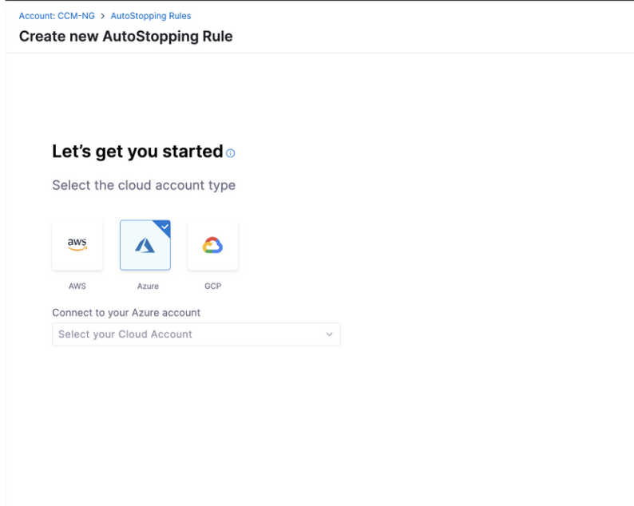
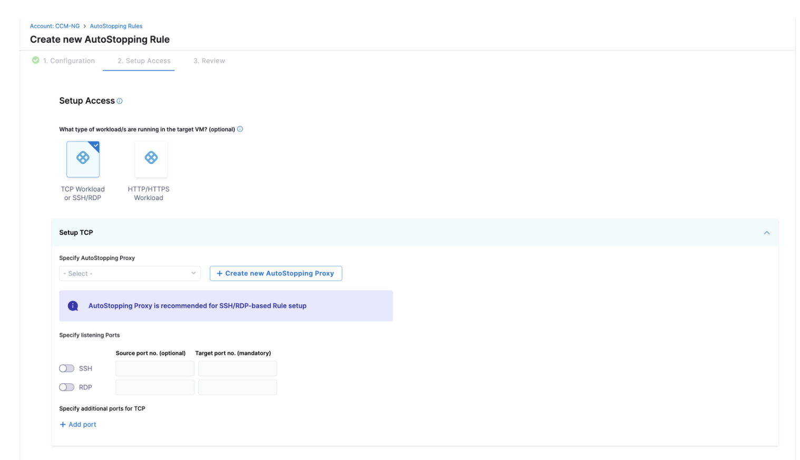

# Create an Application Gateway for Azure

Azure Application Gateway is a web traffic load balancer that enables you to manage traffic to your web applications. Application Gateway can make routing decisions based on additional attributes of an HTTP request, for example, URI path or host headers.

### Before You Begin

* [Connect to an Azure Connector](../1-add-connectors/add-azure-connector.md)
* [Create AutoStopping Rules for Azure](../4-create-auto-stopping-rules/create-auto-stopping-rules-for-azure.md)

## Create a New Application Gateway

You can either create a new application gateway when creating a new order, stopping or you can do so from Load Balancer Manager page. By using the second option, you can easily import.

### Method 1: Create a new Application Gateway from Load Balancer Manager page.

1. Navigate to the Autostopping rules page and select "Load Balancer" icon on top right.

2. Click on "+Create new Load Balancer" and from the pop-up, select "Azure". Also select the cloud connector (or create a new one if needed)

3. Select the cloud provider and cloud connector. Click on "Create Application Gateway".

4. Enter a name for the load balance and the domain name to be accessed by the rule. Click on Continue.

5. In the next window, add:
- Region: The region where your target VM or the cloud resource is hosted.
- Resource Group: A resource group is a container that holds related resources for an Azure solution. For example, virtual machines, storage accounts, etc.
- Certificate (Optional)
- Virtual Network: Azure Virtual Network is a service that provides the fundamental building block for your private network in Azure. VNet allows you to create and manage virtual private networks (VPNs) in the Azure cloud. 
- Subnet: AppGateway subnet should only contain AppGateway, no other resources can be placed in this subnet.
- Frontend IP
- SKU
- Azure Function Region

Click on Save.
This newly created application gateway can be imported in any new Autostopping rule. 

### Method 2: Create a new Application Gateway from Autostopping Rule setup UI

Perform the following steps to create a new Application Gateway in Azure.

1. In **Cloud Costs**, click **+New AutoStopping Rule**.

2. In **AutoStopping Rules**, select **Azure**. 
   

3. If you have already linked your Azure account and want to use that account, then select the Azure account from the list.

4. If you have not added your cloud account, click **New Connector**. For the detailed steps, see [Connect to an Azure Connector](../1-add-connectors/add-azure-connector.md).  

  
  
5. On the Configuration page:

- Define your Autostopping rule By entering the rule name and ideal time. Idle minutes are the minutes after which the rule should stop the resources.
- Select the resources to be managed by the AutoStopping Rule. 
  - If VM is selected, then you need to add instances to be managed by the rule. 
  
- You can choose to convert the selected instance(s) to spot or remain on-demand.
- Advanced configuration like hiding progress, page or dry run can be set up. You can also add dependencies between two or more AutoStopping Rules when you want one Rule to make one or more other Rules active based on the traffic that it receives. You can choose the rules from the drop down menu and add the required delay in seconds.

6. Setup Access

You can select the network protocol based on the workload type handled by the target VM.
 

- **TCP Workload or SSH/RDP:**

You can either specify an Autostopping proxy from the drop down menu (if an Autostopping proxy already exists). Or choose to create one.

 

- **HTTP/HTTPS Workload:**

Select the connector to which your appGateway or load balancer belongs. Next specify an application gateway (if it has already been created) from the drop down menu or you can create a new one.
 

Click on +Create new AutoStopping Proxy and select "Create Application Gateway". Provide a name and a domain. 
 

After this is set up. In the next window, add:
- Region: The region where your target VM or the cloud resource is hosted.
- Resource Group: A resource group is a container that holds related resources for an Azure solution. For example, virtual machines, storage accounts, etc.
- Certificate (Optional): The SSL certificate should match the domain selected for the LB. 
- Virtual Network: VNet allows you to create and manage virtual private networks (VPNs) in the Azure cloud. 
- Subnet: A range of IP addresses that you define within a VNet and is used to logically segment and isolate resources within the network.
- Frontend IP
- SKU
- Azure Function Region

Click on Save.

7. Click on Next and Review entire information about the new rule and click on save To save the rule. Your application gateway will be listed under the **Application Gateway**. And a new rule has been created.
 

:::note
We’ve recently launched support for Azure WAF Gateways. Currently, only import functionality is available for this gateway type.
:::

