# Create AutoStopping Rules for Azure
AutoStopping Rules make sure that your non-production resources run only when used, and never when idle. It also allows you to run your workloads on fully orchestrated spot instances without any worry of spot interruptions.

## Before you begin

* [Create an Azure Connector for AutoStopping Rules](../1-add-connectors/add-azure-connector.md)
* [Create a Kubernetes Connector for AutoStopping Rules](../1-add-connectors/k8s-connector-autostopping.md)
* [AutoStopping Rules Overview](../1-auto-stopping-rules.md)

## Prerequisites

* Make sure that you have Azure on-demand VMs created
* Make sure that you have the **Application Administrator** role assigned for your Azure AD. Users in this role can create and manage all aspects of enterprise applications, application registrations, and application proxy settings. See [Application Administrator](https://docs.microsoft.com/en-us/azure/active-directory/roles/permissions-reference#application-administrator).
* Many Azure CLI commands act within a subscription. Ensure that you have selected the right subscription before executing the commands. If you need to switch the subscription, use the following command:  
`az account set -s <`*`subs id/name`*`>`  
For more information, see [Manage Subscriptions](https://docs.microsoft.com/en-us/cli/azure/manage-azure-subscriptions-azure-cli).
* Permissions to create an application gateway:
	+ A dedicated subnet with no other resources
	+ A public IP belonging to the same VPN as the application gateway
		- SKU: Basic for V1 Application gateway and Standard for V2 application gateway
		- Type: Static or Dynamic
* Permissions to create Azure function and a dedicated storage account
* SSL certificate in **\*.pfx** format to support HTTPS traffic if required. You can use a wild card certificate or specific to the domain certificate
* To create an AutoStopping rule using an AutoStopping proxy load balancer: 
   * You must provide the required permissions to Harness to create an instance in your Azure account.
   * You must provide the required permissions to read the secrets and fetch the certificates stored in the secret for TLS-based flows.
   * Ensure that you reserve some IPs if you intend to allocate elastic IP while creating an AutoStopping proxy.


## Add a Cloud provider

Perform the following steps to link your Azure cloud account to Harness.

1. In **Cloud Costs**, click **New AutoStopping Rule**.
   
2. In **AutoStopping Rules**, select **Azure**. It is the cloud account in which your workloads are running that you want to manage using AutoStopping rules.
   
     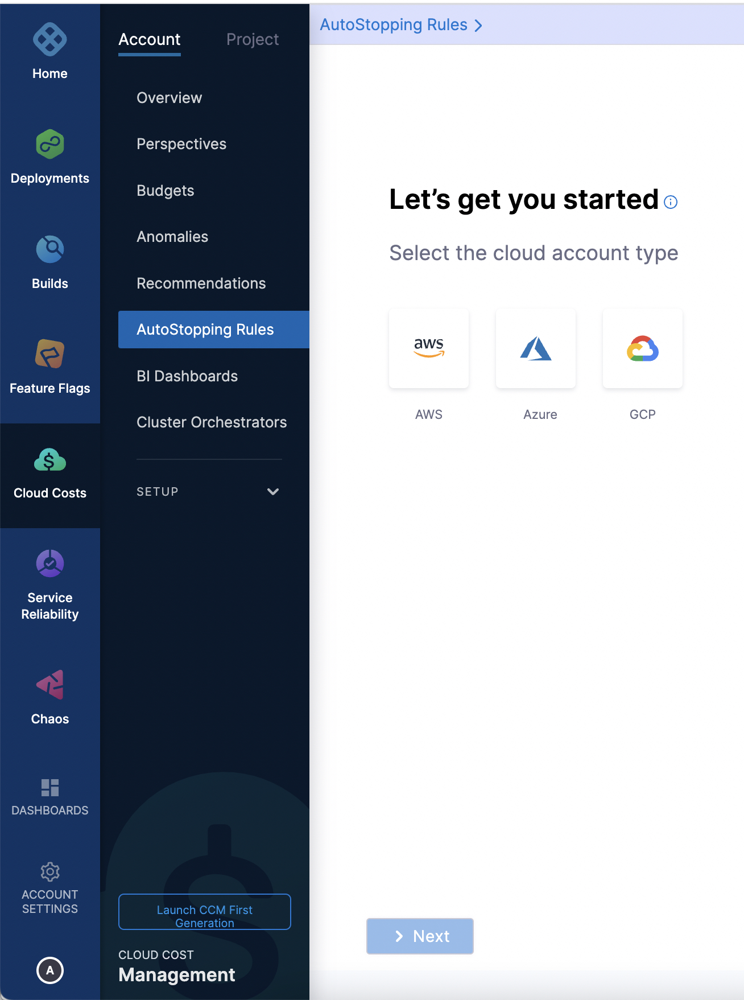
3. If you have already linked your Azure account and want to use that account, then select the Azure account from the list.
4. If you have not added your cloud account, click **New Connector**. For the detailed steps, see [Connect to an Azure Connector](../1-add-connectors/add-azure-connector.md).
   
     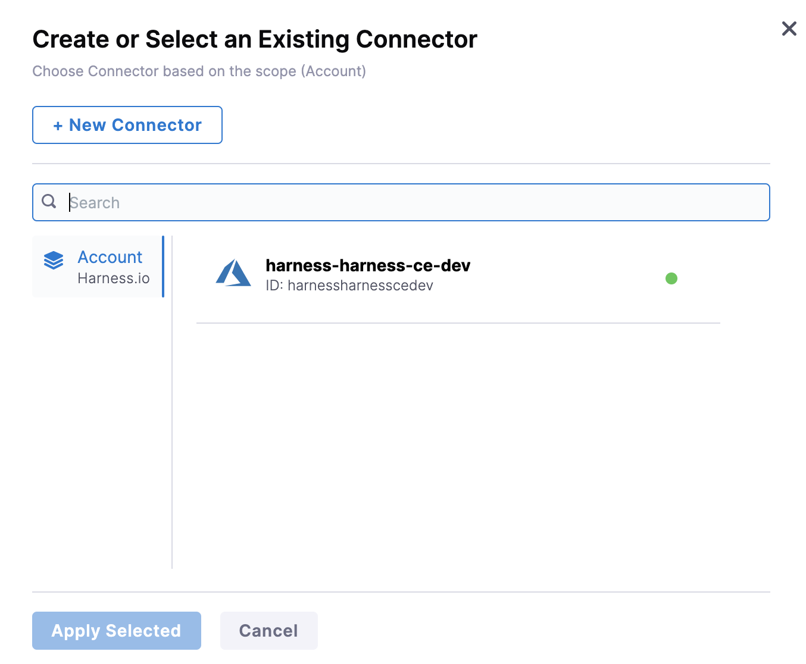

## Add a new AutoStopping rule

Perform the following steps to add a new AutoStopping rule for Azure:

* Configuration: In this step, do the following:
	+ Step 1: Define an AutoStopping Rule
	+ Step 2: Select the Resources to be Managed by the AutoStopping Rule
	+ Step 3: Select the Instance Fulfillment Type
	+ (Optional) Step 4: Set Up Advanced Configuration
* Set up access for TCP workload or SSH/RDP 
* Set up access for HTTP/HTTPS workload
* Verify the configurations.

## Define an AutoStopping rule

Perform the following steps to get started with AutoStopping Rule.

1. In **Cloud Costs,** in **AutoStopping Rules**, click **New AutoStopping Rule**.
2. In the cloud account type, select **Azure**. It is the cloud account in which your workloads are running that you want to manage using AutoStopping rules.
3. Select your Azure account from the **Connect to your Azure account**.  
  
  If you have not added an Azure cloud account, see [Connect to an Azure Connector](../1-add-connectors/add-azure-connector.md).
4. In **Define your AutoStopping rule**, in **Name your Rule**, enter a name for your rule. This is the name of your AutoStopping rule.
5. In **Idle time**, enter the idle time in minutes. This is the time that the AutoStopping rule waits before stopping the idle instances.  
AutoStopping shuts down (for on-demand) or snapshot and terminate (for spot) the instances after the idle time period has elapsed.

  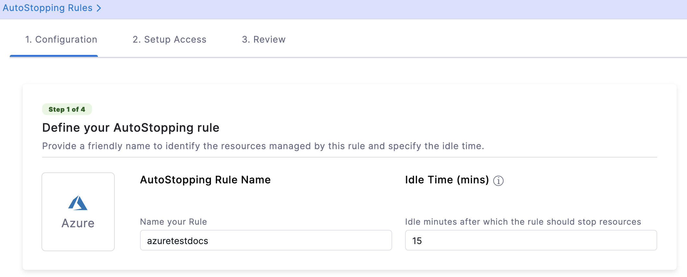

## Select the resources to be managed by the AutoStopping rule

Select the cloud resources that you want to manage using this rule. AutoStopping Rule monitors the selected resources and stops them when they are idle beyond the configured idle time.

### Option 1: Select Instances

:::note
You can add multiple instances to a single Rule. However, all the VMs should be part of the same region.
:::

1. Select **Instances** and click **Add an Instance**.
2. Select the instances that you want to manage using the AutoStopping rules. You can use the search option to search the instances.
   
     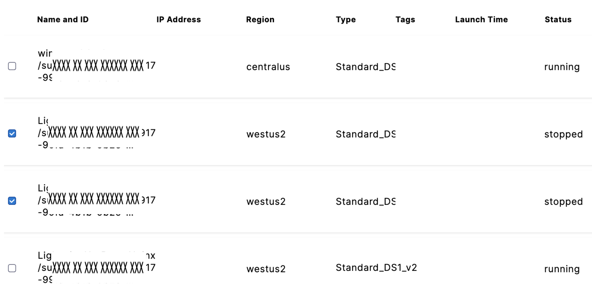
3. Once you have finished selecting the instances, click **Add selected**.

### Option 2: Select Kubernetes Clusters

Add a cluster to be managed by the AutoStopping Rule.

1. Select **Kubernetes Cluster** and then click **Add a cluster**.
2. Select the Kubernetes cluster that you want to manage using the AutoStopping rules. If you wish to create a new connector for the Kubernetes cluster, see [Create a Kubernetes Connector for AutoStopping Rules](../1-add-connectors/k8s-connector-autostopping.md).
3. Once you have finished selecting the Kubernetes cluster, click **Add selected**.  

:::note
If you have selected a Kubernetes cluster, follow the steps in [Create AutoStopping Rules for Kubernetes Cluster](create-autostopping-rules-for-kubernetes.md).

:::


## Select the Instance Fulfillment Type

You can convert the fulfillment type of your selected instances. Select **Spot** or **On-Demand**.

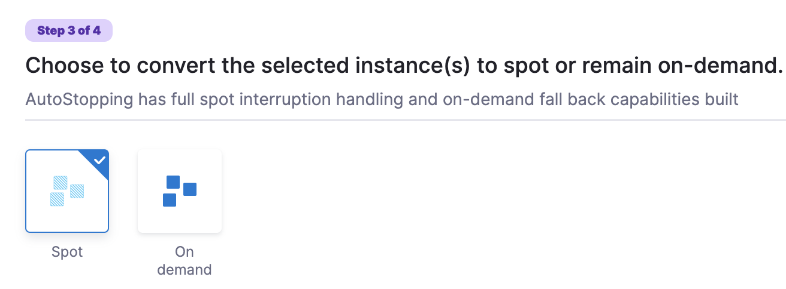

## (Optional) Set Up Advanced Configuration

In this step, you can configure the following settings:

### Hide progress page

Toggle the button to disable the display of progress page during instances' warming up process. This option is especially useful when the service is invoked by an automation system, as it prevents misinterpretation of the progress page as the intended response from a service that is onboarded to AutoStopping. By hiding the progress page, the first response of warming up a rule after a downtime will be delayed until the intended service is up and running.


### Dry Run
Toggle the button if you wish to evaluate this feature without terminating your cloud resources. For more information, go to [Evaluate AutoStopping rules in dry-run mode](../4-create-auto-stopping-rules/autostopping-dry-run-mode.md).

### Add Dependency

Establish dependencies between two or more AutoStopping Rules when you want one Rule to activate one or more Rules based on the traffic it receives. For example for an application server dependant on a database server, create two AutoStopping Rules managing both the servers. Add a dependency on the Rule managing the application server to be dependant on the Rule managing the database server.

1. Click **add dependency** to add a dependency on any existing rule.
2. Select the rule from the **RULES** drop-down list.
3. In **DELAY IN SECS**, enter the number of seconds that rule should wait after warming up the dependent rule. For example, you have Rule 1 dependent on Rule 2 and you have set 5 seconds delay. In that case, when the request is received to warm up Rule 1, then first Rule 2 (dependent rule) is warmed up, and then there will be a delay of 5 seconds before warming up Rule 1.
4. Once you're done with all the configurations, click **Next**.  
  
Now that you have the AutoStopping Rule configured, define how to access the instances.

### Fixed Schedule

Create fixed uptime or downtime schedules for the resources managed by this AutoStopping Rule. When a resource is configured to go up or down on a fixed schedule, it is unaffected by activity or idleness during that time period.

In certain scenarios, you would not want your resources to go down or up. For example, every Friday at 5 p.m. you want your `ABC` resource to go down. You can schedule downtime for your `ABC` resource. During this window, the resource is forced to go down regardless of the defined rule. You can choose to specify uptime for your resources in the same way.

:::note
The fixed schedule takes precedence over the defined AutoStopping Rule.
:::

:::note
Harness executes scheduled rules using [Dkron](https://dkron.io/), an open-source workload automation service.
:::

To create a fixed schedule for your rule, do the following:

1. In **Fixed Schedules**, click **Add Fixed Schedule**.
   
     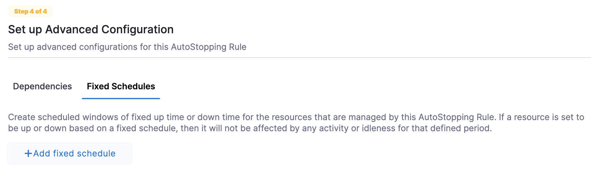

2. In **New Fixed Schedule**, enter a **Name** for your schedule.
3. In **Type**, select the type for your schedule. You can schedule an **Uptime** or **Downtime** for your rule. As per your schedule, the resources go up or down.
4. Select the **Time Zone** from the drop-down list.
5. In **Set schedule period**, use the date picker to set the start and end time for your schedule.
	1. In **Begins on**, select the start date and time for your schedule. You can select a date and specify the time.
	2. In **Ends on**, select the end date and time for your schedule. You can select a date and specify the time. Ensure that **Never ends** checkbox is unselected to set the end time.  
	  
	  If you don't specify an end time, the schedule continues to run until you manually update the settings or remove the schedule.
5. Select the checbox **Never ends** if you do not want to set end time for your schedule.
6. You can also set a recurring schedule for the rule. If you want to set a recurring schedule, in **Uptime/Downtime in the selected period**, in **Repeats**, select the repeat frequency.
	1. Select which days of the week you'd like your schedule to repeat. You can choose any day between Sunday and Saturday.
	2. Select **Everyday**, to set the schedule for all seven days of the week.
	3. Set your repeat schedule's beginning and ending time. In the **Time** field, specify the start and end time for the fixed schedule.
	4. Select **All Day**, if you wish to set your schedule for the entire day. If you choose All Day for your schedule, you won't be able to choose a start and end time.  
	  
	**Example 1**:  
	In the following example, resources are up every Mon, Tue, Wed starting from 12:00 a.m. on February 14, 2022 till April 30, at 10:00 p.m.
	
	  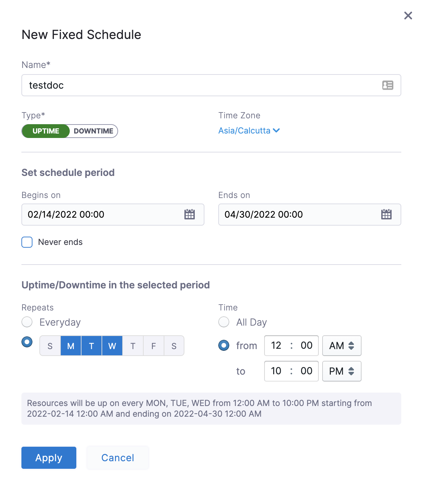
	**Example 2**:  
	In the following example, resources are down every day (all day) starting from 12:00 a.m. on February 14, 2022 till April 30, at 12:00 a.m.
	  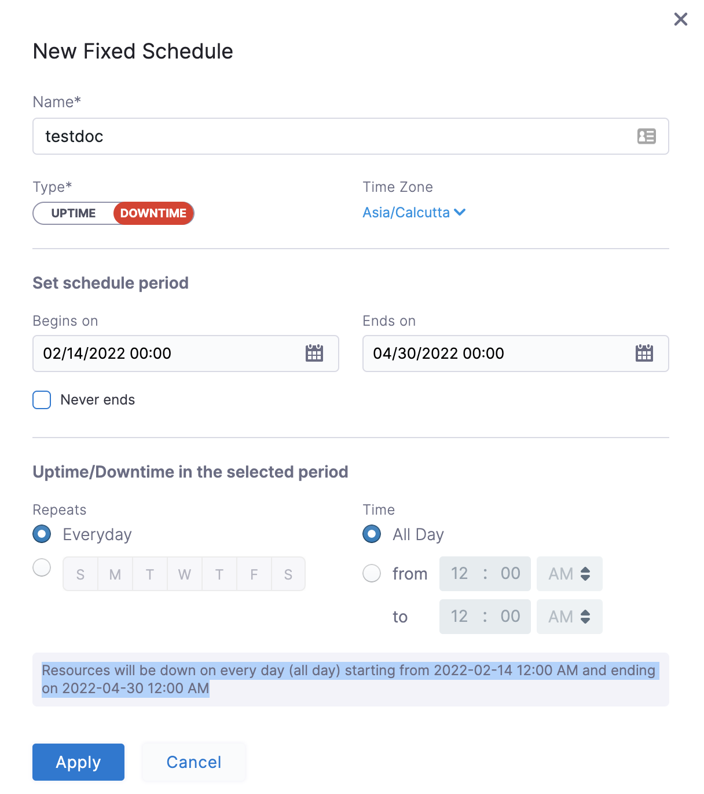
7. Click **Apply**.

Now that you have the AutoStopping rule configured, define how you would want to access the underlying application running on the resources managed by this Rule. You can use either of the following or both the methods depending on your requirement:

* Set up Access for HTTP/HTTPS workload: If the underlying applications running on the resources managed by the AutoStopping Rule are accessed by an HTTP or HTTPS URL.
* Setup Access for TCP workload or SSH/RDP: If the underlying applications running on the resources managed by the AutoStopping Rule are accessed via TCP, SSH, or RDP.
* You could skip this step for now and use the CLI to set up access. Go to [Use the Harness CLI to access resources through SSH/RDP](create-auto-stopping-rules-for-azure.md#use-the-harness-cli-to-access-resources-through-sshrdp) for details.

## Set up access for TCP workload or SSH/RDP 

Setting up access for TCP workload or SSH/RDP allows AutoStopping to detect activity and idleness, and ensure that the database is up and running only when you need it. Use the AutoStopping Proxy URL (IP/Hostname of the Proxy and a unique autogenerated port number) for this AutoStopping Rule when you connect to the RDS database using any database client. The Proxy URL is generated when you save the AutoStopping Rule.
If you need to access the resources managed by this AutoStopping rule using TCP or SSH/RDP HTTPS URL, you need to perform the following steps: 


1. Choose an AutoStopping Proxy load balancer from the **Specify AutoStopping Proxy** dropdown list to set up access. Go to [Create an AutoStopping Proxy for Azure](../3-load-balancer/create-azure-autoproxy-lb.md) to create an AutoStopping load balancer.
2. Toggle SSH or RDP to specify the listening ports. The port number is autopopulated.
3. Specify the source port numbers and the target TCP ports your application is listening to. If the source port is not specified, a random port will be generated at the backend. This auto-generated port will continue to be used as long as the target port remains unchanged or unless the user explicitly modifies the source port. Ensure that these ports are open and accessible.
4. Click **Next**.

## Set up access for HTTP/HTTPS workload

If you need to access the resources managed by this AutoStopping rule using an HTTP or HTTPS URL, you need to perform the following steps: 


Choose an Application Gateway or an AutoStopping Proxy load balancer from the dropdown list to set up access.


### Use an Application Gateway

The rule requires an application gateway to detect traffic and shut down appropriate instances. Multiple instances and rules can use a single load balancer. It identifies instances based on hostnames and directs the HTTP traffic appropriately.

#### Select an Application Gateway
Select an application gateway from the dropdown list. If your application gateway is not added, click **New Application Gateway**. For detailed steps, see [Create an Application Gateway for Azure](../3-load-balancer/create-an-application-gateway-for-azure.md).
 
 
 
   
   
The list populates the application gateway if the application gateway has previously been created in your environment but not yet mapped to Harness. In that case, you must [configure the DNS mapping settings](../3-load-balancer/create-an-application-gateway-for-azure.md). 


 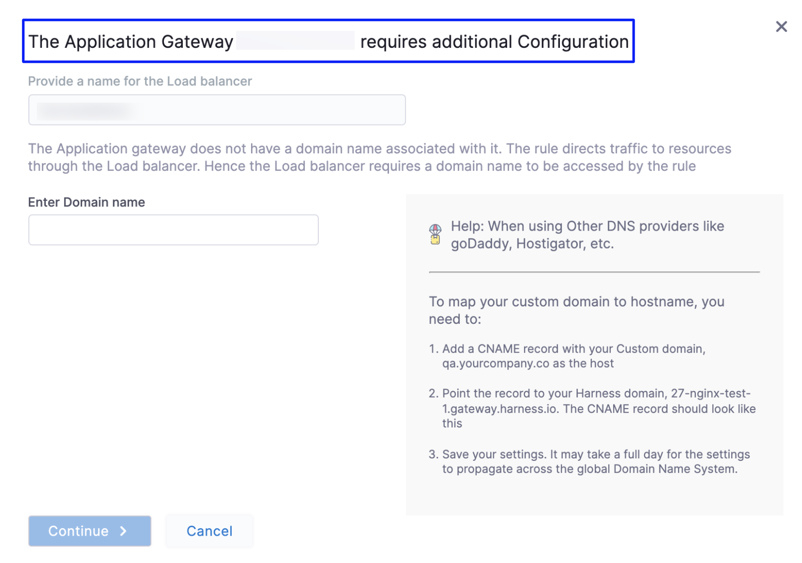
 
:::note
 Multiple instances and rules can use a single application gateway. It identifies instances based on hostnames and directs the HTTP traffic appropriately.
:::


#### Enter Routing Configuration and Health Check Details
This is an application gateway routing configuration for the underlying application that is running on the cloud resources managed by this AutoStopping Rule.

1. Verify listeners information under the **Routing** tab. If the security groups are configured for the selected instances, then the routing information is auto-populated for those instances. 


:::note
You can edit or delete the routing information. However, it is mandatory to have at least one port listed. For more information, see [Listeners](https://docs.aws.amazon.com/elasticloadbalancing/latest/application/load-balancer-listeners.html).
:::


 
 
  
 Click **Add** if you wish to add more ports. The following are some points to consider: 
    
 * If you are forwarding the same action to different ports, then specify the server name and/or path match.  
    
 * If you specify the server name, then the host uses the custom URL to access the resources. You cannot use an auto-generated URL to access the resources.
    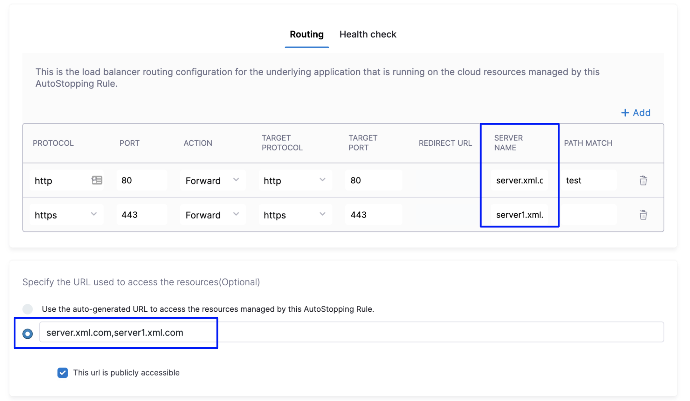
2. Toggle the **Health check** button to configure the health check. Health check status should be successful for the AutoStopping rules to come into effect. 
    By default, the health check is turned on.
   1. In PROTOCOL, select **http** or **https**.
   2. Enter Path, port, and timeout details. For example, if you have configured port 80 and the timeout as 30 seconds for your instance, then the AutoStopping rule checks these specified parameters before bringing the AutoStopping Rule into effect.
 
    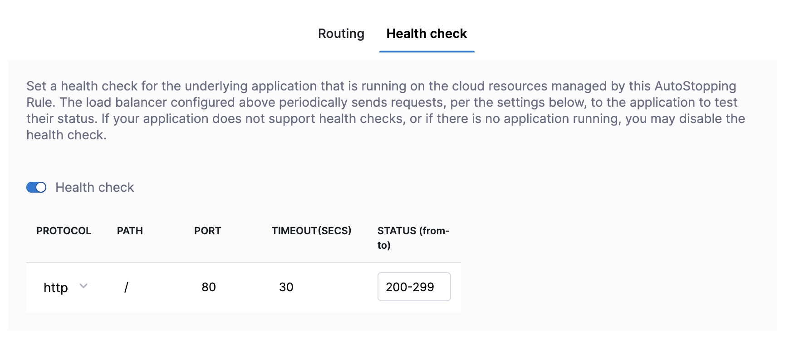


#### Select the URL for Accessing the Resources


You can use either of the following methods:


* Auto-generated URL
* Custom URL


**Auto-generated URL**


  Every AutoStopping rule has an auto-generated URL. This URL is a subdomain to the domain name specified for the application gateway. Since the application gateway configures a wildcard domain such as `*.autostopping.yourcompany.com`, the auto-generated URL works automatically and point to the correct load balancer.


Select **Use the auto-generated URL to access the resources managed by this AutoStopping Rule**.


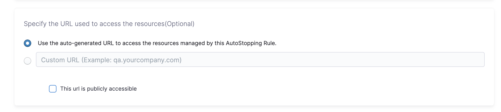

**Custom URL**


  AutoStopping rule can use multiple custom domains. In such a case, it should be configured in the DNS provider. AutoStopping Rules also allows you to use custom domains or change the root of your site's URL from the default, like,`autostop.harness.io`, to any domain you own. To point your site's default domain to a custom domain, you can set it up in your DNS provider.


  Enter the custom URL currently used to access the instances. The domain name should be entered without prefixing the scheme. A rule can have multiple URLs. You can enter comma-separated values into a custom URL to support multiple URLs.


### Use an AutoStopping Proxy load balancer
If you have not created an AutoStopping proxy load balancer already, go to [Create an AutoStopping Proxy load balancer](../3-load-balancer/create-azure-autoproxy-lb.md).


:::note
You can use the same proxy load balancer for more than one rule managing resources (VMs, ASG) within the same Resource Group.
:::

#### Enter Routing Configuration and Health Check Details

1. If the security groups are configured for the selected instances, then the routing information is auto-populated for those instances.  
You can edit or delete the routing information. However, it is mandatory to have at least one port listed. For more information, see [Listeners](https://docs.aws.amazon.com/elasticloadbalancing/latest/application/load-balancer-listeners.html). 

  This is the load balancer routing configuration for the underlying application that is running on the cloud resources managed by this AutoStopping rule.


  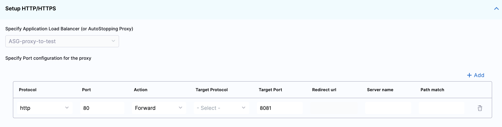


2. Click **Add** if you wish to add more ports. The following are some points to consider:  
	  
  * If you are forwarding the same action to different ports, then specify the server name and/or path match.  
	  
  * If you specify the server name, then the host uses the custom URL to access the resources. You cannot use an auto-generated URL to access the resources.
  

3. Toggle the **Health check** button to configure the health check. Health check status should be successful for the AutoStopping rules to come into effect. Set a health check for the underlying application that is running on the cloud resources managed by this AutoStopping rule. The load balancer periodically sends requests as per the settings below to the application. If your application does not support health check, or you do not have any application running, you can disable the health check.

  By default, the health check is turned on.

4. In Protocol, select **http** or **https**.
5. Enter Path, port, and timeout details. For example, if you have configured port 80 and the timeout as 30 seconds for your instance, then the AutoStopping rule checks these specified parameters before bringing AutoStopping Rule into effect.
   

   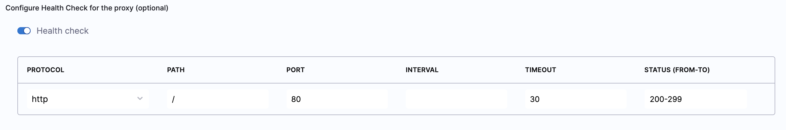

#### Specify the URL to access the resources

You can use either of the following methods:

* Auto-generated URL
* Custom URL

**Auto-generated URL**
You can use the auto-generated URL to access the resources managed by this AutoStopping Rule.

Every AutoStopping rule has an auto-generated URL. This URL is a subdomain to the domain name specified for the [load balancer](../3-load-balancer/create-load-balancer-aws.md). Since the load balancer configures a wildcard domain such as `*.autostopping.yourcompany.com`, the auto-generated URL works automatically and points to the correct load balancer.

Select **Use the auto-generated URL to access the resources managed by this AutoStopping Rule**.


**Custom URL**

AutoStopping rule can use multiple custom domains. In such a case, it should be configured in the DNS provider. AutoStopping Rules also allow you to use custom domains or change the root of your site's URL from the default, like,`autostop.harness.io`, to any domain you own. To point your site's default domain to a custom domain, you can set it up in your DNS provider.

  - The domain name should be entered without prefixing the scheme.
  - A rule can have multiple URLs.
  - You can enter comma-separated values into a custom URL to support multiple URLs.

Enter the custom URL currently used to access the instances. 


## Use the Harness CLI to access resources through SSH/RDP 

SSH/RDP allows you to access the resources managed by the AutoStopping rule via SSH or RDP HTTPS URL. Select this option if the underlying applications running on the resources managed by AutoStopping Rule are accessed via SSH or RDP.

1. In **Setup Access**, select **SSH/RDP**.
2. Select your operating system to download the Harness CLI for your system.
3. Click **Download CLI**.
4. You can connect using SSH or RDP.

### SSH commands

To connect to remote servers via SSH/RDP, such as PuTTY, use the Harness CLI `connect` command. The `connect` command opens a proxy connection in your machine which can be used from other applications.


```
harness connect --host hostname --port <ssh/rdp port>
```
You can simply copy the hostname from the AutoStopping Rule dashboard view. Click on the AutoStopping Rule that you want to connect and copy the hostname.

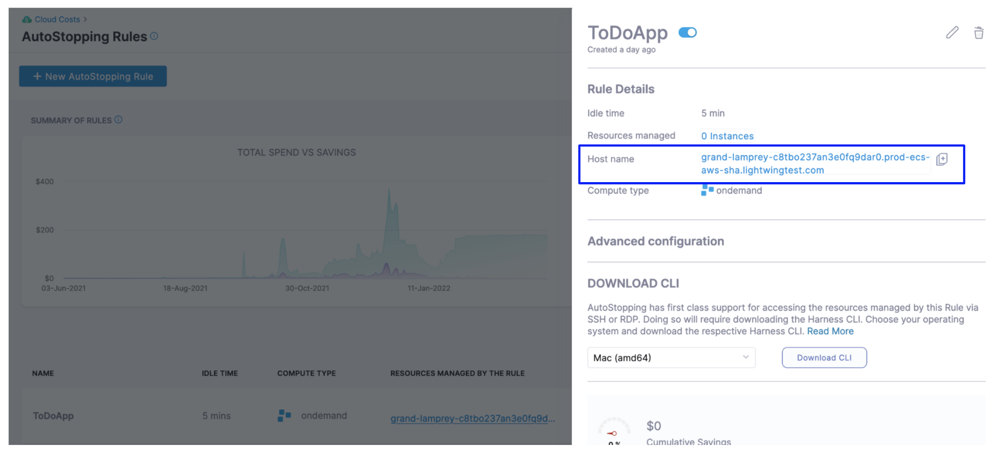For example:


```
harness connect --host default-test-ssh-1.abc1000test.lightwingtest.com --port 22 -- -i ~/.ssh/ry-jupyter.pem
```
Here is the output:


```
Proxy listening details:  
    Rule name:           Test SSH 1  
    Listen address:      127.0.0.1  
    Port forwarding:     14527 => 22  
    Protocol:            tcp  
    Started at:          2021-05-19 21:53:38.320943 +0530 IST m=+48.950643931
```
Harness `connect` created a secure tunnel from your computer to the given port after bringing up the VM. Now open the RDP/SSH client and use the hostname and port information provided above to connect.


```
harness ssh --host default-test-ssh-1.abc1000test.lightwingtest.com --user ubuntu --config lwc.toml -- -i ~/.ssh/ry-jupyter.pem
```
### RDP commands

For RDP run the following command:


```
harness rdp --host default-test-rdp-1.abc1000test.lightwingtest.com
```
Run the following command to connect via private IP:


```
harness rdp --host default-test-rdp-1.abc1000test.lightwingtest.com --internal-ip
```
Click **Next**.

### Review

In Review, verify all the configuration details and click **Save Rule**. To edit any of the configuration settings, click **EDIT** and modify the settings.  
  
Your AutoStopping rule is listed under the [AutoStopping Rules summary page](autostopping-dashboard.md).

## See also

* [Create AutoStopping Rules for a Kubernetes Cluster](../4-create-auto-stopping-rules/create-autostopping-rules-for-kubernetes.md)
* [Use AutoStopping Rules Dashboard](../4-create-auto-stopping-rules/autostopping-dashboard.md)

