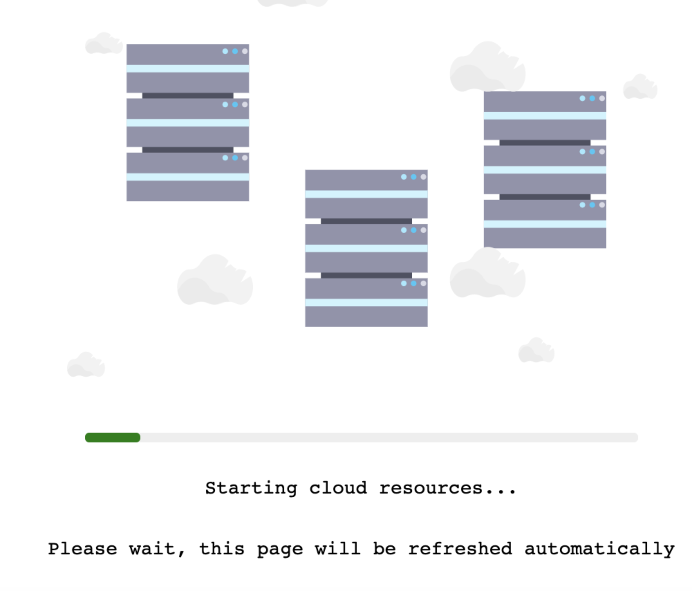

# Create AutoStopping Rules for Amazon ECS
AutoStopping Rule is a dynamic and powerful resource orchestrator for non-production workloads. It automatically shuts down idle resources and runs them on spot instances without worrying about interruptions. For more information, see [AutoStopping Rules Overview](../1-auto-stopping-rules.md).

This topic describes how to create AutoStopping Rules for Amazon Elastic Container Service (ECS).

AutoStopping Rules are configured for the ECS services. You need to create an AutoStopping Rule for each ECS service. There is a one-to-one mapping between the AutoStopping rule and the ECS service. When AutoStopping is configured for a specific ECS service, AutoStopping Rules monitor the traffic coming into this ECS service and start or stop the ECS tasks based on the traffic and idleness.

:::note
The current version of AutoStopping Rules orchestrates the ECS tasks. For the auto scaling groups (ASGs) based ECS clusters, you need a separate setup. However, Fargate clusters do not require any additional setup because the cloud provider charges per task that are running in the cluster.
:::


## Before You Begin

* [Create an AWS Connector for AutoStopping Rules](create-autostopping-rules-aws.md)

## Prerequisites
Read the following topics in [Set up Cloud Cost Management for AWS](../../../2-getting-started-ccm/4-set-up-cloud-cost-management/set-up-cost-visibility-for-aws.md): 

* Access to CUR. See Cost and Usage Reports (CUR) and CCM Requirements.
* Permissions to create a cross-account role. See AWS Access Permissions.
* Permissions for AWS ECS and Resource Inventory Management. See AWS ECS and Resource Inventory Management.
* Permissions for AWS Resource Optimization Using AutoStopping Rules. See AWS Resource Optimization Using AutoStopping Rules.
* HTTP/HTTPS-based applications running on ECS
* ECS running on EC2 nodes or Fargate

## Application Load balancer (ALB) Requirements and Traffic Detection

AutoStopping rules based on ECS can only use the ALB associated with the ECS service. When creating a new AutoStopping rule, you can select the ALB.

Once configured, AutoStopping will monitor network traffic for ALB in order to keep ECS tasks running. When ALB receives no traffic, it is considered idle and ECS tasks are scaled down.

## Step 1: Add a Cloud Provider

Perform the following steps to link your AWS cloud account to Harness.

1. In **Cloud Costs**, click **New AutoStopping Rule**.
   
     
2. In **AutoStopping Rules**, select **AWS**. It is the cloud account in which your workloads are running that you want to manage using AutoStopping rules.
   
     
3. If you have already linked your AWS account and want to use that account, then select the AWS account from the **Connect to your AWS account** drop-down list.
4. If you have not added your cloud account, click **Connect to your AWS account** drop-down list and then click **New Connector**. For the detailed steps, see [Connect to an AWS Connector](../1-add-connectors/connect-to-an-aws-connector.md).
   

## Step 2: Add a New AutoStopping Rule for an ECS Service

Creating AutoStopping Rules for Amazon ECS involves the following steps:

### Define an AutoStopping Rule

1. In **Cloud Costs,** in **AutoStopping Rules**, click **New AutoStopping Rule**.
2. In the cloud account type, select **AWS**. It is the cloud account in which your workloads are running that you want to manage using AutoStopping rules.
3. Select your AWS account from the **Connect to your AWS account** drop-down list and click **Next**. If you have not added an AWS cloud account, see [Connect to an AWS Connector](../1-add-connectors/connect-to-an-aws-connector.md).
   
    
4. In **Define your AutoStopping rule**, in **Name your Rule**, enter a name for your rule. This is the name of your AutoStopping rule.
5. In **Idle time**, enter the idle time in minutes. This is the time that the AutoStopping rule will wait before stopping the idle instances.

### Select the Resources to be Managed by the AutoStopping Rule

Select the cloud resources that you want to manage using this rule. AutoStopping Rule will monitor the selected resources and stop them when they are idle beyond the configured idle time.

1. In **Select the resources to be managed by the rule**, select **ECS Service**, and then click **Add an ECS Service**.
   
     
2. In **Select ECS Service**, select one of the following options:
   * ECS Service Name.
   * ECS Service Tags.
   
    

  If you chose **ECS Service Name**, select a region and a cluster to see all of their services:
  1. Select the region where your cluster is hosted from the **Select Region** dropdown list.
  2. Select your cluster from the **Select Cluster** dropdown list.
  3. Select the ECS Service where you want to enable the AutoStopping Rule. 
  4. Click **Add Selected**.
   
   
   
If you chose **ECS Service Tags**, select the region, cluster, and the tag associated with the service. Once you create a rule using this option, the rule is applied automatically to the most recently created ECS service using the tag. 
1. Select the region where your cluster is hosted from the **Select Region** dropdown list.
2. Select your cluster from the **Select Cluster** dropdown list.
3. Select the tag key and the tag value from the dropdown lists. If you want to learn how to add tags to your service, go to [Tagging your Amazon ECS Resources](https://docs.aws.amazon.com/AmazonECS/latest/developerguide/ecs-using-tags.html).
   
     You can view the list of ECS services using this tag. 

4. Click **Continue**.  

:::note
* If you have added the same tag to multiple ECS services, the AutoStopping rule is applied to the most recently created service.
* If there are no services with the selected tag, the following error message is displayed: 
  "There is no ECS service that contains the selected tag. Create a service with the selected tag to proceed."
:::


   
### **Specify the desired task count**
In **Desired Task Count**, specify the desired task count for the selected ECS service. This is the number of tasks that Harness will instantiate when your service is up and running. For more information, see [Amazon ECS service quotas](https://docs.aws.amazon.com/AmazonECS/latest/developerguide/service-quotas.html).

### (Optional) Set Up advanced configuration

In this step, you can configure the following settings:

#### Hide progress page

 Toggle the button to disable the display of progress page during instances' warming up process. This option is especially useful when the service is invoked by an automation system, as it prevents misinterpretation of the progress page as the intended response from a service that is onboarded to AutoStopping. By hiding the progress page, the first response of warming up a rule after a downtime will be delayed until the intended service is up and running.



#### Dry Run
Toggle the button if you wish to evaluate this feature without terminating your cloud resources. For more information, go to [Evaluate AutoStopping rules in dry-run mode](../4-create-auto-stopping-rules/autostopping-dry-run-mode.md).

* **Add Dependency**: Set dependencies between two or more AutoStopping Rules when you want one Rule to make one or more Rules to be active based on the traffic that it receives. See [Add Dependency](create-autostopping-rules-aws.md).
* **Fixed Schedules**: Create fixed uptime or downtime schedules for the resources managed by this AutoStopping Rule. When a resource is configured to go up or down on a fixed schedule, it is unaffected by activity or idleness during that time period. See [Fixed Schedules](../4-create-auto-stopping-rules/create-autostopping-rules-aws.md#fixed-schedules).

### (Optional) Setup access using DNS Link

:::note
You can skip this step in the following scenarios:  
  
- If you are creating an AutoStopping Rule for an ECS Service that does not have a load balancer associated with it.  
  
- If you do not want to create a DNS link for the resources managed by this AutoStopping rule.
:::

A DNS link allows you to access the resources managed by the AutoStopping rule using an HTTP or HTTPS URL. To create a DNS Link, you need to:

* **Select a Load Balancer**: The rule requires a load balancer to detect traffic and shut down appropriate instances. Multiple instances and rules can use a single load balancer. It identifies instances based on hostnames and directs the HTTP traffic appropriately.
* **Select the URL Used to Access the Resources**: You can use either of the following methods:
	+ **Auto-generated URL**: You can use the auto-generated URL to access the resources managed by this AutoStopping Rule.
	+ **Custom URL**: If using a custom URL:
		- The domain name should be entered without prefixing the scheme.
		- A rule can have multiple URLs.
		- You can enter comma-separated values into a custom URL to support multiple URLs.
		- AutoStopping rule can also use an additional custom domain. In such a case, it should be configured in the DNS provider.

#### Select a Load Balancer

1. In **Setup Access**, select **DNS Link**.
2. Select the load balancer from the drop-down list. The associated load balancer with your ECS service is listed.
   
     

#### Select the URL for Accessing the Resources

You can use either of the following methods:

* Auto-generated URL
* Custom URL

**Auto-generated URL**

Every AutoStopping rule will have an auto-generated URL. This URL will be a subdomain to the domain name specified for the [load balancer](../3-load-balancer/create-load-balancer-aws.md). Since the load balancer configures a wildcard domain such as `*.autostopping.yourcompany.com`, the auto-generated URL will work automatically and point to the correct load balancer.

Select **Use the auto-generated URL to access the resources managed by this AutoStopping Rule**.


**Custom URL**

AutoStopping rule can use multiple custom domains. In such a case, it should be configured in the DNS provider. AutoStopping Rules also allows you to use custom domains or change the root of your site's URL from the default, like,`autostop.harness.io`, to any domain you own. To point your site's default domain to a custom domain, you can set it up in your DNS provider.

Enter the custom URL currently used to access the instances. The domain name should be entered without prefixing the scheme. A rule can have multiple URLs. You can enter comma-separated values into a custom URL to support multiple URLs.


**Map Your Custom Domain to the Hostname**

If you've chosen to use a **custom URL** to access the resources, you need to map your custom domain to the hostname generated by this AutoStopping Rule. Select your DNS Provider from the list (Route 53 or Others) to proceed with the mapping.


**DNS configuration using Route 53**: If you select Route 53 account, AutoStopping manages Route 53 configuration automatically. You don’t have to do any changes manually when using Route 53.


**DNS configuration using other providers:** Perform the following steps:

1. Select **Others**.
2. Once you're done, click **Next**.

### Review

In Review, verify all the configuration details and click **Save Rule**. To edit any of the configuration settings, click **EDIT** and modify the settings.

Your AutoStopping rule is listed under the [AutoStopping Rules dashboard](autostopping-dashboard.md).

### Create AutoStopping Rules with Terraform for ECS Services

You can also use Terraform provider to create AutoStopping Rules. To do so, perform the following steps:

Perform the following steps to create AutoStopping Rules for Terraform.

#### Step 1: Install Terraform for AutoStopping Rules

To use Terraform you first need to install it. To install Terraform, download the appropriate package for your Operating System:

* [Windows](https://lightwing-downloads.s3.ap-southeast-1.amazonaws.com/terraform-provider/1.0.1/tf-1.0.1-windows_amd64.zip)
* [Linux](https://lightwing-downloads.s3.ap-southeast-1.amazonaws.com/terraform-provider/1.0.1/tf-1.0.1-linux_amd64.zip)
* [Mac](https://lightwing-downloads.s3.ap-southeast-1.amazonaws.com/terraform-provider/1.0.1/tf-1.0.1-darwin_amd64.zip)

For more information on installing Terraform, see [Install Terraform for AWS](https://learn.hashicorp.com/tutorials/terraform/install-cli?in=terraform/aws-get-started) and [Install Terraform for Azure](https://learn.hashicorp.com/tutorials/terraform/install-cli?in=terraform/azure-get-started).

#### Step 2: Create an API Key

To use a Harness API key, do the following:

1. In Harness Manager, click **Security**, and then click **Access Management**.
2. Click **API Keys**.
3. Click **Add API Key**.
4. In the **Add API Key** settings, enter a name and select your User Group.
5. Click **Submit**. The new API key is created.
6. To copy the API key, first click the Eye icon to reveal the key's value.
7. Next, click the Copy icon beside the key. This copies the key's value to your clipboard.

#### Step 3: Obtain Harness Account Identifier

1. In Harness Manager, click **Try NextGen**.
2. In Harness NextGen, navigate to **Account Settings**.
3. Copy your **Account ID** from the **Account Overview**.
   
     
   
   You need to enter the Account ID in the script.

#### (Optional) Step 4: Obtain Load Balancer Host Name

Fetch the load balancer details from the [Setup Access Using DNS Link](../4-create-auto-stopping-rules/create-auto-stopping-rules-for-ecs.md) section.

#### Step 5: Run the Script

The following sample script creates an AutoStopping rule for ECS:


```
terraform {  
  required_providers {  
    harness-ccm = {  
      source = "harness.io/ccm/harness-ccm"  
      version = "1.0.1"  
    }  
  }  
}  
  
provider "harness-ccm" {  
  token = "<harness api token>"  
  account_identifier = "<harness account identifier>"  
}  
  
resource "harness-ccm_autostopping_rule" "RuleName" {  
  name = "Terraform Ecs rule"  
  kind = "containers"  
  cloud_account_id = "<harness cloud account connector id>"  
  idle_time_mins = 10  
  
  load_balancer = "<load balancer host name>"  
  
  container {  
    cluster = "<ECS Cluster Name>"  
    service = "<Ecs Service Name>"  
    task_count = 1  
    region = "us-east-1"  
  }  
}  

```
