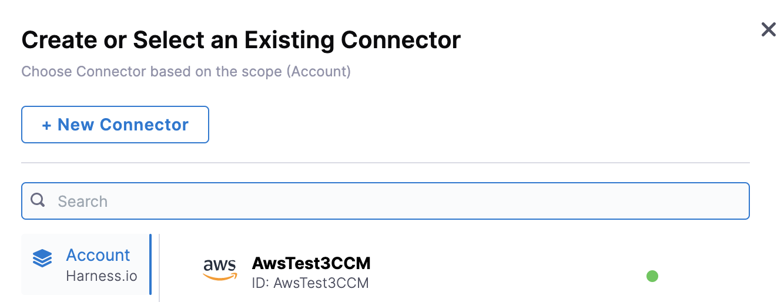
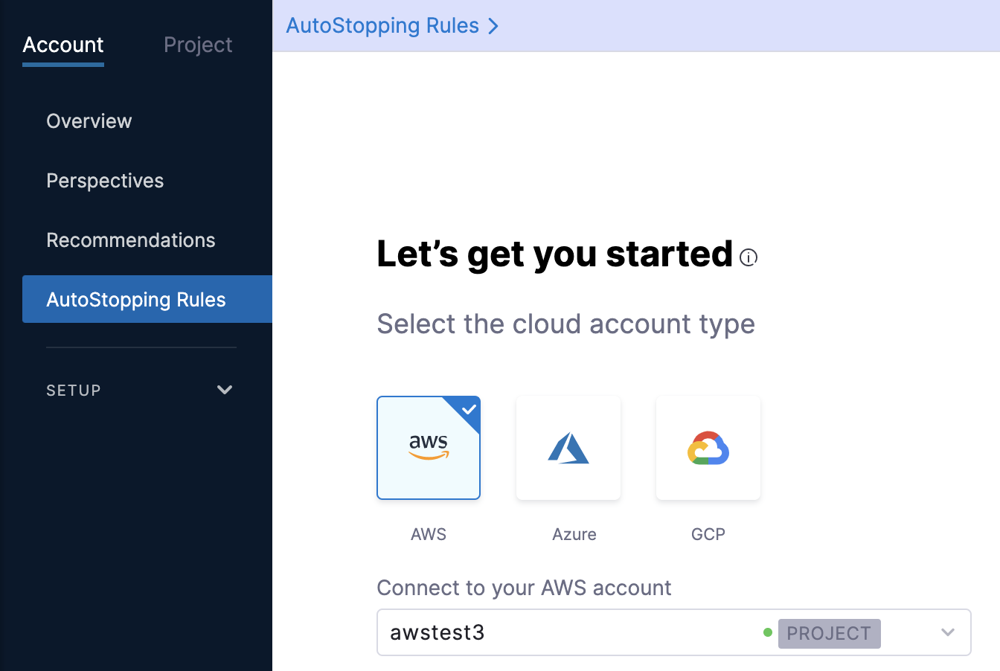
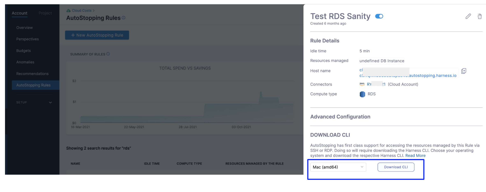

# Create AutoStopping Rules for RDS
AutoStopping Rule is a dynamic and powerful resource orchestrator for non-production workloads. For more information, see [AutoStopping Rules Overview](../1-auto-stopping-rules.md).

This topic describes how to create AutoStopping Rules for Amazon Relational Database Service (RDS).


## Prerequisites

* Read the following topics in [Set up Cloud Cost Management for AWS](../../../2-getting-started-ccm/4-set-up-cloud-cost-management/set-up-cost-visibility-for-aws.md): 

	* Access to CUR. See Cost and Usage Reports (CUR) and CCM Requirements.
	* Permissions to create a cross-account role. See AWS Access Permissions.
	* Permissions for AWS Resource Optimization Using AutoStopping Rules. See AWS resource optimization using AutoStopping rules.
* The database that will be onboarded must be able to start and stop. Harness AutoStopping cannot manage certain DB instances, such as serverless ones, because they cannot be started or stopped.

## Use Cases for Using AutoStopping for RDS

This section describes some of the most common scenarios where you can use AutoStopping Rules with RDS.

### EC2 Rule With RDS Dependency

This is an ideal use case when a web server or an application server connects to an RDS database to access/store data.


In this scenario, if there is no traffic to the application server (EC2 instance), the AutoStopping Rule will stop both the application server and the RDS database that it connects to. When the application server receives traffic, the Rule will start the RDS instance first, followed by the EC2 instance. This results in substantial cost savings for both instances. 

You can achieve this by simply creating an EC2 AutoStopping Rule and adding an RDS Rule as a dependency.

### Query the Archived Database Using Your Own Database Client

See [Use Harness AutoStopping CLI to Keep the RDS Instance(s) Running](../4-create-auto-stopping-rules/create-auto-stopping-rules-for-rds.md#use-harness-autostopping-cli-to-keep-the-rds-instances-running).

## Step 1: Add a Cloud Provider

Perform the following steps to link your AWS cloud account to Harness.

1. In **Cloud Costs**, click **New AutoStopping Rule**.
   
     
2. In **AutoStopping Rules**, select **AWS**. It is the cloud account in which your workloads are running that you want to manage using AutoStopping rules.
   
     
3. If you have already linked your AWS account and want to use that account, then select the AWS account from the **Connect to your AWS account** drop-down list.
4. If you have not added your cloud account, click **Connect to your AWS account** drop-down list and then click **New Connector**. For the detailed steps, see [Connect to an AWS Connector](../1-add-connectors/connect-to-an-aws-connector.md).
   
   

## Step 2: Add a New AutoStopping Rule for RDS

Creating AutoStopping Rules for Amazon RDS involves the following steps:

### Define an AutoStopping Rule

1. In **Cloud Costs,** in **AutoStopping Rules**, click **New AutoStopping Rule**.
2. In the cloud account type, select **AWS**. It is the cloud account in which your workloads are running that you want to manage using AutoStopping rules.
3. Select your AWS account from the **Connect to your AWS account** drop-down list and click **Next**. If you have not added an AWS cloud account, see [Connect to an AWS Connector](../1-add-connectors/connect-to-an-aws-connector.md).
   
     
4. In **Define your AutoStopping rule**, in **Name your Rule**, enter a name for your rule. This is the name of your AutoStopping rule.
5. In **Idle time**, enter the idle time in minutes. This is the time that the AutoStopping rule will wait before stopping the idle instances.

### Select the Resources to be Managed by the AutoStopping Rule

Select the cloud resources that you want to manage using this rule. AutoStopping Rule will monitor the selected resources and stop them when they are idle beyond the configured idle time.

1. In **Select the resources to be managed by the rule**, select **RDS** and then click Add RDS instance.
   
     
2. In **Select RDS Instance**, do the following:
	1. Select the region where your instance is hosted from the drop-down list.
	2. Select the RDS instance for which you want to enable AutoStopping Rule and click **Add Selected**.
   
     
	3. Once you've made all the selections, click **Add Selected**.
3. Click **Next**.

### (Optional) Set Up Advanced Configuration

In this step, you can configure the following settings:

### Hide progress page

Toggle the button to disable the display of progress page during instances' warming up process. This option is especially useful when the service is invoked by an automation system, as it prevents misinterpretation of the progress page as the intended response from a service that is onboarded to AutoStopping. By hiding the progress page, the first response of warming up a rule after a downtime will be delayed until the intended service is up and running.


### Dry Run

Toggle the button if you wish to evaluate this feature without terminating your cloud resources. For more information, go to [Evaluate AutoStopping rules in dry-run mode](../4-create-auto-stopping-rules/autostopping-dry-run-mode.md).

* **Add Dependency**: Set dependencies between two or more AutoStopping Rules when you want one Rule to make one or more Rules to be active based on the traffic that it receives. See [Add Dependency](../4-create-auto-stopping-rules/create-autostopping-rules-aws.md#optional-step-set-up-advanced-configuration).
* **Fixed Schedules**: Create fixed uptime or downtime schedules for the resources managed by this AutoStopping Rule. When a resource is configured to go up or down on a fixed schedule, it is unaffected by activity or idleness during that time period. See [Fixed Schedules](create-autostopping-rules-aws.md).

## Review

In Review, verify all the configuration details and click **Save Rule**. To edit any of the configuration settings, click **EDIT** and modify the settings.

Your AutoStopping rule is listed under the [AutoStopping Rules dashboard](../4-create-auto-stopping-rules/autostopping-dashboard.md).

## Use Harness AutoStopping CLI to Keep the RDS Instance(s) Running

You can also use Harness AutoStopping CLI to query the archived database using your own database client. Basically you're leveraging Harness CLI to keep the RDS instance(s) running.

1. From the AutoStopping dashboard, click on the RDS rule.
2. In **Download CLI**, select your operating system to download the Harness CLI for your system.
   
     
3. Click **Download CLI**.
4. Run the following command to connect to an RDS database.  

```
harness connect --host hostname --port 5432
```
  
The above command will start the RDS database if it is not running and set up a secure tunnel to it. This command will output the connection details to which you can connect your database client.
5. As an example, in the case of Postgres, the following command can be used to connect to the database.  

```
psql -h localhost -p port-received-from-above -u postgres
```
  
As soon as your database client is disconnected, AutoStopping will consider it as idleness and shut down the database after the configured idle time.

