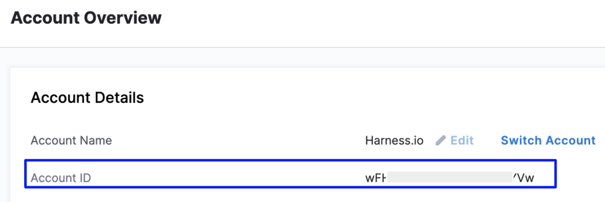

# Create AutoStopping Rules with Terraform
AutoStopping Rules make sure that your non-production resources run only when used, and never when idle. It also allows you to run your workloads on fully orchestrated spot instances without any worry of spot interruptions.

This topic describes how to create AutoStopping Rules with Terraform using scripts.

### Before You Begin

* [AutoStopping Rules Overview](../1-auto-stopping-rules.md)
* [Create AutoStopping Rules for AWS](../4-create-auto-stopping-rules/create-autostopping-rules-aws.md)
* [Create AutoStopping Rules for Azure](../4-create-auto-stopping-rules/create-auto-stopping-rules-for-azure.md)

Perform the following steps to create AutoStopping Rules for Terraform.

### Step 1: Install Terraform for AutoStopping Rules

To use Terraform you first need to install it. To install Terraform, download the appropriate package for your Operating System:

* Darwin: <https://lightwing-downloads.s3.ap-southeast-1.amazonaws.com/terraform-provider/3.1.1/tf_3.1.1_darwin_amd64.zip>
* Linux: <https://lightwing-downloads.s3.ap-southeast-1.amazonaws.com/terraform-provider/3.1.1/tf_3.1.1_linux_amd64.zip>
* Windows: <https://lightwing-downloads.s3.ap-southeast-1.amazonaws.com/terraform-provider/3.1.1/tf_3.1.1_windows_amd64.zip>

For Windows, you need to manually extract the contents of the Zip file and place it in the following location:

`C:\Users\Administrator\AppData\Roaming\terraform.d\plugins\harness.io\ccm\harness-ccm\{version}\windows_386\terraform-provider-harness-ccm.exe
`


For more information on installing Terraform, see [Install Terraform for AWS](https://learn.hashicorp.com/tutorials/terraform/install-cli?in=terraform/aws-get-started) and [Install Terraform for Azure](https://learn.hashicorp.com/tutorials/terraform/install-cli?in=terraform/azure-get-started).

### Step 2: Create an API Key

To use a Harness API key, do the following:

1. In Harness Manager, click **Security**, and then click **Access Management**.
2. Click **API Keys**.
3. Click **Add API Key**.
4. In the **Add API Key** settings, enter a name and select your User Group.
5. Click **Submit**. The new API key is created.
6. To copy the API key, first click the Eye icon to reveal the key's value.
7. Next, click the Copy icon beside the key. This copies the key's value to your clipboard.

### Step 3: Obtain Harness Account Identifier

1. In Harness Manager, click **Try NextGen**.
2. In Harness NextGen, navigate to **Account Settings**.
3. Copy your **Account ID** from the **Account Overview**.
   
     
   
   You need to enter the Account ID in the script.

### Step 4: Run the Script

Here are some of the sample scripts for different scenarios:

#### Create AutoStopping Rules for an Instance

The following sample scripts create AutoStopping rules for an instance.

  Example 1: Specify the following details:

* **Token**: Specify the API Key.
* **API_URL**: Specify the endpoint.
* **Account Identifier**: Specify the Account ID.
* **Name**: Specify a name for your AutoStopping Rule.
* **Fulfilment**: Specify the instance fulfillment type, **On-Demand** or **Spot**.
* **Load balancer**: Specify the name of the load balancer domain name. You can obtain this information from the screen where you create the load balancer.
* **Hosted Zone ID**: Specify the domain name for your Route 53 hosted zone.
* **Resource_ID**: Specify the instance ID.
* **Routing**: Specify listeners information.
* **(Optional) Health Check**: A health check makes sure that the specified parameters are met before stopping the instances. Health check status should be successful for the AutoStopping rules to come into effect.


```
terraform {  
  required_providers {  
    harness-ccm = {  
      source = "harness.io/ccm/harness-ccm"  
      version = "3.0.1"  
    }  
  }  
}  
provider "harness-ccm" {  
  token = "<*paste your token her*e>"  
  api_url = "https://app.harness.io/gateway/lw/api"  
  account_identifier = "<*paste your account id*>"  
}  
  
resource "harness-ccm_autostopping_rule" "rule_i1" {  
  name = "<*enter a name for your autostopping rule*>"  
  fulfilment = "ondemand"  
  disabled = false  
  cloud_account_id = "<*enter your cloud account ID*>"  
  load_balancer = "<enter *the name of the load balancer domain name*>"  
  custom_domain_providers {  
    route53 {  
      hosted_zone_id = “/hostedzone/*YourValueHere*”  
    }  
  }  
  filter {  
      resource_id = <*enter your instance ID*>  
  }  
  routing {  
    source_protocol = "http"  
    target_protocol = "http"  
    source_port = 80  
    target_port = 80  
    action = "forward"  
  }  
  routing {  
    source_protocol = "https"  
    target_protocol = "http"  
    source_port = 443  
    target_port = 80  
    action = "forward"  
  }  
   
}  
  
resource "harness-ccm_autostopping_rule" "rule_i2" {  
  name = ""  
  fulfilment = "ondemand"  
  disabled = false  
  org_id = ""  
  project_id = ""  
  cloud_account_id = ""  
  load_balancer = ""  
    
  filter {  
    tag {  
      key = "Name"  
      value = "aws_instance_i2"  
    }  
  }  
  routing {  
    source_protocol = "http"  
    target_protocol = "http"  
    source_port = 80  
    target_port = 80  
    action = "forward"  
  }  
  routing {  
    source_protocol = "https"  
    target_protocol = "http"  
    source_port = 443  
    target_port = 80  
    action = "forward"  
  }  
  health {  
    protocol = "http"  
    port = 8080  
    timeout = 30  
    path = "/"  
    status_code_from = 200  
    status_code_to = 399  
  }  
}
```

Example 2: This is an example script to create an AutoStopping rule for a VM that has both TCP and HTTP/HTTPS workloads running:


> 
```
> `terraform {
>   required_providers {
>     harness-ccm = {
>       source = "harness.io/ccm/harness-ccm"
>       version = "3.0.1"
>     }
>   }
> }
> provider "harness-ccm" {
>   token = ""
>   api_url = "https://app.harness.io/gateway/lw/api"
>   account_identifier = ""
> }
> 
> resource "harness-ccm_autostopping_rule" "rule_i2" {
>   name = "Azure Terraform https"
>   fulfilment = "ondemand"
>   disabled = false
>   cloud_account_id = "LightwingProd"
>   kind = "instance"
>   custom_domains = "ssl.lightwingtest.com"
>   idle_time_mins = 5
>   
>   filter {
>       resource_id = "/subscriptions/12d2db62-5aa9-471d-84bb-faa489b3e319/resourceGroups/lightwing-r-and-d/providers/Microsoft.Compute/virtualMachines/tls-nginx"
>       region = "southcentralus"
>   }
>   http {
>     load_balancer = "ssl.lightwingtest.com"
> 
>     routing {
>         source_protocol = "https"
>         target_protocol = "https"
>         source_port = 443
>         target_port = 443
>         action = "forward"
>     }
> 
>     routing {
>         source_protocol = "http"
>         target_protocol = "http"
>         source_port = 80
>         target_port = 80
>         action = "forward"
>     }
>   }
> 
>   tcp {
>     load_balancer = "azure-tf.io"
>     routing {
>         # ssh = 22
>         # rdp = 3389
>         ports = [80]
>     }
>   }
> 
>   health {
>     protocol = "http"
>     port = 80
>     path = "/"
>     timeout = 30
>     status_code_from = 200
>     status_code_to = 299
>   }
>  
> }
> 
```


#### Create AWS Instances and Enable AutoStopping Rules for the Instances

The following sample script creates AWS instances and enables AutoStopping rules for those instances.


```
terraform {  
  required_providers {  
    harness-ccm = {  
      source = "harness.io/ccm/harness-ccm"  
      version = "3.0.1"  
    }  
  }  
}  
provider "harness-ccm" {  
  token = ""  
  api_url = "https://app.harness.io/gateway/lw/api"  
  account_identifier = ""  
}  
provider "aws" {  
  region = "ap-south-1"  
  access_key = ""  
  secret_key = ""  
}  
data "aws_ami" "ubuntu" {  
  most_recent = true  
  filter {  
    name   = "name"  
    values = ["ubuntu/images/hvm-ssd/ubuntu-focal-20.04-amd64-server-*"]  
  }  
  filter {  
    name   = "virtualization-type"  
    values = ["hvm"]  
  }  
  owners = ["099720109477"] # Canonical  
}  
resource "aws_instance" "i1" {  
  ami           = data.aws_ami.ubuntu.id  
  instance_type = "t2.micro"  
  availability_zone = "ap-south-1a"  
  key_name = "ry-jupyter"  
  vpc_security_group_ids = [ "" ]  
  user_data = <<EOF  
        #!/bin/bash  
        apt-get -y install nginx  
  EOF  
  tags = {  
    Name = "aws_instance_i1"  
  }  
}  
resource "aws_instance" "i2" {  
  ami           = data.aws_ami.ubuntu.id  
  instance_type = "t2.micro"  
  availability_zone = "ap-south-1a"  
  key_name = "ry-jupyter"  
  vpc_security_group_ids = [ "" ]  
  user_data = <<EOF  
        #!/bin/bash  
        apt-get -y install nginx  
  EOF  
  tags = {  
    Name = "aws_instance_i2"  
  }  
}  
resource "harness-ccm_autostopping_rule" "rule_i1" {  
  name = ""  
  fulfilment = "ondemand"  
  disabled = false  
  org_id = ""  
  project_id = ""  
  cloud_account_id = ""  
  load_balancer = ""  
    
  filter {  
      resource_id = <something>  
  }  
  routing {  
    source_protocol = "http"  
    target_protocol = "http"  
    source_port = 80  
    target_port = 80  
    action = "forward"  
  }  
  routing {  
    source_protocol = "https"  
    target_protocol = "http"  
    source_port = 443  
    target_port = 80  
    action = "forward"  
  }  
  lifecycle {  
    ignore_changes = [  
      host_name,  
      filter,  
    ]  
  }  
}  
  
resource "harness-ccm_autostopping_rule" "rule_i2" {  
  name = ""  
  fulfilment = "ondemand"  
  disabled = false  
  org_id = ""  
  project_id = ""  
  cloud_account_id = ""  
  load_balancer = ""  
    
  filter {  
    tag {  
      key = "Name"  
      value = "aws_instance_i2"  
    }  
  }  
  routing {  
    source_protocol = "http"  
    target_protocol = "http"  
    source_port = 80  
    target_port = 80  
    action = "forward"  
  }  
  routing {  
    source_protocol = "https"  
    target_protocol = "http"  
    source_port = 443  
    target_port = 80  
    action = "forward"  
  }  
    
}
```
#### Create AutoStopping Rules for Auto Scaling Groups

The following sample script creates an AutoStopping rule for Auto Scaling Groups (ASGs).


```
terraform {  
  required_providers {  
    harness-ccm = {  
      source = "harness.io/ccm/harness-ccm"  
      version = "3.0.1"  
    }  
  }  
}  
provider "harness-ccm" {  
  token = ""  
  api_url = "https://app.harness.io/gateway/lw/api"  
  account_identifier = ""  
}  
  
resource "harness-ccm_autostopping_rule" "rule_i3" {  
  name = "ASG Server Nginx 1"  
  fulfilment = "ondemand"  
  disabled = false  
  cloud_account_id = ""  
  load_balancer = ""  
  custom_domain_providers {  
    route53 {  
      hosted_zone_id = "/hostedzone/Z06070943NA512B2KHEHF"  
    }  
  }  
  custom_domains = ""  
  scaling_group {  
    id = "<arn of the ASG>"  
    name = ""  
    capacity {  
      max = "3"  
      min = "1"  
      desired = "2"  
    }  
      
    target_group {  
      id = "<arn of the TG>"  
      port = "80"  
      protocol = "http"  
    }  
    region = "ap-south-1"  
  }  
  http {
    load_balancer = "ssl.lightwingtest.com"

    routing {
        source_protocol = "https"
        target_protocol = "https"
        source_port = 443
        target_port = 443
        action = "forward"
    }

    routing {
        source_protocol = "http"
        target_protocol = "http"
        source_port = 80
        target_port = 80
        action = "forward"
    }
  } 
  }  
   
  health {  
    protocol = "http"  
    port = 8080  
    timeout = 30  
    path = "/"  
    status_code_from = 200  
    status_code_to = 399  
  }  
}
```
#### Create AutoStopping Rules for ECS

The following sample script creates an AutoStopping rule for ECS.


```
terraform {  
  required_providers {  
    harness-ccm = {  
      source = "harness.io/ccm/harness-ccm"  
      version = "3.0.1"  
    }  
  }  
}  
  
provider "harness-ccm" {  
  token = "<harness api token>"  
  account_identifier = "<harness account identifier>"  
}  
  
resource "harness-ccm_autostopping_rule" "RuleName" {  
  name = "Terraform Ecs rule"  
  kind = "containers"  
  cloud_account_id = "<harness cloud account connector id>"  
  idle_time_mins = 10  
  
  load_balancer = "<load balancer host name>"  
  
  container {  
    cluster = "<ECS Cluster Name>"  
    service = "<Ecs Service Name>"  
    task_count = 1  
    region = "us-east-1"  
  }  
}  

```
