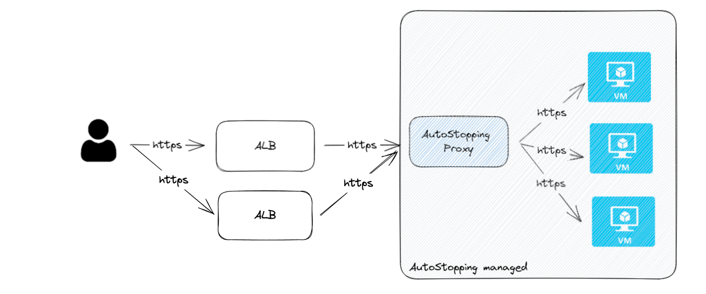
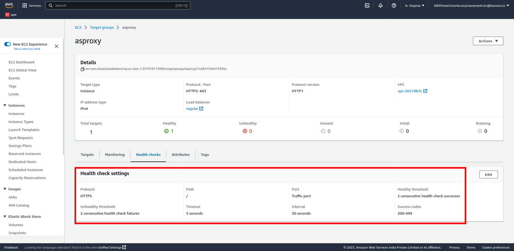
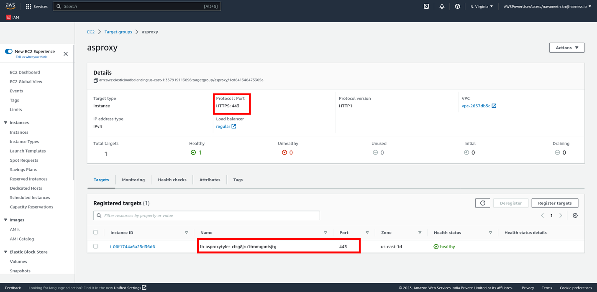
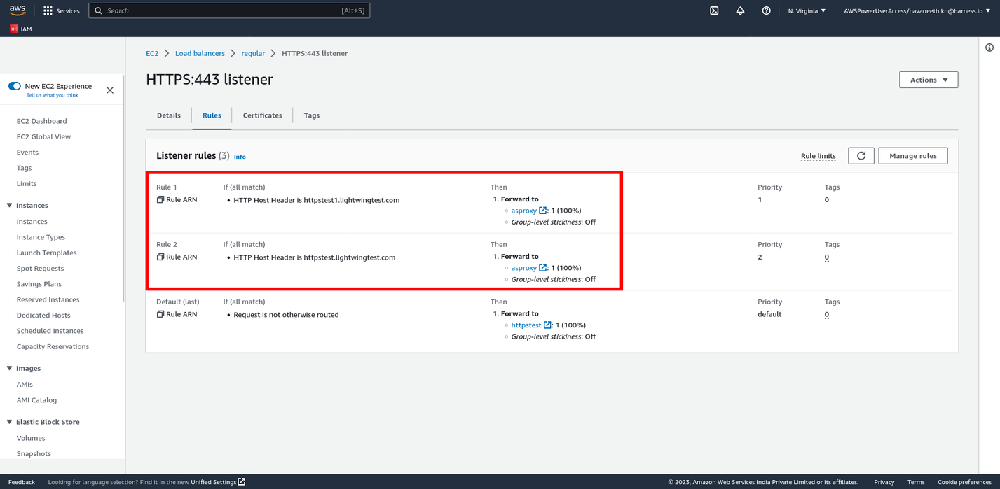
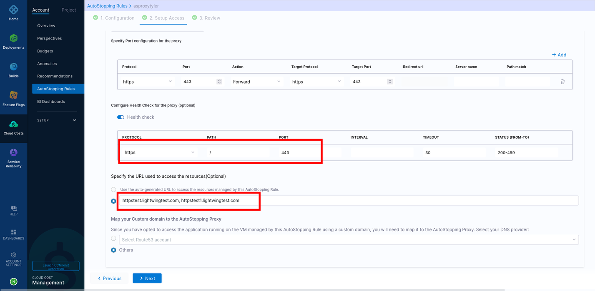

# Configure Autostopping Porxy as a Downstream to AWS ALB
The AutoStopping Proxy can be used as a downstream system to existing ALB(s) in order to leverage dynamic idle-time detection required for AutoStopping of resources. This can be done for various types of load balancers. This would mean no changes to existing DNS mappings done on AWS ALB and involves easier configuration without any disruptions.

### Steps to be performed to configure an AutoStopping Proxy as a downstream system of AWS ALB:

* Create a target group for the proxy VM with a health check configuration.
* Edit ALB rules and add forwarding action to the proxy target group.
* Create AutoStopping rule with HTTP/HTTPS workload and configure custom domains in the AutoStopping rule.

## Create a target group for the AutoStopping Proxy VM with a health check configuration

1. In the AWS console, navigate to Target Groups and create a new target group.

2. Choose the AutoStopping Proxy VM and register it as a target.

3. The port should match the port details of the application.

4. Configure the health check settings as per the port information. Success codes should be configured to be a range from 200-499.

5. If the Proxy needs to handle multiple ports (80, 443), create a target group for each of the ports.

## Edit ALB rules and add forwarding action to the proxy target group

All the URLs configured on the AutoStopping Rules should point to the AutoStopping Proxy target group.

## Create an AutoStopping Rule with custom domains

