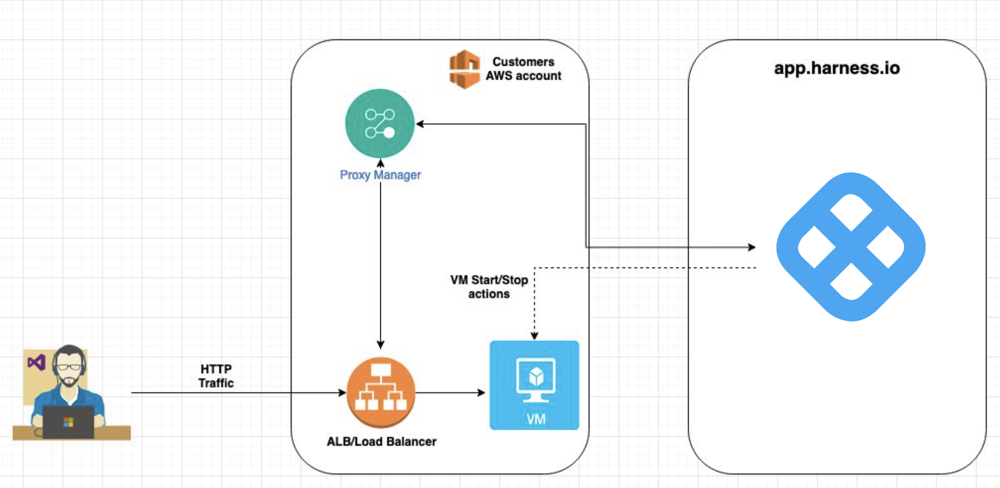
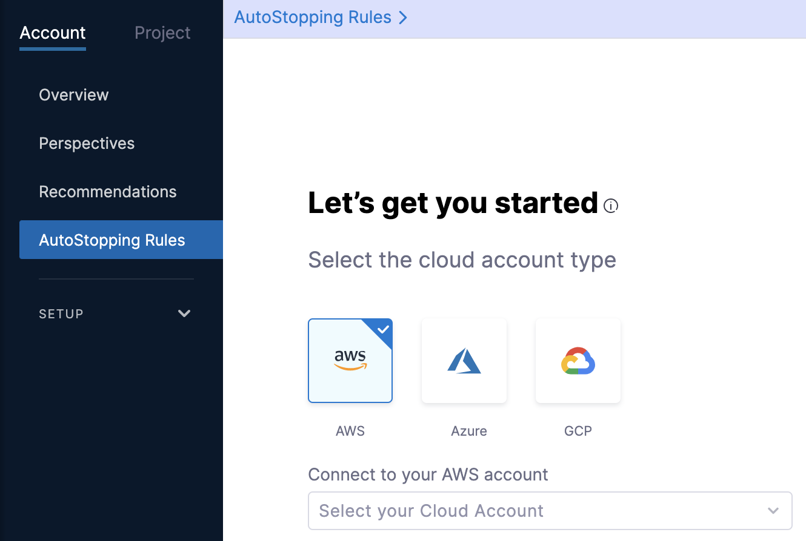
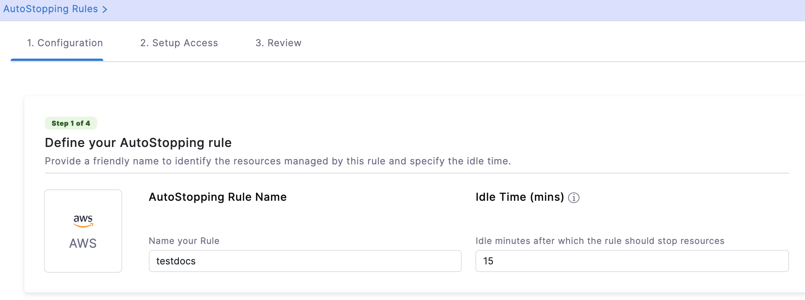
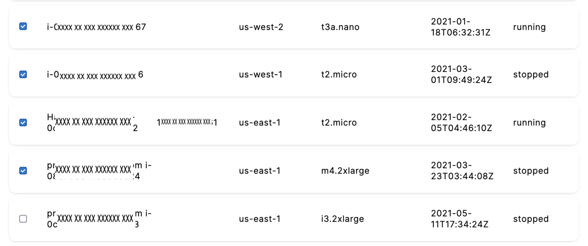
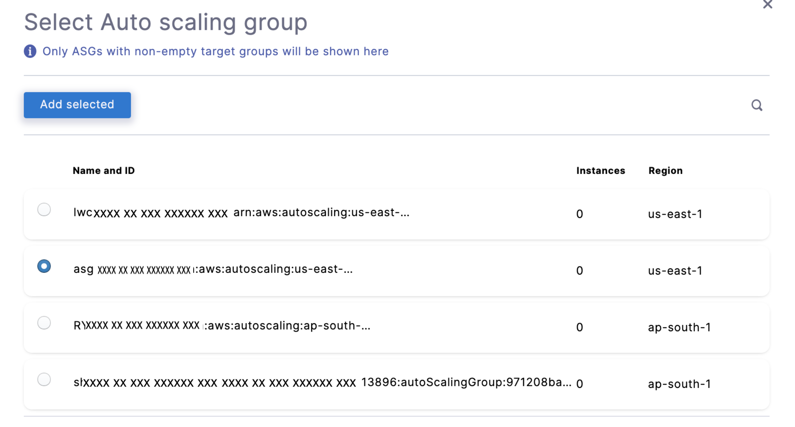
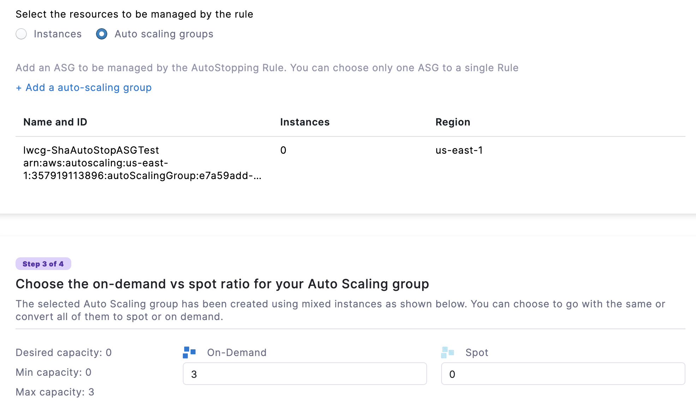
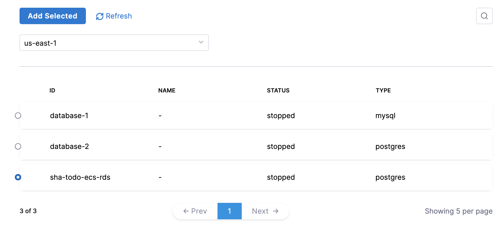
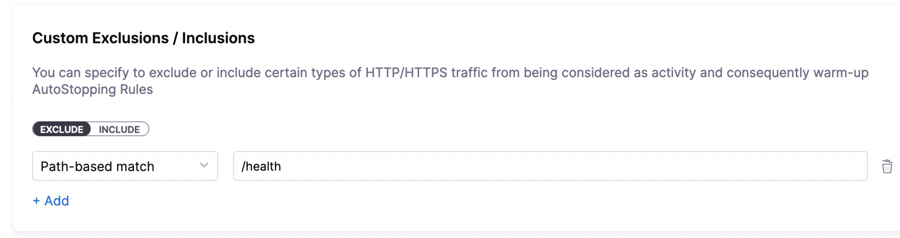
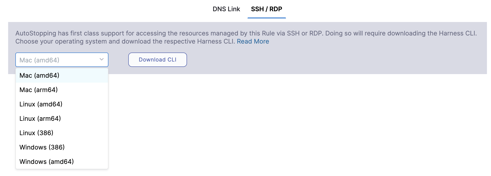
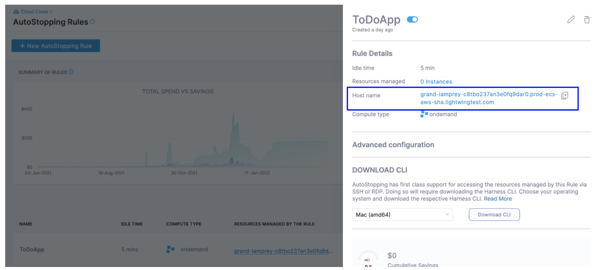

# Create AutoStopping Rules for AWS
AutoStopping Rules make sure that your non-production resources run only when used, and never when idle. It also allows you to run your workloads on fully orchestrated spot instances without any worry of spot interruptions.

## Before you begin

* [Create an AWS Connector for Autostopping Rules](../1-add-connectors/connect-to-an-aws-connector.md)
* [Create a Kubernetes Connector for AutoStopping Rules](../1-add-connectors/k8s-connector-autostopping.md)
* [AutoStopping Rules Overview](../1-auto-stopping-rules.md)

## Prerequisites

* Ensure that you have AWS EC2 VMs or Auto Scaling Groups created.
* Ensure that you have access to CUR. See [Review: Cost and Usage Reports (CUR) and CCM Requirements](../../../2-getting-started-ccm/4-set-up-cloud-cost-management/set-up-cost-visibility-for-aws.md#cost-and-usage-reports-cur-and-ccm-requirements)
* Permissions to create a cross-account role. See [AWS Access Permissions](../../../2-getting-started-ccm/4-set-up-cloud-cost-management/set-up-cost-visibility-for-aws.md#aws-access-permissions).
* To create an AutoStopping rule using an AutoStopping proxy load balancer: 
   * You must provide the required permissions to Harness to create a VM in your AWS account.
   * You must provide the required permissions to read the secrets and fetch the certificates stored in the secret for TLS-based flows.
   * Ensure that you reserve some IPs if you intend to allocate elastic IP while creating an AutoStopping proxy.

## How Spot orchestration works?

For spot instances, periodic snapshots are taken every two minutes. A snapshot is also taken before the instance is shut down. It is important to note here that only the last three successful snapshots are kept, while the rest are deleted. When an interruption occurs, or when the next activity after idleness occurs, the last known snapshot is used to create a new spot instance. If there is no available spot capacity, we fall back to an on-demand instance. AWS spot instance creation API is used to create a new spot instance.

When there is idleness, the spot instance, along with the root EBS volume, is terminated after a successful snapshot is taken (snapshots in AWS are incremental, so subsequent snapshots after the first one are very fast). When a new spot instance is created, the root EBS volume is recreated from the most recent successful snapshot and the additional EBS volumes are reattached. As a result, there is no data loss. All network interfaces and metadata are also saved. As a result, even though it's a new spot instance, the user sees it to be the same machine.

## Visual summary

This section provides an overview of AutoStopping Rules.
<figure><iframe src="//fast.wistia.com/embed/iframe/8wo6shjqqh" width="560" height="315" frameborder="0" allowfullscreen=""></iframe></figure>

## AutoStopping architecture

Here is an AutoStopping architecture for AWS resources:



## Add a Cloud provider

Perform the following steps to link your AWS cloud account to Harness.

1. In **Cloud Costs**, click **New AutoStopping Rule**.
     
	   
2. In **AutoStopping Rules**, select **AWS**. It is the cloud account in which your workloads are running that you want to manage using AutoStopping rules.
   
      
3. If you have already linked your AWS account and want to use that account, then select the AWS account from the **Connect to your AWS account** drop-down list.
4. If you have not added your cloud account, click **Connect to your AWS account** drop-down list and then click **New Connector**. For the detailed steps, see [Connect to an AWS Connector](../1-add-connectors/connect-to-an-aws-connector.md).
   
     

## Add a new AutoStopping rule

Perform the following steps to add a new AWS AutoStopping rule:

* Configuration: In this step, do the following:
	+ Step: Define an AutoStopping Rule
	+ Step: Select the Resources to be Managed by the AutoStopping Rule
		- Option 1: Select EC2 VM(s)
		- Option 2: Select Auto Scaling Groups
		- Option 3: Select Kubernetes Clusters
		- Option 4: Select ECS Service
		- Option 5: Select RDS Instances
	+ (Optional) Step: Set Up Advanced Configuration
* Setup Access: In this step, do the following:
	+ Setup Access for TCP workload or SSH/RDP 
	+ Setup Access for HTTP/HTTPS workload
* Review: Verify the configurations.

### Define an AutoStopping rule

Perform the following steps to get started with AutoStopping Rule.

1. In **Cloud Costs,** in **AutoStopping Rules**, click **New AutoStopping Rule**.
2. In the cloud account type, select **AWS**. It is the cloud account in which your workloads are running that you want to manage using AutoStopping rules.
3. Select your AWS account from the **Connect to your AWS account** drop-down list and click **Next**. If you have not added an AWS cloud account, see [Connect to an AWS Connector](../1-add-connectors/connect-to-an-aws-connector.md).
   
     
4. In **Define your AutoStopping rule**, in **Name your Rule**, enter a name for your rule. This is the name of your AutoStopping rule.
5. In **Idle time**, enter the idle time in minutes. This is the time duration for which the AutoStopping rule waits before stopping the idle instances.  
  
  After the idle time elapses:  
  
  - For Spot Instances, a snapshot is taken, and then the instances are terminated. See **How Spot Orchestration Works?** section.  
  
  - On-Demand Instances are shut down without a snapshot.
  
   

### Select the resources to be managed by the AutoStopping Rule

Select the cloud resources that you want to manage using this rule. AutoStopping Rule monitors the selected resources and stop them when they are idle beyond the configured idle time. You can select any of the following:

* Instances
* Auto Scaling Groups
* Kubernetes Cluster
* ECS Service
* RDS Instance

#### Option 1: Select EC2 VM(s)

Add instance/s to be managed by your AutoStopping rule.

:::note
You can add multiple instances to a single Rule. However, all the VMs should be part of the same region.
:::

1. Select **Instances** and click **Add an Instance**.
2. Select the instances that you want to manage using the AutoStopping rules. You can use the search option to search the instances.
   
     

3. After selecting the instances, click **Add selected**.
4. You can convert the fulfillment type of your selected instances. Select **Spot** or **On-Demand**.

#### Option 2: Select Auto Scaling Groups

Add an Auto Scaling Group to be managed by the AutoStopping rule.

:::note
You can add only one Auto Scaling Group to a rule.
:::

1. Select **Auto scaling groups** and click **Add a auto-scaling group**.
2. Select the Auto Scaling Group that you want to manage using the AutoStopping rule. You can also use the search option to find the Auto Scaling Group.
   
   
     

3. After selecting the Auto Scaling Group, click **Add selected**.
4. You can convert the fulfillment type of your selected Auto Scaling Group. Enter the number of instances for **Spot** and **On-Demand**. Depending on the size of your Auto Scaling group, you can specify the values for each fulfillment type. The total number of Spot and On-Demand instances should always be equal to or less than the maximum capacity of the group.  
  
  If the maximum capacity of your group is 3, then you can enter the ratio of your instances like the following:  


  | **On-Demand** | **Spot** |
  | ------------- | -------- |
  | 1             | 2        |
  | 2             | 1        |
  | 0             | 3        |
  | 3             | 0        |

  
In this example, all the instances are of On-Demand type.

  

#### Option 3: Select Kubernetes Clusters

Add a cluster to be managed by the AutoStopping Rule.

1. Select **Kubernetes Cluster** and then click **Add a cluster**.
2. Select the Kubernetes cluster that you want to manage using the AutoStopping rules. If you wish to create a new connector for the Kubernetes cluster, see [Create a Kubernetes Connector for AutoStopping Rules](../1-add-connectors/k8s-connector-autostopping.md).
3. Once you have finished selecting the Kubernetes cluster, click **Add selected**.  

:::note
If you select a Kubernetes cluster, follow the steps in [Create AutoStopping Rules for Kubernetes Cluster](../4-create-auto-stopping-rules/create-autostopping-rules-for-kubernetes.md).
:::


#### Option 4: Select ECS Service

Add an ECS Service to be managed by the AutoStopping Rule. See [Create AutoStopping Rules for Amazon ECS](../4-create-auto-stopping-rules/create-auto-stopping-rules-for-ecs.md).

#### Option 5: Select RDS Instances

Add the RDS instance to be managed by this Autostopping Rule.

1. Select **RDS instances** and then click **Add RDS instances**.
2. Select a region from the **All Regions** drop-down list to see all the databases.
3. Select the RDS instance for which you want to implement the AutoStopping Rule and click **Add Selected**.
   
     

## (Optional) Step: Set Up Advanced Configuration

In this step, you can configure the following settings:

### Hide progress page

Toggle the button to disable the display of progress page during instances' warming up process. This option is especially useful when the service is invoked by an automation system, as it prevents misinterpretation of the progress page as the intended response from a service that is onboarded to AutoStopping. By hiding the progress page, the first response of warming up a rule after a downtime will be delayed until the intended service is up and running.


### Dry Run

Toggle the button if you wish to evaluate this feature without terminating your cloud resources. For more information, go to [Evaluate AutoStopping rules in dry-run mode](../4-create-auto-stopping-rules/autostopping-dry-run-mode.md).

### Add Dependency

Set dependencies between two or more AutoStopping Rules when you want one Rule to make one or more Rules to be active based on the traffic that it receives. For example for an application server dependant on a database server, create two AutoStopping Rules managing both the servers. Add a dependency on the Rule managing the application server to be dependant on the Rule managing the database server.

1. In **Dependencies**, click **add dependency** to add a dependency on any existing rule.
2. Select the rule from the **RULES** drop-down list.
3. In **DELAY IN SECS**, enter the number of seconds that rule should wait after warming up the dependent rule. For example, you have Rule 1 dependent on Rule 2 and you have set 5 seconds delay. In that case, when the request is received to warm up Rule 1, then first Rule 2 (dependent rule) is warmed up, and then there is a delay of 5 seconds before warming up Rule 1.
4. Once you're done with all the configurations, click **Next**.

### Fixed Schedules

Create fixed uptime or downtime schedules for the resources managed by this AutoStopping Rule. When a resource is configured to go up or down on a fixed schedule, it is unaffected by activity or idleness during that time period.

In certain scenarios, you would not want your resources to go down or up. For example, every Friday at 5 p.m. you want your `ABC` resource to go down. You can schedule downtime for your `ABC` resource. During this window, the resource is forced to go down regardless of the defined rule. You can choose to specify uptime for your resources in the same way.

:::note
The fixed schedule takes precedence over the defined AutoStopping Rule. 
:::

:::note
Harness executes scheduled rules using [Dkron](https://dkron.io/), an open-source workload automation service.
:::

To create a fixed schedule for your rule, do the following:

1. In **Fixed Schedules**, click **Add Fixed Schedule**.
   
     
2. In **New Fixed Schedule**, enter a **Name** for your schedule.
3. In **Type**, select the type for your schedule. You can schedule an **Uptime** or **Downtime** for your rule. As per your schedule, the resources go up or down.
4. Select the **Time Zone** from the drop-down list.
5. In **Set schedule period**, use the date picker to set the start and end time for your schedule.
	1. In **Begins on**, select the start date and time for your schedule. You can select a date and specify the time.
	2. In **Ends on**, select the end date and time for your schedule. You can select a date and specify the time. Ensure that **Never ends** checkbox is unselected to set the end time.  
	  
	If you don't specify an end time, the schedule continues to run until you manually update the settings or remove the schedule.
6. Select the checbox **Never ends** if you do not want to set end time for your schedule.
7. You can also set a recurring schedule for the rule. If you want to set a recurring schedule, in **Uptime/Downtime in the selected period**, in **Repeats**, select the repeat frequency.
	1. Select which days of the week you'd like your schedule to repeat. You can choose any day between Sunday and Saturday.
	2. Select **Everyday**, to set the schedule for all seven days of the week.
	3. Set your repeat schedule's beginning and ending time. In the **Time** field, specify the start and end time for the fixed schedule.
	4. Select **All Day**, if you wish to set your schedule for the entire day. If you choose All Day for your schedule, you won't be able to choose a start and end time.  
	  
	**Example 1**:  
	In the following example, resources are up every Mon, Tue, Wed starting from 12:00 a.m. on February 14, 2022 till April 30, at 10:00 p.m.
     
       
     
     **Example 2**:  
	In the following example, resources are down every day (all day) starting from 12:00 a.m. on February 14, 2022 till April 30, at 12:00 a.m.
     
       
8. Click **Apply**.

Now that you have the AutoStopping rule configured, define how you would want to access the underlying application running on the resources managed by this Rule. You can use either of the following or both the methods depending on your requirement:

* **Set up Access for HTTP/HTTPS workload**: If the underlying applications running on the resources managed by the AutoStopping Rule are accessed by an HTTP or HTTPS URL.
* **Setup Access for TCP workload or SSH/RDP**: If the underlying applications running on the resources managed by AutoStopping Rule are accessed via TCP, SSH or RDP.
* You could skip this step for now and use the CLI to set up access. Go to [Use the Harness CLI to access resources through SSH/RDP](create-autostopping-rules-aws.md#use-the-harness-cli-to-access-resources-through-sshrdp) for details.

## Set up access for TCP workload or SSH/RDP 

Setting up access for TCP workload or SSH/RDP allows AutoStopping to detect activity and idleness, and ensure that the database is up and running only when you need it. Use the AutoStopping Proxy URL (IP/Hostname of the Proxy and a unique autogenerated port number) for this AutoStopping Rule when you connect to the RDS database using any database client. The Proxy URL is generated when you save the AutoStopping Rule.
If you need to access the resources managed by this AutoStopping rule using TCP or SSH/RDP HTTPS URL, you need to perform the following steps: 


  


1. Choose an AutoStopping Proxy load balancer from the **Specify AutoStopping Proxy** dropdown list to set up access.
2. Toggle SSH or RDP to specify the listening ports. The port number is autopopulated based on the security group.
3. Specify the source port numbers and the target TCP ports your application is listening to. If the source port is not specified, a random port will be generated at the backend. This auto-generated port will continue to be used as long as the target port remains unchanged or unless the user explicitly modifies the source port.
4. Click **Next**.


## Set up access for HTTP/HTTPS workload

If you need to access the resources managed by this AutoStopping rule using an HTTP or HTTPS URL, you need to perform the following steps: 

Choose an Application Load Balancer or an AutoStopping Proxy load balancer from the dropdown list to set up access.

### Use an Application Load Balancer
  If you have not created a load balancer already, go to [Create an Application load balancer](../3-load-balancer/create-load-balancer-aws.md).

#### Enter the routing configuration 

1. If the security groups are configured for the selected instances, then the routing information is auto-populated for those instances.  
You can edit or delete the routing information. However, it is mandatory to have at least one port listed. For more information, see [Listeners](https://docs.aws.amazon.com/elasticloadbalancing/latest/application/load-balancer-listeners.html). 

  This is the load balancer routing configuration for the underlying application that is running on the cloud resources managed by this AutoStopping rule.


  


2. Click **Add** if you wish to add more ports. The following are some points to consider:  
	  
  * If you are forwarding the same action to different ports, then specify the server name and/or path match.  
	  
  * If you specify the server name, then the host uses the custom URL to access the resources. You cannot use an auto-generated URL to access the resources.

##### Add multiple domains with the AutoStopping rule
ALB has certain [limitations](https://docs.aws.amazon.com/elasticloadbalancing/latest/application/load-balancer-limits.html) to consider when creating rules. By default, ALB allows only five conditions on a Listener Rule. This can become problematic when the AutoStopping rule requires configuration for more than five domains. To address this, you can utilize the **Server name** field in the **Port configuration** section.

:::important
Each row in the Port config table represents an ALB rule in Harness. The information provided in the row is translated into an ALB rule by the Harness backend. Therefore, the **Server name** field has a limit of five domains.
:::

You can add a comma separated list of domain names in the server name field to add more domains to the rule. Each server name field can take up to five domain names. Continue adding rows to the table until all domains are included. Each row will generate a new rule in the ALB of the Harness load balancer.

#### Enter the Health Check Details
1. Toggle the **Health check** button to configure the health check. Health check status should be successful for the AutoStopping rules to come into effect. Set a health check for the underlying application that is running on the cloud resources managed by this AutoStopping rule. The load balancer periodically sends requests as per the settings below to the application. If your application does not support health check or you do not have any application running, you can disable the health check.

  By default, the health check is turned on.

4. In Protocol, select **http** or **https**.
5. Enter Path, port, and timeout details. For example, if you have configured port 80 and the timeout as 30 seconds for your instance, then the AutoStopping rule checks these specified parameters before bringing AutoStopping Rule into effect.
   

   

#### Specify the URL to access the resources

You can use either of the following methods:

* Auto-generated URL
* Custom URL

**Auto-generated URL**

Every AutoStopping rule has an auto-generated URL. This URL is a subdomain to the domain name specified for the [load balancer](../3-load-balancer/create-load-balancer-aws.md). Since the load balancer configures a wildcard domain such as `*.autostopping.yourcompany.com`, the auto-generated URL works automatically and points to the correct load balancer.

Select **Use the auto-generated URL to access the resources managed by this AutoStopping Rule**.


**Custom URL**

AutoStopping rule can use multiple custom domains. In such a case, it should be configured in the DNS provider. AutoStopping Rules also allows you to use custom domains or change the root of your site's URL from the default, like,`autostop.harness.io`, to any domain you own. To point your site's default domain to a custom domain, you can set it up in your DNS provider.

Enter the custom URL currently used to access the instances. The domain name should be entered without prefixing the scheme. A rule can have multiple URLs. You can enter comma-separated values into a custom URL to support multiple URLs.


#### Configure custom exclusions and inclusions

Before you begin, make sure that you've enabled ALB access logs in your AWS account to be able to configure custom exclusions and inclusions while creating AutoStopping rules. Go to [ALB access logs](https://docs.aws.amazon.com/elasticloadbalancing/latest/classic/enable-access-logs.html) for more information.

Custom exclusions and inclusions allow you to keep the cloud resources managed by AutoStopping remain idle by defining rules. These rules prevent the cloud resource from detecting traffic by the AutoStopping rule. For example, you can use custom exclusions and inclusions to filter out repeated traffic such as health checks, which would otherwise keep the cloud resource active at all times. The minimum idle time for the exclusion or inclusion-enabled AutoStopping rule is 15 minutes.

You can configure exclusions by defining either of the following options:

* **Path-based match**: Specify the path that you want to exclude from invoking the instance. You can use wildcards in the path.
  
  
  
  An error message is displayed to the user trying to access the path if the managed resource is in a stopped state. If the resource is active and running, this request is not considered as traffic and is ignored by the AutoStopping rule.

* **Source IP-based match**: Specify one or more IP addresses that you want to exclude from accessing the instance. You could specify an entire range of IP addresses. Use commas to separate the IP addresses.
  
    
	
Any requests from the specified IP addresses are ignored by the AutoStopping rule.

Requests from these IP addresses or to these paths do not disturb the idle time configured for the AutoStopping rule.

Similarly, you can configure custom inclusions. Requests to the specified path or from the specified IP address alone can invoke the cloud resource managed by AutoStopping. Only these requests are detected as traffic by the AutoStopping rule.

### Use an AutoStopping Proxy load balancer
If you have not created an AutoStopping proxy load balancer already, go to [Create an AutoStopping Proxy load balancer](../3-load-balancer/create-autoproxy-aws-lb.md).

:::note
You can use the same proxy load balancer for more than one rule managing resources (VMs, ASG) within the same VPC.
:::

#### Enter Routing Configuration and Health Check Details

1. If the security groups are configured for the selected instances, then the routing information is auto-populated for those instances.  
You can edit or delete the routing information. However, it is mandatory to have at least one port listed. For more information, see [Listeners](https://docs.aws.amazon.com/elasticloadbalancing/latest/application/load-balancer-listeners.html). 

  This is the load balancer routing configuration for the underlying application that is running on the cloud resources managed by this AutoStopping rule.


  


2. Click **Add** if you wish to add more ports. The following are some points to consider:  
	  
  * If you are forwarding the same action to different ports, then specify the server name and/or path match.  
	  
  * If you specify the server name, then the host uses the custom URL to access the resources. You cannot use an auto-generated URL to access the resources.
  

3. Toggle the **Health check** button to configure the health check. Health check status should be successful for the AutoStopping rules to come into effect. Set a health check for the underlying application that is running on the cloud resources managed by this AutoStopping rule. The load balancer periodically sends requests as per the settings below to the application. If your application does not support health check, or you do not have any application running, you can disable the health check.

  By default, the health check is turned on.

4. In Protocol, select **http** or **https**.
5. Enter Path, port, and timeout details. For example, if you have configured port 80 and the timeout as 30 seconds for your instance, then the AutoStopping rule checks these specified parameters before bringing AutoStopping Rule into effect.
   

   

#### Specify the URL to access the resources

You can use either of the following methods:

* Auto-generated URL
* Custom URL

**Auto-generated URL**

Every AutoStopping rule has an auto-generated URL. This URL is a subdomain to the domain name specified for the [load balancer](../3-load-balancer/create-load-balancer-aws.md). Since the load balancer configures a wildcard domain such as `*.autostopping.yourcompany.com`, the auto-generated URL works automatically and point to the correct load balancer.

Select **Use the auto-generated URL to access the resources managed by this AutoStopping Rule**.


**Custom URL**

AutoStopping rule can use multiple custom domains. In such a case, it should be configured in the DNS provider. AutoStopping Rules also allows you to use custom domains or change the root of your site's URL from the default, like,`autostop.harness.io`, to any domain you own. To point your site's default domain to a custom domain, you can set it up in your DNS provider.

Enter the custom URL currently used to access the instances. The domain name should be entered without prefixing the scheme. A rule can have multiple URLs. You can enter comma-separated values into a custom URL to support multiple URLs.


## Use the Harness CLI to access resources through SSH/RDP 


SSH/RDP allows you to access the resources managed by the AutoStopping rule via SSH or RDP HTTPS URL. Select this option if the underlying applications running on the resources managed by AutoStopping Rule are accessed via SSH or RDP.

1. In **Setup Access**, select **SSH/RDP**.
2. Select your operating system to download the Harness CLI for your system.
   
     
3. Click **Download CLI**.
4. You can connect using SSH or RDP.

#### SSH Commands

To connect to remote servers via SSH/RDP, such as PuTTY, use the Harness CLI `connect` command. The `connect` command opens a proxy connection in your machine which can be used from other applications.


```
harness connect --host hostname --port <ssh/rdp port>
```
You can simply copy the hostname from the AutoStopping Rule dashboard view. Click on the AutoStopping Rule that you want to connect and copy the hostname.



For example:


```
harness connect --host default-test-ssh-1.abc1000test.lightwingtest.com --port 22 -- -i ~/.ssh/ry-jupyter.pem
```
Here is the output:


```
Proxy listening details:  
    Rule name:           Test SSH 1  
    Listen address:      127.0.0.1  
    Port forwarding:     14527 => 22  
    Protocol:            tcp  
    Started at:          2021-05-19 21:53:38.320943 +0530 IST m=+48.950643931
```
Harness `connect` created a secure tunnel from your computer to the given port after bringing up the VM. Now open the RDP/SSH client and use the hostname and port information provided above to connect.


```
harness ssh --host default-test-ssh-1.abc1000test.lightwingtest.com --user ubuntu --config lwc.toml -- -i ~/.ssh/ry-jupyter.pem
```
#### RDP Commands

For RDP run the following command:


```
harness rdp --host default-test-rdp-1.abc1000test.lightwingtest.com
```
Run the following command to connect via private IP:


```
harness rdp --host default-test-rdp-1.abc1000test.lightwingtest.com --internal-ip
```
Click **Next**.

### Review

In Review, verify all the configuration details and click **Save Rule**. To edit any of the configuration settings, click **EDIT** and modify the settings.

Your AutoStopping rule is listed under the [AutoStopping Rules dashboard](autostopping-dashboard.md).

### Next Steps

* [Create AutoStopping Rules for a Kubernetes Cluster](create-autostopping-rules-for-kubernetes.md)
* [Use AutoStopping Rules Summary Page](autostopping-dashboard.md)

