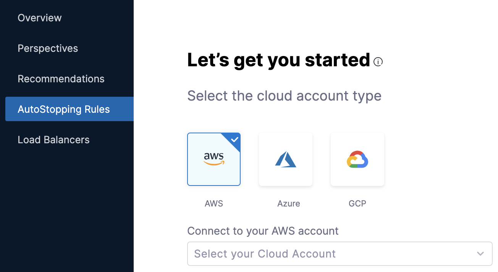

# Create AutoStopping Rules for a Kubernetes Cluster
AutoStopping Rules make sure that your non-production resources run only when used, and never when idle. 

## Before you begin

* [Create a Kubernetes Connector for AutoStopping Rules](../1-add-connectors/k8s-connector-autostopping.md)
* [AutoStopping Rules Overview](../1-auto-stopping-rules.md)

## Kubernetes Coverage

The following section lists the support for Kubernetes clusters for AutoStopping Rules:

* EKS (AWS)
* GKE (GCP)
* AKS (Azure)
* kOps

## Prerequisites

* Ingress controller installed. For more information, go to [Supported Ingress Controllers for Kubernetes AutoStopping](../../../../getting-started/supported-platforms-and-technologies.md#cloud-cost-management).
* Ensure that you have Cluster Autoscaler enabled for EKS with managed node groups.
* For EKS:
	+ Ensure that you have access to (Cost Usage Report) CUR. See [Review: Cost and Usage Reports (CUR) and CCM Requirements](../../../2-getting-started-ccm/4-set-up-cloud-cost-management/set-up-cost-visibility-for-aws.md#cost-and-usage-reports-cur-and-ccm-requirements)
	+ Permissions to create a cross-account role. See [AWS Access Permissions](../../../2-getting-started-ccm/4-set-up-cloud-cost-management/set-up-cost-visibility-for-aws.md#aws-access-permissions)

## Add a cloud provider

Perform the following steps to link your Kubernetes cluster to Harness for creating AutoStopping Rules:

1. In **Cloud Costs**, in **AutoStopping Rules**, click **New AutoStopping Rule**.
   
     
2. In **AutoStopping Rules**, select the cloud account. It is the cloud account in which your workloads are running that you want to manage using AutoStopping Rules.  
  
You can select any of the following cloud account types:  
- AWS  
- Azure  
- GCP
  
    

3. If you have already linked your cloud account and want to use that account, then select your cloud account from the drop-down list.
4. If you have not added your cloud account, click **Connect to your** ***Cloud Account*** drop-down list. The name of the drop-down list depends on the cloud account type selection. If you select AWS, then the label reads as **Connect to your AWS account**.  
  
For the detailed steps, see the [Create a Kubernetes Connector for AutoStopping Rules](../1-add-connectors/k8s-connector-autostopping.md).

## Add a new AutoStopping rule

Perform the following steps to add a new AWS AutoStopping rule for Kubernetes clusters:

### Define an AutoStopping rule

Perform the following steps to get started with AutoStopping Rule.

1. In **Cloud Costs,** in **AutoStopping Rules**, click **New AutoStopping Rule**.
2. In the cloud account type, select your cloud account. For example, **AWS**. It is the cloud account in which your workloads are running that you want to manage using AutoStopping rules.
3. Select your cloud account from the **Connect to your** ***Cloud Account*** drop-down list. The name of the drop-down list depends on the cloud account type selection. If you select AWS, then the label reads as **Connect to your AWS account**.  
  
For the detailed steps, see [Create a Kubernetes Connector for AutoStopping Rules](../1-add-connectors/k8s-connector-autostopping.md).

  

4. In **Define your AutoStopping rule**, in **Name your Rule**, enter a name for your rule. This is the name of your AutoStopping rule.
5. In **Idle time**, enter the idle time in minutes. This is the time that the AutoStopping rule will wait before stopping the idle instances.

### Select the Resources to be Managed by the AutoStopping Rule

Select the Kubernetes workload that you want to manage using this rule. AutoStopping Rule will monitor the selected resources and stop them when they are idle beyond the configured idle time.

1. Select **Kubernetes Cluster** and then click **Add a cluster**.
2. Select the Kubernetes cluster that you want to manage using the AutoStopping rules. If you wish to create a new connector for the Kubernetes cluster, see [Create a Kubernetes Connector for AutoStopping Rules](../1-add-connectors/k8s-connector-autostopping.md).
3. Once you have finished selecting the Kubernetes cluster, click **Add selected**.

## (Optional) Set up Advanced Configuration

In this step, you can configure the following settings:

### Hide progress page

Toggle the button to disable the display of progress page during instances' warming up process. This option is especially useful when the service is invoked by an automation system, as it prevents misinterpretation of the progress page as the intended response from a service that is onboarded to AutoStopping. By hiding the progress page, the first response of warming up a rule after a downtime will be delayed until the intended service is up and running.


### Dry Run

Toggle the button if you wish to evaluate this feature without terminating your cloud resources. For more information, go to [Evaluate AutoStopping rules in dry-run mode](../4-create-auto-stopping-rules/autostopping-dry-run-mode.md).

### Add Dependency

Set dependencies between two or more AutoStopping Rules when you want one Rule to make one or more Rules to be active based on the traffic that it receives. For example for an application server dependant on a database server, create two AutoStopping Rules managing both the servers. Add a dependency on the Rule managing the application server to be dependant on the Rule managing the database server.

1. Click **add dependency** to add a dependency on any existing rule.
2. Select the rule from the **RULES** drop-down list.
3. In **DELAY IN SECS**, enter the number of seconds that rule should wait after warming up the dependent rule. For example, you have Rule 1 dependent on Rule 2 and you have set 5 seconds delay. In that case, when the request is received to warm up Rule 1, then Rule 2 (dependent rule) is warmed up first, and then there will be a delay of 5 seconds before warming up Rule 1.
4. Once you're done with all the configurations, click **Next**.

### Fixed Schedule

Create fixed uptime or downtime schedules for the resources managed by this AutoStopping Rule. When a resource is configured to go up or down on a fixed schedule, it is unaffected by activity or idleness during that time period.

In certain scenarios, you would not want your resources to go down or up. For example, every Friday at 5 p.m. you want your `ABC` resource to go down. You can schedule downtime for your `ABC` resource. During this window, the resource will be forced to go down regardless of the defined rule. You can choose to specify uptime for your resources in the same way.

:::note
The fixed schedule takes precedence over the defined AutoStopping Rule.
:::

:::note
Harness executes scheduled rules using [Dkron](https://dkron.io/), an open-source workload automation service.
:::

To create a fixed schedule for your rule, do the following:

1. In **Fixed Schedules**, click **Add Fixed Schedule**.
   
     
2. In **New Fixed Schedule**, enter a **Name** for your schedule.
3. In **Type**, select the type for your schedule. You can schedule an **Uptime** or **Downtime** for your rule. As per your schedule, the resources will go up or down.
4. Select the **Time Zone** from the drop-down list.
5. In **Set schedule period**, use the date picker to set the start and end time for your schedule.
	1. In **Begins on**, select the start date and time for your schedule. You can select a date and specify the time.
	2. In **Ends on**, select the end date and time for your schedule. You can select a date and specify the time. Ensure that **Never ends** checkbox is unselected to set the end time.  
	  
	If you don't specify an end time, the schedule will continue to run until you manually update the settings or remove the schedule.
6. Select the checbox **Never ends** if you do not want to set end time for your schedule.
7. You can also set a recurring schedule for the rule. If you want to set a recurring schedule, in **Uptime/Downtime in the selected period**, in **Repeats**, select the repeat frequency.
	1. Select which days of the week you'd like your schedule to repeat. You can choose any day between Sunday and Saturday.
	2. Select **Everyday**, to set the schedule for all seven days of the week.
	3. Set your repeat schedule's beginning and ending time. In the **Time** field, specify the start and end time for the fixed schedule.
	4. Select **All Day**, if you wish to set your schedule for the entire day. If you choose All Day for your schedule, you won't be able to choose a start and end time.  
	  
	**Example 1**:  
	In the following example, resources will be up every Mon, Tue, Wed starting from 12:00 a.m. on February 14, 2022 till April 30, at 10:00 p.m.
    
      **Example 2**:  
	In the following example, resources will be down every day (all day) starting from 12:00 a.m. on February 14, 2022 till April 30, at 12:00 a.m.
    
      
8. Click **Apply**.

## Setup Access

In this step, update the resource definition YAML of the Kubernetes AutoStopping Rule that will be applied to the cluster.

### Ingress

The specification in the YAML file is the same as a Kubernetes Ingress with additional metadata. These are the configurations to the Ingress that the AutoStopping Rule will create for your Service.

Update the following parameters with the correct HTTP/HTTPS service details:

* **(Optional) host**: Enter the domain name. If a host is provided (for example, `app.harness.com`), the rule applies to that host. If you do not specify the domain name, the ingress created will match requests to all the domains.
* **name**: Enter the name of your Kubernetes service. For example, `test`.
* **port**: Enter the port number. For example, `80`.
* For more information, see [The Ingress Resource](https://kubernetes.io/docs/concepts/services-networking/ingress/#the-ingress-resource).  
  

```
apiVersion: ccm.harness.io/v1  
kind: AutoStoppingRule  
metadata:  
    name: test-rule  
    namespace: default  
    annotations:  
        harness.io/cloud-connector-id: Lightwing_Non_Prod  
spec:  
    service:  
        name: <replace with your service name>  
        port: 80  
    ingress:  
        name: <replace with ingress name>  
        controllerName: nginx  
    idleTimeMins: 15  
    hideProgressPage: false
```

### Non-Ingress

If your workload is non-ingress type, copy the following YAML and edit the metadata. These are the configurations to the Non-Ingress that the AutoStopping Rule will create for your Service.

Edit the metadata with correct service details:


```
apiVersion: ccm.harness.io/v1  
kind: AutoStoppingRule  
metadata:  
    name: <*postgres*>  
    namespace: <*dev-poc*>  
    annotations:  
        harness.io/cloud-connector-id: <*connector\_id*>  
spec:  
    idleTimeMins: <40>  
    workloadName: <*postgres>*  
    workloadType: <*Deployment*>
    hideProgressPage: false
```
1. After updating the YAML file with all the details, click **Validate YAML**.
2. Click **Next** once the YAML is validated.
3. Click **Save Rule**.
   
     

## Next Step

* [Use AutoStopping Rules Summary Page](autostopping-dashboard.md)

