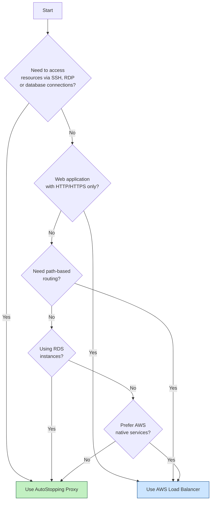
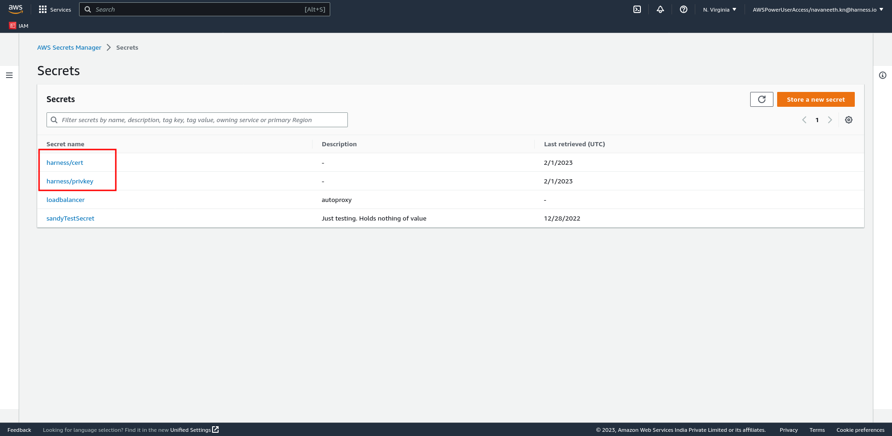
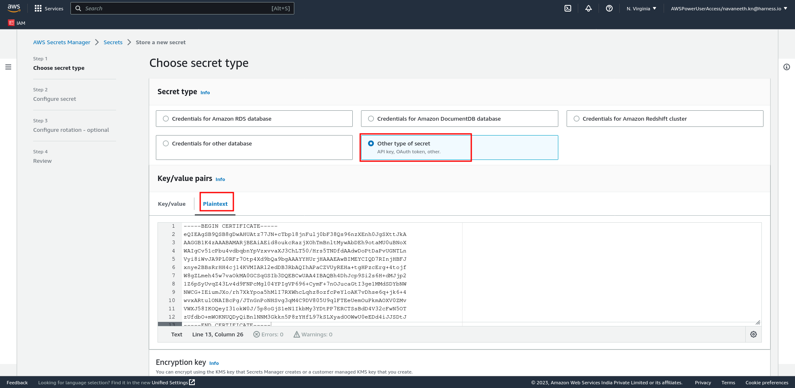

## What is an AutoStopping proxy?

AutoStopping is designed to integrate seamlessly with native load-balancing solutions like AWS ALB. However, for use cases that fall outside of these integrations such as SSH, RDP, or RDS connections, AutoStopping offers an advanced reverse proxy solution: **the AutoStopping Proxy**.

This proxy VM sits in front of your virtual machines and intelligently starts or stops them based on incoming network traffic. It supports both HTTP(S) and TCP connections:

- **For HTTP(S)**: It provides Layer 7 load balancing, request routing, and full SSL support.
- **For TCP traffic**: It uses ephemeral, dynamically generated port mappings to route connections efficiently.

Built on the proven, open-source [Envoy Proxy](https://www.envoyproxy.io/), the AutoStopping Proxy is highly reliable and scalable, capable of managing traffic for multiple AutoStopping-managed VMs from a single instance.

<DocImage path={require('./static/autostopping-proxy-architecture-diagram.png')} width="70%" height="70%" title="Click to view full-size image" />

## Choosing Between Load Balancer and AutoStopping Proxy

### Key Differences

| Feature | AWS Load Balancer | AutoStopping Proxy |
|---------|------------------|--------------------|
| **Traffic Types** | HTTP/HTTPS only | HTTP/HTTPS + TCP |
| **Best For** | Web applications | Direct VM access, databases |
| **Implementation** | AWS native ALB | Dedicated proxy VM |

## Steps to create an AutoStopping proxy for AWS

1. In **Harness**, go to the **Cloud Costs** module. Click on **AutoStopping Rules** from left Navbar.
2. Click **Load Balancers**.
3. Click **Create New Load Balancer**.
4. Select **AWS**.
5. Choose an existing connector or [create a new one](/docs/cloud-cost-management/get-started/onboarding-guide/set-up-cost-visibility-for-aws).
6. Click **Continue**.
7. Click **Create AutoStopping Proxy**. 
8. Click **Continue**.
9. In the **Create a new AutoStopping Proxy** window, enter the following information:
    1. Provide a name for the AutoStopping Proxy.
    2. Select your preferred DNS provider and perform the mapping:
        * If you select **Route 53**, you must choose a hosted zone from the available zones and enter the domain name. AutoStopping manages Route 53 configuration automatically. 
        * If you select **Others**, enter the URL of the DNS provider. Make sure that you have updated the DNS mapping in your DNS provider.
    3. Click **Continue**.

<DocImage path={require('./static/aws-autoproxy-lb.png')} width="70%" height="70%" title="Click to view full-size image" />

10. On the next screen, configure the following settings:
    - **Region**: Select the AWS region where your target resources are hosted
    - **API Key**: Enter a Harness API key for authentication
      - Choose **No Expiration** when creating this key
      - See [Create an API Key](/docs/platform/automation/api/api-quickstart) for more information
    - **VPC**: Select the Virtual Private Cloud where your resources are located
    - **Security Groups**: Select security groups to control traffic flow
      - Ensure all required ports and protocols are allowed
    - **Subnet**: Select the subnet for the proxy deployment
    - **Machine type**: Select an appropriate AWS instance type for the proxy
      - Choose based on your expected traffic volume and performance needs
    - **Key Pair**: Select an SSH key pair to connect to your proxy VM
    - **TLS Certificate Configuration**:
      - **TLS Certificate Secret Version**: Provide a PEM-encoded certificate stored in AWS Secrets Manager
        - Store your certificate in AWS Secrets Manager using the **Other type of secret** option
        - Recommended naming convention: use _harness/_ prefix in the secret name
      - **TLS Private Key Secret Version**: Provide the ARN of your private key secret
        - Format: 'arn:aws:secretsmanager:[Region]:[AccountId]:secret:SecretName-6RandomCharacters'
        - See AWS documentation on [creating secrets](https://docs.aws.amazon.com/secretsmanager/latest/userguide/create_secret.html)
    - **[OPTIONAL] Allocate Static IP**: Enable to assign an elastic IP address
      - Makes the proxy publicly accessible
      - Remember to update your DNS records to point to this IP

<!-- <DocImage path={require('./static/aws-proxy-two.png')} width="70%" height="70%" title="Click to view full-size image" /> -->

### AWS Secrets Manager Configuration

1. Secret naming convention example:

2. Secret creation example:

11. Review your configuration and click **Save Load Balancer**.

## Next Steps

After creating your AutoStopping proxy, you can:

- [Create AutoStopping rules](/docs/cloud-cost-management/use-ccm-cost-optimization/optimize-cloud-costs-with-intelligent-cloud-auto-stopping-rules/autostopping-for-aws/create-rule-ec2) for your AWS resources

