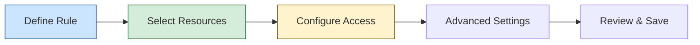

## Overview

AutoStopping Rules for EC2 automatically start and stop your non-production EC2 instances based on actual usage, ensuring you only pay for resources when they're needed. This guide walks you through setting up AutoStopping for EC2 instances.

## Prerequisites

### Required Accounts and Connectors
- [AWS Connector](/docs/cloud-cost-management/get-started/onboarding-guide/set-up-cost-visibility-for-aws) with appropriate permissions
- AWS account with EC2 instances or Auto Scaling Groups

### Required Permissions
- Access to AWS Cost and Usage Reports (CUR)
- Permissions to create cross-account IAM roles
- For proxy-based setup: permissions to create VMs and read secrets in your AWS account

### Recommended Reading
- [AutoStopping Overview](/docs/cloud-cost-management/use-ccm-cost-optimization/optimize-cloud-costs-with-intelligent-cloud-auto-stopping-rules/autostopping-overview)
- [Load Balancer Setup](/docs/cloud-cost-management/use-ccm-cost-optimization/optimize-cloud-costs-with-intelligent-cloud-auto-stopping-rules/autostopping-for-aws/load-balancer) (for HTTP/HTTPS access)
- [AutoStopping Proxy Setup](/docs/cloud-cost-management/use-ccm-cost-optimization/optimize-cloud-costs-with-intelligent-cloud-auto-stopping-rules/autostopping-for-aws/autostopping-proxy) (for SSH/RDP access)

## How AutoStopping Works with EC2

<DocVideo src="https://youtu.be/lNf_P5sHTcE" />

### Architecture


AutoStopping for EC2 works by:

1. **Monitoring usage** of your EC2 instances
2. **Automatically stopping** instances after a period of inactivity
3. **Instantly restarting** instances when traffic is detected
4. **Redirecting users** to a waiting page during instance startup

### Spot Instance Support

AutoStopping includes intelligent spot instance orchestration that:

- Takes snapshots every 2 minutes and before shutdown
- Maintains the last 3 successful snapshots
- Uses snapshots to recreate instances after interruptions
- Falls back to on-demand instances when spot capacity isn't available
- Preserves data by reattaching EBS volumes and network interfaces

## Creating an AutoStopping Rule for EC2

### Step 1: Connect to AWS

1. In Harness, navigate to **Cloud Costs** module
2. Click **New AutoStopping Rule**
   
3. Select **AWS** as your cloud provider
   
4. Choose an existing AWS connector or click **New Connector** to create one
   

### Step 2: Define Your AutoStopping Rule

1. Enter a **Name** for your rule
2. Set the **Idle Time** - how long an instance should be inactive before stopping
3. Choose whether to use **Spot Instances** for cost savings



### Step 3: Select EC2 Resources to Manage

1. In the resource selection screen, choose **Instances** (EC2)
   
   

2. Filter instances by:
   - **Region** - Select the AWS region(s) where your instances are located
   - **Tags** - Filter instances by specific AWS tags
   - **Instance Name** - Search for specific instance names

3. Select the instances you want to manage with AutoStopping

4. Click **Add Selected** to include them in your rule

### Step 4: Configure Access Method

Choose how users will access your EC2 instances:

#### Option A: HTTP/HTTPS Access (Load Balancer)

For web applications or services that use HTTP/HTTPS:

1. Select **DNS Link** in the access setup screen
2. Choose an existing load balancer or [create a new one](/docs/cloud-cost-management/use-ccm-cost-optimization/optimize-cloud-costs-with-intelligent-cloud-auto-stopping-rules/autostopping-for-aws/load-balancer)
3. Configure routing:
   - Port mappings
   - Health check settings
   - URL configuration (auto-generated or custom)

#### Option B: SSH/RDP Access (AutoStopping Proxy)

For direct server access via SSH or RDP:

1. Select **SSH/RDP** in the access setup screen
2. Download the Harness CLI for your operating system
3. Use the provided commands to connect to your instances

```bash
# For SSH access
harness ssh --host <hostname> --user <username> --config lwc.toml

# For RDP access
harness rdp --host <hostname>
```

### Step 5: Advanced Configuration (Optional)

#### Scheduling Options

Create fixed schedules to automatically start or stop your instances at specific times:

1. Click **Add Fixed Schedule**
2. Configure schedule parameters:
   - **Name** - Identify your schedule
   - **Start/End Time** - When the schedule should begin and end
   - **Recurring Pattern** - Daily, weekly, or custom patterns
   - **Action** - Keep resources up or down during the scheduled period


#### Dependencies

Link your rule to other AutoStopping rules when resources depend on each other:

1. Click **Add Dependency**
2. Select the rule your instances depend on
3. Choose the dependency type (startup or shutdown)

### Step 6: Review and Save

1. Review all your configuration settings
2. Click **Save Rule** to create your AutoStopping rule

Your rule will appear in the AutoStopping Rules dashboard where you can monitor its status and savings.

## Using Your AutoStopping Rule

### Accessing EC2 Instances

#### Via HTTP/HTTPS

Use the URL configured in your rule to access your web applications. When instances are stopped:

1. Users are shown a waiting page
2. Instances are automatically started
3. Users are redirected once the application is ready

#### Via SSH/RDP

Use the Harness CLI to connect to your instances:

```bash
# For SSH access
harness ssh --host <hostname> --user <username> --config lwc.toml

# For RDP access
harness rdp --host <hostname>
```

### Monitoring and Managing Your Rule

- Track instance status and savings in the AutoStopping Rules dashboard
- Edit or delete your rule as needed
- Use the Harness CLI for advanced management and troubleshooting

### Troubleshooting

- Check the AutoStopping Rules dashboard for error messages or alerts
- Verify instance status and configuration in the AWS console
- Contact Harness support for assistance with troubleshooting or configuration issues

Create fixed uptime or downtime schedules for the resources managed by this AutoStopping Rule. When a resource is configured to go up or down on a fixed schedule, it is unaffected by activity or idleness during that time period.

In certain scenarios, you would not want your resources to go down or up. For example, every Friday at 5 p.m. you want your `ABC` resource to go down. You can schedule downtime for your `ABC` resource. During this window, the resource is forced to go down regardless of the defined rule. You can choose to specify uptime for your resources in the same way.

:::note
The fixed schedule takes precedence over the defined AutoStopping Rule.
:::

:::note
Harness executes scheduled rules using [Dkron](https://dkron.io/), an open-source workload automation service.
:::

To create a fixed schedule for your rule, do the following:

1. In **Fixed Schedules**, click **Add Fixed Schedule**.

   

2. In **New Fixed Schedule**, enter a **Name** for your schedule.
3. In **Type**, select the type for your schedule. You can schedule an **Uptime** or **Downtime** for your rule. As per your schedule, the resources go up or down.
4. Select the **Time Zone** from the drop-down list.
5. In **Set schedule period**, use the date picker to set the start and end time for your schedule.
   1. In **Begins on**, select the start date and time for your schedule. You can select a date and specify the time.
   2. In **Ends on**, select the end date and time for your schedule. You can select a date and specify the time. Ensure that **Never ends** checkbox is unselected to set the end time.
   If you don't specify an end time, the schedule continues to run until you manually update the settings or remove the schedule.
6. Select the checbox **Never ends** if you do not want to set end time for your schedule.
7. You can also set a recurring schedule for the rule. If you want to set a recurring schedule, in **Uptime/Downtime in the selected period**, in **Repeats**, select the repeat frequency.
   1. Select which days of the week you'd like your schedule to repeat. You can choose any day between Sunday and Saturday.
   2. Select **Everyday**, to set the schedule for all seven days of the week.
   3. Set your repeat schedule's beginning and ending time. In the **Time** field, specify the start and end time for the fixed schedule.
   4. Select **All Day**, if you wish to set your schedule for the entire day. If you choose All Day for your schedule, you won't be able to choose a start and end time.
   **Example 1**:  
   In the following example, resources are up every Mon, Tue, Wed starting from 12:00 a.m. on February 14, 2022 till April 30, at 10:00 p.m.
   
   **Example 2**:  
   In the following example, resources are down every day (all day) starting from 12:00 a.m. on February 14, 2022 till April 30, at 12:00 a.m.
   
8. Click **Apply**.

Now that you have the AutoStopping rule configured, define how you would want to access the underlying application running on the resources managed by this Rule. You can use either of the following or both the methods depending on your requirement:

- **Set up Access for HTTP/HTTPS workload**: If the underlying applications running on the resources managed by the AutoStopping Rule are accessed by an HTTP or HTTPS URL.
- **Setup Access for TCP workload or SSH/RDP**: If the underlying applications running on the resources managed by AutoStopping Rule are accessed via TCP, SSH or RDP.
- You could skip this step for now and use the CLI to set up access. Go to [Use the Harness CLI to access resources through SSH/RDP](create-autostopping-rules-aws.md#use-the-harness-cli-to-access-resources-through-sshrdp) for details.

## Set up access for TCP workload or SSH/RDP

Setting up access for TCP workload or SSH/RDP allows AutoStopping to detect activity and idleness, and ensure that the database is up and running only when you need it. Use the AutoStopping Proxy URL (IP/Hostname of the Proxy and a unique autogenerated port number) for this AutoStopping Rule when you connect to the RDS database using any database client. The Proxy URL is generated when you save the AutoStopping Rule.
If you need to access the resources managed by this AutoStopping rule using TCP or SSH/RDP HTTPS URL, you need to perform the following steps:


1. Choose an AutoStopping Proxy load balancer from the **Specify AutoStopping Proxy** dropdown list to set up access.
2. Toggle SSH or RDP to specify the listening ports. The port number is autopopulated based on the security group.
3. Specify the source port numbers and the target TCP ports your application is listening to. If the source port is not specified, a random port will be generated at the backend. This auto-generated port will continue to be used as long as the target port remains unchanged or unless the user explicitly modifies the source port.
4. Click **Next**.

## Set up access for HTTP/HTTPS workload

If you need to access the resources managed by this AutoStopping rule using an HTTP or HTTPS URL, you need to perform the following steps:

Choose an Application Load Balancer or an AutoStopping Proxy load balancer from the dropdown list to set up access.

### Use an Application Load Balancer

If you have not created a load balancer already, go to [Create an Application load balancer](../3-load-balancer/create-load-balancer-aws.md).

#### Enter the routing configuration

1. If the security groups are configured for the selected instances, then the routing information is auto-populated for those instances.  
   You can edit or delete the routing information. However, it is mandatory to have at least one port listed. For more information, see [Listeners](https://docs.aws.amazon.com/elasticloadbalancing/latest/application/load-balancer-listeners.html).

This is the load balancer routing configuration for the underlying application that is running on the cloud resources managed by this AutoStopping rule.


2. Click **Add** if you wish to add more ports. The following are some points to consider:  


- If you are forwarding the same action to different ports, then specify the server name and/or path match.  

- If you specify the server name, then the host uses the custom URL to access the resources. You cannot use an auto-generated URL to access the resources.

##### Add multiple domains with the AutoStopping rule

ALB has certain [limitations](https://docs.aws.amazon.com/elasticloadbalancing/latest/application/load-balancer-limits.html) to consider when creating rules. By default, ALB allows only five conditions on a Listener Rule. This can become problematic when the AutoStopping rule requires configuration for more than five domains. To address this, you can utilize the **Server name** field in the **Port configuration** section.

:::important
Each row in the Port config table represents an ALB rule in Harness. The information provided in the row is translated into an ALB rule by the Harness backend. Therefore, the **Server name** field has a limit of five domains.
:::

You can add a comma separated list of domain names in the server name field to add more domains to the rule. Each server name field can take up to five domain names. Continue adding rows to the table until all domains are included. Each row will generate a new rule in the ALB of the Harness load balancer.

#### Enter the Health Check Details

1. Toggle the **Health check** button to configure the health check. Health check status should be successful for the AutoStopping rules to come into effect. Set a health check for the underlying application that is running on the cloud resources managed by this AutoStopping rule. The load balancer periodically sends requests as per the settings below to the application. If your application does not support health check or you do not have any application running, you can disable the health check.

By default, the health check is turned on.

4. In Protocol, select **http** or **https**.
5. Enter Path, port, and timeout details. For example, if you have configured port 80 and the timeout as 30 seconds for your instance, then the AutoStopping rule checks these specified parameters before bringing AutoStopping Rule into effect.

   

#### Specify the URL to access the resources

You can use either of the following methods:

- Auto-generated URL
- Custom URL

**Auto-generated URL**

Every AutoStopping rule has an auto-generated URL. This URL is a subdomain to the domain name specified for the [load balancer](../3-load-balancer/create-load-balancer-aws.md). Since the load balancer configures a wildcard domain such as `*.autostopping.yourcompany.com`, the auto-generated URL works automatically and points to the correct load balancer.

Select **Use the auto-generated URL to access the resources managed by this AutoStopping Rule**.


**Custom URL**

AutoStopping rule can use multiple custom domains. In such a case, it should be configured in the DNS provider. AutoStopping Rules also allows you to use custom domains or change the root of your site's URL from the default, like,`autostop.harness.io`, to any domain you own. To point your site's default domain to a custom domain, you can set it up in your DNS provider.

Enter the custom URL currently used to access the instances. The domain name should be entered without prefixing the scheme. A rule can have multiple URLs. You can enter comma-separated values into a custom URL to support multiple URLs.


#### Configure custom exclusions and inclusions

Before you begin, make sure that you've enabled ALB access logs in your AWS account to be able to configure custom exclusions and inclusions while creating AutoStopping rules. Go to [ALB access logs](https://docs.aws.amazon.com/elasticloadbalancing/latest/classic/enable-access-logs.html) for more information.

Custom exclusions and inclusions allow you to keep the cloud resources managed by AutoStopping remain idle by defining rules. These rules prevent the cloud resource from detecting traffic by the AutoStopping rule. For example, you can use custom exclusions and inclusions to filter out repeated traffic such as health checks, which would otherwise keep the cloud resource active at all times. The minimum idle time for the exclusion or inclusion-enabled AutoStopping rule is 15 minutes.

You can configure exclusions by defining either of the following options:

- **Path-based match**: Specify the path that you want to exclude from invoking the instance. You can use wildcards in the path.

  

  An error message is displayed to the user trying to access the path if the managed resource is in a stopped state. If the resource is active and running, this request is not considered as traffic and is ignored by the AutoStopping rule.

- **Source IP-based match**: Specify one or more IP addresses that you want to exclude from accessing the instance. You could specify an entire range of IP addresses. Use commas to separate the IP addresses.

  

Any requests from the specified IP addresses are ignored by the AutoStopping rule.

Requests from these IP addresses or to these paths do not disturb the idle time configured for the AutoStopping rule.

Similarly, you can configure custom inclusions. Requests to the specified path or from the specified IP address alone can invoke the cloud resource managed by AutoStopping. Only these requests are detected as traffic by the AutoStopping rule.

### Use an AutoStopping Proxy load balancer

If you have not created an AutoStopping proxy load balancer already, go to [Create an AutoStopping Proxy load balancer](../3-load-balancer/create-autoproxy-aws-lb.md).

:::note
You can use the same proxy load balancer for more than one rule managing resources (VMs, ASG) within the same VPC.
:::

#### Enter Routing Configuration and Health Check Details

1. If the security groups are configured for the selected instances, then the routing information is auto-populated for those instances.  
   You can edit or delete the routing information. However, it is mandatory to have at least one port listed. For more information, see [Listeners](https://docs.aws.amazon.com/elasticloadbalancing/latest/application/load-balancer-listeners.html).

This is the load balancer routing configuration for the underlying application that is running on the cloud resources managed by this AutoStopping rule.


2. Click **Add** if you wish to add more ports. The following are some points to consider:  


- If you are forwarding the same action to different ports, then specify the server name and/or path match.  

- If you specify the server name, then the host uses the custom URL to access the resources. You cannot use an auto-generated URL to access the resources.

3. Toggle the **Health check** button to configure the health check. Health check status should be successful for the AutoStopping rules to come into effect. Set a health check for the underlying application that is running on the cloud resources managed by this AutoStopping rule. The load balancer periodically sends requests as per the settings below to the application. If your application does not support health check, or you do not have any application running, you can disable the health check.

By default, the health check is turned on.

4. In Protocol, select **http** or **https**.
5. Enter Path, port, and timeout details. For example, if you have configured port 80 and the timeout as 30 seconds for your instance, then the AutoStopping rule checks these specified parameters before bringing AutoStopping Rule into effect.

   

#### Specify the URL to access the resources

You can use either of the following methods:

- Auto-generated URL
- Custom URL

**Auto-generated URL**

Every AutoStopping rule has an auto-generated URL. This URL is a subdomain to the domain name specified for the [load balancer](../3-load-balancer/create-load-balancer-aws.md). Since the load balancer configures a wildcard domain such as `*.autostopping.yourcompany.com`, the auto-generated URL works automatically and point to the correct load balancer.

Select **Use the auto-generated URL to access the resources managed by this AutoStopping Rule**.


**Custom URL**

AutoStopping rule can use multiple custom domains. In such a case, it should be configured in the DNS provider. AutoStopping Rules also allows you to use custom domains or change the root of your site's URL from the default, like,`autostop.harness.io`, to any domain you own. To point your site's default domain to a custom domain, you can set it up in your DNS provider.

Enter the custom URL currently used to access the instances. The domain name should be entered without prefixing the scheme. A rule can have multiple URLs. You can enter comma-separated values into a custom URL to support multiple URLs.


## Use the Harness CLI to access resources through SSH/RDP

SSH/RDP allows you to access the resources managed by the AutoStopping rule via SSH or RDP HTTPS URL. Select this option if the underlying applications running on the resources managed by AutoStopping Rule are accessed via SSH or RDP.

1. In **Setup Access**, select **SSH/RDP**.
2. Select your operating system to download the Harness CLI for your system.

   

3. Click **Download CLI**.
4. You can connect using SSH or RDP.

#### SSH Commands

To connect to remote servers via SSH/RDP, such as PuTTY, use the Harness CLI `connect` command. The `connect` command opens a proxy connection in your machine which can be used from other applications.

```
harness connect --host hostname --port <ssh/rdp port>
```

You can simply copy the hostname from the AutoStopping Rule dashboard view. Click on the AutoStopping Rule that you want to connect and copy the hostname.


For example:

```
harness connect --host default-test-ssh-1.abc1000test.lightwingtest.com --port 22 -- -i ~/.ssh/ry-jupyter.pem
```

Here is the output:

```
Proxy listening details:
    Rule name:           Test SSH 1
    Listen address:      127.0.0.1
    Port forwarding:     14527 => 22
    Protocol:            tcp
    Started at:          2021-05-19 21:53:38.320943 +0530 IST m=+48.950643931
```

Harness `connect` created a secure tunnel from your computer to the given port after bringing up the VM. Now open the RDP/SSH client and use the hostname and port information provided above to connect.

```
harness ssh --host default-test-ssh-1.abc1000test.lightwingtest.com --user ubuntu --config lwc.toml -- -i ~/.ssh/ry-jupyter.pem
```

#### RDP Commands

For RDP run the following command:

```
harness rdp --host default-test-rdp-1.abc1000test.lightwingtest.com
```

Run the following command to connect via private IP:

```
harness rdp --host default-test-rdp-1.abc1000test.lightwingtest.com --internal-ip
```

Click **Next**.

### Review

In Review, verify all the configuration details and click **Save Rule**. To edit any of the configuration settings, click **EDIT** and modify the settings.

Your AutoStopping rule is listed under the [AutoStopping Rules dashboard](autostopping-dashboard.md).

## Next Steps

- [Monitor your AutoStopping rules](/docs/cloud-cost-management/use-ccm-cost-optimization/optimize-cloud-costs-with-intelligent-cloud-auto-stopping-rules/autostopping-rules-overview-page) to track savings
- [Set up AutoStopping for Auto Scaling Groups](/docs/cloud-cost-management/use-ccm-cost-optimization/optimize-cloud-costs-with-intelligent-cloud-auto-stopping-rules/autostopping-for-aws/create-rule-asg)
- [Configure AutoStopping for Kubernetes](/docs/cloud-cost-management/use-ccm-cost-optimization/optimize-cloud-costs-with-intelligent-cloud-auto-stopping-rules/autostopping-for-kubernetes/connector)
