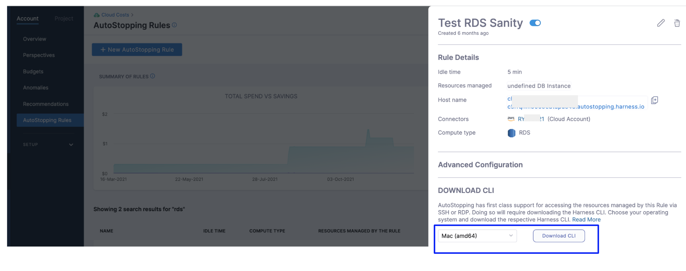

import Tabs from '@theme/Tabs';
import TabItem from '@theme/TabItem';

## Prerequisites

* Read the following topics in [Set up Cloud Cost Management for AWS](../../../get-started/onboarding-guide/set-up-cost-visibility-for-aws.md): 

    * Access to CUR. See Cost and Usage Reports (CUR) and CCM Requirements.
    * Permissions to create a cross-account role. See AWS Access Permissions.
    * Permissions for AWS Resource Optimization Using AutoStopping Rules. See AWS resource optimization using AutoStopping rules.
* The database that will be onboarded must be able to start and stop. Harness AutoStopping cannot manage certain DB instances, such as serverless ones, because they cannot be started or stopped.

## Creating an AutoStopping Rule for RDS

1. In Harness, navigate to **Cloud Costs** module -> **AutoStopping Rules**
2. Click **New AutoStopping Rule**
3. Select **AWS** as your cloud provider. Choose an existing AWS connector or click **New Connector** to [create one](/docs/cloud-cost-management/get-started/onboarding-guide/set-up-cost-visibility-for-aws). 

After this, there are 3 simple steps to set up your AutoStopping rule:

<Tabs>
<TabItem value="configuration" label="Step 1: Configuration">

1. Enter a **Name** for your rule
2. Set the **Idle Time** - how long an instance should be inactive before stopping
3. In the **Resources to be managed by the AutoStopping rules** section, select "RDS". 
4. Click on **Add RDS Instance**.
5.  Set up Advanced Configuration: 
    - Hide Progress Page: This is especially useful when the service is invoked by an automation system, as it prevents misinterpretation of the progress page as the intended response from a service that is onboarded to AutoStopping.
    - Dry-Run: Toggle the button if you wish to evaluate this feature without terminating your cloud resources. For more information, go to Evaluate AutoStopping rules in dry-run mode.
    - Dependencies: Link your rule to other AutoStopping rules when resources depend on each other.
    - Fixed Schedules: Create fixed schedules to automatically start or stop your instances at specific times. 
<details>
<summary>Click to expand advanced configuration details</summary>

## (Optional) Set up advanced configuration

In this step, you can configure the following settings:

### Hide progress page

Toggle the button to disable the display of progress page during instances' warming up process. This option is especially useful when the service is invoked by an automation system, as it prevents misinterpretation of the progress page as the intended response from a service that is onboarded to AutoStopping. By hiding the progress page, the first response of warming up a rule after a downtime will be delayed until the intended service is up and running.

### Dry Run

Toggle the button if you wish to evaluate this feature without terminating your cloud resources. 

### Add Dependency

Set dependencies between two or more AutoStopping Rules when you want one Rule to make one or more Rules to be active based on the traffic that it receives. For example for an application server dependent on a database server, create two AutoStopping Rules managing both the servers. Add a dependency on the Rule managing the application server to be dependent on the Rule managing the database server.

1. Click **add dependency** to add a dependency on any existing rule.
2. Select the rule from the **RULES** drop-down list.
3. In **DELAY IN SECS**, enter the number of seconds that rule should wait after warming up the dependent rule. For example, you have Rule 1 dependent on Rule 2 and you have set 5 seconds delay. In that case, when the request is received to warm up Rule 1, then first Rule 2 (dependent rule) is warmed up, and then there is a delay of 5 seconds before warming up Rule 1.
4. Once you're done with all the configurations, click **Next**.

### Fixed Schedule

Create fixed uptime or downtime schedules for the resources managed by this AutoStopping Rule. When a resource is configured to go up or down on a fixed schedule, it is unaffected by activity or idleness during that time period.

In certain scenarios, you would not want your resources to go down or up. For example, every Friday at 5 p.m. you want your `ABC` resource to go down. You can schedule downtime for your `ABC` resource. During this window, the resource is forced to go down regardless of the defined rule. You can choose to specify uptime for your resources in the same way.

:::note
The fixed schedule takes precedence over the defined AutoStopping Rule.
:::

:::note
Harness executes scheduled rules using [Dkron](https://dkron.io/), an open-source workload automation service.
:::

To create a fixed schedule for your rule, do the following:

1. In **Fixed Schedules**, click **Add Fixed Schedule**.
2. In **New Fixed Schedule**, enter a **Name** for your schedule.
3. In **Type**, select the type for your schedule. You can schedule an **Uptime** or **Downtime** for your rule. As per your schedule, the resources go up or down.
4. Select the **Time Zone** from the drop-down list.
5. In **Set schedule period**, use the date picker to set the start and end time for your schedule.
    1. In **Begins on**, select the start date and time for your schedule. You can select a date and specify the time.
    2. In **Ends on**, select the end date and time for your schedule. You can select a date and specify the time. Ensure that **Never ends** checkbox is unselected to set the end time.  
      
      If you don't specify an end time, the schedule continues to run until you manually update the settings or remove the schedule.
6. Select the checbox **Never ends** if you do not want to set end time for your schedule.
7. You can also set a recurring schedule for the rule. If you want to set a recurring schedule, in **Uptime/Downtime in the selected period**, in **Repeats**, select the repeat frequency.
    1. Select which days of the week you'd like your schedule to repeat. You can choose any day between Sunday and Saturday.
    2. Select **Everyday**, to set the schedule for all seven days of the week.
    3. Set your repeat schedule's beginning and ending time. In the **Time** field, specify the start and end time for the fixed schedule.
    4. Select **All Day**, if you wish to set your schedule for the entire day. If you choose All Day for your schedule, you won't be able to choose a start and end time.  

</details>

</TabItem>
<TabItem value="access" label="Step 2: Setup Access">

1. In **Setup Access**, select **Proxy** from drop-down list or [create a new one](/docs/cloud-cost-management/use-ccm-cost-optimization/optimize-cloud-costs-with-intelligent-cloud-auto-stopping-rules/autostopping-for-aws/autostopping-proxy).
2. Select Source Port and Target Port.
3. Click on Next.

</TabItem>
<TabItem value="review" label="Step 3: Review">


In Review, verify all the configuration details and click **Save Rule**. To edit any of the configuration settings, click **EDIT** and modify the settings.

Your AutoStopping rule is listed under the AutoStopping Rules dashboard.

</TabItem>
</Tabs>


## Use Harness AutoStopping CLI to Keep the RDS Instance(s) Running

You can also use Harness AutoStopping CLI to query the archived database using your own database client. Basically you're leveraging Harness CLI to keep the RDS instance(s) running.

1. From the AutoStopping dashboard, click on the RDS rule.
2. In **Download CLI**, select your operating system to download the Harness CLI for your system.
   
     
3. Click **Download CLI**.
4. Run the following command to connect to an RDS database.  

```
harness connect --host hostname --port 5432
```
  
The above command will start the RDS database if it is not running and set up a secure tunnel to it. This command will output the connection details to which you can connect your database client.
5. As an example, in the case of Postgres, the following command can be used to connect to the database.  

```
psql -h localhost -p port-received-from-above -u postgres
```
  
As soon as your database client is disconnected, AutoStopping will consider it as idleness and shut down the database after the configured idle time.

