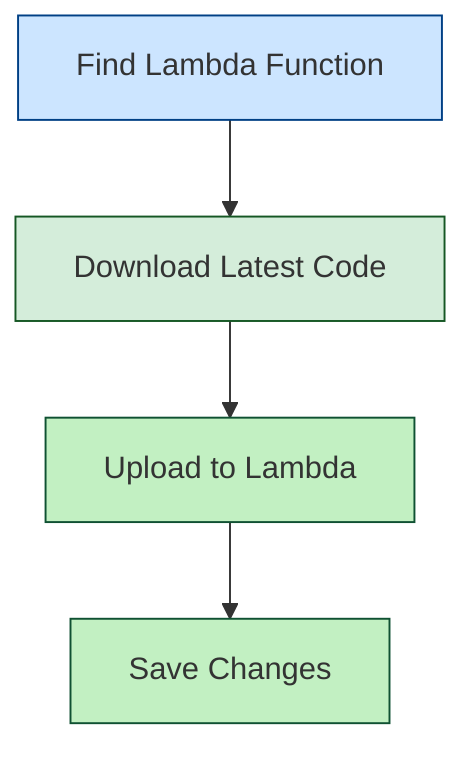

## Overview

An AWS Application Load Balancer (ALB) serves as the entry point for HTTP/HTTPS traffic to your AutoStopping-managed resources. It intelligently routes requests and works with AutoStopping to start and stop resources based on traffic patterns.

## Before You Begin

* [Connect to an AWS Connector](../1-add-connectors/connect-to-an-aws-connector.md)
* [Create AutoStopping Rules for AWS](../4-create-auto-stopping-rules/create-autostopping-rules-aws.md)

## How AWS Load Balancer Works with AutoStopping


A Harness load balancer in AWS consists of two primary components:

1. **Application Load Balancer (ALB)**: Routes HTTP/HTTPS traffic based on application-level information
2. **Lambda Function**: Manages resource warm-up and displays progress pages during startup

### Key Benefits

- **Centralized Traffic Management**: Direct traffic to multiple AutoStopped resources
- **Reuse Across Rules**: One load balancer can serve multiple AutoStopping rules
- **Path-Based Routing**: Route different paths to different resource groups
- **Seamless User Experience**: Users access resources through familiar URLs

### DNS Configuration

Each load balancer requires a domain name (e.g., `*.autostopping.example.com`) that points to the load balancer. This is typically configured as:

```
*.autostopping.example.com → Load balancer DNS address
```

## Setup Process

### Prerequisites

- An active AWS account with appropriate permissions
- A domain name you can configure (either in Route 53 or another DNS provider)
- [AWS Connector configured in Harness](/docs/cloud-cost-management/get-started/onboarding-guide/set-up-cost-visibility-for-aws)

### Step 1: Start the Load Balancer Creation Process

1. In Harness, navigate to **Cloud Costs** module
2. Click **New AutoStopping Rule**
3. Select **AWS** as your cloud provider


### Step 2: Connect to AWS

1. Select an existing AWS connector from the dropdown, or click **New Connector** to create one
2. Click **Continue**
3. Select the resources you want to manage with AutoStopping
4. Click **Continue**
5. In **Setup Access**, select **DNS Link**
6. Click **New Load Balancer**


### Step 3: Configure Load Balancer

1. Enter a name for your load balancer
2. Choose your DNS configuration method:

#### Option A: Using AWS Route 53 (Recommended)

:::note
This option requires that Route 53 is in the same AWS account as your resources.
:::

1. Select **Route 53** as your DNS provider
2. Choose the appropriate Route 53 hosted zone
   
3. Enter a subdomain prefix (e.g., `autostopping`)
   
4. Click **Continue**

#### Option B: Using Other DNS Providers

1. Select **Others** as your DNS provider
2. Enter the full domain name (e.g., `autostopping.yourcompany.com`)
3. Click **Continue**

### Step 4: Configure AWS Settings

1. Select the AWS region for deployment
2. Choose an SSL certificate
3. Select the VPC for deployment
4. Select appropriate security groups

### Step 5: Save and Finalize

1. Click **Save Load Balancer**
   

2. If using Route 53, Harness automatically creates the necessary DNS record:
   ```
   A record: *.autostopping.yourdomain.com → [ALB DNS address]
   ```

3. If using another DNS provider, you'll need to manually create a CNAME record:
   - Go to your DNS provider's management console
   - Create a wildcard CNAME record: `*.autostopping.yourcompany.com → [ALB DNS address]`
   - For detailed instructions, see [AWS DNS CNAME documentation](https://docs.aws.amazon.com/managedservices/latest/ctexguide/ex-dirserv-cname-record-add-col.html)

Your load balancer is now ready to use with AutoStopping rules.

## Updating the Lambda Function

The AWS Load Balancer uses a Lambda function to manage traffic and handle resource warm-up. You may need to update this function to the latest version.



### Step 1: Locate the Lambda Function

1. Go to the AWS Console and navigate to the EC2 service
2. Select **Load Balancers** and find your AutoStopping ALB
3. Go to the **Listeners** tab
4. Find the default rule and note the target group
5. The target group contains the Lambda function that needs updating

### Step 2: Update the Function Code

:::important
The current version is `aws-proxymanager-0.1.3.zip`
:::

1. [Download the latest code package](https://lightwing-downloads-temp.s3.ap-south-1.amazonaws.com/aws-proxymanager-0.1.3.zip)
2. In AWS Console, navigate to Lambda → Functions and find your function
3. Select the **Code** tab
   <DocImage path={require('./static/lambda-function-code.png')} width="50%" height="50%" title="Click to view full size image" />
4. Click **Upload from** → **.zip file**
5. Select the downloaded zip file and click **Save**

## Next Steps

- [Create AutoStopping rules](/docs/cloud-cost-management/use-ccm-cost-optimization/optimize-cloud-costs-with-intelligent-cloud-auto-stopping-rules/autostopping-for-aws/create-rule-ec2) for your AWS resources
