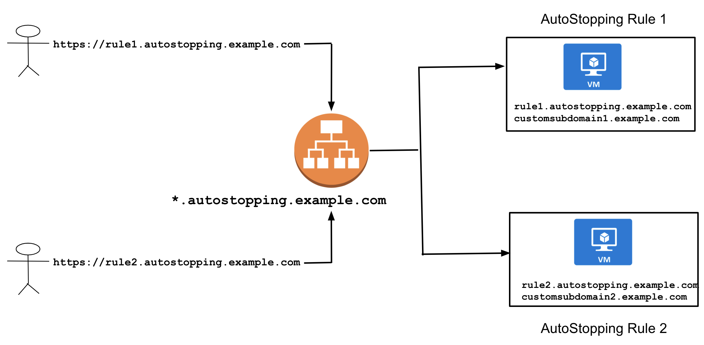
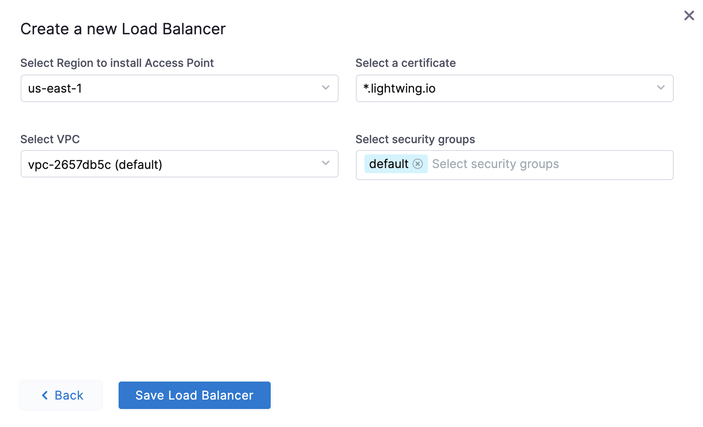
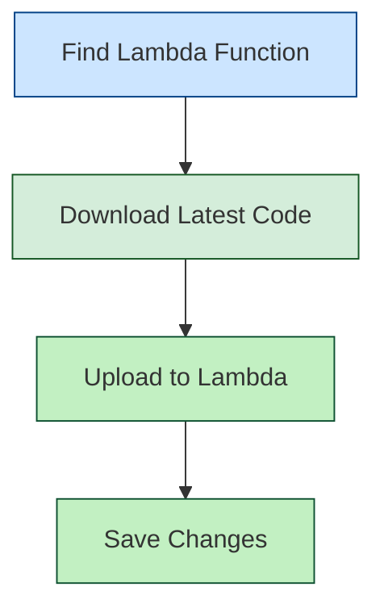

# Setting Up AWS Application Load Balancer (ALB)

## Overview

An AWS Application Load Balancer (ALB) serves as the entry point for HTTP/HTTPS traffic to your AutoStopping-managed resources. It intelligently routes requests and works with AutoStopping to start and stop resources based on traffic patterns.

## How AWS Load Balancer Works with AutoStopping



A Harness load balancer in AWS consists of two primary components:

1. **Application Load Balancer (ALB)**: Routes HTTP/HTTPS traffic based on application-level information
2. **Lambda Function**: Manages resource warm-up and displays progress pages during startup

### Key Benefits

- **Centralized Traffic Management**: Direct traffic to multiple AutoStopped resources
- **Reuse Across Rules**: One load balancer can serve multiple AutoStopping rules
- **Path-Based Routing**: Route different paths to different resource groups
- **Seamless User Experience**: Users access resources through familiar URLs

### DNS Configuration

Each load balancer requires a domain name (e.g., `*.autostopping.example.com`) that points to the load balancer. This is typically configured as:

```
*.autostopping.example.com → Load balancer DNS address
```

## Setup Process

### Prerequisites

- An active AWS account with appropriate permissions
- A domain name you can configure (either in Route 53 or another DNS provider)
- [AWS Connector configured in Harness](/docs/cloud-cost-management/get-started/onboarding-guide/set-up-cost-visibility-for-aws)

You can create a Load Balancer in two ways:
1. During the AutoStopping rule setup flow
2. From the AutoStopping overview page

### Option 1: Creating a Load Balancer During Rule Setup

After following Step 1 from the [Create AutoStopping Rule](/docs/cloud-cost-management/use-ccm-cost-optimization/optimize-cloud-costs-with-intelligent-cloud-auto-stopping-rules/autostopping-for-aws/create-rules-ectwo) guide, you will be directed to the "Setup Access" screen:

1. Choose either **TCP Workload** or **HTTP/HTTPS Workload**
2. Click **Create new AutoStopping Proxy** (or select an existing load balancer from the dropdown)
3. Fill in the required details:
   - Select your DNS provider: **Route 53** (must be in the same AWS account as your resources) or **Others**
   - Enter a domain name for your load balancer

<DocImage path={require('./static/alb-one.png')} width="50%" height="50%" title="Click to view full size image" />

4. Configure additional settings:
   - Select the AWS region for deployment
   - Choose an SSL certificate
   - Select the VPC for deployment
   - Choose appropriate security groups

<DocImage path={require('./static/alb-two.png')} width="50%" height="50%" title="Click to view full size image" />

5. Click **Save Load Balancer**

   
   
Your load balancer is now ready to use with AutoStopping rules.

### Option 2: Creating a Load Balancer from the AutoStopping Homepage

<DocImage path={require('./static/as-lb-aws.png')} width="100%" height="100%" title="Click to view full size image" />

1. In the AutoStopping overview page, click **Load Balancers** in the top right
2. Enter a name and select **AWS** in **Cloud Provider**
3. Choose a cloud connector or create a [new one](/docs/cloud-cost-management/get-started/onboarding-guide/set-up-cost-visibility-for-aws). 
4. Enter **Load Balancer Configuration**.
   - Choose access type as **Internal** or **External**
   - Select the AWS region for deployment
   - Choose an SSL certificate
   - Select the VPC for deployment
   - Choose appropriate security groups

7. Click **Save Load Balancer**


Your load balancer is now ready to use with AutoStopping rules.

:::note DNS Configuration
If using **Route 53**, Harness automatically creates the necessary DNS record:
```
A record: *.autostopping.yourdomain.com → [ALB DNS address]
```

If using **another DNS provider**, you'll need to manually create a CNAME record:
1. Go to your DNS provider's management console
2. Create a wildcard CNAME record: `*.autostopping.yourcompany.com → [ALB DNS address]`
3. For detailed instructions, see [AWS DNS CNAME documentation](https://docs.aws.amazon.com/managedservices/latest/ctexguide/ex-dirserv-cname-record-add-col.html)
:::

## Updating the Lambda Function

The AWS Load Balancer uses a Lambda function to manage traffic and handle resource warm-up. You may need to update this function to the latest version.



### Step 1: Locate the Lambda Function

1. Go to the AWS Console and navigate to the EC2 service
2. Select **Load Balancers** and find your AutoStopping ALB
3. Go to the **Listeners** tab
4. Find the default rule and note the target group
5. The target group contains the Lambda function that needs updating

### Step 2: Update the Function Code

:::important
The current version is `aws-proxymanager-0.1.3.zip`
:::

1. [Download the latest code package](https://lightwing-downloads-temp.s3.ap-south-1.amazonaws.com/aws-proxymanager-0.1.3.zip)
2. In AWS Console, navigate to **Lambda** → **Functions** and find your function
3. Select the **Code** tab

   <DocImage path={require('./static/lambda-function-code.png')} width="50%" height="50%" title="Click to view full size image" />

4. Click **Upload from** → **.zip file**
5. Select the downloaded zip file and click **Save**