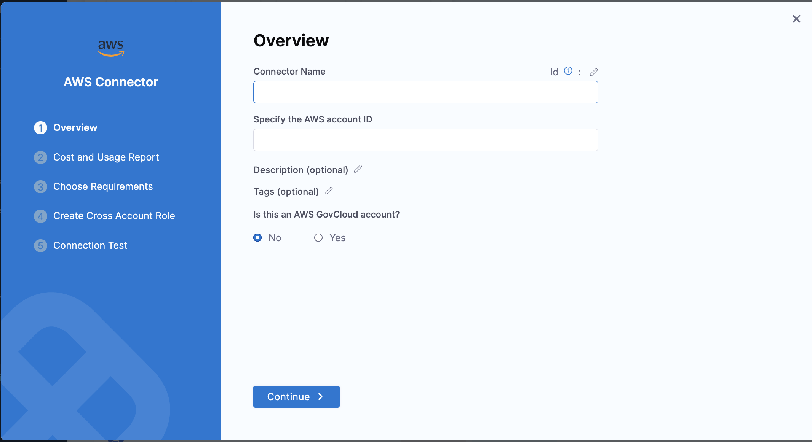
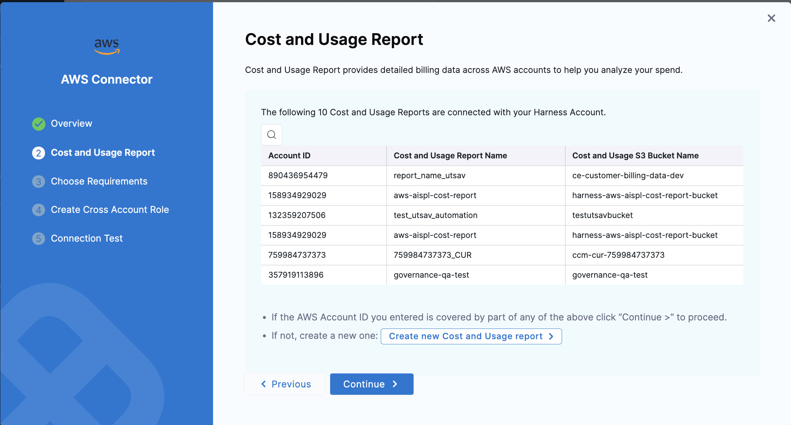
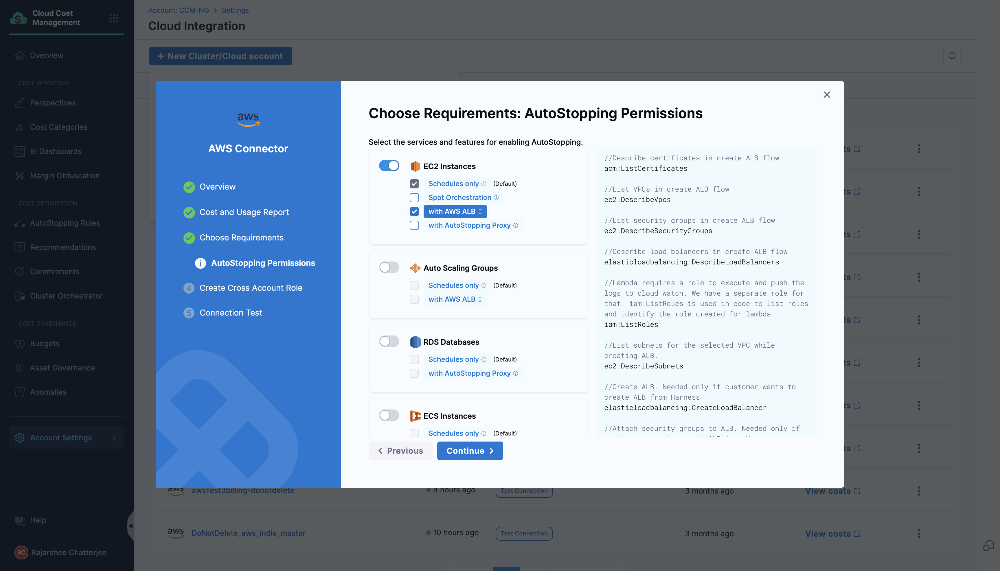
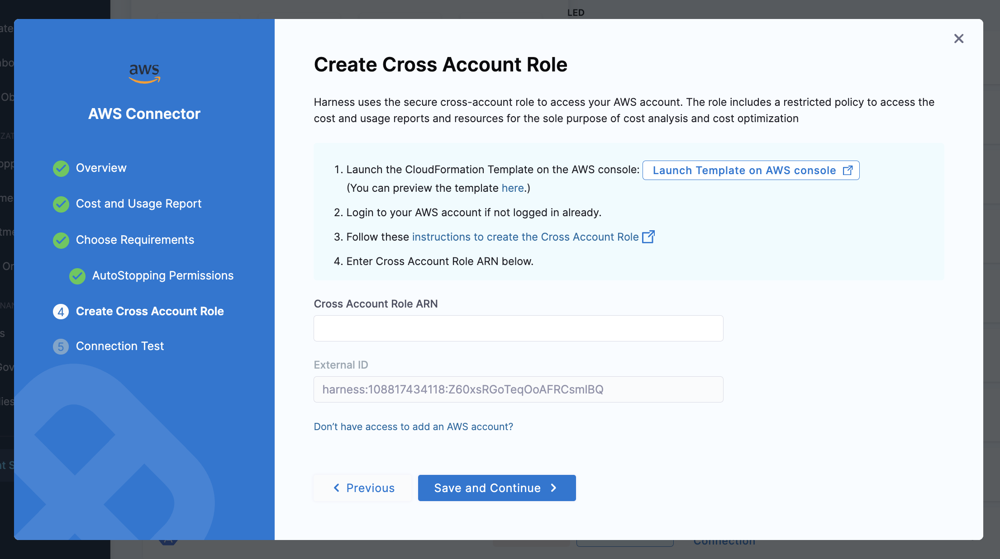

Connectors allow Harness to connect to your deployment environments, such as Kubernetes Clusters, AWS, Google Cloud Platform, Azure, etc. To create an AutoStopping Rule for your AWS instances, you first need to connect Harness to your AWS account. This topic describes how to connect your AWS cloud account to Harness.

### Before you begin

* [AutoStopping Rules Overview](../1-auto-stopping-rules.md)

### Add an AWS Connector

Perform the following steps to add an AWS connector for AutoStopping Rules:

1. In **Account Settings**, click **Integration for Cloud Cost**.

2. Click on **+New Cluster/Cloud Account**, select **AWS**. 

3. Enter overview details like Connector Name, AWS account ID, etc. as shown below:
     

4. Set Up Cost and Usage Report using the instructions shown on the screen.
     

5. Choose all the Cloud Cost Management features you want to enable for your AWS account including "Optimization by AutoStopping". 
      

6. AutoStopping supports granular access controls to help you follow the principle of least privilege. In the next step, you’ll be prompted to select the specific services you want to enable AutoStopping for, along with only the necessary permissions required for each.
     
      

7. Click **Continue**.

8. Create Cross Account Role. Follow the instructions shown on the screen.
     

9. Save and Continue

### Next Steps

* [Create AutoStopping Rules for AWS](../4-create-auto-stopping-rules/create-autostopping-rules-aws.md)
* [Use AutoStopping Rules Dashboard](../4-create-auto-stopping-rules/autostopping-dashboard.md)

