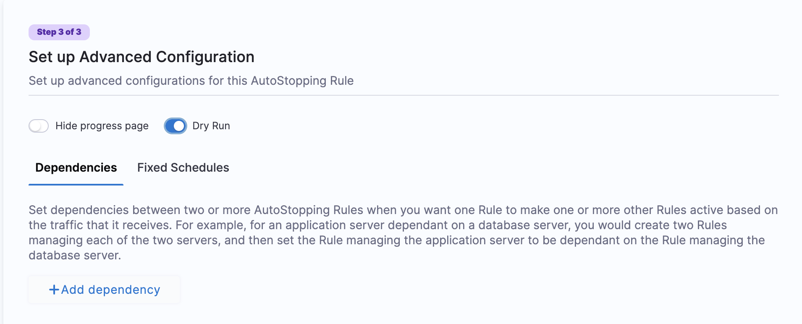
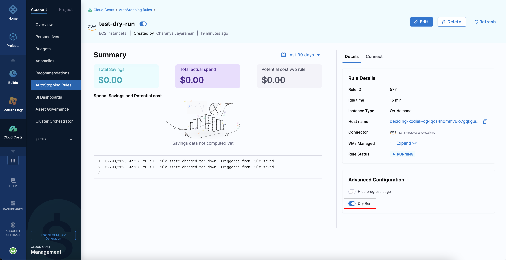

AutoStopping Rules make sure that your non-production resources run only when used, and never when idle. It also allows you to run your workloads on fully orchestrated spot instances without any worry of spot interruptions.

AutoStopping dashboard allows you to view a summary of all the AutoStopping rules you have created in a simple and intuitive interface. The following are the key features of the AutoStopping Rules dashboard:

- View total savings in your setup after AutoStopping rules are created
- View total spend in your setup after AutoStopping rules are created
- Number of instances managed using AutoStopping rules
- State of the instances where AutoStopping rules are applied
- Number of active AutoStopping rules in your setup

You can also perform the following actions from the AutoStopping dashboard view:

- Start the instances that are in a stopped state
- Edit or delete an AutoStopping rule
- Enable or disable an AutoStopping rule


:::info
CCM now allows bulk processing of AutoStopping rules i.e. multiple rules can be selected at once to be disabled, enabled, and dry run.
:::


### Visual summary

<DocVideo src="https://youtu.be/CDSRjRC_vY4" />

### View the AutoStopping Rules dashboard

The **AutoStopping Summary of Rules dashboard** displays data as a chart and table. You can view, understand, and analyze your usage and cost data using either of them. However, the table allows you to view granular details.

1. In **AutoStopping Rules**, in **Summary of Rules**, click the instance for which you want to view the details.

   

   You can view the details of the AutoStopping rule that you have created.


2. In **Spend vs Saving**, view the spend and savings data of seven days for the selected rule. The savings are calculated as the following:

- The actual and potential costs of the VM are used to calculate savings.

  - Your actual hourly cost multiplied by 24 equals your potential daily cost.
  - The actual cost is the amount paid to the cloud provider for the number of hours actually used. This information comes from the AutoStopping usage records.

  ```
  Potential cost = Actual hourly cost * 24
  ```

  With potential and actual cost, the savings are calculated.

  ```
  Savings = Potential cost - Actual cost
  ```

  

3. In **Logs and Usage Time**, view usage details and logs for the selected rule.

   1. **Usage Time**: This shows the details of the time at which the rule started and ended for seven days.

    2. **Logs**: This shows the different states of the rule with the timestamp. For example, active, warming up, and cooling down.

   

4. In **Details**, click the instance to go to the cloud provider page to modify any of the settings.


### Start the instances from the dashboard

You can start an instance from the Summary of Rules Page or from the Details page of a selected rule.

#### From the Summary of Rules page

1. In **AutoStopping Rules**, in **Summary of Rules**, click on the **Custom Domain** or **Hostname** of the selected instance.

   

2. The instance starts to warm up. This takes about 30 seconds.

   

3. Once the instance is up and running, the status of the instance changes from stopped to running in the dashboard.

   

#### From the Details page

1. In **AutoStopping Rules**, in **Summary of Rules**, click the instance that you want to start.
2. In **Details**, click the **Hostname** or **Domain name** to warm up the instance.

   

### Enable or Disable an AutoStopping Rule from the Dashboard

You can enable or disable an AutoStopping rule from the Summary of Rules Page or from the details page of a selected rule.

#### From the Summary of Rules page

1. In **AutoStopping Rules**, in **Summary of Rules**, select the instance that you want to enable or disable.
2. Click the three-dot menu and click **Disable**.

 3. Click **Disable**.

     

#### From the Details page

1. In **AutoStopping Rules**, in **Summary of Rules**, click the instance that you want to enable or disable.
2. Toggle the button to disable or enable the rule.

   

### Edit an AutoStopping Rule from the Dashboard

You can edit an AutoStopping rule from the Summary of Rules Page or from the details page of a selected rule.

#### From the Summary of Rules Page

1. In **AutoStopping Rules**, in **Summary of Rules**, select the instance that you want to enable or disable.
2. Click the three-dot menu and click **Edit**.

   

3. The AutoStopping Rules setting appears. Follow the steps in [Create AutoStopping Rules for AWS](create-autostopping-rules-aws.md) and [Create AutoStopping Rules for Azure](create-auto-stopping-rules-for-azure.md).

#### From the Details Page

1. In **AutoStopping Rules**, in **Summary of Rules**, click the instance that you want to edit.
2. Click the **Edit** button. The AutoStopping Rules setting appears. Follow the steps in [Create AutoStopping Rules for AWS](create-autostopping-rules-aws.md) and [Create AutoStopping Rules for Azure](create-auto-stopping-rules-for-azure.md).

   

### Delete an AutoStopping Rule from the dashboard

You can delete an AutoStopping rule from the Summary of Rules Page or from the details page of a selected rule.

#### From the Summary of Rules page

1. In **AutoStopping Rules**, in **Summary of Rules**, select the instance that you want to enable or disable.
2. Click the three-dot menu and click **Delete**.

   

3. Click **Delete**.

#### From the Details page

1. In **AutoStopping Rules**, in **Summary of Rules**, click the instance that you want to delete.
2. Click the **Delete** button.

   

3. Click **Delete**.

   


### Overlapping Schedules


Harness AutoStopping Rules now support overlapping schedules, offering enhanced flexibility for resource management. Users can define multiple fixed schedules within a single AutoStopping rule, even if they overlap. The resulting schedule is determined based on a customizable priority order, which can be adjusted using a drag-and-drop interface.  

Overlapping schedules are particularly useful for organizations with teams operating in different time zones or for scenarios where temporary overrides, such as maintenance windows, need to be added to an existing schedule. By prioritizing schedules, users can ensure that the most critical rules are applied at the right time without modifying or deleting existing configurations.  

<DocImage path={require('./static/overlapping_schedules1.png')} width="90%" height="90%" title="Click to view full size image" />
<DocImage path={require('./static/overlapping_schedules2.png')} width="90%" height="90%" title="Click to view full size image" />

### Evaluate AutoStopping rules in dry-run mode
description: This topic describes how to create AutoStopping rules in dry-run mode.

AutoStopping Rules make sure that your non-production resources run only when used, and never when idle. It also allows you to run your workloads on fully orchestrated spot instances without any worry of spot interruptions.

The dry-run mode is a feature that enables you to try out AutoStopping without actually stopping your cloud resources. This option allows you to evaluate the impact of AutoStopping and estimate the costs saved before enabling the feature.

While creating the AutoStopping rule, in the **Set up Advanced Configuration** step, turn on the **Dry Run** toggle switch as shown in the screenshot: 



After creating the AutoStopping rule in the dry-run mode, you can view the rules on the summary page.


A dry run rule is similar to a regular AutoStopping rule, but it does not involve the actual shutdown of cloud resources. This approach allows you to simulate the effects of the rule without any actual impact on the resources.

Generating the estimated savings data may take up to 24 hours. You can view the savings data either in the rules summary page or in the rule details page, where you can verify if the savings data is satisfactory.

If the data is satisfactory, you can turn off the **Dry Run** mode to apply the AutoStopping rule to your cloud resources and start saving costs.



