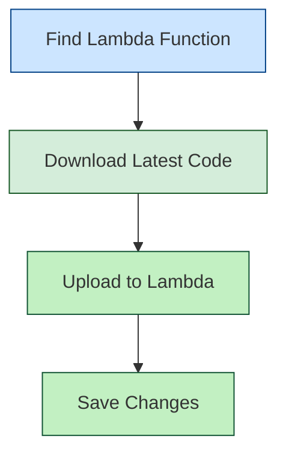

import Tabs from '@theme/Tabs';
import TabItem from '@theme/TabItem';
import RedirectIfStandalone from '@site/src/components/DynamicMarkdownSelector/RedirectIfStandalone';

<RedirectIfStandalone label="AWS" targetPage="/docs/cloud-cost-management/get-started/dynamic-get-started" />

## Before You Start

- [Create Cloud Connector for AWS](/docs/cloud-cost-management/get-started/#aws)

-------

## Step 1:  Set Up Proxy or Load Balancer

Set up a proxy or load balancer that will intercept and manage traffic to your resources. This component is what enables the seamless start/stop functionality.

| AWS Resource | AutoStopping Proxy | Application Load Balancer (ALB) |
|--------------|-------------------|---------------------------------|
| Amazon EC2 | ✅ [Link](/docs/cloud-cost-management/4-use-ccm-cost-optimization/1-optimize-cloud-costs-with-intelligent-cloud-auto-stopping-rules/content/aws-proxy) | ✅ [Link](/docs/cloud-cost-management/4-use-ccm-cost-optimization/1-optimize-cloud-costs-with-intelligent-cloud-auto-stopping-rules/content/aws-alb) |
| Auto Scaling Groups | ❌ | ✅ [Link](/docs/cloud-cost-management/4-use-ccm-cost-optimization/1-optimize-cloud-costs-with-intelligent-cloud-auto-stopping-rules/content/aws-alb) |
| Amazon RDS Instances | ✅ [Link](/docs/cloud-cost-management/4-use-ccm-cost-optimization/1-optimize-cloud-costs-with-intelligent-cloud-auto-stopping-rules/content/aws-proxy) | ❌ |


<Tabs>
<TabItem value="Load Balancer">


1. In the AutoStopping overview page, click **Load Balancers** in the top right
2. Enter a name and select **AWS** in **Cloud Provider**
3. Choose a cloud connector or create a [new one](/docs/cloud-cost-management/get-started/onboarding-guide/set-up-cost-visibility-for-aws). 
4. Enter **Load Balancer Configuration**.
   - Choose access type as **Internal** or **External**
   - Select the AWS region for deployment
   - Choose an SSL certificate
   - Select the VPC for deployment
   - Choose appropriate security groups

7. Click **Save Load Balancer**


Your load balancer is now ready to use with AutoStopping rules.

:::note DNS Configuration
If using **Route 53**, Harness automatically creates the necessary DNS record:
```
A record: *.autostopping.yourdomain.com → [ALB DNS address]
```

If using **another DNS provider**, you'll need to manually create a CNAME record:
1. Go to your DNS provider's management console
2. Create a wildcard CNAME record: `*.autostopping.yourcompany.com → [ALB DNS address]`
3. For detailed instructions, see [AWS DNS CNAME documentation](https://docs.aws.amazon.com/managedservices/latest/ctexguide/ex-dirserv-cname-record-add-col.html)
:::

## Updating the Lambda Function

The AWS Load Balancer uses a Lambda function to manage traffic and handle resource warm-up. You may need to update this function to the latest version.



### Step 1: Locate the Lambda Function

1. Go to the AWS Console and navigate to the EC2 service
2. Select **Load Balancers** and find your AutoStopping ALB
3. Go to the **Listeners** tab
4. Find the default rule and note the target group
5. The target group contains the Lambda function that needs updating

### Step 2: Update the Function Code

:::important
The current version is `aws-proxymanager-0.1.3.zip`
:::

1. [Download the latest code package](https://lightwing-downloads-temp.s3.ap-south-1.amazonaws.com/aws-proxymanager-0.1.3.zip)
2. In AWS Console, navigate to **Lambda** → **Functions** and find your function
3. Select the **Code** tab

4. Click **Upload from** → **.zip file**
5. Select the downloaded zip file and click **Save**

</TabItem>
<TabItem value="Proxy">


1. In **Harness**, go to the **Cloud Costs** module. Click on **AutoStopping Rules** from left Navbar.
2. Click **Load Balancers**.
3. Click **Create New Load Balancer**. Click **Create New AutoStopping Proxy**.
4. Enter a name and select **AWS** in **Cloud Provider**.
5. Choose an existing connector or [create a new one](/docs/cloud-cost-management/get-started/onboarding-guide/set-up-cost-visibility-for-aws).
6. Enter **Autostopping Proxy Configuration**.
    - **Region**: Select the AWS region where your target resources are hosted
    - **API Key**: Enter a Harness API key for authentication
      - Choose **No Expiration** when creating this key
      - See [Create an API Key](/docs/platform/automation/api/api-quickstart) for more information
    - **VPC**: Select the Virtual Private Cloud where your resources are located
    - **Security Groups**: Select security groups to control traffic flow
      - Ensure all required ports and protocols are allowed
    - **Subnet**: Select the subnet for the proxy deployment
    - **Machine type**: Select an appropriate AWS instance type for the proxy
      - Choose based on your expected traffic volume and performance needs
    - **Key Pair**: Select an SSH key pair to connect to your proxy VM
    - **TLS Certificate Configuration**:
      - **TLS Certificate Secret Version**: Provide a PEM-encoded certificate stored in AWS Secrets Manager
        - Store your certificate in AWS Secrets Manager using the **Other type of secret** option
        - Recommended naming convention: use _harness/_ prefix in the secret name
      - **TLS Private Key Secret Version**: Provide the ARN of your private key secret
        - Format: 'arn:aws:secretsmanager:[Region]:[AccountId]:secret:SecretName-6RandomCharacters'
        - See AWS documentation on [creating secrets](https://docs.aws.amazon.com/secretsmanager/latest/userguide/create_secret.html)
    - **[OPTIONAL] Encrypted EBS Volume**: Enable to encrypt the EBS volume
    - **[OPTIONAL] Allocate Static IP**: Enable to assign an elastic IP address
      - Makes the proxy publicly accessible
      - Remember to update your DNS records to point to this IP


7. Click on "Save AutoStopping Proxy".

### AWS Secrets Manager Configuration

1. Secret naming convention example:


2. Secret creation example:


11. Review your configuration and click **Save Load Balancer**.


</TabItem>
</Tabs>

-------

## Step 2: Create AutoStopping Rule

Create an AutoStopping rule to define the conditions under which your resources should be started and stopped.

| AWS Resource | Link to Guide | 
|--------------|-------------------|
| EC2 | ✅ [Link](/docs/cloud-cost-management/4-use-ccm-cost-optimization/1-optimize-cloud-costs-with-intelligent-cloud-auto-stopping-rules/content/aws-proxy) |
| Auto Scaling Groups | ✅ [Link](/docs/cloud-cost-management/4-use-ccm-cost-optimization/1-optimize-cloud-costs-with-intelligent-cloud-auto-stopping-rules/content/aws-alb) |
| Amazon RDS Instances | ✅ [Link](/docs/cloud-cost-management/4-use-ccm-cost-optimization/1-optimize-cloud-costs-with-intelligent-cloud-auto-stopping-rules/content/aws-proxy) |


> **Note:**  
> - There's **no limit** on the number of dependencies a rule can manage.  
> - **RDS warm-up time** depends on cluster/instance size (~25 minutes).  
> - Other resources warm up in under 2 minutes (max 5 minutes).

