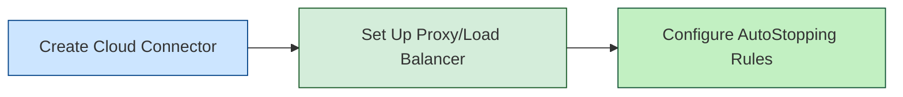

import Tabs from '@theme/Tabs';
import TabItem from '@theme/TabItem';

## Before You Begin

**Prerequisites:**
- An active Harness Cloud Cost Management (CCM) account
- Access to your cloud provider account(s) with appropriate permissions
- Resources you want to optimize with AutoStopping

> **Note for Kubernetes Users:** For Kubernetes clusters (Amazon EKS, Azure AKS, or Google GKE), you must first set up the appropriate cloud provider connector before configuring AutoStopping.

## Setup Process

Setting up AutoStopping is a straightforward process that involves three main steps:

## Step 1: Create a Cloud Connector

First, you need to connect Harness to your cloud provider account by creating a connector.

<Tabs>
  <TabItem value="aws" label="AWS">
    
Create an <a href="/docs/cloud-cost-management/get-started/#aws">AWS Connector</a> with the following permissions:

    <ul>
      <li>Amazon EC2 access</li>
      <li>AWS Cost and Usage Reports access</li>
      <li>AWS Auto Scaling access (if using Auto Scaling Groups)</li>
      <li>Amazon EKS access (if using Kubernetes clusters)</li>
      <li>Amazon RDS access (if using database instances)</li>
    </ul>
  </TabItem>
  <TabItem value="azure" label="Azure">
    
Create an <a href="/docs/cloud-cost-management/get-started/#azure">Azure Connector</a> with:

    <ul>
      <li>Azure Virtual Machine access</li>
      <li>Azure Cost Management access</li>
      <li>Azure Kubernetes Service (AKS) access (if using Kubernetes clusters)</li>
    </ul>
  </TabItem>
  <TabItem value="gcp" label="GCP">
    
Create a <a href="/docs/cloud-cost-management/get-started/#gcp">Google Cloud Platform (GCP) Connector</a> with:

    <ul>
      <li>Google Compute Engine access</li>
      <li>Google Cloud Billing access</li>
      <li>Google Kubernetes Engine (GKE) access (if using Kubernetes clusters)</li>
    </ul>
  </TabItem>
</Tabs>

## Step 2: Set Up Proxy or Load Balancer

Next, you'll need to set up a proxy or load balancer that will intercept and manage traffic to your resources. This component is what enables the seamless start/stop functionality.

> **Note for Kubernetes Clusters:** For Kubernetes workloads (Amazon EKS, Azure AKS, or Google GKE), you will configure AutoStopping directly through the Harness UI without requiring a separate proxy or load balancer setup. You'll be prompted to provide your Kubernetes cluster details during the AutoStopping rule configuration.

<Tabs>
  <TabItem value="aws" label="AWS">
    <h4>Option 1: AutoStopping Proxy</h4>
    
Best for: Amazon EC2, and Amazon RDS Instances

    
The AutoStopping Proxy acts as an intermediary that forwards traffic to your resources and automatically starts them when needed.

    
<a href="/docs/cloud-cost-management/use-ccm-cost-optimization/optimize-cloud-costs-with-intelligent-cloud-auto-stopping-rules/autostopping-for-aws/autostopping-proxy">Set up AWS AutoStopping Proxy →</a>

    
    <h4>Option 2: Load Balancer Integration</h4>
    
Best for: Amazon EC2, Auto Scaling Groups, and Amazon ECS Services

    
Integrate with your existing AWS Load Balancers to enable AutoStopping functionality.

    
<a href="/docs/cloud-cost-management/use-ccm-cost-optimization/optimize-cloud-costs-with-intelligent-cloud-auto-stopping-rules/autostopping-for-aws/load-balancer"> Configure AWS Load Balancer for AutoStopping →</a>

  </TabItem>
  
  <TabItem value="azure" label="Azure">
    <h4>Option 1: AutoStopping Proxy</h4>
    
Best for: Azure Virtual Machines

    
Deploy an AutoStopping Proxy to manage traffic to your Azure VMs.

    
<a href="/docs/cloud-cost-management/use-ccm-cost-optimization/optimize-cloud-costs-with-intelligent-cloud-auto-stopping-rules/autostopping-for-azure/autostopping-proxy">Set up Azure AutoStopping Proxy →</a>

    
    <h4>Option 2: Azure Application Gateway</h4>
    
Best for: Azure Virtual Machines in production-like environments

    
Integrate with Azure Application Gateway for enhanced routing capabilities.

    
<a href="/docs/cloud-cost-management/use-ccm-cost-optimization/optimize-cloud-costs-with-intelligent-cloud-auto-stopping-rules/autostopping-for-azure/load-balancer">Configure Azure Application Gateway →</a>

  </TabItem>
  
  <TabItem value="gcp" label="GCP">
    <h4>AutoStopping Proxy</h4>
    
Best for: Google Compute Engine VMs and Google Cloud Instance Groups

    
Deploy an AutoStopping Proxy to manage your GCP resources.

    
<a href="/docs/cloud-cost-management/use-ccm-cost-optimization/optimize-cloud-costs-with-intelligent-cloud-auto-stopping-rules/autostopping-for-gcp/autostopping-proxy">Set up GCP AutoStopping Proxy →</a>

    
    
<em>Note: For GCP only Proxy is supported.</em>

  </TabItem>
</Tabs>

## Step 3: Configure AutoStopping Rules

You can create AutoStopping Rules with two methods:

1. **Using Terraform**: For detailed instructions, see [Create AutoStopping Rules for Terraform](/docs/cloud-cost-management/use-ccm-cost-optimization/optimize-cloud-costs-with-intelligent-cloud-auto-stopping-rules/create-auto-stopping-rules/create-auto-stopping-rules-for-terraform/).

2. **Using the Harness UI**: 

<Tabs>
  <TabItem value="aws" label="AWS">
    <ol>
      <li>In Harness, navigate to <strong>Cloud Costs</strong> > <strong>Cost Optimization</strong> > <strong>AutoStopping</strong></li>
      <li>Click <strong>New Rule</strong> and select <strong>AWS</strong></li>
      <li>Follow the guided setup to configure</li>
      <li>Review and activate your rule</li>
    </ol>
    
<a href="/docs/cloud-cost-management/use-ccm-cost-optimization/optimize-cloud-costs-with-intelligent-cloud-auto-stopping-rules/autostopping-for-aws/create-rules-ectwo">Detailed AWS AutoStopping Configuration →</a>

  </TabItem>
  
  <TabItem value="azure" label="Azure">
    <ol>
      <li>In Harness, navigate to <strong>Cloud Costs</strong> > <strong>Cost Optimization</strong> > <strong>AutoStopping</strong></li>
      <li>Click <strong>New Rule</strong> and select <strong>Azure</strong></li>
      <li>Follow the guided setup to configure</li>
      <li>Review and activate your rule</li>
    </ol>
    
<a href="/docs/cloud-cost-management/use-ccm-cost-optimization/optimize-cloud-costs-with-intelligent-cloud-auto-stopping-rules/autostopping-for-azure/create-rule-vm">Detailed Azure AutoStopping Configuration →</a>

  </TabItem>
  
  <TabItem value="gcp" label="GCP">
    <ol>
      <li>In Harness, navigate to <strong>Cloud Costs</strong> > <strong>Cost Optimization</strong> > <strong>AutoStopping</strong></li>
      <li>Click <strong>New Rule</strong> and select <strong>GCP</strong></li>
      <li>Follow the guided setup to configure</li>
      <li>Review and activate your rule</li>
    </ol>
    
<a href="/docs/cloud-cost-management/use-ccm-cost-optimization/optimize-cloud-costs-with-intelligent-cloud-auto-stopping-rules/autostopping-for-gcp/create-rule-instance-groups">Detailed GCP AutoStopping Configuration →</a>

  </TabItem>
</Tabs>

