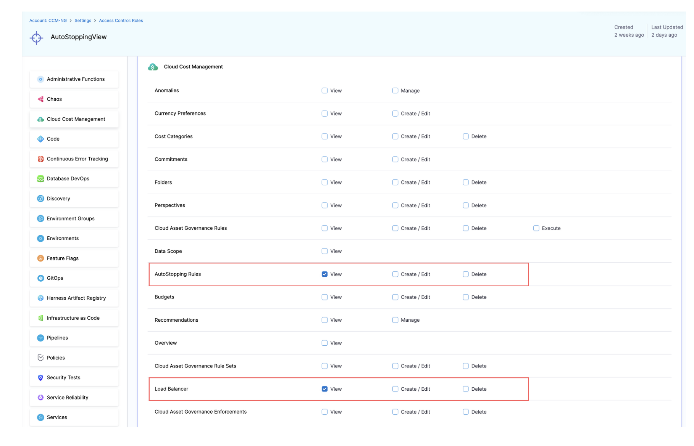
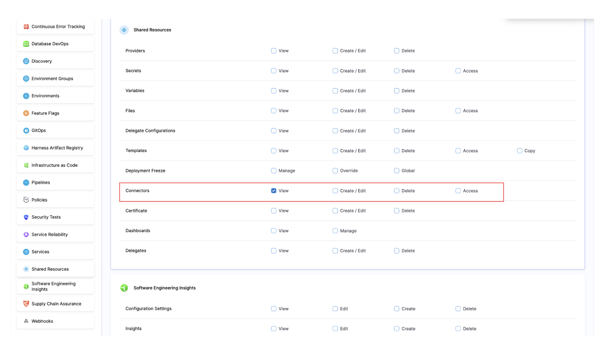
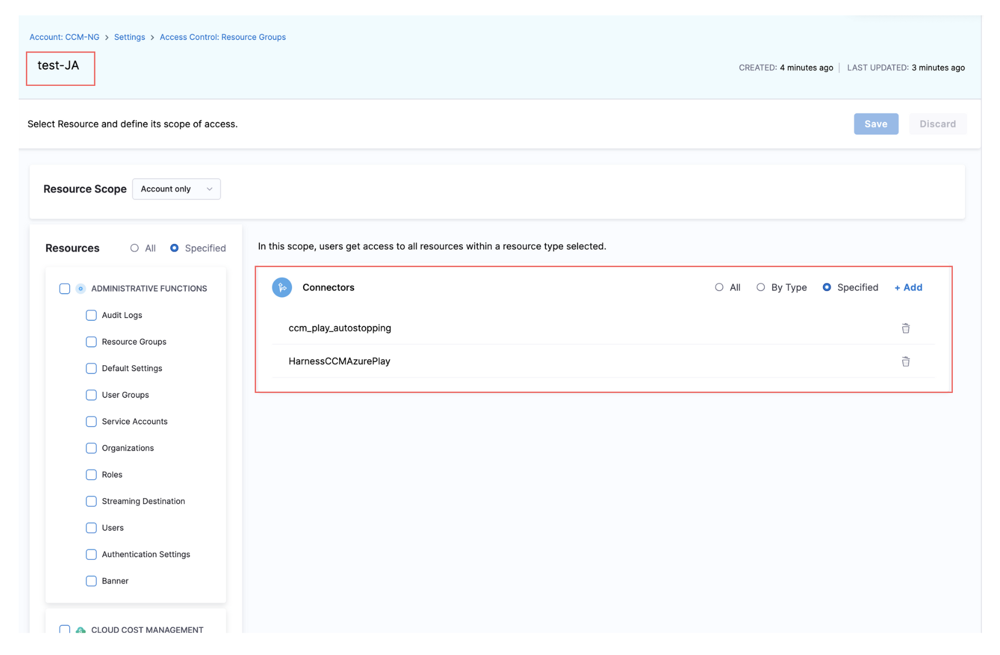
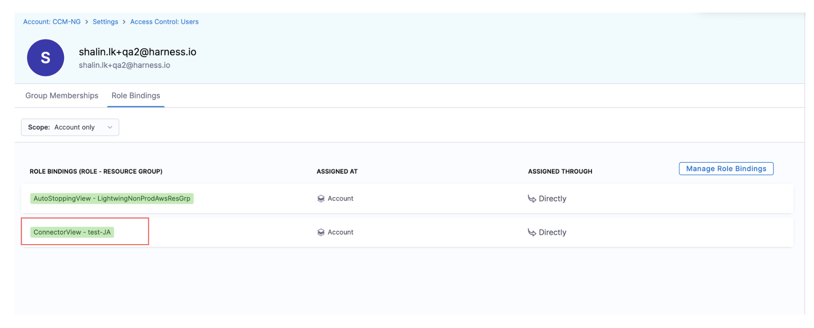
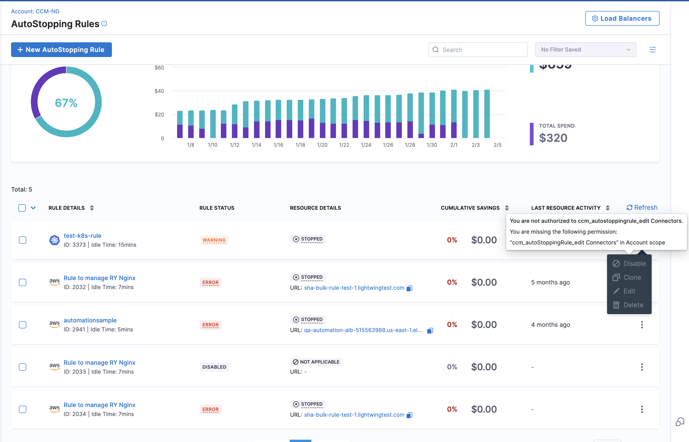
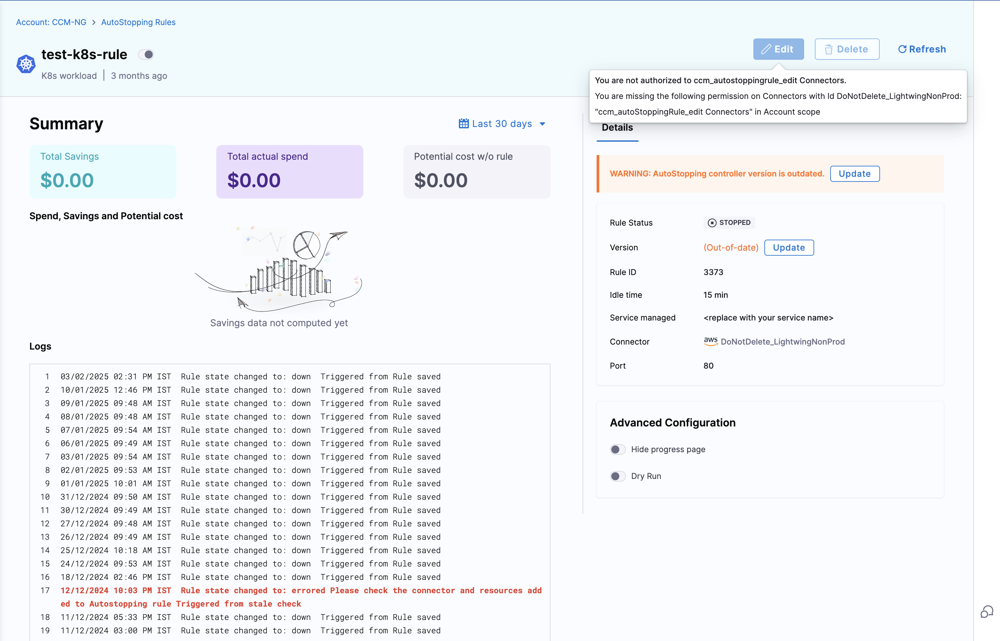

With RBAC, user can control view, create+edit, and delete access for AWS, Azure, and GCP autostopping based on cloud connectors (cloud accounts). Granular permission is an additional fine grained permission level on top of global RBAC levels. Global RBAC currently provides following roles:
- CCM Viewer : Grants permission to view CCM entities, including ASRs as whole.
- CCM Admin : Grants permission to create/edit/delete CCM entities, including all ASRs.

Connectors are shared resources in the Harness account, meaning multiple users can use them. Since they are shared, they appear in the Shared Resources section when creating a Resource Group (RG) in the ACL (Access Control List) module. Admins can create Resource Groups (RGs) for connectors by selecting the relevant connectors.

Once an RG is created, it can be assigned to a user along with a role. This ensures that the user can only perform operations allowed by the role and only on the resources specified in the RG.

Example:
If a user is assigned the CCM Viewer role on an RG called rg_dev_connectors, which includes a connector named dev_connector (linked to a DEV cloud account), then:

- The user will have only viewer access to AutoStopping Rules (ASRs) created using dev_connector.
- They will not be able to modify or manage other ASRs or connectors.

To control which cloud accounts a user can perform the above actions on, you need to create a **Resource Group** under **Account Settings > Resource Groups** that defines the appropriate access.  

1. Under **"Shared Resources"**, select **"Connectors"**, then choose **"Specified"**.  
2. Select all the **CCM AWS Account Connectors** for the cloud accounts you want to grant access to.  
3. Create as many **Resource Groups** as needed, depending on the number of distinct access patterns required.  

Once you have a role and resource group, you can assign this access to a user, group, or service account.

You can use your generic "Autostopping" role and select the resource group created that outlines the target access for the user/group/serviceaccount.

To ensure users can properly view AutoStopping Rules, you must grant them **Connector:View** permission. This allows them to load all necessary information related to AutoStopping Rules.  

Additionally, if a user does not have **User:View** permission on **_all_account_resources**, they will encounter an error in the AutoStopping UI. This happens because the UI makes API calls to retrieve user information within the Harness account to display who made changes to the rules. Without this permission, the UI cannot fetch the required data, leading to access issues.

