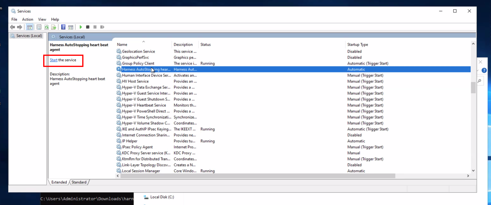

This topic describes how to configure ECG for AutoStopping Rules. You can assume ECG as an **event emitter** for your rule. It sends usage records for the configured rules.

When the ECG is configured to watch a workload, an AutoStopping Rule will not stop the resource until the workload finishes running. ECG comes with the following pre-installed watchers:

* UNIX
  * Metrics
  * Process
* Windows
  * User Sessions

Usually AutoStopping Rules listen to HTTP/HTTPS traffic or follow a schedule. On the other hand, a resource can be working on long-running background jobs like batch jobs. Nightly data updates or scheduled processing, for example. In this scenario, relying just on network traffic to detect resource idleness is not the ideal solution. For such scenarios, you can configure ECG for your AutoStopping Rules.

## Metrics Watcher

Metrics watcher is used to detect activity based on CPU and memory of the resource. If the CPU and memory values are above the configured threshold the ECG will send heartbeats to Harness for the configured rule.

If you specify both CPU and memory, they will both need to be met to be considered active.

### Example

Assume your threshold for resource activity is 50% CPU and 1G memory.

```
[metrics]  
cpu = "50"  
memory = "1Gb"
```

## Process Watcher

Process watcher watches for the existence of processes that match the supplied condition. When a process with the matching condition is detected the ECG will send heartbeats to Harness for the configured rule.

### Example

Assume your long-running job is a simple Python script:

```
> python trainmodel.py
```

You might set the condition to match the file name:

```
[process]  
condition = "trainmodel.py"
```

If you want to watch for any python program, you can use REGEX:

```
[process]  
condition = "python*"
```

## User Session Watcher

User session watcher watches for current users logged into the system. When a user is detected the ECG will send heartbeats to Harness for the configured rule.

```
user_session_watch = true
```

## Configure ECG

You can configure the ECG on UNIX or Windows machines.

### UNIX

1. Download the ECG file from the S3 link:  
[https://lightwing-downloads-temp.s3.ap-south-1.amazonaws.com/ecg/ecg_1.2.0_linux_amd64.zip](https://lightwing-downloads-temp.s3.ap-south-1.amazonaws.com/ecg/ecg_1.2.0_linux_amd64.zip)

```
wget https://lightwing-downloads-temp.s3.ap-south-1.amazonaws.com/ecg/ecg_1.2.0_linux_amd64.zip
```

2. Unzip the file and navigate into the resulting folder

```
unzip ecg_1.2.0_linux_amd64.zip
cd ecg_1.2.0_linux_amd64
```

3. Check the contents of the installation script, make it executable, and execute it as root

```
cat install.sh
chmod +x install.sh
sudo ./install.sh
```

4. Configure the ECG by setting the correct values in `/etc/lightwing/ecg.toml`:

* **Account ID**: Account ID for which you want to enable ECG. You can copy the account ID from the Harness Manager. In Harness Manager's address bar, copy the **Harness account ID** from your Harness URL. The Harness account ID comes after `account` in the URL.  
  * For example in the following URL, the account ID is `1a2b3c`: `https://app.harness.io/ng/account/1a2b3c`.

* **Hostname of the AutoStopping Rule**: Hostname of the AutoStopping Rule for which you want to configure the ECG. You can copy the hostname from the [AutoStopping dashboard](../1-optimize-cloud-costs-with-intelligent-cloud-auto-stopping-rules/4-create-auto-stopping-rules/autostopping-dashboard.md). To obtain the hostname, do the following:
  * In **AutoStopping Rules**, in **Summary of Rules**, click the rule for which you want to configure the ECG.
  * Copy the hostname.


```  
accountID = "abcdSmUISimoRrJL6NL12w"  
ruleHostName = "fluent-katydid-c6p67ucpv2dpsb76i66g.schedules-ce-dev.lightwingtest.com"  
  
[process]  
condition = "trainmodel.py"  
  
[metrics]  
cpu = "50"  
memory = "1Gb"
```

*You will need to specify at least one of `[metrics]` or `[process]`.*

5. Restart the ECG process

```
sudo systemctl restart ecg
```

### For Windows 

Autostopping ECG provides the capability to track the user session and stop the VM once the user session is completed.

To install ECG on Windows and track user session, please follow the steps below.

1. Setup an Autostopping rule for the VM in Harness using the [UI](https://developer.harness.io/docs/category/create-autostopping-rules) or [Terraform](https://registry.terraform.io/providers/harness/harness/latest/docs/resources/autostopping_rule_vm).

2. Login to the target Windows VM and open a Powershell session as Administrator

3. Download and unzip the latest ECG release:

```
Invoke-WebRequest -Uri "https://lightwing-downloads-temp.s3.ap-south-1.amazonaws.com/ecg/harness_autostop_ecg_windows_amd64.zip" -OutFile "./Downloads\harness_autostop_ecg_windows_amd64.zip"

Expand-Archive -Path "./Downloads\harness_autostop_ecg_windows_amd64.zip" -DestinationPath "./Downloads\harness_autostop_ecg_windows_amd64"
cd ecg_1.2.0_linux_amd64
```

4. Create a new folder and move the executable into it:

```
mkdir C:\Users\Administrator\harness
mv .\Downloads\harness_autostop_ecg_windows_amd64\harness_autostop_ecg_windows_amd64 C:\Users\Administrator\harness\harness_autostop_ecg_windows_amd64.exe
```

5. Configure the ECG by setting global environment variables on the machine:

```
setx ECG_accountID "{account_id}" /M
setx ECG_apiURL "https://app.harness.io/gateway/lw/api" /M
setx ECG_ruleHostName "{host_name}" /M
setx ECG_user_session_watch "true" /M
```

Where you should replace `{account_id}` with your Harness account id, and `{host_name}` with the hostname of your autostopping rule (without the `http://`)


If you use a non-standard Harness URL, you can change the `apiURL` accordingly.

6. Finally install the ECG as a Windows service and start it

```
cd C:\Users\Administrator\harness
./harness_autostop_ecg_windows_amd64.exe install
Start-Service Harness-ecg
```

## Validation

You can validate the service is running by opening `Services` in Windows and locating the `Harness Autostopping Heartbeat` service.



You should also be able to see activity metrics being sent to Harness by looking at the logs on your autostopping rule in the CCM UI.

The service should restart manually on reboot. Such that after a successful shutdown by Harness, when a user restarts the machine and logs in, the machine won't be deemed "idle" until all users have logged off the machine. The machine should shut off after the defined idle period on the rule.
