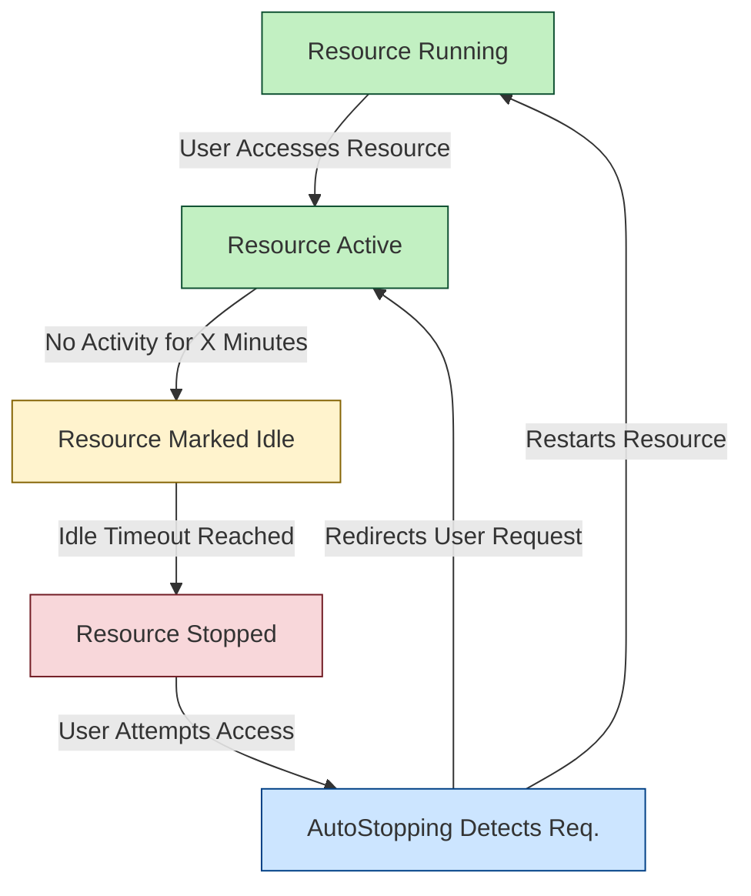

import Tabs from '@theme/Tabs';

import TabItem from '@theme/TabItem';

<DocVideo src="https://youtu.be/lNf_P5sHTcE" width="50%" height="250" />

## What are AutoStopping Rules?

Cloud resources in non-production environments (dev, test, staging) are typically used for only 30-40% of the time they're running, yet you pay for 100% of that time. AutoStopping Rules ensure you're only **paying for resources when they're actually in use**.

AutoStopping Rules let you define:

- **Controlled resources**: Choose exactly which EC2 instances, Auto Scaling Groups, Kubernetes namespaces, RDS databases, or other supported assets the rule should manage.
- **Idle-time threshold**: Specify how long a resource must remain inactive before AutoStopping considers it idle and eligible for shutdown.
- **Optional fixed schedules**: Keep resources online during business hours, maintenance windows, or any recurring schedule you choose.
- **Dependency order**: List upstream and downstream services so AutoStopping stops and starts them in the right sequence.
- **Access method**: Select load balancer, proxy, or direct IP so your teams continue to use the same DNS, SSH, or RDP endpoints without interruption.
- **Set-and-forget automation**: Zero manual overhead after initial setup

## What's Supported?

| Cloud Provider | Supported Resources |
|----------------|---------------------|
|   <strong style={{fontSize: '1.1rem'}}>AWS</strong> | <ul><li>EC2</li><li>Auto Scaling Groups</li><li>Kubernetes (EKS)</li><li>ECS Services</li><li>RDS Instances</li></ul> |
|  <strong style={{fontSize: '1.1rem'}}>Azure</strong> | <ul><li>On-demand VMs</li><li>Kubernetes Clusters (AKS)</li></ul> |
|  <strong style={{fontSize: '1.1rem'}}>GCP</strong> | <ul><li>GCE VMs</li><li>Kubernetes Clusters (GKE)</li><li>Instance Groups</li></ul> |

## How AutoStopping Works

The AutoStopping process works in four key steps:

1. **Intelligent Detection**: AutoStopping continuously monitors your resources for activity
2. **Automatic Shutdown**: After a configurable idle period, resources are automatically stopped
3. **Seamless Restart**: When access is requested, resources are automatically restarted
4. **Transparent Access**: Users continue to use the same access methods they always have (DNS, SSH, RDP)

## Ready to Get Started?

Follow our [Get Started Guide](./getting-started.md) to set up AutoStopping in your environment in three simple steps.
