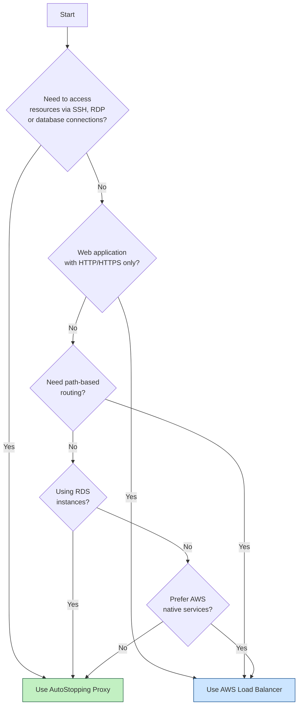
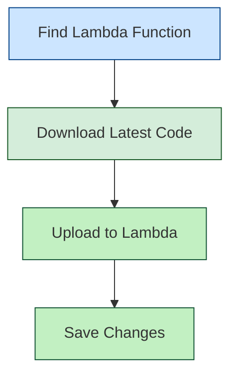

import Tabs from '@theme/Tabs';
import TabItem from '@theme/TabItem';

<Tabs>
<TabItem value="configuration" label="AutoStopping Proxy">

## What is an AutoStopping proxy?

AutoStopping is designed to integrate seamlessly with native load-balancing solutions like AWS ALB. However, for use cases that fall outside of these integrations such as SSH, RDP, or RDS connections, AutoStopping offers an advanced reverse proxy solution: **the AutoStopping Proxy**.

This proxy VM sits in front of your virtual machines and intelligently starts or stops them based on incoming network traffic. It supports both HTTP(S) and TCP connections:

- **For HTTP(S)**: It provides Layer 7 load balancing, request routing, and full SSL support.
- **For TCP traffic**: It uses ephemeral, dynamically generated port mappings to route connections efficiently.

Built on the proven, open-source [Envoy Proxy](https://www.envoyproxy.io/), the AutoStopping Proxy is highly reliable and scalable, capable of managing traffic for multiple AutoStopping-managed VMs from a single instance.

<DocImage path={require('./static/autostopping-proxy-architecture-diagram.png')} width="70%" height="70%" title="Click to view full-size image" />

## Choosing Between Load Balancer and AutoStopping Proxy

### Key Differences

| Feature | AWS Load Balancer | AutoStopping Proxy |
|---------|------------------|--------------------|
| **Traffic Types** | HTTP/HTTPS only | HTTP/HTTPS + TCP |
| **Best For** | Web applications | Direct VM access, databases |
| **Implementation** | AWS native ALB | Dedicated proxy VM |




## Steps to create an AutoStopping proxy for AWS

<DocImage path={require('./static/as-proxy-aws.png')} width="100%" height="100%" title="Click to view full-size image" />

1. In **Harness**, go to the **Cloud Costs** module. Click on **AutoStopping Rules** from left Navbar.
2. Click **Load Balancers**.
3. Click **Create New Load Balancer**. Click **Create New AutoStopping Proxy**.
4. Enter a name and select **AWS** in **Cloud Provider**.
5. Choose an existing connector or [create a new one](/docs/cloud-cost-management/get-started/onboarding-guide/set-up-cost-visibility-for-aws).
6. Enter **Autostopping Proxy Configuration**.
    - **Region**: Select the AWS region where your target resources are hosted
    - **API Key**: Enter a Harness API key for authentication
      - Choose **No Expiration** when creating this key
      - See [Create an API Key](/docs/platform/automation/api/api-quickstart) for more information
    - **VPC**: Select the Virtual Private Cloud where your resources are located
    - **Security Groups**: Select security groups to control traffic flow
      - Ensure all required ports and protocols are allowed
    - **Subnet**: Select the subnet for the proxy deployment
    - **Machine type**: Select an appropriate AWS instance type for the proxy
      - Choose based on your expected traffic volume and performance needs
    - **Key Pair**: Select an SSH key pair to connect to your proxy VM
    - **TLS Certificate Configuration**:
      - **TLS Certificate Secret Version**: Provide a PEM-encoded certificate stored in AWS Secrets Manager
        - Store your certificate in AWS Secrets Manager using the **Other type of secret** option
        - Recommended naming convention: use _harness/_ prefix in the secret name
      - **TLS Private Key Secret Version**: Provide the ARN of your private key secret
        - Format: 'arn:aws:secretsmanager:[Region]:[AccountId]:secret:SecretName-6RandomCharacters'
        - See AWS documentation on [creating secrets](https://docs.aws.amazon.com/secretsmanager/latest/userguide/create_secret.html)
    - **[OPTIONAL] Encrypted EBS Volume**: Enable to encrypt the EBS volume
    - **[OPTIONAL] Allocate Static IP**: Enable to assign an elastic IP address
      - Makes the proxy publicly accessible
      - Remember to update your DNS records to point to this IP


7. Click on "Save AutoStopping Proxy".

### AWS Secrets Manager Configuration

1. Secret naming convention example:


2. Secret creation example:


11. Review your configuration and click **Save Load Balancer**.

-----

</TabItem>
<TabItem value="ALB" label="AWS Application Load Balancer (ALB)">

# Setting Up AWS Application Load Balancer (ALB)

## Overview

An AWS Application Load Balancer (ALB) serves as the entry point for HTTP/HTTPS traffic to your AutoStopping-managed resources. It intelligently routes requests and works with AutoStopping to start and stop resources based on traffic patterns.

## How AWS Load Balancer Works with AutoStopping


A Harness load balancer in AWS consists of two primary components:

1. **Application Load Balancer (ALB)**: Routes HTTP/HTTPS traffic based on application-level information
2. **Lambda Function**: Manages resource warm-up and displays progress pages during startup

### Key Benefits

- **Centralized Traffic Management**: Direct traffic to multiple AutoStopped resources
- **Reuse Across Rules**: One load balancer can serve multiple AutoStopping rules
- **Path-Based Routing**: Route different paths to different resource groups
- **Seamless User Experience**: Users access resources through familiar URLs

### DNS Configuration

Each load balancer requires a domain name (e.g., `*.autostopping.example.com`) that points to the load balancer. This is typically configured as:

```
*.autostopping.example.com → Load balancer DNS address
```

## Setup Process

### Prerequisites

- An active AWS account with appropriate permissions
- A domain name you can configure (either in Route 53 or another DNS provider)
- [AWS Connector configured in Harness](/docs/cloud-cost-management/get-started/onboarding-guide/set-up-cost-visibility-for-aws)

### Creating a Load Balancer from the AutoStopping Homepage

<DocImage path={require('./static/as-lb-aws.png')} width="100%" height="100%" title="Click to view full size image" />

1. In the AutoStopping overview page, click **Load Balancers** in the top right
2. Enter a name and select **AWS** in **Cloud Provider**
3. Choose a cloud connector or create a [new one](/docs/cloud-cost-management/get-started/onboarding-guide/set-up-cost-visibility-for-aws). 
4. Enter **Load Balancer Configuration**.
   - Choose access type as **Internal** or **External**
   - Select the AWS region for deployment
   - Choose an SSL certificate
   - Select the VPC for deployment
   - Choose appropriate security groups

7. Click **Save Load Balancer**


Your load balancer is now ready to use with AutoStopping rules.

:::note DNS Configuration
If using **Route 53**, Harness automatically creates the necessary DNS record:
```
A record: *.autostopping.yourdomain.com → [ALB DNS address]
```

If using **another DNS provider**, you'll need to manually create a CNAME record:
1. Go to your DNS provider's management console
2. Create a wildcard CNAME record: `*.autostopping.yourcompany.com → [ALB DNS address]`
3. For detailed instructions, see [AWS DNS CNAME documentation](https://docs.aws.amazon.com/managedservices/latest/ctexguide/ex-dirserv-cname-record-add-col.html)
:::

## Updating the Lambda Function

The AWS Load Balancer uses a Lambda function to manage traffic and handle resource warm-up. You may need to update this function to the latest version.



### Step 1: Locate the Lambda Function

1. Go to the AWS Console and navigate to the EC2 service
2. Select **Load Balancers** and find your AutoStopping ALB
3. Go to the **Listeners** tab
4. Find the default rule and note the target group
5. The target group contains the Lambda function that needs updating

### Step 2: Update the Function Code

:::important
The current version is `aws-proxymanager-0.1.3.zip`
:::

1. [Download the latest code package](https://lightwing-downloads-temp.s3.ap-south-1.amazonaws.com/aws-proxymanager-0.1.3.zip)
2. In AWS Console, navigate to **Lambda** → **Functions** and find your function
3. Select the **Code** tab

   <DocImage path={require('./static/lambda-function-code.png')} width="50%" height="50%" title="Click to view full size image" />

4. Click **Upload from** → **.zip file**
5. Select the downloaded zip file and click **Save**

</TabItem>
</Tabs>