Harness CCM Budgets allow you to set custom budgets and receive alerts when your costs exceed (or are forecasted to exceed) your budget.

This topic describes how to create a new budget.

## Before You Begin

* [Set Up Cloud Cost Management for AWS](../../get-started/onboarding-guide/set-up-cost-visibility-for-aws.md)
* [Set Up Cloud Cost Management for GCP](../../get-started/onboarding-guide/set-up-cost-visibility-for-gcp.md)
* [Set Up Cloud Cost Management for Azure](../../get-started/onboarding-guide/set-up-cost-visibility-for-azure.md)
* [Set Up Cloud Cost Management for Kubernetes](../../get-started/onboarding-guide/set-up-cost-visibility-for-kubernetes.md)
* [Create Cost Perspectives](../../3-use-ccm-cost-reporting/1-ccm-perspectives/1-create-cost-perspectives.md)

## Create a New Budget

Perform the following steps to create a budget:

1. Navigate to the **Cloud Cost Management** module and click **Budgets.**
   
     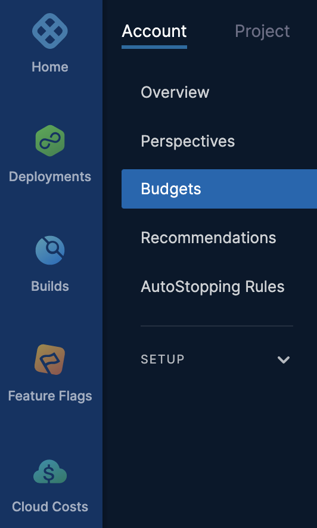
2. In **All Budgets**, click **New Budget**.

### Define Target

In **Define Target**, do the following:

1. In **Select Perspective**, select the Perspective for which you want to set a budget.  
Budgets are created on Perspectives. If you do not have a Perspective of the resources you would like to budget, first create a new Perspective and then proceed to set a budget. You can add multiple budgets for a single Perspective.
   1. To create a new Perspective of the resources you would like to budget, click **Create a new Perspective**. Follow the steps in [Create Cost Perspectives](../../3-use-ccm-cost-reporting/1-ccm-perspectives/1-create-cost-perspectives.md) to create a Perspective.
   2. In **Budget Name**, enter a name for your budget that will appear in the budget dashboard to identify this budget.
   3. Click **Continue**.
   
     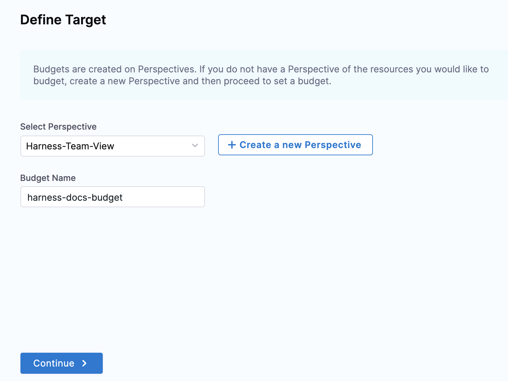

### Set Budget Amount

In **Set Budget Amount** you can specify the budget period, amount, type, etc. The **Set Budget Amount** window also displays the **Total cost last period** and **Projected cost end of this period**. For more information on how the projected cost is calculated, see **Projected Cost**.

1. In **Budget Period**, select the period for which you want to set the budget. You can set the budget period to **Monthly**, **Daily**, **Weekly**, **Quarterly**, or **Yearly**.
   
     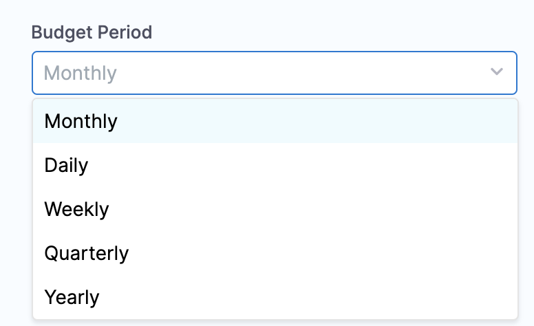
2. Use the date picker to set the start date for your budget.
   
     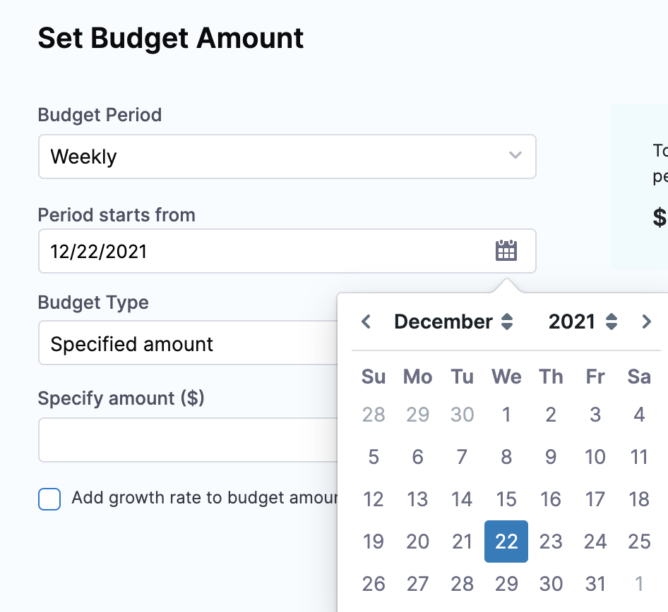
3. In **Budget Type**, select abudget type.  

	* **Specified Amount**: Enter the amount that you want to set as the budget limit.
	* **Previous Month Spend**: Sets the previous month spent as your budget.
4. To add growth rate to your budgeted amount, select the checkbox **Add growth rate to budget amount**. Growth rate refers to the percentage change of the budgeted amount within the specified time period. When you've decided to add growth rate to the budget amount, specify the growth rate percentage.  

5. In **Specify Growth rate**, enter the percentage of the growth rate to the budget amount. You can select this option only if you have selected **Specified Amount** in the **Budget Type**.  
	  
	You can view the increased amount of your budget in the graph. The graph displays the amount and budget period. The following example considers a 5% increase to the weekly budget amount.
	
	  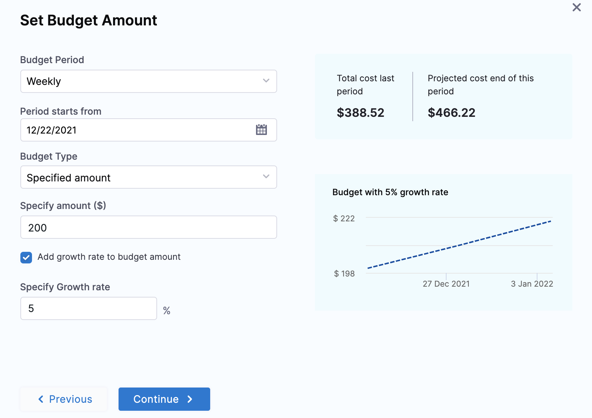
6. Click **Continue**.

### Projected Cost

Budget also displays the projected cost based on the actual spend, cost of the last 30 days, and remaining days in the budget period.

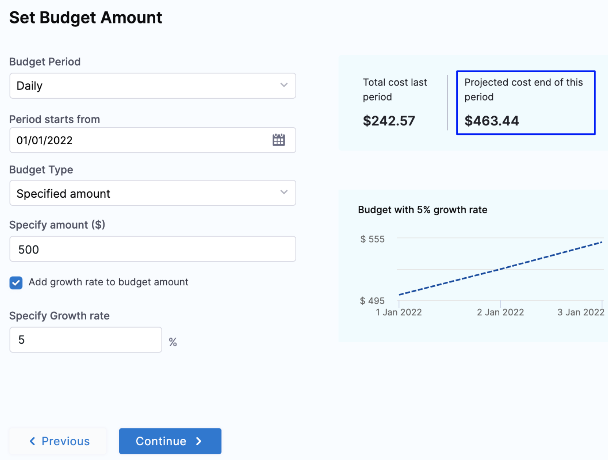

The projected cost in budget is calculated as follows:

`(Actual spend till date)`  +  `(cost of last 30 days) * ((remaining days in budget)/30)`

Let's try to understand this using the following examples:

**Monthly Budget**: Suppose you have set a monthly budget for your Perspective and the current date is January 10. In this case, the projected cost of the budget is calculated as the following:

`(Actual spend till date (1-10 Jan))`  +  `(cost of last 30 days) * ((remaining days in budget (21))/30)`

**Weekly Budget**: Suppose you have set a weekly budget for your Perspective. The week starts from January 1 and the current date is January 6. In this case, the projected cost of the budget is calculated as the following:

`(Actual spend till date (1-6 Jan))`  +  `(cost of last 30 days) * ((remaining days in budget (1))/30)`

**Daily Budget**: In the case of daily budget:

`(Actual spend till date)`  +  `(cost of last 30 days) / 30`

### Configure Alerts

1. In **Configure Alerts**, set a threshold for the **Percentage of Budget** based on the **Actual Cost** or **Forecasted Cost**. Harness sends alerts when the Actual Cost or Forecasted Cost exceeds the threshold.  
Harness will send an alert to the specified email addresses and Harness User Groups when the actual or forecasted cost exceeds a percentage of your monthly budget.
2. In **Send Alert To**, select one of the following options to receive budget notifications.
	1. **Email**: Enter the email address (you can enter more than one email address or email groups).
	2. **Slack Webhook URL**: Enter the webhook URL.!
   
     
3. Click **Save**. Your budget is listed.

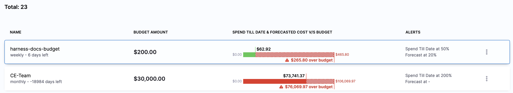

## Using the Budget Dashboard

The **All** **Budgets** dashboard shows a summary of your budgets. By default, all your budgets are sorted based on the time created.

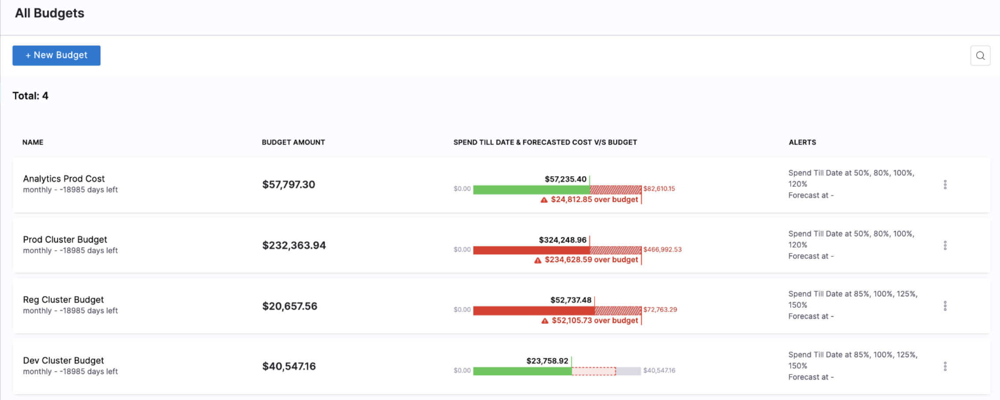

The dashboard includes the following information:

* **Name**: Name of the budget.
* **Budget Amount**: The amount that you set as the budget limit.
* **Spend Till Date & Forecasted Cost v/s Budget**: Your actual spend till date compared to your forecasted cost and budgeted cost.
* **Alerts**: Alerts configured for the set threshold percentage for the budget. An alert is sent when the Actual and/or Forecasted cost exceeds the specified percentage of your budgeted amount.

### Read Your Budget

The **Budgets** dashboard further shows you the details of your selected budget at a glance. You can also navigate to the [Perspective](../../3-use-ccm-cost-reporting/1-ccm-perspectives/1-create-cost-perspectives.md) on which the budget is created from the budget dashboard.

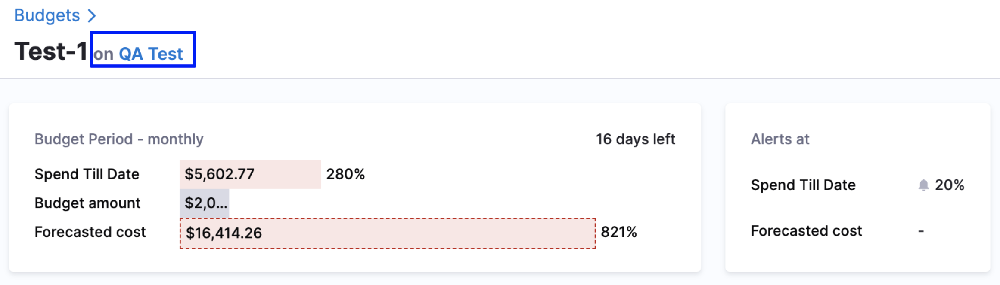

Select a budget from the list to view the following information:

* **Budget Status**: This is your budget period. For example, monthly, yearly, weekly, etc.
* **Spend Till Date Cost**: The actual incurred cost.
* **Budget Amount**: The amount that you set as the budget limit.
* **Forecasted Cost**: Your forecasted cost compared to your budgeted cost. Forecasted costs are predictions based on your historical cost data. The Forecasted Cost is the actual cost plus the projected cost, based on the spend pattern of previous months.
* **Alerts at**: Alerts configured for the set threshold percentage for the budget. An alert is sent when the Actual and/or Forecasted cost exceeds the specified percentage of your budgeted amount.
* **Budget History**: The monthly history of your budget. The dashboard displays the data as a chart and table. You can view, understand, and analyze your budget using either of them.
	+ **Actual Cost**: The actual incurred cost.
	+ **Budgeted Cost**: The budgeted amount.
	+ **Budget variance**: The difference between the budgeted and actual cost in percentage and dollars. The variance data is available only in the tabular format.
  
    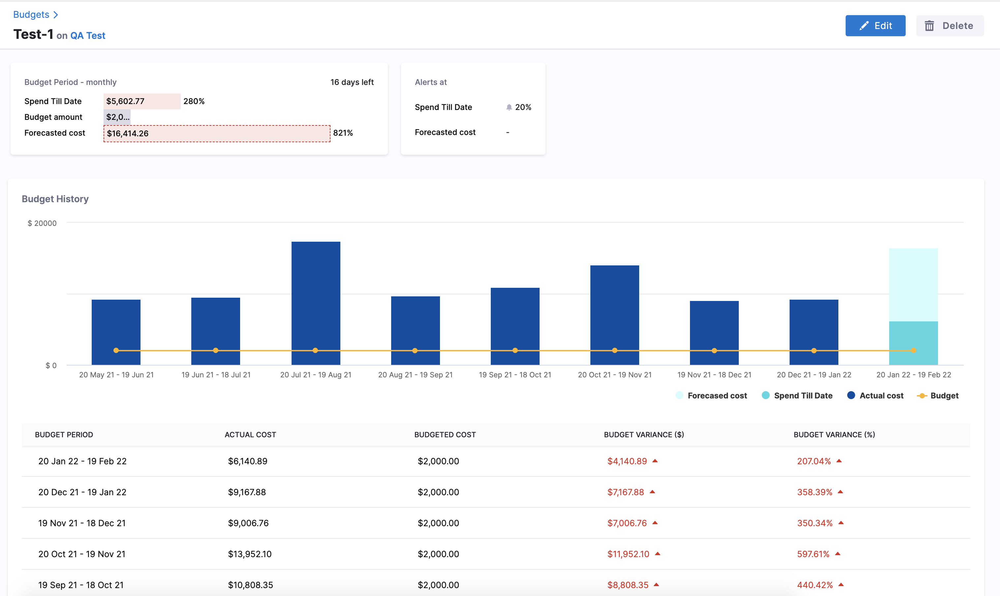

You can also **Edit** and **Delete** a budget from the dashboard.

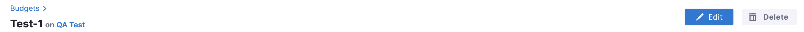

## Edit a Budget

To edit a budget:

1. In **All Budgets**, select the budget that you want to edit.
2. Click **Edit**.
   
     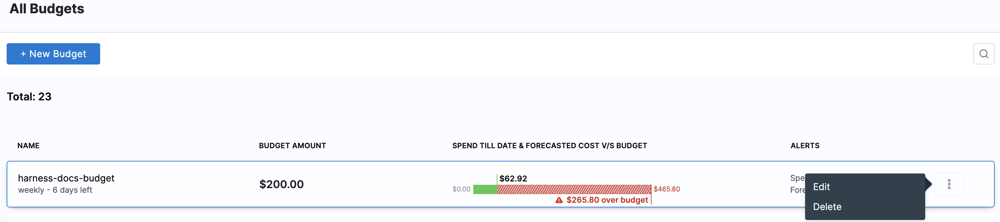
3. The Budget settings appear. Follow the steps in **Create a New Budget** to edit the details of the budget.  
You cannot edit the **Budget Period**.

## Delete a Budget

Once a budget is deleted, it cannot be restored.

To delete a budget:

1. In **All Budgets**, select the budget that you want to delete.
   
     
2. Click **Delete**.
   
     

## Next Steps

* [Analyze Cost for Kubernetes Using Perspectives](../../3-use-ccm-cost-reporting/3-root-cost-analysis/analyze-cost-for-k8s-ecs-using-perspectives.md)
* [Analyze Cost for AWS Using Perspectives](../../3-use-ccm-cost-reporting/3-root-cost-analysis/analyze-cost-for-aws.md)
* [Analyze Cost for GCP ​Using Perspectives](../../3-use-ccm-cost-reporting/3-root-cost-analysis/analyze-cost-for-gcp-using-perspectives.md)
* [Analyze Cost for Azure Using Perspectives](../../3-use-ccm-cost-reporting/3-root-cost-analysis/analyze-cost-for-azure.md)
* [Create a Budget for Your Perspective](../../3-use-ccm-cost-reporting/1-ccm-perspectives/3-create-a-budget-perspective.md)

