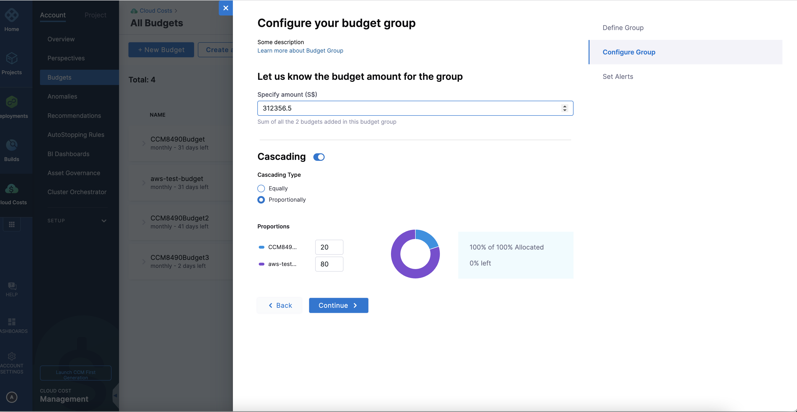
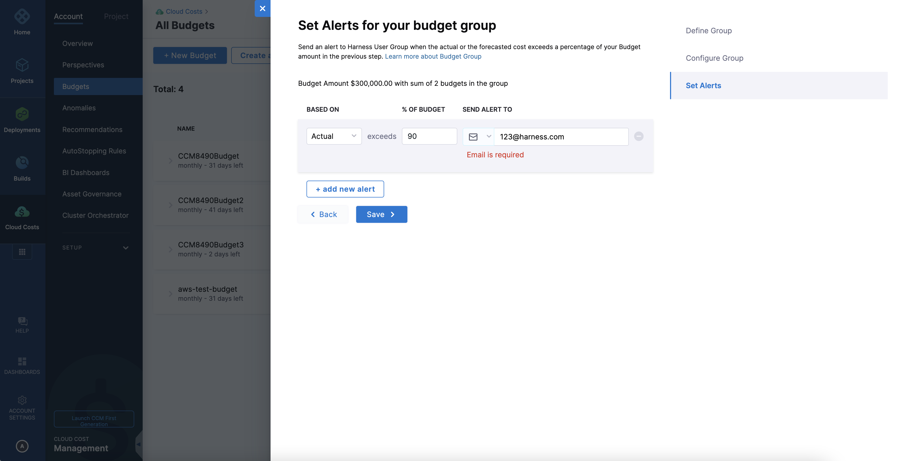

:::note
Currently, this feature is behind the feature flag CCM_BUDGET_CASCADES. Contact Harness Support to enable the feature.
:::

By combining multiple budgets into budget groups, you can establish correlations between various financial aspects. 

## Before you begin

* See [Create a budget](./create-a-budget.md).

## Create a new budget group

### Visual summary

  

Perform the following steps to create a budget group:

1. In your Harness application, go to **Cloud Costs**, and select **Budgets**.
2. Click **Create a new Budget Group**.
3. Enter a budget group name.
4. Select the budgets to create a group. You could also select multiple budget groups. However, you cannot combine a budget and a budget group to create another group.

  
:::note
When selecting budgets, you must ensure that they have the same start date, budget amount type, and period. If you are creating a group of budget groups, the cascading type must also be similar. After selecting the first budget or budget group, the remaining budgets or budget groups that have a different start date, budget amount type, period, or cascading type are disabled.
:::

5. Click **Continue**.
6. In the **Specify Amount** field, the sum of the budgets or budget groupd selected in the previous step is displayed by default. You can edit this value.
7. Select **Cascading** if you wish to split the budget group amount across individual budgets or budget groups. Select one of the following options:

   - **Equally**: Selecting this option splits the amount equally between the budgets in the group.
   - **Proportionally**: Specify the percentage split for each budget by selecting this option. For example, if you have a budget group with three budgets - Budget A, Budget B, and Budget C, you must specify the percentage of the total budget amount allotted to each of the three budgets. Ensure that the sum of the three percentages equals 100%.
  
     - Budget A - 20%
     - Budget B - 30%
     - Budget C - 50%

  

8. Click **Continue**.
9. Set alerts for your budget group. Harness sends alerts when the actual cost or forecasted cost exceeds the percentage of budget that you specify.
   1. Select **Actual** or **Forecasted** from the dropdown list.
   2. Enter the threshold percentage of the budget that will trigger an alert.
   3. In **Send Alert To**, select one of the following options to receive budget notifications.
	-  **Email**: Enter the email address (you can enter more than one email address or email groups).
	-  **Slack Webhook URL**: Enter the webhook URL.
   4. Click **Save**. 

    

## Update a budget group

1. In **All Budgets**, select the budget group that you want to edit.
2. Click **Edit** from the vertical ellipsis (⋮) icon.
3. You can update the name of the budget group. 
  
:::note
You cannot modify the budget amount and the **Cascading** settings if you have selected the option while creating the budget group. Furthermore, you cannot modify certain parameters such as the start date, the budget amount type, and the period of individual budgets or budget groups in the budget group.
:::

3. You could exclude existing budgets or budget groups and include new ones with the same parameters.
4. If you have selected **Cascading**, depending on the cascading type the budget group amount is redistributed: 

  - **Equally**: The new budget or budget group will be summed up and redistributed across all the budgets in the group.
  - **Proportionally**: The new budget will be assigned 0% by default. You must edit this value to redistribute. The budgets in the budget group will be recomputed and set to the new budget amounts based on the new ratios.
  
:::note
  Whenever there is a change in the budget values within a nested budget group, the adjustment will cascade upwards, causing a readjustment of the budget ratios all the way to the top. Consequently, the budget amounts in that pathway will increase by a consistent delta amount.
:::

An example of how a cascading monthly budget is recalculated when the budget amount changes.

- Jan, Feb, Mar - $80
- May - $90
- June, July - $100
- Aug, Sep, Oct, Nov - $120
- Dec - $110

The overall budget is $1200. When this amount is increased to $1800, the difference in the amount, that is $600 is redistributed across months in the same ratio as their initial splits. That is, the budget amount for January will increase by $40 (80/1200 * 600 = 40).

6. Save the budget group.

## Delete a budget group

1. In **All Budgets**, select the budget group that you want to delete.
2. Click **Delete** from the vertical ellipsis (⋮) icon.
3. Click **Delete** in the confirmation dialog.

    

The budget group is deleted. The budgets and budget groups in the deleted budget group are moved to the common pool where they retain their autonomy and function independently as individual budgets and budget groups. If the budget group was part of a cascade, all the upward budget group ratios will be readjusted and computed accordingly. 

When a perspective is deleted, all associated entities, such as reports, alerts, budgets, and budget groups are also deleted. If all children of a budget group are deleted as part of the perspective deletion, then the budget group itself will also be deleted.

  