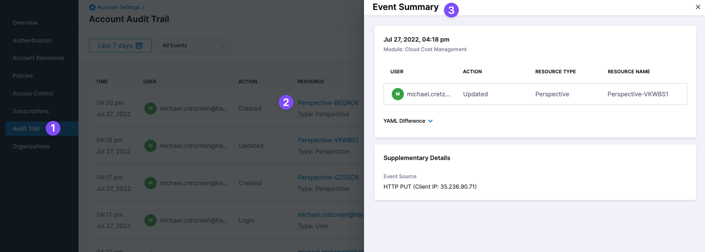
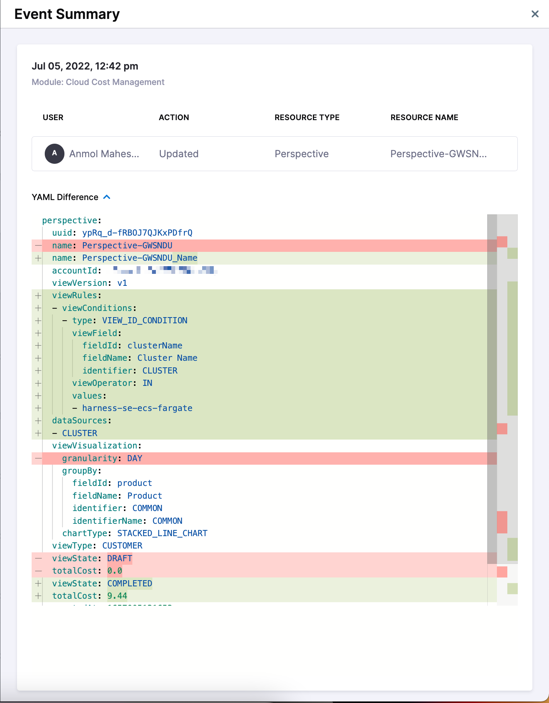

# CCM Audit trail
Currently, this feature is behind the feature flag `AUDIT_TRAIL_WEB_INTERFACE`. Contact [Harness Support](mailto:support@harness.io) to enable the feature. Your Harness account [Audit Trail](/docs/platform/Governance/Audit-Trail/audit-trail) includes events for CCM changes.

## CCM Events in Audit Trail

The following CCM events are included in Audit Trail:

* **Perspectives:** Create/Delete/Update.
* **Perspective Reports:** Create/Delete/Update.
* **Budgets:** Create/Delete/Update.
* **Cost Categories:** Create/Delete/Update.

For example, in Audit Trails, click a Perspective event to see its details:

Expand **YAML Difference** to see what was changed: 

