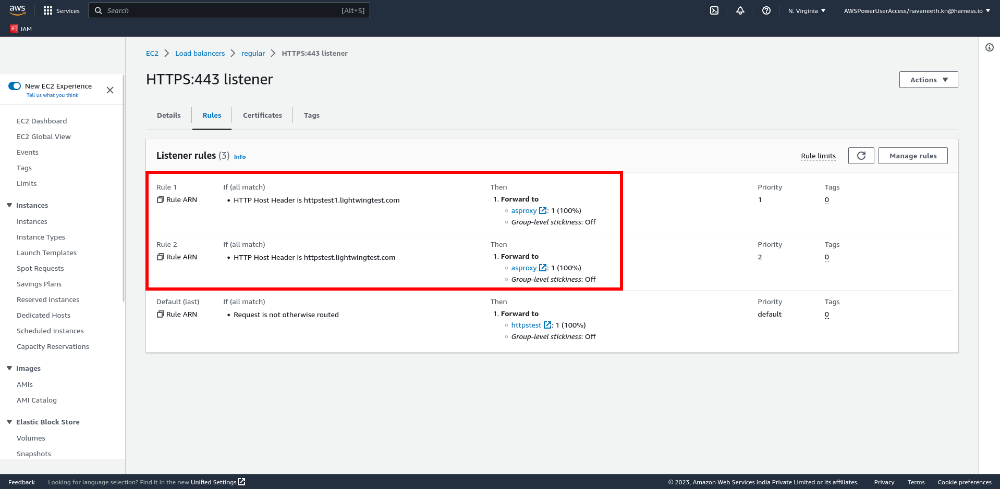
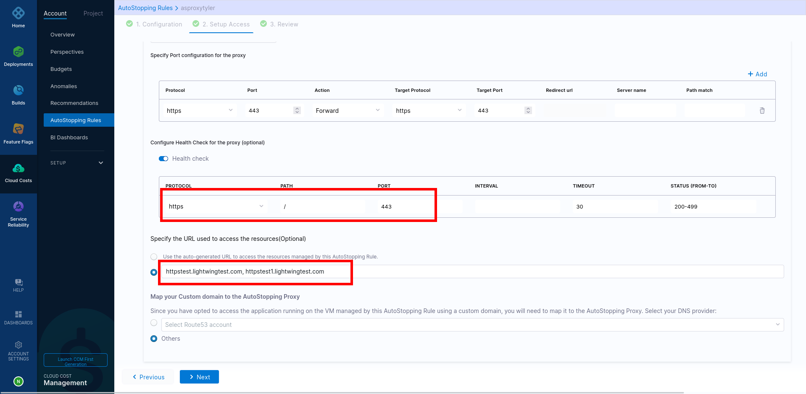

Learn how to configure an AutoStopping proxy as a downstream system of an Application Load Balancer in AWS, as illustrated by this network architecture diagram:

## Create a target group for the proxy VM with a health check configuration

On the AWS console, you need to create a target group for the proxy VM with a health check configuration, and then edit ALB rules and add forwarding action to the proxy target group.

1. On the AWS console, navigate to **Target Groups** and [create a target group](https://docs.aws.amazon.com/elasticloadbalancing/latest/application/create-target-group.html).

2. Choose the proxy VM and register it as a target.

3. Make sure the port matches the port details that the application is using.

4. Configure the [health check settings](https://docs.aws.amazon.com/elasticloadbalancing/latest/application/target-group-health-checks.html) as per the port information.

   

5. If the proxy needs to handle multiple ports (80, 443), create one target group for each of the ports.

   

6. Edit ALB rules and add forwarding action to the proxy target group.

   All the URLs configured in the AutoStopping rules should point to the AutoStopping proxy target group.

   

## Create an AutoStopping rule with custom domains

In Harness, [create AutoStopping rule for AWS](/docs/category/autostopping-for-aws) with HTTP/HTTPS workload and configure custom domains in the AutoStopping rule.

