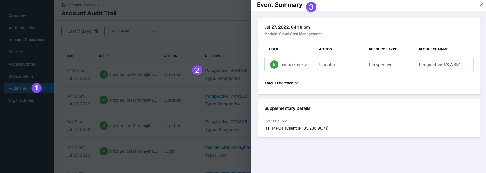
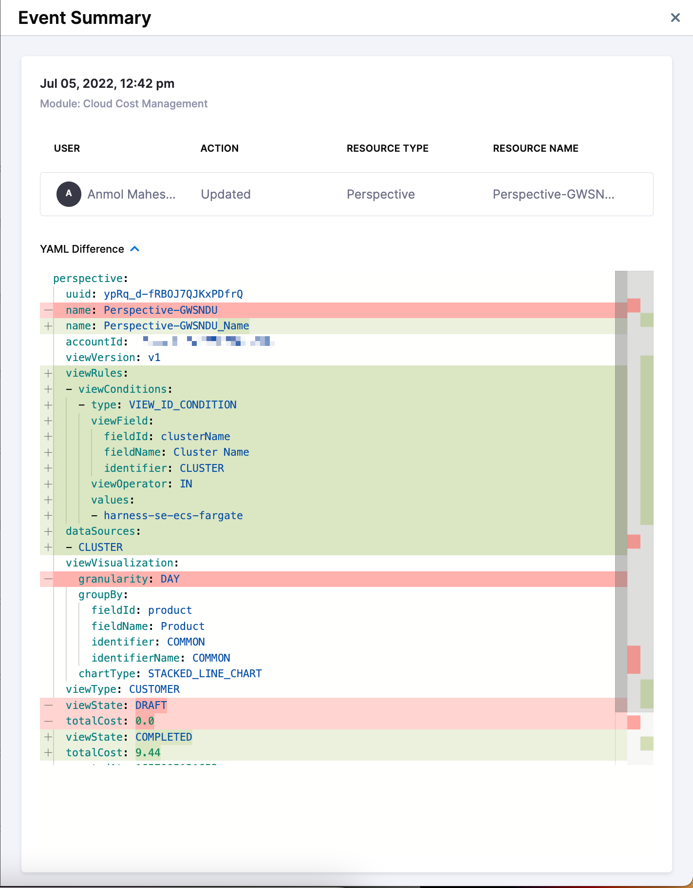

# CACM Audit trail
Your Harness account [Audit Trail](/docs/platform/governance/audit-trail/audit-trail.md) includes events for CACM changes.

## CACM Events in Audit Trail

The following CACM events are included in Audit Trail:

* **Perspectives:** Create/Delete/Update.
* **Perspective Reports:** Create/Delete/Update.
* **Budgets:** Create/Delete/Update.
* **Cost Categories:** Create/Delete/Update.

For example, in Audit Trails, click a Perspective event to see its details:

Expand **YAML Difference** to see what was changed: 

