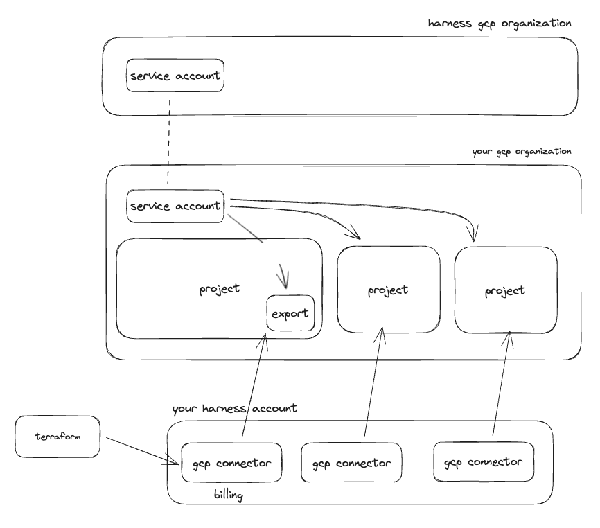

# GCP

In your GCP organization there should be a billing project that covers your entire organization. We will need to create a billing export in the billing project, to be placed into a BigQuery database and table.

If you do not have a billing project, you will need to locate some other project to create the billing export from.

You may end up with one to many billing exports depending on your GCP configuration.


## Overview



## Get Harness Service Account Information

To give Harness access to billing information and resources in your GCP organization, you will need to add a Harness GCP service account to your GCP organization.

The service account you need to add is generated based off your Harness account ID. You need to go to the Harness UI, go to `Account Settings`, `Connectors`, `Create New Connector`, and select `GCP Cloud Costs`. Start filling out the form entering either real or fake information, and when prompted for `Choosing Requirements` select `Cost Visibility`. Finally on the next page you are given a GCP service account email.

You will need to use this service account when assigning access to the billing export or projects below.

## Billing Data

The first step is to [create a billing export](https://developer.harness.io/docs/cloud-cost-management/get-started/onboarding-guide/set-up-cost-visibility-for-gcp#gcp-billing-export) in your billing (or other) project. When you create the billing export, you will need to specify a BigQuery dataset to store the export in. Once the billing export has been created, we will need give Harness access to read the export in the database.

To do this, assign `BigQuery Data Viewer` to the Harness GCP service account you found above for the database which holds the billing export.


### Harness CCM GCP Connector

Now that the export has been created and access assigned we need to create a corresponding CCM GCP connector in your Harness account to start billing data ingestion.

You can create this connector through the UI or via the API with a tool like Terraform. Using Terraform is the recommended approach and there is a [Harness Terraform provider here](https://registry.terraform.io/providers/harness/harness/latest/docs).

To configure the connector you will need the following information:

- Project ID: The ID of your billing (or other) project where the export is located
- Service account email: The Harness service account email you found above
- Dataset ID: The ID of the dataset where the billing export is being delivered to
- Table ID: The ID of the table where the billing export is being delivered to
- Features enabled: The CCM features that you want to use in this project
  - At minimum this should be `BILLING`
  - You should additionally enable any other features you want to use in this subscription
    - `VISIBILITY`: This enables the inventory management feature
      - This will enable VM  metadata gathering
    - `OPTIMIZATION`: This enables the optimization feature
      - This will enable you to use the auto stopping feature for VMs


```terraform
resource "harness_platform_connector_gcp_cloud_cost" "billing" {
  identifier = "billing"
  name       = "billing"

  gcp_project_id        = "example-proj-234"
  service_account_email = "harness-ce-sdjfh-00001@ce-prod-000001.iam.gserviceaccount.com"
  billing_export_spec {
    data_set_id = "data_set_id"
    table_id    = "table_id"
  }
  features_enabled      = ["BILLING"]
}
```

## Other Projects

Enabling CCM for your project that holds the billing export gets your cost data into Harness and enables you to start creating perspectives, budgets, alerts, and dashboards. To leverage the other features like inventory and auto stopping we need to give access and create connectors for each project where you want to use these other features.

For the inventory management feature you need to enable [Compute Engine APIs](https://console.cloud.google.com/apis/library/compute.googleapis.com) and give the Harness service account `Compute Viewer` access to the project.

For the optimization feature you need to give the Harness service account `Compute Editor` access to the project.

Below is an example of assigning the Harness service account access to a GCP project using terraform:

```
resource "google_project_iam_member" "viewer" {
  project = "example-proj-012"
  role    = "roles/viewer"
  member  = "serviceAccount:harness-ce-sdjfh-00001@ce-prod-000001.iam.gserviceaccount.com"
}
```

### Fine-grain Auto Stopping Permissions

If you do not wish to give Contributor access to the Harness service account here is the fine grain actions needed for auto stopping. You can create a custom policy with these actions and assign it to the Harness service account.

```json
{
    [
        "compute.addresses.create",
        "compute.addresses.createInternal",
        "compute.addresses.delete",
        "compute.addresses.deleteInternal",
        "compute.addresses.get",
        "compute.addresses.list",
        "compute.addresses.setLabels",
        "compute.addresses.use",
        "compute.addresses.useInternal",
        "compute.autoscalers.create",
        "compute.autoscalers.delete",
        "compute.autoscalers.get",
        "compute.autoscalers.list",
        "compute.autoscalers.update",
        "compute.instanceGroupManagers.create",
        "compute.instanceGroupManagers.delete",
        "compute.instanceGroupManagers.get",
        "compute.instanceGroupManagers.list",
        "compute.instanceGroupManagers.update",
        "compute.instanceGroupManagers.use",
        "compute.instanceGroups.create",
        "compute.instanceGroups.delete",
        "compute.instanceGroups.get",
        "compute.instanceGroups.list",
        "compute.instanceGroups.update",
        "compute.instanceGroups.use",
        "compute.instances.addAccessConfig",
        "compute.instances.attachDisk",
        "compute.instances.create",
        "compute.instances.createTagBinding",
        "compute.instances.delete",
        "compute.instances.deleteAccessConfig",
        "compute.instances.deleteTagBinding",
        "compute.instances.detachDisk",
        "compute.instances.get",
        "compute.instances.getEffectiveFirewalls",
        "compute.instances.getIamPolicy",
        "compute.instances.getSerialPortOutput",
        "compute.instances.list",
        "compute.instances.listEffectiveTags",
        "compute.instances.listTagBindings",
        "compute.instances.osAdminLogin",
        "compute.instances.osLogin",
        "compute.instances.removeResourcePolicies",
        "compute.instances.reset",
        "compute.instances.resume",
        "compute.instances.sendDiagnosticInterrupt",
        "compute.instances.setDeletionProtection",
        "compute.instances.setDiskAutoDelete",
        "compute.instances.setIamPolicy",
        "compute.instances.setLabels",
        "compute.instances.setMachineResources",
        "compute.instances.setMachineType",
        "compute.instances.setMetadata",
        "compute.instances.setMinCpuPlatform",
        "compute.instances.setScheduling",
        "compute.instances.setServiceAccount",
        "compute.instances.setShieldedInstanceIntegrityPolicy",
        "compute.instances.setShieldedVmIntegrityPolicy",
        "compute.instances.setTags",
        "compute.instances.start",
        "compute.instances.stop",
        "compute.instances.suspend",
        "compute.instances.update",
        "compute.instances.updateAccessConfig",
        "compute.instances.updateDisplayDevice",
        "compute.instances.updateNetworkInterface",
        "compute.instances.updateSecurity",
        "compute.instances.updateShieldedInstanceConfig",
        "compute.instances.updateShieldedVmConfig",
        "compute.instances.use",
        "compute.instances.useReadOnly",
        "compute.machineTypes.list",
        "compute.networks.access",
        "compute.networks.get",
        "compute.networks.getEffectiveFirewalls",
        "compute.networks.getRegionEffectiveFirewalls",
        "compute.networks.list",
        "compute.networks.mirror",
        "compute.regions.get",
        "compute.regions.list",
        "compute.firewalls.list",
        "compute.subnetworks.list",
        "compute.disks.create",
        "compute.subnetworks.use",
        "compute.subnetworks.useExternalIp",
        "secretmanager.versions.access",
        "compute.projects.get"
    ]
}
```

Here is example terraform for creating a custom role via terraform and applying it to a project:

```
resource "google_project_iam_custom_role" "harness_autostopping" {
  project = "example-proj-012"
  role_id = "harness_autostopping"
  title   = "harness_autostopping"
  permissions = [
    "compute.addresses.create",
    "compute.addresses.createInternal",
    "compute.addresses.delete",
    "compute.addresses.deleteInternal",
    "compute.addresses.get",
    "compute.addresses.list",
    "compute.addresses.setLabels",
    "compute.addresses.use",
    "compute.addresses.useInternal",
    "compute.autoscalers.create",
    "compute.autoscalers.delete",
    "compute.autoscalers.get",
    "compute.autoscalers.list",
    "compute.autoscalers.update",
    "compute.instanceGroupManagers.create",
    "compute.instanceGroupManagers.delete",
    "compute.instanceGroupManagers.get",
    "compute.instanceGroupManagers.list",
    "compute.instanceGroupManagers.update",
    "compute.instanceGroupManagers.use",
    "compute.instanceGroups.create",
    "compute.instanceGroups.delete",
    "compute.instanceGroups.get",
    "compute.instanceGroups.list",
    "compute.instanceGroups.update",
    "compute.instanceGroups.use",
    "compute.instances.addAccessConfig",
    "compute.instances.attachDisk",
    "compute.instances.create",
    "compute.instances.createTagBinding",
    "compute.instances.delete",
    "compute.instances.deleteAccessConfig",
    "compute.instances.deleteTagBinding",
    "compute.instances.detachDisk",
    "compute.instances.get",
    "compute.instances.getEffectiveFirewalls",
    "compute.instances.getIamPolicy",
    "compute.instances.getSerialPortOutput",
    "compute.instances.list",
    "compute.instances.listEffectiveTags",
    "compute.instances.listTagBindings",
    "compute.instances.osAdminLogin",
    "compute.instances.osLogin",
    "compute.instances.removeResourcePolicies",
    "compute.instances.reset",
    "compute.instances.resume",
    "compute.instances.sendDiagnosticInterrupt",
    "compute.instances.setDeletionProtection",
    "compute.instances.setDiskAutoDelete",
    "compute.instances.setIamPolicy",
    "compute.instances.setLabels",
    "compute.instances.setMachineResources",
    "compute.instances.setMachineType",
    "compute.instances.setMetadata",
    "compute.instances.setMinCpuPlatform",
    "compute.instances.setScheduling",
    "compute.instances.setServiceAccount",
    "compute.instances.setShieldedInstanceIntegrityPolicy",
    "compute.instances.setShieldedVmIntegrityPolicy",
    "compute.instances.setTags",
    "compute.instances.start",
    "compute.instances.stop",
    "compute.instances.suspend",
    "compute.instances.update",
    "compute.instances.updateAccessConfig",
    "compute.instances.updateDisplayDevice",
    "compute.instances.updateNetworkInterface",
    "compute.instances.updateSecurity",
    "compute.instances.updateShieldedInstanceConfig",
    "compute.instances.updateShieldedVmConfig",
    "compute.instances.use",
    "compute.instances.useReadOnly",
    "compute.machineTypes.list",
    "compute.networks.access",
    "compute.networks.get",
    "compute.networks.getEffectiveFirewalls",
    "compute.networks.getRegionEffectiveFirewalls",
    "compute.networks.list",
    "compute.networks.mirror",
    "compute.regions.get",
    "compute.regions.list",
    "compute.firewalls.list",
    "compute.subnetworks.list",
    "compute.disks.create",
    "compute.subnetworks.use",
    "compute.subnetworks.useExternalIp",
    "secretmanager.versions.access",
    "compute.projects.get",
  ]
}

resource "google_project_iam_member" "autostopping" {
  project = "example-proj-012"
  role    = google_project_iam_custom_role.harness_autostopping.id
  member  = "serviceAccount:harness-ce-sdjfh-00001@ce-prod-000001.iam.gserviceaccount.com"
}
```

### Harness CCM GCP Connector

Now that the Harness service account has been granted access to your projects we need to create a corresponding CCM GCP connector in your Harness account for each project.

You can create these connectors through the UI or via the API with a tool like Terraform. Using Terraform is the recommended approach and there is a [Harness Terraform provider here](https://registry.terraform.io/providers/harness/harness/latest/docs).

To configure the connector you will need the following information:

- Project ID: The ID of your billing (or other) project where the export is located
- Service account email: The Harness service account email you found above
- Features enabled: The CCM features that you want to use in this project
  - You should not enable `BILLING`
  - You should additionally enable any other features you want to use in this subscription
    - `VISIBILITY`: This enables the inventory management feature
      - This will enable VM  metadata gathering
    - `OPTIMIZATION`: This enables the optimization feature
      - This will enable you to use the auto stopping feature for VMs


```terraform
resource "harness_platform_connector_gcp_cloud_cost" "project" {
  identifier = "project"
  name       = "project"

  gcp_project_id        = "example-proj-234"
  service_account_email = "harness-ce-sdjfh-00001@ce-prod-000001.iam.gserviceaccount.com"
  billing_export_spec {
    data_set_id = "data_set_id"
    table_id    = "table_id"
  }
  features_enabled      = ["VISIBILITY", "OPTIMIZATION"]
}
```


## Connectors and Roles for GCP CCM

The process below defines how to provision Harness connectors and GCP IAM roles using Terraform.

### Permissions

You will need access to provision IAM roles in GCP and create CCM connectors in Harness.

### Setup Providers

We need to leverage the GCP and Harness Terraform providers. We will use these to create IAM roles and CCM connectors. We also will get all GCP subscriptions and set the Harness service account.  To get all subscriptions, we are filtering on the parent folder  [This](https://registry.terraform.io/providers/hashicorp/google/latest/docs/data-sources/projects) document describes other ways to get a list of projects such as at the organization level.  

You should already have a billing connector in your GCP organization for the project that has the billing export.  To find this connector, go to the Harness UI -> Account Settings -> Connectors -> Click on the GCP connector that has the billing export -> Toggle the YAML view -> Copy the value for 'serviceAccountEmail'.

You can get the hierarchical structure of a project by running this gcloud CLI command:
```
gcloud projects get-ancestors {projectId}
```

You can get the complete project list in your organization by running:
```
gcloud projects list
```

```
terraform {
  required_providers {
    harness = {
      source = "harness/harness"
    }
    google = {
      source = "google"
    }
  }
}

provider "google" {}

provider "harness" {}

variable "harness_gcp_sa" {
  type = string
}
```

### Get Projects And Create Connectors

There are two options to retrieve the projects we want to create connectors for.  We'll use the Harness provider to create a CCM connector for each GCP project after we retrieve them. We are enabling recommendations (VISIBILITY), governance (GOVERNANCE), and autostopping (OPTIMIZATION).

#### Use The Google Provider To Get All Projects In The Organization

Get all projects in a specific folder:
```
data "google_projects" "my-org-projects" {
  filter = "parent.type:folder parent.id:0123456789"
}
```

Get all projects in an organization:
```
data "google_projects" "my-org-projects" {
  filter = "name:*"
}
```

```
resource "harness_platform_connector_gcp_cloud_cost" "this" {
  for_each = { for project in data.google_projects.my-org-projects.projects : project.project_id => project }

  identifier = replace(each.value.project_id, "-", "_")
  name       = each.value.name

  features_enabled      = ["VISIBILITY", "OPTIMIZATION", "GOVERNANCE"]
  gcp_project_id        = each.value.project_id
  service_account_email = var.harness_gcp_sa
}
```


#### Use The Built In Locals Value To Define The Projects Statically
This is useful when you don't have a solid naming convention and you want to apply certain features to different projects.  For example, you want to only apply autostopping in non-prod projects.  This is also useful when you can't authenticate to the GCP organization.

```
locals {
  gcp-non-prod = ['project-1', 'project-2']
  gcp-prod = ['project-3', 'project-4']
}

resource "harness_platform_connector_gcp_cloud_cost" "this" {
  for_each = toset(concat(local.gcp-non-prod, local.gcp-prod))

  identifier = "gcp${replace(replace(trimspace(each.key), "-", "_"), " ", "_")}"
  name = "gcp${replace(replace(trimspace(each.key), "-", "_"), " ", "_")}"

  features_enabled      = ["VISIBILITY", "OPTIMIZATION", "GOVERNANCE"]
  gcp_project_id        = each.key
  service_account_email = var.harness_gcp_sa
}
```

### Create Roles In Each GCP Project
Your organization probably already has a process to do this.  When this is the case, defer to that process.  Below is an alternative.

### Create Role In Each GCP Project via Terraform

There are two examples. One is project-wide viewer (read-only) access and the other is project-wide editor access. Based on your needs in Harness, choose the minimum amount of permissions needed.

Note:  If you give the Harness service account the appropriate permissions across your entire organization via the GCP console, you do not have to use the below Terraform to give permissions for each project.  These are written using the Google provider to get all projects.  If you are using the locals value to statically define the projects, the logic for the loop and project will have to be modified.

```
# for view access
resource "google_project_iam_member" "viewer" {
  for_each = { for project in data.google_projects.my-org-projects.projects : project.project_id => project }

  project = each.value.project_id
  role    = "roles/viewer"
  member  = "serviceAccount:${var.harness_gcp_sa}"
}

# for editor access
resource "google_project_iam_member" "editor" {
  for_each = { for project in data.google_projects.my-org-projects.projects : project.project_id => project }

  project = each.value.project_id
  role    = "roles/editor"
  member  = "serviceAccount:${var.harness_gcp_sa}"
}
```

:::info

This is a general example of providing either viewer or reditor access for each connector inside of a GCP folder. This example doesn't include setting up the connector for the billing export.

## Supplemental Information

[Here](https://registry.terraform.io/providers/harness/harness/latest/docs) is the Terraform documentation for the Harness provider.

[Here](https://registry.terraform.io/providers/hashicorp/google/latest/docs) is the Terraform documentation for the GCP provider.

[Here](https://cloud.google.com/resource-manager/docs/apis) is the GCP API documentation.