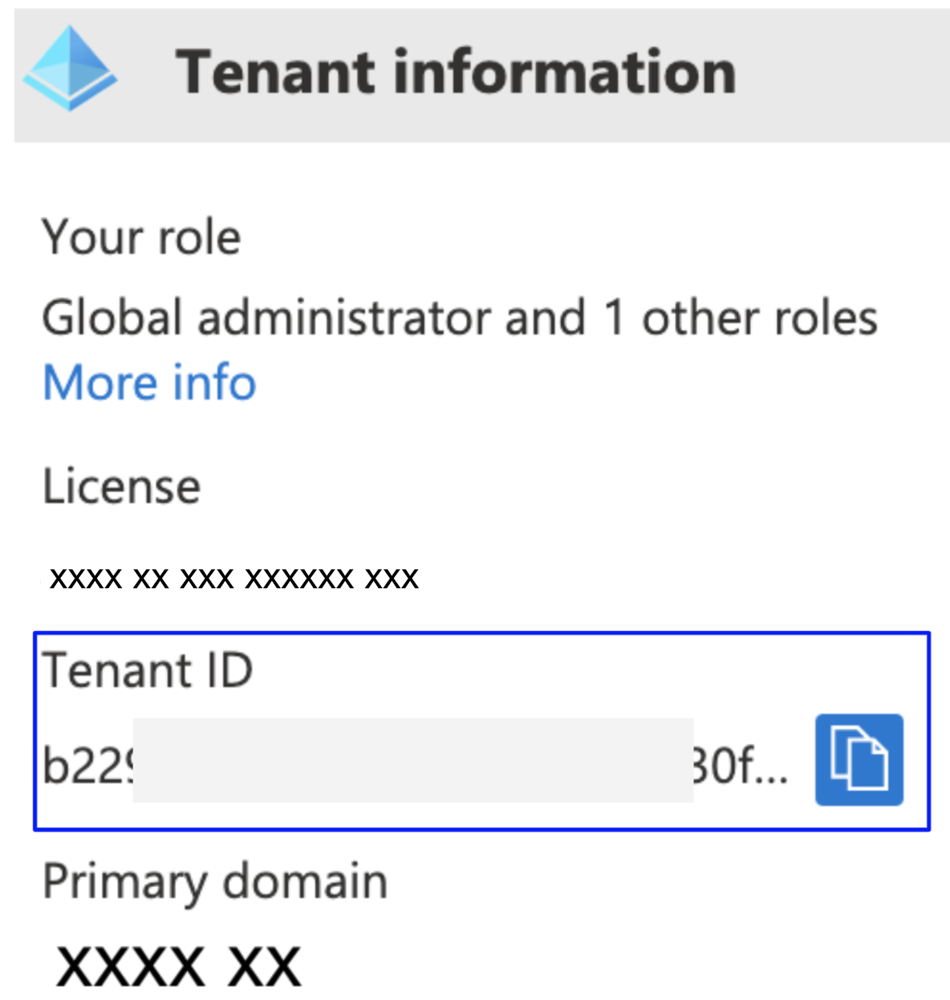
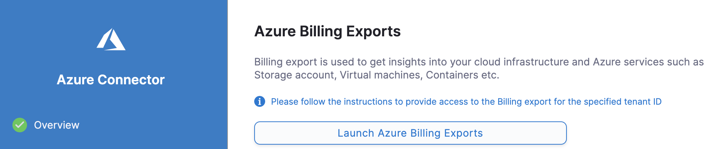
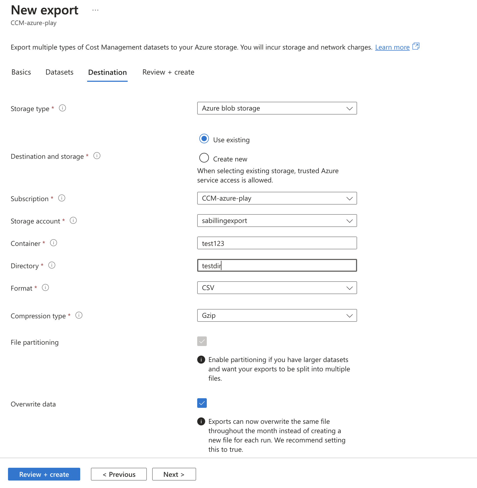
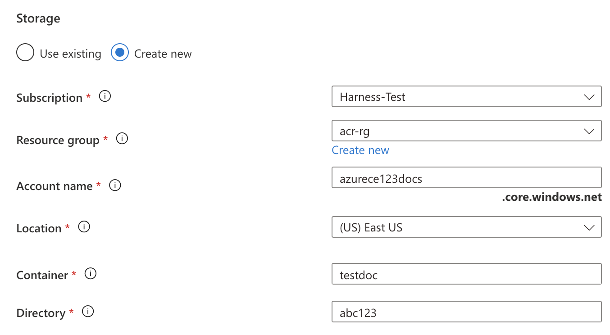
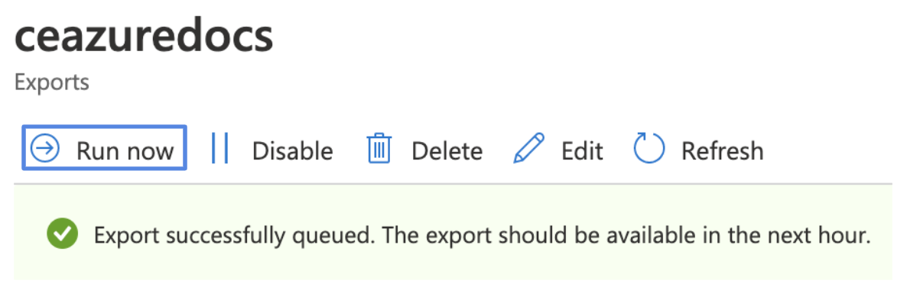
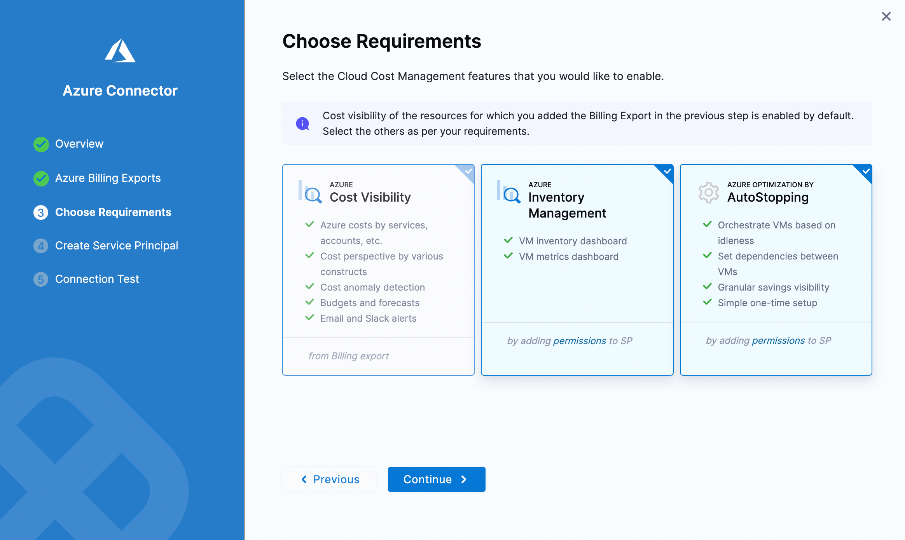
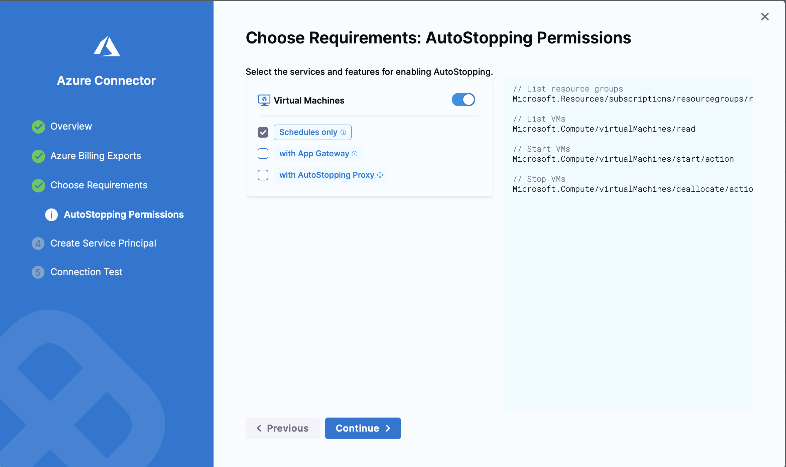

import Tabs from '@theme/Tabs';
import TabItem from '@theme/TabItem';
import RedirectIfStandalone from '@site/src/components/DynamicMarkdownSelector/RedirectIfStandalone';

<RedirectIfStandalone label="Azure" targetPage="/docs/cloud-cost-management/get-started/dynamic-get-started" />

Harness Cloud Cost Management (CCM) monitors the cloud costs of your Azure services. Connect your Azure account and set up Billing Export to get insights into your cloud infrastructure and Azure services such as Storage accounts, Virtual machines, Containers, and so on. CCM also allows you to optimize your instances and AKS clusters using intelligent cloud [AutoStopping rules](/docs/category/autostopping-for-azure).

:::info
After enabling CCM, it takes about 24 hours for the data to be available for viewing and analysis.
:::

## Prerequisites

* Make sure that you have the **Application Administrator** role assigned to your Azure AD. Users in this role can create and manage all aspects of enterprise applications, application registrations, and application proxy settings. See [Application Administrator](https://docs.microsoft.com/en-us/azure/active-directory/roles/permissions-reference#application-administrator).
* Many Azure CLI commands act within a subscription. Make sure that you have selected the right subscription before executing the commands.
   If you need to switch subscription, run: ```az account set -s <'*'subs id/name'*'>```
   For more information, see [Manage Subscriptions](https://docs.microsoft.com/en-us/cli/azure/manage-azure-subscriptions-azure-cli).

### Azure Connector requirements

* For CCM, Azure connectors are available only at the Account level in Harness.
* You can create multiple Azure connectors for each Harness Account.
* You can create multiple Azure connectors per Azure Tenant with unique subscription IDs. 
* If you have separate billing exports for each of your subscriptions in your Azure account, set up separate connectors in Harness to view the cloud cost of all the subscriptions in CCM.

## Connect CCM to your Azure Account

To enable CCM for your Azure services (such as storage accounts, virtual machines, containers, and so on), you need to connect Harness to your Azure account.

Perform the following steps to connect to your Azure account:
1. Create a new Kubernetes connector using one of the two options below:

<Tabs queryString="tab-number">
<TabItem value="4" label="From Account Settings">

1. Go to **Account Resources** > **Connectors**.
2. Select **+ New Connector**.
3. Under **Cloud Costs**, select **Azure**.

</TabItem>
<TabItem value="5" label="From Cloud Costs">

1. Go to **Setup** > **Cloud Integration**.
2. Select on **New Cluster/Cloud account**.
3. Select **Azure**.

</TabItem>
</Tabs>

2. Perform the following tasks in the **Azure Connector** wizard.

### Overview

1. In the **Azure Connector** wizard, in the **Overview** section, enter the following details:
   1. **Connector name**: Enter a name for the connector.
   2. **Azure Tenant ID**: Enter the Tenant ID of your Azure AD account. A tenant represents an organization. It's a dedicated instance of Azure AD that an organization or app developer receives at the beginning of a relationship with Microsoft. Each Azure AD tenant is distinct and separate from other Azure AD tenants. To find your tenant ID, do the following:
      1. Launch Microsoft Entra ID (formerly Active Directory).
      2. Copy the tenant ID from the Tenant information.

      

      If you don't find the tenant ID in the Azure console, run the `az account show` command using the Azure CLI.

   3. **Azure Subscription ID**: Enter the Azure subscription ID. To find your Subscription ID, do the following:
      1. Launch Azure **Cost Management** page.
      2. Under **Product + services**, select **Azure subscriptions**.
      3. Copy the **Subscription ID** for your subscription.

      

      If you don't find the Subscription ID in the Azure console, you can use Azure CLI. See [List your Azure subscriptions with CLI](https://docs.microsoft.com/en-us/azure/media-services/latest/setup-azure-subscription-how-to?tabs=cli).
   4. **Description** (optional): Enter a brief description that conveys the purpose of this connector.
   5. **Tag** (optional): Enter text to create a tag for this connector.
5. Select **Continue**.

### Azure Billing Exports

Billing export is used to get insights into your cloud infrastructure and Azure services such as Storage accounts, Virtual machines, Containers, etc.

1. In **Azure Billing Exports**, select **Launch Azure Billing Exports**.
   
2. In the Azure **Cost Management** portal, under **Settings**, in **Exports**, select **Add** to create a new export.
3. In **Export details**, provide the following details:
   1. Enter a name for your export.
   2. In **Metrics**, select one of the following cost type:
      * **Actual cost** (Usage and Purchases) - Select to export standard usage and purchases.
      * **Amortized cost** (Usage and Purchases) - Select to export amortized costs for purchases like Azure reservations and Azure savings plan for compute.
   3. In **Export type**, select **Daily export of month-to-date costs**.
   4. In the **Start date**, leave the date as the current date. For example, if you are creating a new export on March 1, 2021, select the date as **Mon Mar 01 2021**.
4. In **Storage**, you can select **Use existing** or **Create new**.
   1. If you select **Use existing**, enter the following details:
      1. In **Subscription**, select the **Subscription** of your storage account.
      2. In the **Storage account**, select the storage account where the data needs to be exported.
      3. In **Container**, enter the container name where the report is to be stored.
      4. In **Directory**, enter the directory path where the export is to be stored.
      5. In **Format**, select **CSV**.
      6. In **Compression type**, select **Gzip**. This can be any type, but we recommend **Gzip**.
      7. File partitioning will already be enabled.
      8. Tick mark the option for **Overwrite data**.
      
   2. If you select **Create new**, enter the following details:
      1. In **Subscription**, select the **Subscription** of your storage account.
      2. In the **Resource group**, select the group to place the storage account. You can also create a new resource group. A resource group is a container that holds related resources for an Azure solution.
      3. In **Account name**, enter the name for your storage account.
      4. In **Location**, select the region for your storage account.
      5. In **Container**, enter the container name where the report is to be stored.
      6. In **Directory**, enter the directory path where the export is to be stored.
      7. Make a note of the **Storage account** name. You need it while assigning permissions to the storage account.
      
      8. Select **Create**. Your export report is listed in the **Exports** list.

5. Select the export that you created in the previous step and select **Run now**.

   

6. In the Azure **Cost Management** portal, select the billing export that you created in the enable export billing step.

   

7. Enter the following details in Harness:
   1. In the **Storage account name**, enter the account name.
   2. In **Storage Container**, enter the container name.
   3. In **Storage Directory**, enter the directory name.
   4. In **Report Name**, enter the export name.
   
8. Select **Continue**.

### Choose Requirements

1. Select **Cost Visibility** and **Azure resource optimization using AutoStopping rules** in **Create Cross Account Role**. Make sure to add the required permissions to the service principal.



CCM offers the following features:

| Features | Capabilities |
| --- | --- |
| **Cost Visibility** (Required)| This feature is available by default and requires access to the billing export. Provides the following functionalities:<ul><li>Insights into Azure costs by services, accounts, etc.</li><li>Root cost analysis using cost perspectives</li><li>Cost anomaly detection</li><li>Governance using budgets and forecasts</li><li>Alert users using Email and Slack notification</li></ul>|
| **Azure Inventory Management** (Optional)| This feature provides visibility into your Azure VM inventory dashboard and metrics dashboard. The insights provided by inventory management can be used by finance teams to understand resource utilization across the board.|
| **Azure optimization using AutoStopping rules** (Required for AutoStopping Rules)| This feature allows you to enable Intelligent Cloud AutoStopping for your Azure instances with a simple one-time setup. If selected, you can select [granular permissions in the next step](/docs/cloud-cost-management/get-started/onboarding-guide/set-up-cost-visibility-for-azure#granular-permissions-for-autostopping). |	
| **Cloud Governance** (Optional)              | This feature allows you to optimize your cloud spend and avoid unnecessary costs by rightsizing resources and decommissioning unused instances. For more information, see [Asset governance](../../5-use-ccm-cost-governance/asset-governance/1-asset-governance.md). <ul><li>Asset Management (VM, Disk, SQLserver, Loadbalancer)</li><li>Automated Actions</li></ul>   
 
2. Make your selection and select **Continue**.

### Create Service Principal and Assign Permissions

Harness uses a multi-tenant app to sync billing export data from the source storage account to Harness and to perform cost optimization functions. This involves the following steps:

* Register the Harness CCM application into your Azure account.
* Grant read permissions to the storage account in which the billing data export is available and/or assign `contributor` role to the subscription if the AutoStopping feature is being utilized.

Create a service principal and assign permissions by running the following commands in the bash terminal or in the Azure cloud shell.

#### Register the Harness Application

Run the following Bash commands using your terminal or Azure cloud shell:

```
az ad sp create --id 0211763d-24fb-4d63-865d-92f86f77e908
```

See **Azure client application ID** in **Harness Platform** > **Connectors** > **Add a Microsoft Azure Cloud Connector** for more information.

:::info

If you encounter the following error message, proceed to [assigning permissions to the storage accounts](#assign-permissions-to-the-storage-accounts):

`Another object with the same value for property servicePrincipalNames already exists.`

The error means that your Harness CCM application is already registered into your Azure account.

:::

#### Assign Permissions to the Storage Accounts

Run the following Bash commands using your terminal or Azure cloud shell.

1. Run the following command that provides scope for your storage account. Each role assignment in Azure needs a scope on which the permissions or role is applied.  The `--name` parameter is required.

   ```
   SCOPE='az storage account show --name <storage account name> --query "id" | xargs'
   ```

   The output of this command is used in the next step. Here's an example output:

   ```
   $ SCOPE=`az storage account show --name test --query "id" | xargs`

   $ echo $SCOPE
   /subscriptions/XXXXXXX-XXXX-XXXX-XXXX-XXXXXXXXXXXX/resourceGroups/<resourcegroupname>/providers/Microsoft.Storage/storageAccounts/<storage account name>
   ```

2. Run the following command that provides Storage Blob Data Reader permission to the Harness application on the scope fetched in the previous step. It contains the ID of the Harness CCM client application: `0211763d-24fb-4d63-865d-92f86f77e908`.

   ```
   az role assignment create --assignee 0211763d-24fb-4d63-865d-92f86f77e908 --role 'Storage Blob Data Reader' --scope $SCOPE
   ```

3. (Optional) Run this command if you have opted for **Azure Inventory Management** in the Choosing Requirements step:

   ```
   az role assignment create --assignee 0211763d-24fb-4d63-865d-92f86f77e908 --role 'Reader' --scope /subscriptions/<Subscription ID>
   ```

4. (Optional) Run this command if you selected **Azure Optimization by AutoStopping** in the Choosing Requirements step:

   ```
   az role assignment create --assignee 0211763d-24fb-4d63-865d-92f86f77e908 --role 'Contributor' --scope /subscriptions/<Subscription ID>
   ```

5. Select **Continue** in Harness.

### Test Connection

The connection is validated and verified in this step. After successful validation, and verification, select **Finish**.

Your connector is listed in the **Connectors**.


## Granular Permissions for AutoStopping



On this screen, you can select specific features and services for AutoStopping:

### Virtual Machines

<details>
<summary><b>Schedules only</b></summary>

```
// List resource groups
Microsoft.Resources/subscriptions/resourcegroups/read

// List VMs
Microsoft.Compute/virtualMachines/read

// Start VMs
Microsoft.Compute/virtualMachines/start/action

// Stop VMs
Microsoft.Compute/virtualMachines/deallocate/action
```

</details>

<details>
<summary><b>with App Gateway</b></summary>

```
// List virtual networks
Microsoft.Network/virtualNetworks/read

// List subnets
Microsoft.Network/virtualNetworks/subnets/read

// List public IP addresses
Microsoft.Network/publicIPAddresses/read

// List app gateways
Microsoft.Network/applicationGateways/read

// For traffic detection using access logs
Microsoft.Storage/storageAccounts/write

// For traffic detection using access logs
Microsoft.Storage/storageAccounts/read

// For traffic detection using access logs
Microsoft.Storage/storageAccounts/listKeys/action

// Create Azure function for initial warm up
Microsoft.Web/sites/write

// Create Azure function for initial warm up
Microsoft.Web/sites/read

// Create Azure function for initial warm up
Microsoft.Web/sites/config/write

// Create Azure function for initial warm up
Microsoft.Web/sites/functions/write

// Create Azure function for initial warm up
Microsoft.Web/sites/functions/read

// Permissions to create application gateway
Microsoft.Network/applicationGateways/write

// Permissions to create application gateway
Microsoft.Network/virtualNetworks/subnets/join/action

// Permissions to create application gateway
Microsoft.Network/publicIPAddresses/join/action

// Permissions to create application gateway
microsoft.insights/diagnosticSettings/write

// Permissions to create application gateway
Microsoft.Network/networkInterfaces/read

// Needed during warmup
Microsoft.Network/applicationGateways/backendhealth/action
```

</details>

<details>
<summary><b>with AutoStopping Proxy</b></summary>

```
// List virtual networks
Microsoft.Network/virtualNetworks/read

// List subnets
Microsoft.Network/virtualNetworks/subnets/read

// List network security groups
Microsoft.Network/networkSecurityGroups/read

// List security rules
Microsoft.Network/networkSecurityGroups/securityRules/read

// List SSH Keys
Microsoft.Compute/sshPublicKeys/read

// create static IP
Microsoft.Network/publicIPAddresses/write

// Read IP address
Microsoft.Network/publicIPAddresses/read

// Basic permissions to setup VM
Microsoft.Network/networkInterfaces/write

// Basic permissions to setup VM
Microsoft.Network/networkSecurityGroups/join/action

// Basic permissions to setup VM
Microsoft.Network/virtualNetworks/subnets/join/action

// Basic permissions to setup VM
Microsoft.Network/networkInterfaces/read

// Basic permissions to setup VM
Microsoft.Network/networkInterfaces/join/action

// Create VM
Microsoft.Compute/virtualMachines/write

// Delete proxy VM
Microsoft.Compute/virtualMachines/delete

// Delete public IP allocated for proxy
Microsoft.Network/publicIPAddresses/delete

// Delete proxy network interface
Microsoft.Network/networkInterfaces/delete

// Delete OS disk of proxy
Microsoft.Compute/disks/delete
```

</details>

### Troubleshooting

If you get this error: `When using this permission, the backing application of the service principal being created must in the local tenant`. Then check if you have the **Application Administrator** role assigned for your Azure AD. Users in this role can create and manage all aspects of enterprise applications, application registrations, and application proxy settings. For more information, see [Application Administrator](https://docs.microsoft.com/en-us/azure/active-directory/roles/permissions-reference#application-administrator).

## Enable Azure recommendations

Configure the following settings in Azure to enable recommendations:

1. Sign in to the [Azure](https://portal.azure.com/#home) portal, and then open **Advisor**.
2. Select **Configuration**.

  All resources are selected by default. However, you can deselect to exclude resources for which you do not wish to receive recommendations.

3. Select the **VM/VMSS right sizing** tab.
4. Select the subscriptions. This is required to receive VM rightsizing recommendations.
   The default **CPU utilization** is 100% and the default **Look back period** is 7 days.

After configuring the **Advisor**, go to [Azure recommendations](/docs/category/recommendations) to view and apply recommendations.
