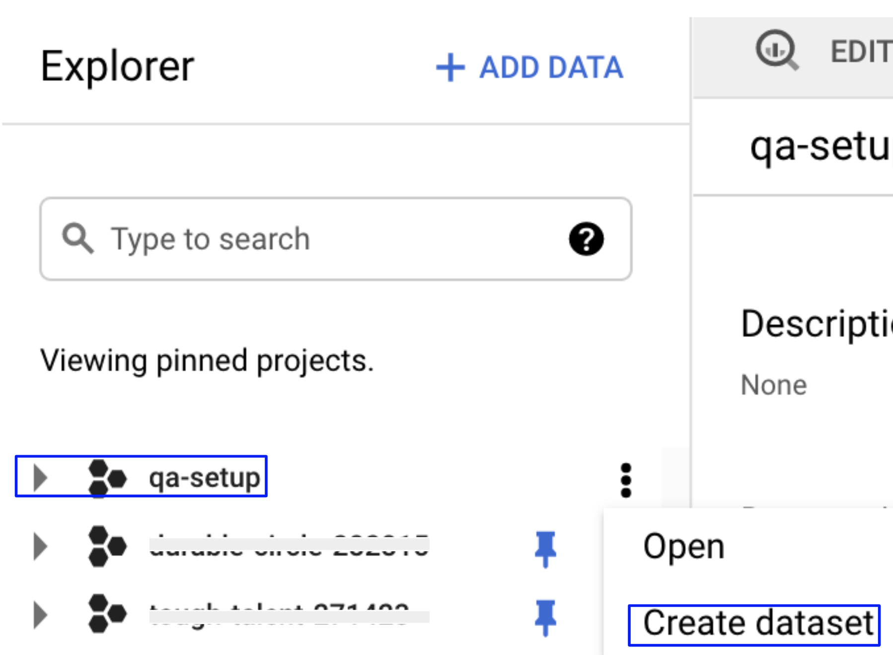
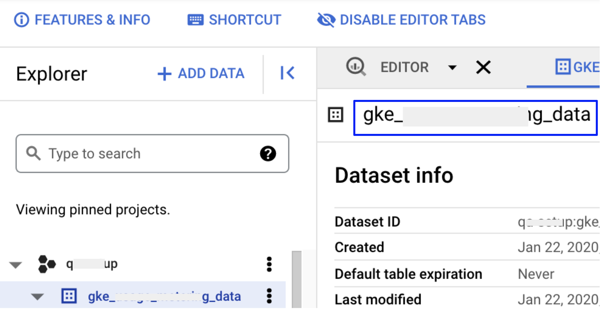
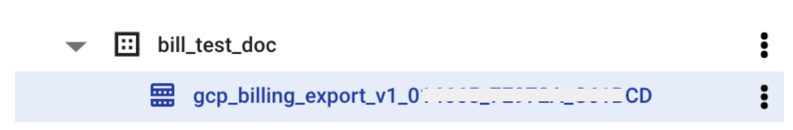
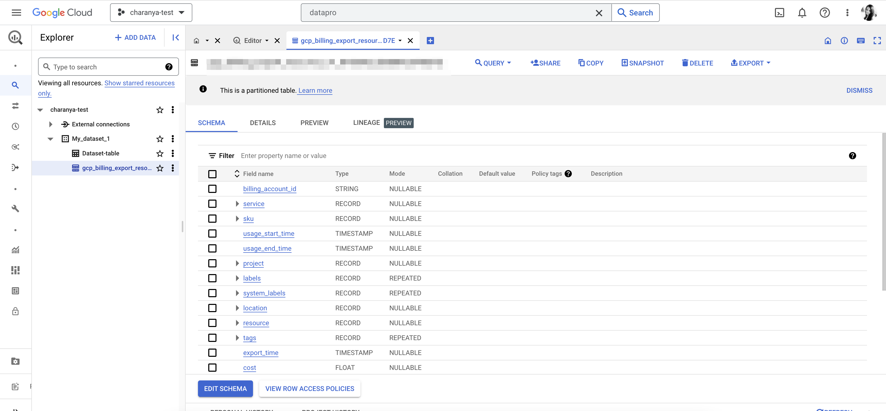
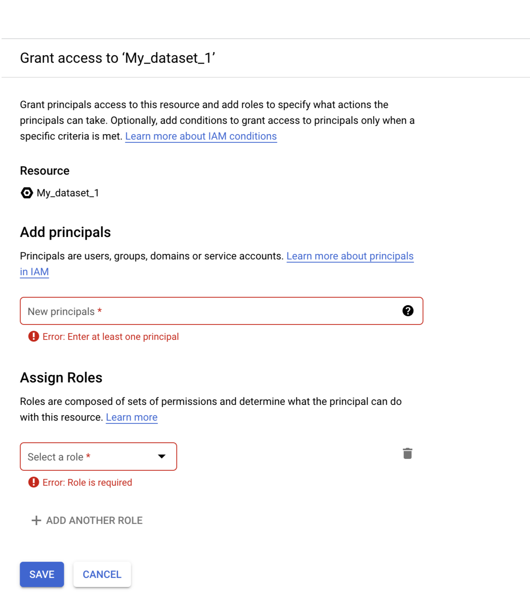
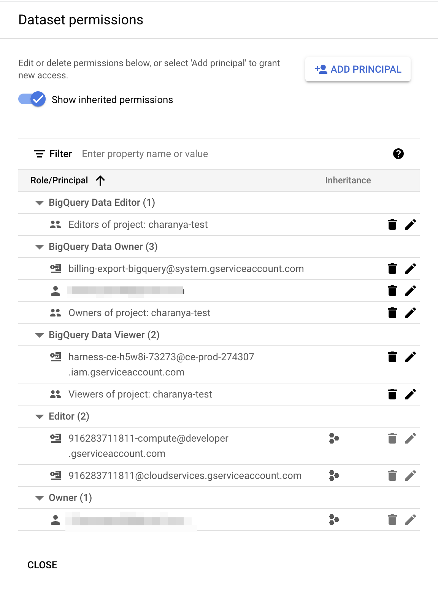
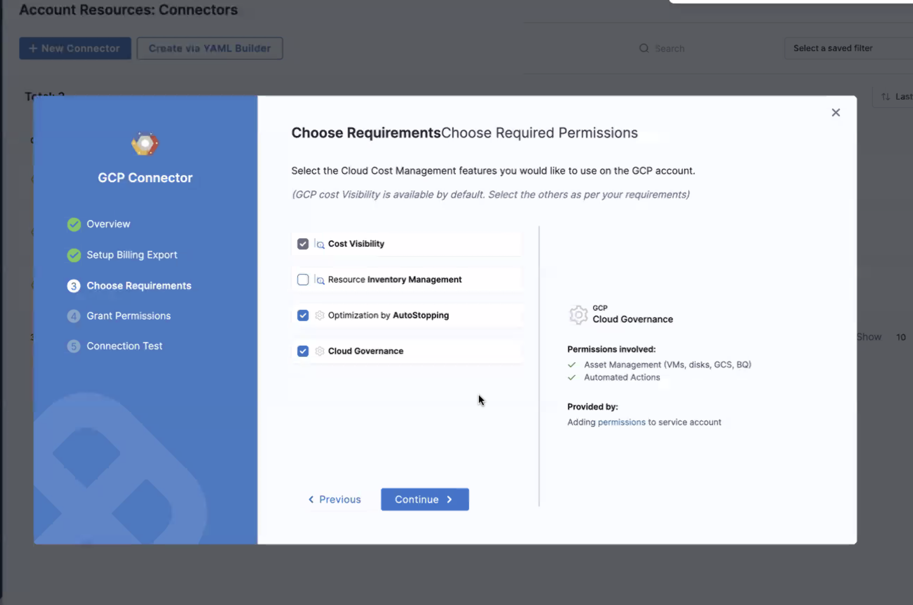
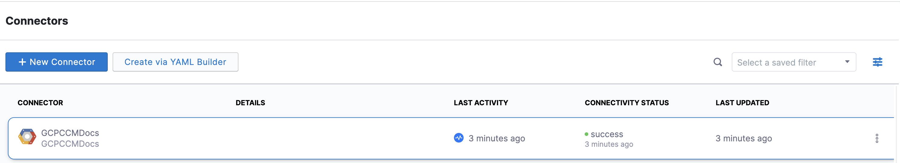
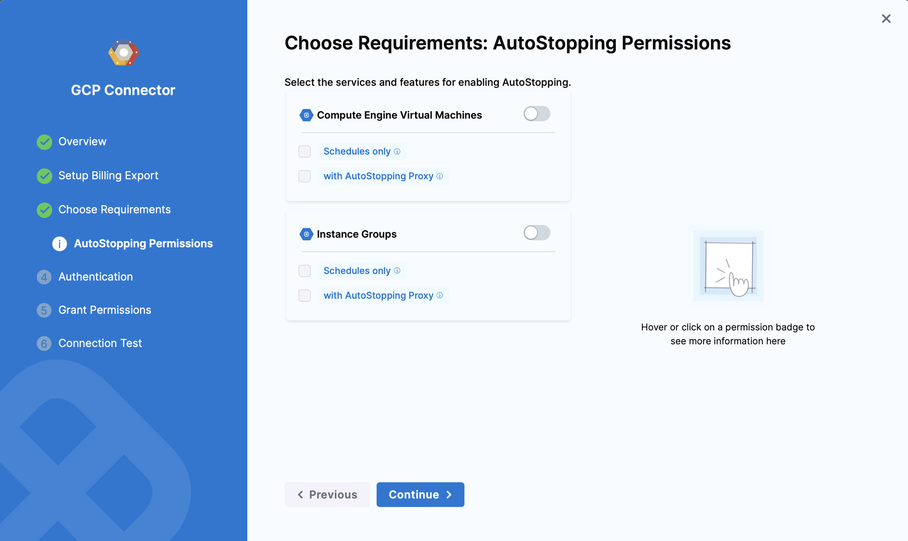

import Tabs from '@theme/Tabs';
import TabItem from '@theme/TabItem';
import RedirectIfStandalone from '@site/src/components/DynamicMarkdownSelector/RedirectIfStandalone';

<RedirectIfStandalone label="GCP" targetPage="/docs/cloud-cost-management/get-started/dynamic-get-started" />

Harness Cloud Cost Management (CCM) monitors the cloud costs of your GCP products, projects, SKUs, and location. As a first step, you need to connect Harness to your GCP account to get insights into your cloud infrastructure, and GCP services, Compute Engine, Cloud Storage, BigQuery, etc. CCM offers a wide range of features to track and control costs associated with your cloud resources.

:::info
After enabling CCM, it takes about 24 hours for the data to be available for viewing and analysis.
:::

## Before you begin

* Review [Required permissions and roles](https://cloud.google.com/iam/docs/understanding-custom-roles#required_permissions_and_roles) to create an IAM role at the organization level
* Ensure that you have the following permissions to enable and configure the export of Google Cloud billing data to a BigQuery dataset:
    + **Billing Account Administrator** role for the target Cloud Billing account
    + [BigQuery User role for the Cloud project](https://cloud.google.com/bigquery/docs/dataset-access-controls) that contains the BigQuery dataset that will be used to store the Cloud Billing data

## Connect Harness to Google Cloud Platform (GCP) Account

Connect Harness to your GCP account to gain access your GCP services, Compute Engine, Cloud Storage, BigQuery, etc. Harness CCM gives you cost insights that are derived from the billing export. For deep Kubernetes visibility and rightsizing recommendations based on the historical utilization and usage metrics, set up Kubernetes connectors. See [Set Up Cloud Cost Management for Kubernetes](/docs/cloud-cost-management/get-started/onboarding-guide/set-up-cost-visibility-for-kubernetes).

:::info

Time periods in the GCP Cloud Billing report use the Pacific Time Zone (PST) and observe daylight saving time shifts. However, Harness CCM explorer uses the UTC time zone. You may notice some cloud cost differences between Harness CCM explorer and the GCP Cloud Billing report due to the time zone difference.

:::

1. Create a new Kubernetes connector using one of the two options below:
<Tabs queryString="tab-number">
<TabItem value="4" label="From Account Settings">

1. Go to **Account Resources** > **Connectors**.
2. Select **+ New Connector**.
3. Under **Cloud Costs**, select **GCP**.

</TabItem>
<TabItem value="5" label="From Cloud Costs">

1. Go to **Setup** > **Cloud Integration**.  
2. Select **New Cluster/Cloud account**.
3. Select **GCP**.

</TabItem>
</Tabs>

2. Perform the following tasks in the **GCP Connector** wizard.

### Overview
1. In **Overview**, in **Connector Name**, enter a name that describes this account.
2. In **Specify Project ID**, enter the project ID and select **Continue**. For more information on how to get a project ID, go to [Create a BigQuery dataset](https://cloud.google.com/billing/docs/how-to/export-data-bigquery-setup#create-bq-dataset).

### GCP Billing Export

Cloud Billing export to BigQuery enables you to export detailed Google Cloud billing data (such as usage and cost estimate data) automatically throughout the day to a BigQuery dataset that you specify.

:::info
Make sure that you have enabled **Detailed Usage Cost** on the **Billing Export** page on your GCP console. For more information, see [ Enable Cloud Billing export to the BigQuery dataset](https://cloud.google.com/billing/docs/how-to/export-data-bigquery-setup#enable-bq-export).
:::

1. In **GCP Billing Export**, select **Launch GCP console**.
2. In the GCP **Explorer** window, in the pinned projects section, select **your project ID** to open the project. If you see an overflow menu (:) next to your project ID, select the menu and select **Open**.
3. Select **Create dataset**. For more information, go to [Create a BigQuery dataset](https://cloud.google.com/billing/docs/how-to/export-data-bigquery-setup#create-bq-dataset).



4. Enter a **Dataset Name**.
You need to enter Dataset Name in Harness.
5. Select a **Data location**.
6. Set the **Default table expiration** to **Never**.
7. Set the **Encryption** option to **Google-managed key**.
8. To save, select **CREATE DATASET**.
9. Enter the **Dataset Name** in Harness.



10. Next, you need to enter the table name in Harness. From the GCP console, copy the table name where the billing export is available. In your BigQuery dataset, the table is named `gcp_billing_export_v1_*`.
11. Once the billing account is selected, open the navigation menu>Billing export>BigQuery export. In BigQuery Export section, user needs to setup "Detailed usage cost". When setting up your dataset, it is recommended to choose the United States (US) as the dataset location.
12. From the Project list, choose the project that contains your BigQuery dataset. You’ll be requested to establish a BigQuery dataset if you don’t already have one. 
13. To create a dataset, if you don’t have one
    - In the Google Cloud Console, go to the Google BigQuery Page.
    - In the Explorer Panel, choose the Project for which you wish to build a dataset.
    - Select +Create Dataset from the drop-down menu.
    - Certain fields, such as Dataset ID, data location, and data expiry, will be required. You will be able to perform billing exports after you have your dataset ready.

   <DocImage path={require('../../get-started/onboarding-guide/static/set-up-cost-visibility-for-gcp-04.png')} width="50%" height="50%" title="Click to view full size image" />
   

12. Enter the **Table Name** in Harness.
13. Select **Continue**.

:::info 
⚠️ GCP Billing Export Table Limitations and CMEK Restrictions
When setting up a connector for GCP Billing Export, keep the following limitations and guidelines in mind:

- GCP does not support copying data across regions if the source table uses CMEK.
- GCP also does not allow copying data from Materialized Views.
- If your organization enforces CMEK policies, consider creating a new dataset without CMEK enabled specifically for the integration.
- It is recommended to create the dataset in the US region, as it offers the most compatibility with GCP billing export operations.
- Use datasets with default (Google-managed) encryption when configuring the connector.

:::

### Choose Requirements

Select the Cloud Cost Management features that you would like to use on your GCP account.

CCM offers the following features:

| Features  | Capabilities | 
| --- | --- | 
| **Cost Visibility** (Required)| This feature is available by default. Make sure you have set up the GCP Billing Export. Provides the following capabilities:<ul><li>Insights into GCP costs by projects, products, etc.</li><li>Root cost analysis using cost perspectives </li><li>Cost anomaly detection</li><li>Governance using budgets and forecasts</li><li>Alert users using Email and Slack notification</li></ul>|
| **GCP Inventory Management** (Optional)| This feature provides visibility into your GCE VMs and unused disks and snapshots. The insights provided by inventory management can be used by Finance teams to understand resource utilization across the board.|
| **GCP optimization using AutoStopping rules** (Required for AutoStopping Rules)| This feature allows you to enable Intelligent Cloud AutoStopping for your GCP cloud resources. If selected, you can select [granular permissions in the next step](/docs/cloud-cost-management/get-started/onboarding-guide/set-up-cost-visibility-for-gcp#granular-permissions-for-autostoppingg)|
| **Cloud Governance** (Optional)              | This feature allows you to optimize your cloud spend and avoid unnecessary costs by rightsizing resources and decommissioning unused instances. For more information, see [Asset governance](../../5-use-ccm-cost-governance/asset-governance/1-asset-governance.md). <ul><li> Asset Management (Instance, Disk, SQL-instance, Image) </li><li>Automated Actions</li></ul>     

Make your selection and select **Continue**.

### Grant Permissions

Cloud Billing Export to BigQuery helps you export detailed Google Cloud billing data (such as usage and cost estimate data) to a BigQuery dataset that you specify. The export happens throughout the day automatically. 

1. In **Grant permissions**, select **Open BigQuery Page**.
2. Log into the GCP console and go to the BigQuery page.
3. Select your project in the left panel.
4. Select your dataset. For more information on creating a dataset, see [Creating datasets](https://cloud.google.com/bigquery/docs/datasets).



5. Select the **more actions** icon (three vertical dots) against the dataset, and then select **Share.**


6. In **Dataset permissions**, in **Add Principals**, enter the Harness service account as a member.  
    Copy the service account detail from Harness. The service account is generated dynamically for your account.



7. In **Select a role**, select **BigQuery Data Viewer**, and then select **Add**.
8. Select **Done**.  
    When you are done, the following screen is displayed:



:::info

To add AutoStopping permissions:

1. Navigate to the IAM & Admin page on the GCP console.
2. Click **IAM** on the right pane.
3. Click **Add** in the PERMISSION tab.
4. In the **Add Principals to [Project name]** window, enter the service principal.
5. Select the required roles and click **Save**.

When a connector is created, a service account is created in Harness' GCP project that is unique for each customer. This service account is created only once per customer. You need to assign two roles to this service account in the GCP project that they are connecting to Harness CCM:

* **Compute Admin** - Assign this role to Harness' service account. This allows Harness CCM to be able to perform AutoStopping actions such as starting and stopping of VMs and Instance groups. Also, GCP AutoStopping involves the usage of a custom VM with configurations as per your preference (instance type configuration). This requires access to create and launch a VM in which a custom load balancer for AutoStopping is installed.
* **Secret Manager Secret Accessor** - Assign this role if you intend to use TLS/HTTPS in the routing configurations of the AutoStopping Rule. You need to upload the certificate's private key and the public certificate as secrets in GCP. Harness needs access to these secrets to be able to configure the custom load balancer. This role provides access to only the particular versions of the secrets, provided the complete path is entered during the creation of the custom load balancer. It does not let Harness view or list all the secrets in your GCP project. You can also add additional protection in the GCP on your end to provide conditional access to secrets as necessary. For example, provide access to Harness' service account to versions of only those secrets with a naming convention like "Harness-".
:::

9. Select **Continue** in Harness.

### Cloud asset governance rules

:::info

Now, Harness CCM supports CAG for GCP.



Regions for Asset Governance Rules for GCP are not available in drop-down menu but can be configured manually in the YAML.

:::

### Connection Test

The connection is validated and verified in this step. After successfully testing the connection, select **Finish**.


Your connector is now listed in the **Connectors**.




## Granular Permissions for AutoStopping



#### Compute Engine Virtual Machines

<details>
<summary><b>Schedules only</b></summary>

```
// List VMs
compute.instances.list

// Tag VM
compute.instances.setLabels

// Get region information to list zones
compute.regions.get

// List regions
compute.regions.list

// Required while waiting to complete VM operations, for example stop operation
compute.zoneOperations.get

// Stop VM
compute.instances.stop

// Start VM
compute.instances.start
```

</details>

<details>
<summary><b>with AutoStopping Proxy</b></summary>

```
// List networks
compute.networks.list

// List machine types
compute.machineTypes.list

// List subnets
compute.subnetworks.list

// List security groups
compute.firewalls.list

// Create address
compute.addresses.create

// Get address
compute.addresses.get

// create disk
compute.disks.create

// Use sub network
compute.subnetworks.use

// Create proxy VM
compute.instances.create

// use static IP
compute.subnetworks.useExternalIp

// Use address
compute.addresses.use

// Set VM metadata
compute.instances.setMetadata

// Set tags
compute.instances.setTags

// Delete address
compute.addresses.delete

// Delete proxy VM
compute.instances.delete
```

</details>

#### Instance Groups

<details>
<summary><b>Schedules only</b></summary>

```
// Get region information to list zones
compute.regions.get

// List regions
compute.regions.list

// list instance groups
compute.instanceGroups.list

// list managed instance groups
compute.instanceGroupManagers.list

// get instance groups details
compute.instanceGroups.get

// Get instances in instance groups
compute.instances.get

// List autoscalers
compute.autoscalers.list

// Get autoscaler details
compute.autoscalers.get

// For updating autoscaler configurations. This is needed during warm up and cool down
compute.autoscalers.update

// List VMS in instance group
compute.instances.list

// Deleting VMs from managed instance groups during cool down
compute.instances.delete

// Get status of operations
compute.globalOperations.get

// Get status of operations
compute.regionOperations.get

// Get status of operations
compute.zoneOperations.get
```

</details>

<details>
<summary><b>with AutoStopping Proxy</b></summary>

```
// List networks
compute.networks.list

// List machine types
compute.machineTypes.list

// List subnets
compute.subnetworks.list

// List security groups
compute.firewalls.list

// Create address
compute.addresses.create

// Get address
compute.addresses.get

// create disk
compute.disks.create

// Use sub network
compute.subnetworks.use

// Create proxy VM
compute.instances.create

// use static IP
compute.subnetworks.useExternalIp

// Use address
compute.addresses.use

// Set VM metadata
compute.instances.setMetadata

// Set tags
compute.instances.setTags

// Delete address
compute.addresses.delete

// Delete proxy VM
compute.instances.delete
```

</details>

### Next Steps
* [Analyze Cost for GCP ​Using Perspectives](/docs/cloud-cost-management/use-ccm-cost-reporting/root-cost-analysis/analyze-cost-for-gcp-using-perspectives)
* [Create Cost Perspectives](/docs/cloud-cost-management/use-ccm-cost-reporting/ccm-perspectives/create-cost-perspectives)
