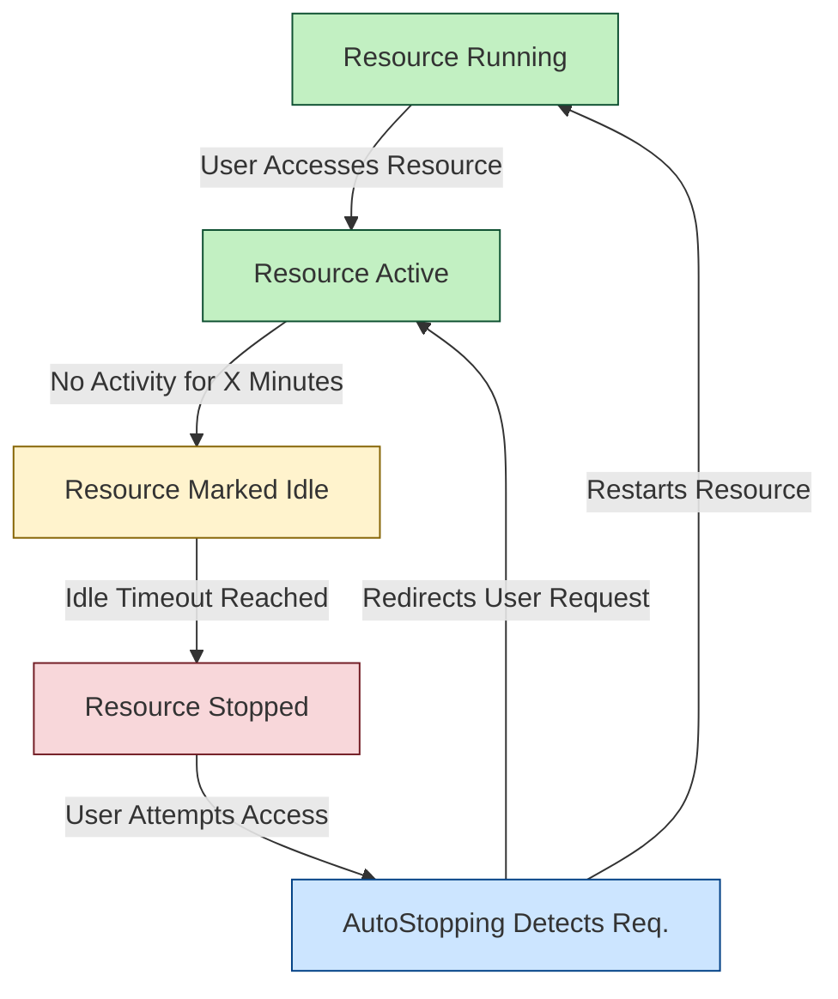

import Tabs from '@theme/Tabs';

import TabItem from '@theme/TabItem';

:::tip [Latest Features Released in 1.47.0](/release-notes/cloud-cost-management#april-2025---version-1470)
<Tabs>
  <TabItem value="Granular permissions support for AWS Autostopping">We have introduced Granular permissions support for AWS Autostopping. With this update, users can now select the specific AWS resource types they want to enable for Autostopping such as EC2, ASG, or RDS. Based on the selected resource types, only the minimal required set of permissions will be requested.  </TabItem>
</Tabs>
:::

<DocVideo src="https://youtu.be/lNf_P5sHTcE" />

## What Are AutoStopping Rules?

**AutoStopping Rules** are intelligent orchestrators that automatically manage your non-production cloud resources. They:

- **Automatically shut down** idle resources when not in use
- **Seamlessly restart** them when needed
- Allow you to run workloads on **spot instances** without interruption concerns
- Maintain **normal access methods** (DNS, SSH, RDP) even after resources are stopped

## Why Use AutoStopping Rules?

Cloud resources in non-production environments (dev, test, staging) are typically used for only 30-40% of the time they're running, yet you pay for 100% of that time. AutoStopping ensures you're only **paying for resources when they're actually in use**.

AutoStopping Rules deliver significant benefits:

- **Real savings**: Cut cloud bills by over 70% for non-production environments
- **Set-and-forget automation**: Zero manual overhead after initial setup
- **No more forgotten VMs**: Enforces policies so idle resources don't keep burning money
- **Easy integration** with Terraform or existing provisioning workflows
- **Access preserved**: Continue using DNS links, SSH, RDP — even after resources restart

| Common Challenges | AutoStopping Solution |
|-------------------|------------------------|
| Manually predicting idle time is inaccurate and inefficient | Intelligent detection of actual usage patterns |
| Forceful shutdowns make machines inaccessible | Transparent access even after shutdown |
| Basic start/stop automation doesn't optimize cloud spend | Full orchestration with dependency management |
| Forgotten resources continue to run and cost money | Automatic enforcement of idle policies |

## Where Can You Use AutoStopping Rules?

| Cloud Provider | Supported Resources |
|----------------|---------------------|
| **AWS**        | EC2, Auto Scaling Groups, Kubernetes (EKS), ECS Services, RDS Instances |
| **Azure**      | On-demand VMs, Kubernetes Clusters (AKS)  |
| **GCP**        | GCE VMs, Kubernetes Clusters (GKE), Instance Groups |

> **Note:**  
> - There's **no limit** on the number of dependencies a rule can manage.  
> - **RDS warm-up time** depends on cluster/instance size (~25 minutes).  
> - Other resources warm up in under 2 minutes (max 5 minutes).

## How AutoStopping Works

The AutoStopping process works in four key steps:

1. **Intelligent Detection**: AutoStopping continuously monitors your resources for activity
2. **Automatic Shutdown**: After a configurable idle period, resources are automatically stopped
3. **Seamless Restart**: When access is requested, resources are automatically restarted
4. **Transparent Access**: Users continue to use the same access methods they always have (DNS, SSH, RDP)

## Ready to Get Started?

Follow our [Getting Started Guide](./getting-started.md) to set up AutoStopping in your environment in three simple steps.
