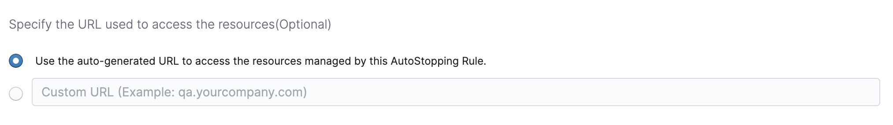
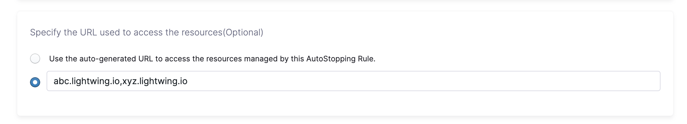

import Tabs from '@theme/Tabs';
import TabItem from '@theme/TabItem';

AutoStopping Rules are configured for the ECS services. You need to create an AutoStopping Rule for each ECS service. There is a one-to-one mapping between the AutoStopping rule and the ECS service. When AutoStopping is configured for a specific ECS service, AutoStopping Rules monitor the traffic coming into this ECS service and start or stop the ECS tasks based on the traffic and idleness.

:::note
The current version of AutoStopping Rules orchestrates the ECS tasks. For the auto scaling groups (ASGs) based ECS clusters, you need a separate setup. However, Fargate clusters do not require any additional setup because the cloud provider charges per task that are running in the cluster.
:::

## Prerequisites

- [AWS Connector](/docs/cloud-cost-management/get-started/onboarding-guide/set-up-cost-visibility-for-aws)
- ECS running on EC2 nodes or Fargate
- AWS [Proxy](/docs/cloud-cost-management/use-ccm-cost-optimization/optimize-cloud-costs-with-intelligent-cloud-auto-stopping-rules/autostopping-for-aws/autostopping-proxy) or [Load Balancer](/docs/cloud-cost-management/use-ccm-cost-optimization/optimize-cloud-costs-with-intelligent-cloud-auto-stopping-rules/autostopping-for-aws/load-balancer)

### Required Permissions
- Access to AWS Cost and Usage Reports (CUR)
- Permissions to create cross-account IAM roles
- For proxy-based setup: permissions to create VMs and read secrets in your AWS account
- Permissions to create a cross-account role.
- Permissions for AWS ECS and Resource Inventory Management.
- Permissions for AWS Resource Optimization Using AutoStopping Rules. 

:::note
AutoStopping rules based on ECS can only use the ALB associated with the ECS service. When creating a new AutoStopping rule, you can select the ALB.

Once configured, AutoStopping will monitor network traffic for ALB in order to keep ECS tasks running. When ALB receives no traffic, it is considered idle and ECS tasks are scaled down.
:::

## Creating an AutoStopping Rule for ECS

1. In Harness, navigate to **Cloud Costs** module -> **AutoStopping Rules**
2. Click **New AutoStopping Rule**
3. Select **AWS** as your cloud provider. Choose an existing AWS connector or click **New Connector** to [create one](/docs/cloud-cost-management/get-started/onboarding-guide/set-up-cost-visibility-for-aws). 

After this, there are 3 simple steps to set up your AutoStopping rule:

<Tabs>
<TabItem value="configuration" label="Step 1: Configuration">

1. Enter a **Name** for your rule
2. Set the **Idle Time** - how long an instance should be inactive before stopping
3. In the **Resources to be managed by the AutoStopping rules** section, select "ECS Service". 
4. Click on **Add an ECS Service**. In **Select ECS Service**, select one of the following options:
   * ECS Service Name: If you chose **ECS Service Name**, select a region and a cluster to see all of their services:
      - Select the region where your cluster is hosted from the **Select Region** dropdown list.
      - Select your cluster from the **Select Cluster** dropdown list.
      - Select the ECS Service where you want to enable the AutoStopping Rule. 
      - Click **Add Selected**.
   
   * ECS Service Tags: If you chose **ECS Service Tags**, select the region, cluster, and the tag associated with the service. Once you create a rule using this option, the rule is applied automatically to the most recently created ECS service using the tag. 
      - Select the region where your cluster is hosted from the **Select Region** dropdown list.
      - Select your cluster from the **Select Cluster** dropdown list.
      - Select the tag key and the tag value from the dropdown lists. If you want to learn how to add tags to your service, go to [Tagging your Amazon ECS Resources](https://docs.aws.amazon.com/AmazonECS/latest/developerguide/ecs-using-tags.html).

6. Specify Desired Task Count: In **Desired Task Count**, specify the desired task count for the selected ECS service. This is the number of tasks that Harness will instantiate when your service is up and running. For more information, see [Amazon ECS service quotas](https://docs.aws.amazon.com/AmazonECS/latest/developerguide/service-quotas.html).

7.  Set up Advanced Configuration: 
    - Hide Progress Page: This is especially useful when the service is invoked by an automation system, as it prevents misinterpretation of the progress page as the intended response from a service that is onboarded to AutoStopping.
    - Dry-Run: Toggle the button if you wish to evaluate this feature without terminating your cloud resources. For more information, go to Evaluate AutoStopping rules in dry-run mode.
    - Dependencies: Link your rule to other AutoStopping rules when resources depend on each other.
    - Fixed Schedules: Create fixed schedules to automatically start or stop your instances at specific times. 

Click to expand advanced configuration details

## (Optional) Set up advanced configuration

In this step, you can configure the following settings:

### Hide progress page

Toggle the button to disable the display of progress page during instances' warming up process. This option is especially useful when the service is invoked by an automation system, as it prevents misinterpretation of the progress page as the intended response from a service that is onboarded to AutoStopping. By hiding the progress page, the first response of warming up a rule after a downtime will be delayed until the intended service is up and running.

### Dry Run

Toggle the button if you wish to evaluate this feature without terminating your cloud resources. 

### Add Dependency

Set dependencies between two or more AutoStopping Rules when you want one Rule to make one or more Rules to be active based on the traffic that it receives. For example for an application server dependent on a database server, create two AutoStopping Rules managing both the servers. Add a dependency on the Rule managing the application server to be dependent on the Rule managing the database server.

1. Click **add dependency** to add a dependency on any existing rule.
2. Select the rule from the **RULES** drop-down list.
3. In **DELAY IN SECS**, enter the number of seconds that rule should wait after warming up the dependent rule. For example, you have Rule 1 dependent on Rule 2 and you have set 5 seconds delay. In that case, when the request is received to warm up Rule 1, then first Rule 2 (dependent rule) is warmed up, and then there is a delay of 5 seconds before warming up Rule 1.
4. Once you're done with all the configurations, click **Next**.

### Fixed Schedule

Create fixed uptime or downtime schedules for the resources managed by this AutoStopping Rule. When a resource is configured to go up or down on a fixed schedule, it is unaffected by activity or idleness during that time period.

In certain scenarios, you would not want your resources to go down or up. For example, every Friday at 5 p.m. you want your `ABC` resource to go down. You can schedule downtime for your `ABC` resource. During this window, the resource is forced to go down regardless of the defined rule. You can choose to specify uptime for your resources in the same way.

:::note
The fixed schedule takes precedence over the defined AutoStopping Rule.
:::

:::note
Harness executes scheduled rules using [Dkron](https://dkron.io/), an open-source workload automation service.
:::

To create a fixed schedule for your rule, do the following:

1. In **Fixed Schedules**, click **Add Fixed Schedule**.
2. In **New Fixed Schedule**, enter a **Name** for your schedule.
3. In **Type**, select the type for your schedule. You can schedule an **Uptime** or **Downtime** for your rule. As per your schedule, the resources go up or down.
4. Select the **Time Zone** from the drop-down list.
5. In **Set schedule period**, use the date picker to set the start and end time for your schedule.
    1. In **Begins on**, select the start date and time for your schedule. You can select a date and specify the time.
    2. In **Ends on**, select the end date and time for your schedule. You can select a date and specify the time. Ensure that **Never ends** checkbox is unselected to set the end time.  
      
      If you don't specify an end time, the schedule continues to run until you manually update the settings or remove the schedule.
6. Select the checbox **Never ends** if you do not want to set end time for your schedule.
7. You can also set a recurring schedule for the rule. If you want to set a recurring schedule, in **Uptime/Downtime in the selected period**, in **Repeats**, select the repeat frequency.
    1. Select which days of the week you'd like your schedule to repeat. You can choose any day between Sunday and Saturday.
    2. Select **Everyday**, to set the schedule for all seven days of the week.
    3. Set your repeat schedule's beginning and ending time. In the **Time** field, specify the start and end time for the fixed schedule.
    4. Select **All Day**, if you wish to set your schedule for the entire day. If you choose All Day for your schedule, you won't be able to choose a start and end time.  

</TabItem>
<TabItem value="access" label="Step 2: Setup Access">

:::note
You can skip this step if you are creating an AutoStopping Rule for an ECS Service that does not have a load balancer associated with it.  
:::

A DNS link allows you to access the resources managed by the AutoStopping rule using an HTTP or HTTPS URL. To create a DNS Link, you need to:

* **Select a Load Balancer**: The rule requires a load balancer to detect traffic and shut down appropriate instances. Multiple instances and rules can use a single load balancer. It identifies instances based on hostnames and directs the HTTP traffic appropriately.
* **Select the URL Used to Access the Resources**: You can use either of the following methods:
    + **Auto-generated URL**: You can use the auto-generated URL to access the resources managed by this AutoStopping Rule.
    + **Custom URL**: If using a custom URL:
        - The domain name should be entered without prefixing the scheme.
        - A rule can have multiple URLs.
        - You can enter comma-separated values into a custom URL to support multiple URLs.
        - AutoStopping rule can also use an additional custom domain. In such a case, it should be configured in the DNS provider.

#### Select a Load Balancer

Select the load balancer from the drop-down list. The associated load balancer with your ECS service is listed.
   
     

#### Select the URL for Accessing the Resources

You can use either of the following methods:

* Auto-generated URL
* Custom URL

**Auto-generated URL**

Every AutoStopping rule will have an auto-generated URL. This URL will be a subdomain to the domain name specified for the [load balancer](/docs/cloud-cost-management/use-ccm-cost-optimization/optimize-cloud-costs-with-intelligent-cloud-auto-stopping-rules/autostopping-for-aws/load-balancer). Since the load balancer configures a wildcard domain such as `*.autostopping.yourcompany.com`, the auto-generated URL will work automatically and point to the correct load balancer.

Select **Use the auto-generated URL to access the resources managed by this AutoStopping Rule**.

**Custom URL**

AutoStopping rule can use multiple custom domains. In such a case, it should be configured in the DNS provider. AutoStopping Rules also allows you to use custom domains or change the root of your site's URL from the default, like,`autostop.harness.io`, to any domain you own. To point your site's default domain to a custom domain, you can set it up in your DNS provider.

Enter the custom URL currently used to access the instances. The domain name should be entered without prefixing the scheme. A rule can have multiple URLs. You can enter comma-separated values into a custom URL to support multiple URLs.

</TabItem>
<TabItem value="review" label="Step 3: Review">

In Review, verify all the configuration details and click **Save Rule**. To edit any of the configuration settings, click **EDIT** and modify the settings.

Your AutoStopping rule is listed under the AutoStopping Rules dashboard.

</TabItem>
</Tabs>

