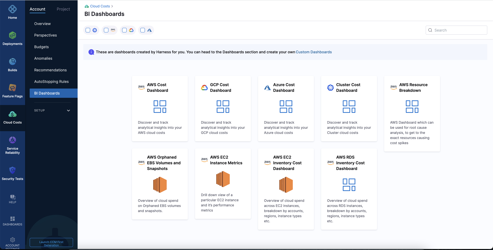
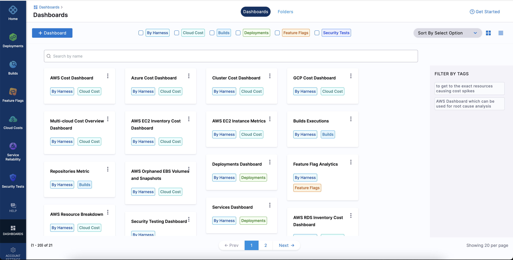

Dashboards are a collection of charts and data tables with filters that you can use to get at the data you are interested. Dashboards serve as a platform for data modeling and analytics using a combination of available business metrics and operational data. You can use this data to make data-driven, informed business decisions.

:::note
For information on core Dashboard functionality, go to [Create Dashboards](https://docs.harness.io/article/ardf4nbvcy-create-dashboards).
:::

:::warning Important

We have deprecated the Dimensions Current CPU/Memory Avg(%), Current CPU/Memory Max(%), Current CPU/Memory Min(%) and introduced new Measures Average CPU Utilization (%), Minimum CPU Utilization (%), Maximum CPU Utilization (%), Average memory utilization percentage, Maximum memory utilization percentage, Minimum memory utilization percentage in Azure VM Inventory metrics.
:::

Harness provides pre-loaded **By Harness** (pre-defined) and **Custom** (user-defined) dashboards to visualize cloud cost data across clusters and cloud accounts.

## Access the CCM dashboards

To access the dashboards from the CCM module, perform the following steps:

1. In the **Harness** application, click **Cloud Costs**.
2. Click **BI Dashboards**. 

     

3. Select the cloud provider to view the dashboards available for the specific cloud provider.
4. Click the required tile.

    The **Dashboards** page opens. 

To access the dashboards outside the CCM module, perform the following steps:

1. In the **Harness** application, click **Dashboards**. 

       

2. Select **By Harness** or **Cloud Cost** to filter the list.
3. Click the required tile to view the corresponding dashboard.

:::important note
The data scan limit is 350 GB per query. Users can avoid hitting this limit by applying necessary filters to reduce the result-set as per their requirements.
:::

## See also
* [Use Dashboard Actions](../../../platform/dashboards/use-dashboard-actions.md)
