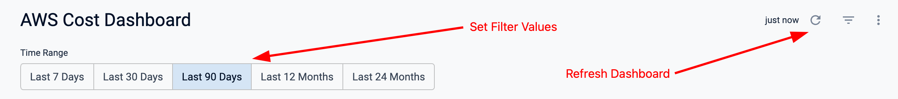

Once you have a Harness dashboard created with one or more tiles, you can grab an export of the data using the Harness API.

# Authentication

You will need an [API Key](https://developer.harness.io/docs/platform/automation/api/add-and-manage-api-keys/) to retrive your exports.

To set your key on requests, add the header `x-api-key: <your key here>` to the request.

# Dashboard Parameters

You will need the numerical dashboard ID and filter values for the API request.

## Filters

If your dashboard has filters at the dashboard level and you need to download the data when using specific values, you can grab these filter values from the UI.

Navigate to your dashboard and set the filters accordingly and refresh the dashboard.mv 



Then in the URL bar of your browser, copy the `filters` query parameter.

For example, if you URL is the following:

`https://app.harness.io/ng/account/wlgELJ0TTre5aZhzpt8gVA/dashboards/folder/shared/view/607?filters=%22Time%2BRange%3D90%22`

You would copy `filters=%22Time%2BRange%3D90%22`.

## Dashboard ID

When viewing your dashboard you can extract the dashboard ID from the URL after the `view/` path parameter.

For example, if you URL is the following:

`https://app.harness.io/ng/account/wlgELJ0TTre5aZhzpt8gVA/dashboards/folder/shared/view/607?filters=%22Time%2BRange%3D90%22`

You would copy `607`.

# Usage

Details on this API call are documented in our [API spec](https://apidocs.harness.io/tag/dashboards#operation/get_dashboard_download_csv).

You will need the following parameter values:

- Harness Account ID
- Harness API Key
- Dashboard ID
- Filters Value

## Example

```
curl -i -X GET \
  -H 'x-api-key: <Harness API Key>' \
  'https://app.harness.io/dashboard/download/dashboards/<Dashboard ID>/csv?accountId=<Harness Account ID>&filters=<Filters Value>&expanded_tables=true' \
  -o dashboard_output.zip
```

You will want to include `expanded_tables` when your data is over 5000 rows, which is the default limit for looker tables.

The result will be a zip file called `dashboard_output.zip` which you can unzip and retrive a CSV of each tile in your dashboard.