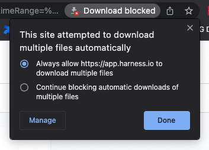

You can export your Perspectives reports as comma-separated values (CSV) files. Exporting allows you to use the data in other software.

## Limitations

* Only comma-separated values files (CSV) are supported.
* The maximum number of rows allowed in one export is 10,000 rows. If you have more rows, you can export separate CSV files using the **Export rows up to** option.
* The more rows you export, the slower the export will be.

## Create a Perspective Export

1. Open a Perspective.

    Below the **Group By** graph, you can see the **Export CSV** option.

  
2. Click **Export CSV**.

3. Enter a name for the CSV file.

4. In **Export rows up to**, enter the number of rows you want exported. The number of rows should be greater than or equal to 1.

### Option: Exclude rows with cost below

Use **Exclude rows with cost below** to set a cost ceiling on the cost data exported.

The amount must be a number. You cannot use symbols or punctuation.

### Export the CSV

Click **Download**. 

Depending on your browser, you might be prompted to allow downloads.

 

The file is downloaded to your local computer.

