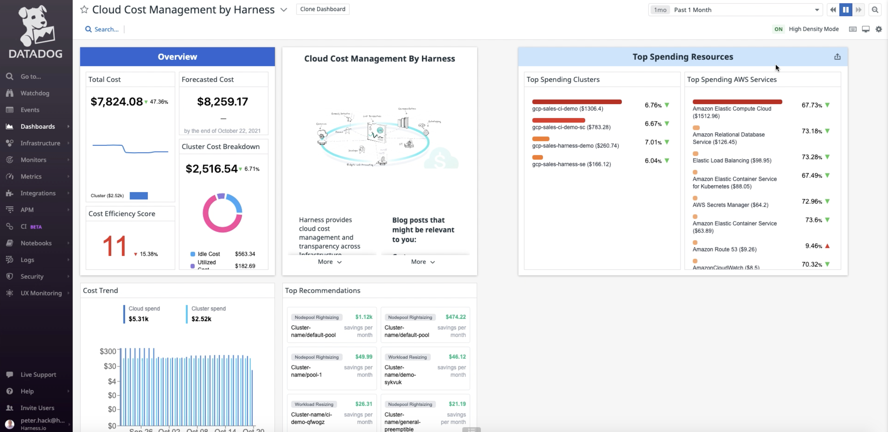

This topic talks about Harness Cloud Cost Management (CCM) integration with Datadog.

## Blog Post

The following blog post talks about the inclusion of Harness CCM with Datadog:

* [Datadog & Harness: Bringing Observability & Monitoring To Cloud Costs](https://harness.io/blog/datadog-harness-observability-cloud-costs/)

## Why Integrate?

Datadog users can get visibility into their cloud spend right in their monitoring tool.

Using the Harness Cloud Cost Management UI extension within Datadog is an easy way for teams to monitor cloud costs alongside the key metrics for their cloud services. 

The following widgets are included from the Harness dashboard: 

* Total Cloud Cost
* Forecasted Cloud Cost
* Cluster Cost Breakdown
* Cost Efficiency Score
* Cost Trend
* Top Recommendations
* Top Spending Clusters
* Top Spending Cloud Services

For more information on how to integrate Harness CCM with Datadog, see [Integrations: Harness Cloud Cost Management](https://docs.datadoghq.com/integrations/harness_cloud_cost_management/#pagetitle).

