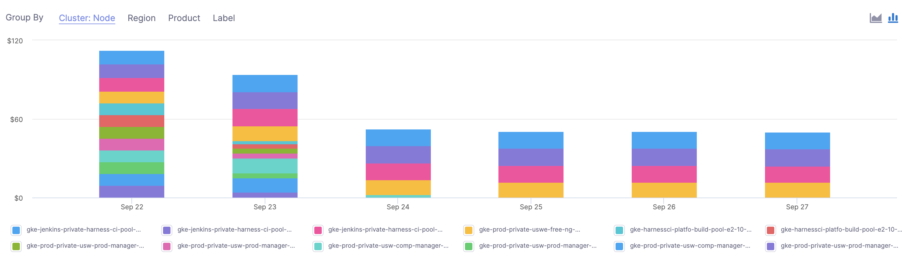
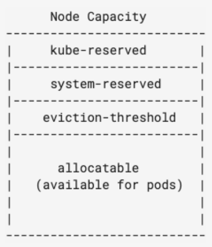
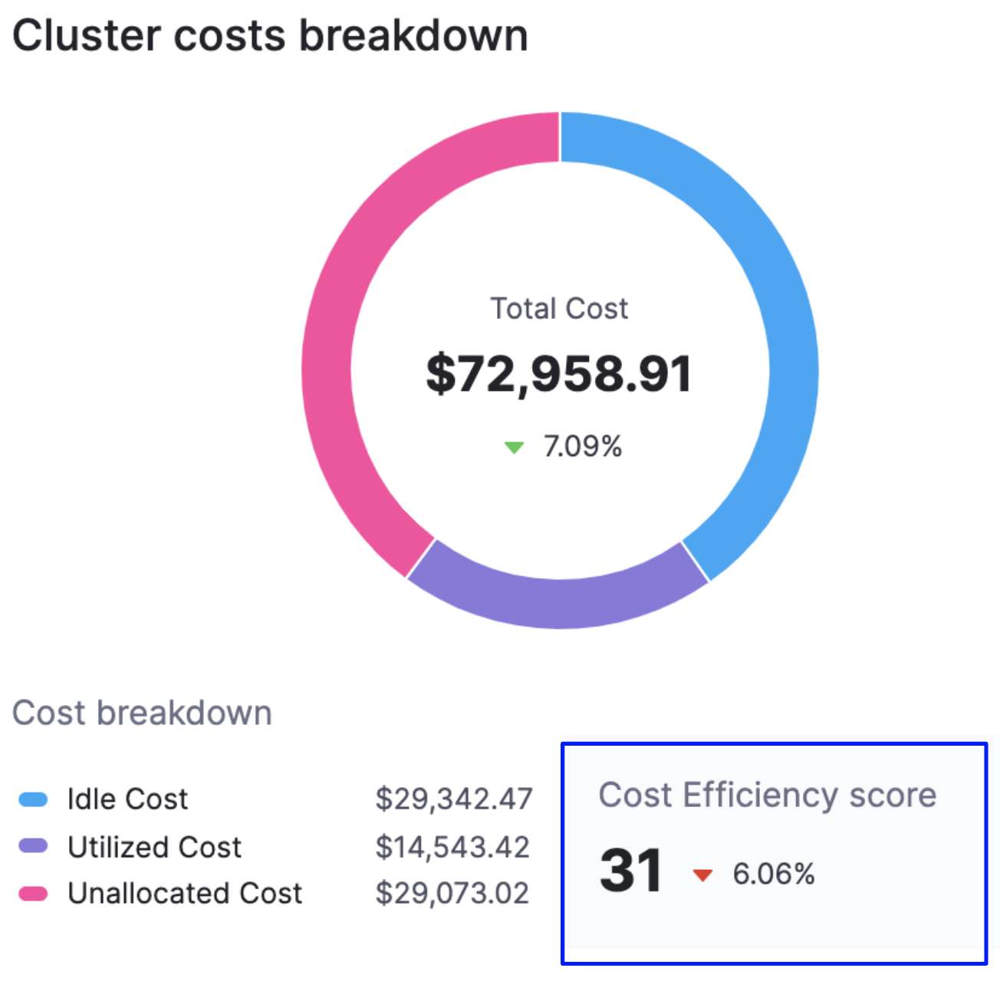

This section explains the key Harness Cloud Cost Management (CCM) concepts that you need to know before implementation.


### Node Cost

Node cost is calculated based on the public pricing API of the cloud platform.


> **☆ NOTE —** For ECS clusters, you can replace nodes with container instances and pods with tasks.

  Here is an example of how node cost is calculated based on the following node specification:




|     |     |
| --- | --- | 
| **Operating system** | Linux |
| **Region** | us-central1 |
| **Instance family** | n1-standard-4 |
| **Instance Category** | ON\_DEMAND |

As per the cloud platform pricing, the per hour price of  n1-standard-4 in us-central1 is $0.1900.

Here is the formula:


```
Cost for 24 hours = 24 * 0.1900 = $4.56.
```
> **☆ NOTE —** Typically nodes are the same size. If they are running for a full day and are the same size, the cost will be the same.

### Pod Cost

Pod cost is a ratio of the cost of the node it is running on. The price is equally distributed among CPU and memory. The following formula is used to calculate the pod cost:


```
Hourly pod cost = ((podCPU/nodeCPU) * nodeCPUPricePerHour) + ((podMemory/nodeMemory)) * nodeMemoryPricePerHour)
```
Here is an example of a pod cost calculation:


```
Pod Resources = (cpuUnits: 1024, memoryMB: 4096)  
Node Resource = (cpuUnits: 4096, memoryMB: 15360) n1-standard-4  
Node Resource = (cpuUnits: 4096, memoryMB: 15360) n1-standard-4  
Pod cost = ((1024/4096)  * 0.095 ) + ((4096/15360)) *  0.095) = 0.0490833333
```
### System Cost

System cost is calculated by subtracting the total cost of the node from the allocatable resource cost.

Allocatable on a Kubernetes node is defined as the amount of compute resources that are available for pods. For more information, see [Reserve Compute Resources for System Daemons](https://kubernetes.io/docs/tasks/administer-cluster/reserve-compute-resources/) in Kubernetes.



Here is the formula:


```
System cost = total cost of node - allocatable resource cost
```
System cost is used while calculating unallocated cost as described below.

### Unallocated Cost

Unallocated cost is applicable to nodes only. There is no concept of unallocated costs for pods. Unallocated cost is the cost of unallocated node resources in a Kubernetes cluster or unallocated container instances in an ECS cluster.


```
Unallocated cost of node = node cost - the cumulative sum of pod costs running on that node - system cost of the node
```

```
Unallocated cost of cluster = sum of the node’s unallocated cost running in the cluster
```
### Idle Cost

Idle cost is the cost of idle resources (CPU and memory) allocated to a Kubernetes pod or an Amazon ECS task but is not utilized.

Here is an example of pod idle cost calculation:


```
Instance cost = 75$, CPU cost = 25$,  Memory cost = 50$  
Avg cpu util = 75%, Avg memory util = 25%  
  
CPU Idle cost = (25) * (1 - .75) = 6.25  
Memory Idle cost = (50) * (1 - .25) = 37.50  
  
Idle Cost= 6.25 + 37.50 = 43.75$ 
```
Node Idle cost = Cost of unutilized resources - unallocated resource

Here is an example of node idle cost calculation:


```
Instance cost = 75$, CPU cost = 25$,  Memory cost = 50$  
Avg cpu util = 75% , Avg memory util = 75%  
CPU Idle cost = (25) * (1 - .75) = 6.25  
Memory Idle cost = (50) * (1 - .75) = 12.5  
  
Unallocated cost of cpu = 2.5$, Memory = 10$  
  
Idle Cost = 6.25 + 12.50 - 2.5 - 10 = 6.25$
```
### Total Cost

For Kubernetes clusters, the total cost is the sum of all the node costs. For ECS clusters, the sum of all container instances.

### Utilized Cost

Utilized cost is the cost estimate for the utilized node or pod resources.


```
Utilized cost = Total cost - node idle cost - unallocated cost
```
### Forecasted Cost

Forecasted costs are predictions based on your historical cost data. The forecasted date is applicable only where historical data exists. If there is insufficient data to compute the forecast, the value is not displayed. The forecasted cost is predicted for the same future time period as your selected date range.

The following table lists some of the examples for forecasted cost calculation. In this example, the current date is considered as **March 30, 2021.**


| **Selected** **Date Range** | **Forecasted Date Range** |
| --- | --- |
| Predefined date range, for example, Last 7 days, Last 30 days, Last month, and so on | Calculated for the next 7 days, next 30 days, or next month based on the selected date range |
| Custom date range, for example, March 25 - 30 (6 days) | March 31 - April 5 (next 6 days) |
| Future date range, for example, March 25 - April 3 (invalid date range) | Not applicable |
| Past date range, for example, March 1 -15 | Not applicable |

### Cost Trend

The cost trend is calculated based on the previous spending. It can be calculated only if the previous data is available. 

### Cost Efficiency Score

A measure of how cost-optimized your resource usage is across your clusters. It is derived from the total and idle (and or unallocated) spend of your resources.

The efficiency score is the deviation of actual utilization from the expected utilization baseline.


```
Expected utilization baseline = utilized resources (100 - x - y)%,   
where  x% is allowed unallocated cost and y% is allowed idle cost
```
Here is an example:


```
Allowed unallocated resources = 5% of the total cost  
  
Allowed idle resources = 30% of the total cost  
  
Utilized resources baseline defined = 65%  
  
If the utilization is 58% of total cost, then the efficiency score =   
[1 - [(65-58)/65]] * 100 ~ [89 efficiency score]
```
