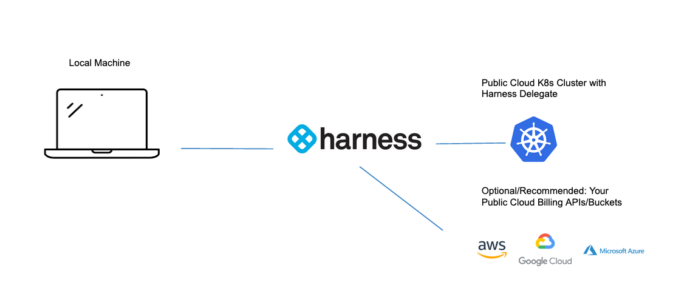
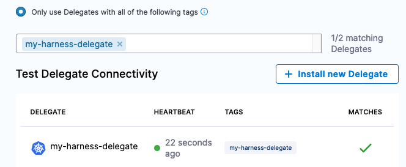
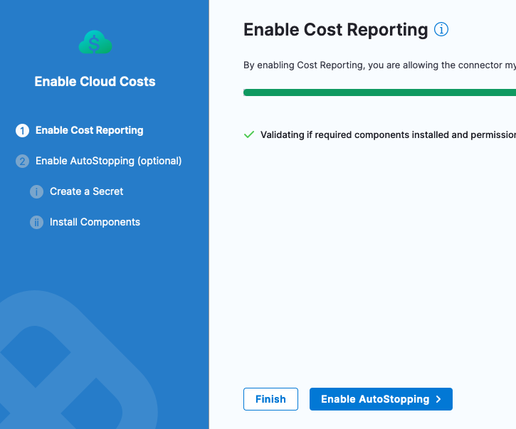
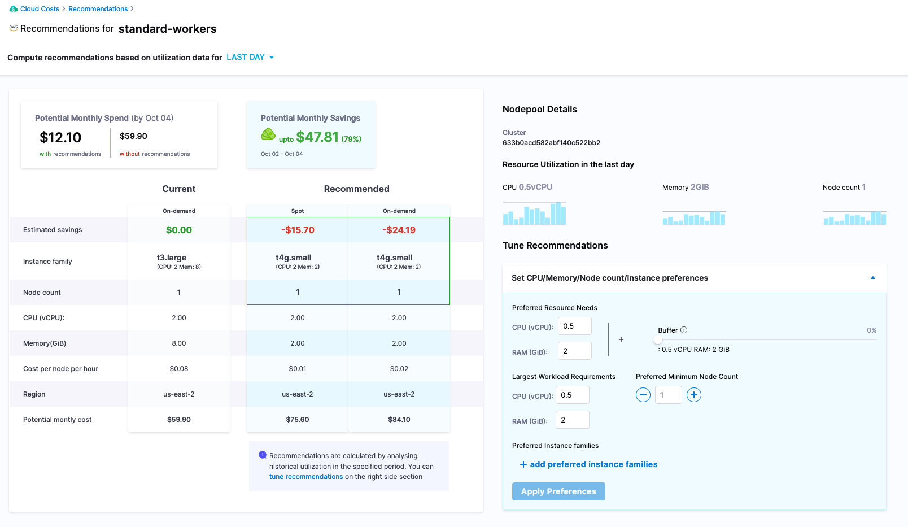

<CTABanner
  buttonText="Learn More"
  title="Continue your learning journey."
  tagline="Take a Cloud Cost Management Certification today!"
  link="/certifications/cloud-cost-management"
  closable={true}
  target="_self"
/>

As engineers, we are natural optimizers. Responding to users in more expeditious and efficient ways are core to optimizations. There are always tradeoffs between architecture and costs. With the rise of public cloud consumption with on the surface "nearly infinite" resources, this unlocks the next generation of distributed architecture. Though this is not without cost. From an engineering perspective, cost/billing data from the public cloud vendors depending on your organization might not be available to you or can take multiple billing cycles to be disseminated.

Resources on the public cloud are certainly not free. Public cloud vendors not only bill for the core infrastructure but also depending on the services leveraged could be billing dimensions for the control/management planes and non-obvious dimensions such as network/data transmissions. When capacity planning for infrastructure, a natural inclination is to err on the side of caution and provision extra capacity in case of a spike.

Optimizing costs focuses on right sizing resource usage to match workload actuals. Coupled with finding more ephemeral infrastructure, such as spot instances, can reduce costs. Monitoring solutions typically monitor for when usage exceeds a certain threshold, but the inverse if usage is under utilized, traditional monitoring solutions might not alert on that. Harness Cloud Cost Management, or CCM, can help unlock insights based on usage in how to optimize costs. This example will connect Kubernetes workload(s) on a public cloud vendor to Harness CCM to start getting cost insights and recommendations.

## Start optimizing your Kubernetes cloud costs

By connecting your public cloud Kubernetes cluster to Harness, you can start to get recommendations on right-sizing the workloads that are running. This example is assuming there are some workloads running in the Kubernetes cluster.

To get actual costing data from your public cloud vendor, it is recommended to [connect your public cloud billing API](https://docs.harness.io/article/80vbt5jv0q-set-up-cost-visibility-for-aws) [usage report, billing export, etc] to Harness CCM. This is not a requirement. Harness CCM will poll usage data from the [Kubernetes Metric Server](https://github.com/kubernetes-sigs/metrics-server) which comes installed by default with GKE and AKS. If using EKS, [installing the Kubernetes Metric Server](https://docs.aws.amazon.com/eks/latest/userguide/metrics-server.html) is needed.

## Prepare your Kubernetes cluster for optimization recommendations

1. If you have not done so already, sign up for a [Harness CCM Account](https://app.harness.io/auth/#/signup/?module=ce&?utm_source=website&utm_medium=harness-developer-hub&utm_campaign=ccm-plg&utm_content=get-started).
1. To start receiving optimizations for your cluster, you need to [install a Harness Delegate in your Kubernetes cluster](/docs/platform/delegates/install-delegates/install-delegate.md). The Harness Delegate is the Harness worker node.

## Connect Harness CCM to your cluster

With the Harness Delegate running, the next step is to create a Cloud Integration that represents your Kubernetes cluster.

1. In Harness, go to **Cloud Costs**, select **Setup**, select **Cloud Integration**, and then select **New Cluster/Cloud Account**.

2. Select Kubernetes.

   

3. Configure the Kubernetes Cluster connector:

   * Name: `my_kubernetes_cluster`
   * Details settings: Select **Connect through Harness Delegate** and select the Harness Delegate you installed in your cluster.

   

4. Select **Save and Continue** to run the connection test and validate connectivity. With the Kubernetes cluster wired in, you can enable the wirings for the reporting.

## Enable Cloud Costs

Under **Features Enabled** column, select **Enable Cloud Costs**.

Confirm and finish the setup. If additional permissions are needed, the wizard will guide you through enabling them.

Harness immediately starts analyzing data around workload usage.

## View costs and inspect cost optimization recommendations

Initial recommendation and costing data can take up to 24 hours to start being reported/calculated. After a few hours, cost information will start to be imported. This tutorial didn't connect a public cloud billing bucket, so list pricing is used in cost calculation.

In Harness, go to **Cloud Costs**, select **Setup**, select **Cloud Integration**, select `my_kubernetes_cluster`, and then select **View Costs**

After about a day, more usage data is captured and recommendations start to appear.

Digging into the savings recommendation, Harness CCM provides recommendations off of the usage data captured.

In Harness, go to **Cloud Costs**, select **Recommendations**, and then select your resource.

Digging into the recommendations list, look at a recommendation that corresponds to the Kubernetes cluster, and notice that the cluster is sized much larger than the resources that are being consumed.

Per this recommendation, resizing the worker node machine size is a prudent move. Taking a look at the back work for the recommendation, can take a look at the actual usage back in the previous perspective. Actions to be taken to reduce costs would be to right size the nodes and if not already, can place resource requests and limits onto the Kubernetes workloads based on what Harness CCM is reporting. This is just the start of the capabilities with Harness CCM, which can also provide additional rules and capabilities around auto-stopping of workloads and give additional infrastructure and workload recommendations. If additional changes are needed, can leverage the Harness Platform to [experiment](/docs/feature-flags) and [make](/docs/continuous-delivery) those changes.
