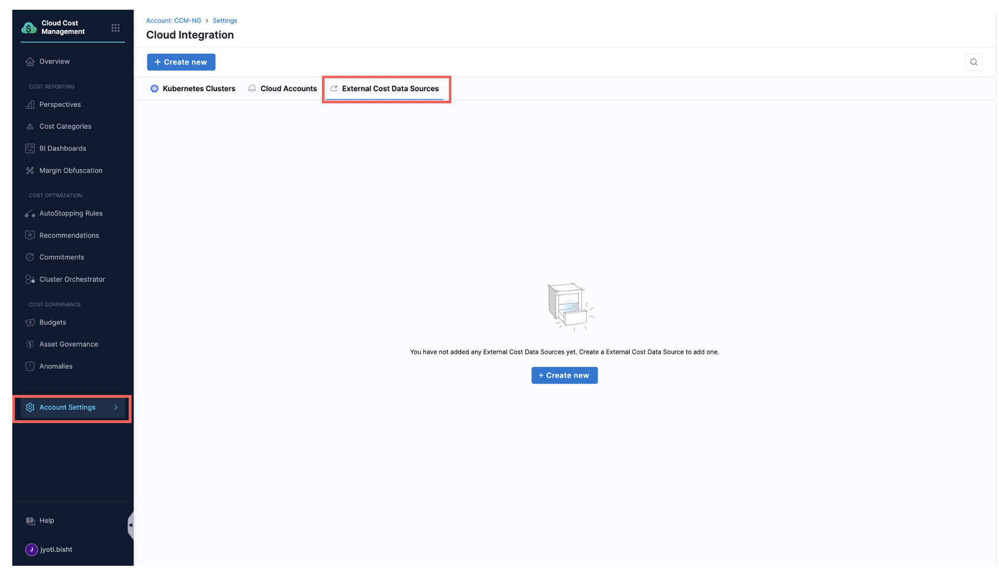
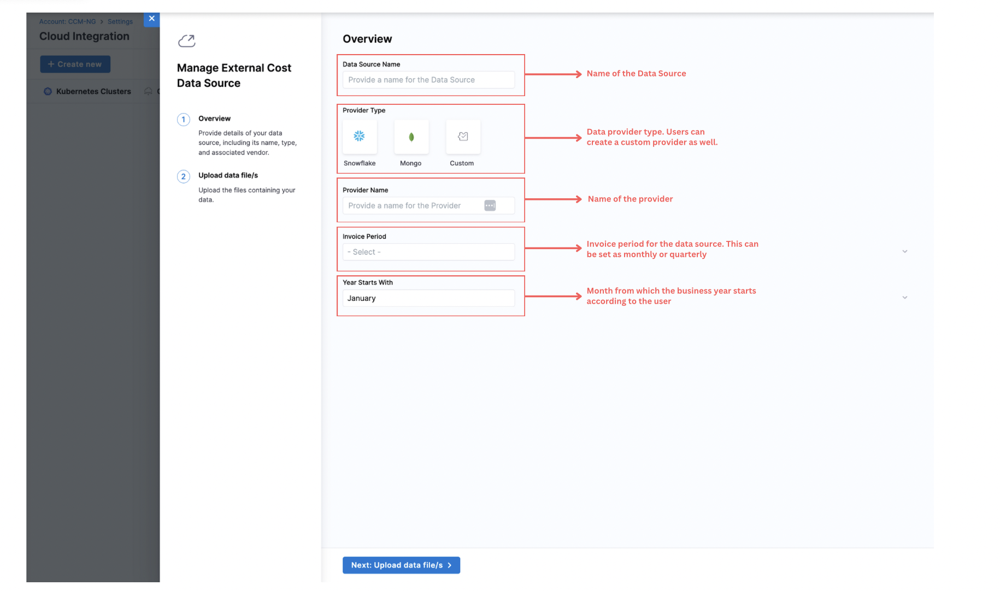
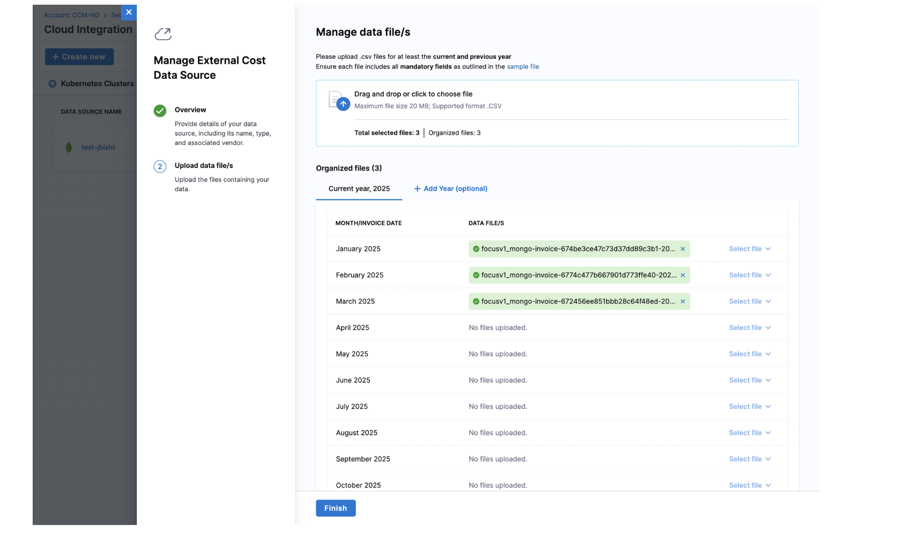
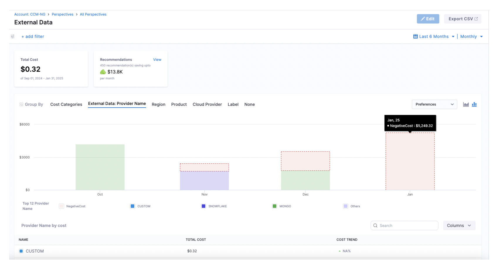
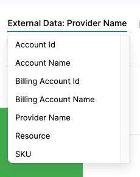

External Cost Data Ingestion allows users to bring cost data from third-party vendors  such as Mongo, Snowflake, etc., into Harness Cloud Cost Management (CCM). This allows users to see unified visibility and analysis across their cloud and external spend. Instead of managing these costs in spreadsheets or siloed tools, users can now consolidate them in Harness CCM for a single source of truth across all the cloud and non-cloud spend.

Harness provides a standard CSV-based ingestion format, called [FOCUS](https://focus.finops.org/what-is-focus/), which allows you to map any third-party billing data into a consistent structure. Once uploaded, Harness ingests, validates, and processes the data, automatically generating default Perspective so you can immediately begin analyzing costs, tracking budgets, and organizing spend by teams, business units, or environments.

:::info
Note: This feature is currently in early access and behind  `CCM_EXTERNAL_DATA_INGESTION` feature flag. Please reach out to our support team to enable it.
:::

## Why Use External Cost Data Ingestion?

Organizations today operate in increasingly complex environments where teams also rely on:

- SaaS services
- Cloud resellers or channel partners
- Hybrid infrastructure vendors, etc.

These external vendors often provide cost and usage data outside of traditional cloud billing APIs, typically in formats like CSVs, PDFs, or through emailed invoices. Without a native integration or ingestion capability, cost data from these vendors becomes hard to manage making it hard to get a complete view of the total cloud + third-party spend, allocate external costs back to teams, include vendor costs in budgeting, reporting, and forecasting, etc.

Without a centralized way to ingest and normalize this data, teams are forced to rely on manual spreadsheets, inaccurate or incomplete reports, which leads to delayed insights. 

External Cost Data Ingestion in Harness CCM solves this by allowing users to upload cost data in a standardized CSV format (FOCUS). Once ingested, Harness treats this data just like native cloud costs enabling you to:

- Analyze external spend with Perspectives
- Set Budgets and Alerts on vendor costs
- Organize costs by projects, environments, or cost categories
- Visualize insights quickly (time to value is typically under 10 minutes)

### Supported Features

The following CCM features are supported with external cost data:

✅ Perspectives

✅ Budgets

✅ Cost Categories

✅ Dashboards

**Coming Soon: Anomalies, Audit Trails, Granular RBAC, and more in future releases.**

## Steps to add External Cost Data Sources

Step 1: Navigate to "Account Settings" in the navigatation bar. Then click on "External Data Sources".
Step 2: Click on "+Create New". 

 
Step 3: Users will be asked to asked to fill in necessary details as shown below:

## Report Format

To ensure smooth and consistent ingestion of external data into our system, we require all incoming reports to follow the `FOCUSv1` specification for report formatting. Information about each column is available [here](https://focus.finops.org/wp-content/uploads/2024/11/FOCUS-spec-v1_1.pdf). For External Data Ingestion in Harness CCM,your report must include the following mandatory fields:

| **FOCUSv1 Field**     | Description                                                                                                                                                                                                 | Requirements                                                                 |
|-----------------------|-------------------------------------------------------------------------------------------------------------------------------------------------------------------------------------------------------------|-----------------------------------------------------------------------------|
| **BillingAccountId**  | Provider-assigned identifier for a billing account. Used for grouping based on organizational constructs, invoice reconciliation and cost allocation strategies. | **MUST be present** in a FOCUS dataset. **MUST be of type String** and **MUST NOT contain null values**. MUST be a globally unique identifier within a provider. |
| **BillingAccountName**| **Display name** assigned to a billing account. Used for grouping based on organizational constructs, invoice reconciliation and cost allocation strategies. | **MUST be present** in a FOCUS dataset and **MUST NOT be null** when the provider supports assigning a display name for the billing account. MUST be of type String. MUST be unique within a customer when a customer has more than one billing account. |
| **BillingPeriodStart**| **Inclusive start date and time** of a billing period. Example: '2024-01-01T00:00:00Z' includes charges for January but not February. | **MUST be present** in a FOCUS dataset, **MUST be of type Date/Time Format**, **MUST be an inclusive value**, and **MUST NOT contain null values**. **Must match invoice month during upload**. The sum of the BilledCost metric for rows in a given billing period MUST match the sum of the invoices received for that billing period for a billing account.|
| **BillingPeriodEnd**  | **Exclusive end date and time** of a billing period. Example: '2024-02-01T00:00:00Z' excludes charges for February. | **MUST be present** in a FOCUS dataset. **MUST be of type Date/Time Format**, **MUST be an exclusive value**, and **MUST NOT contain null values**. Equivalent to AWS `billingperiodenddate`.|
| **ChargeCategory**    | **Highest-level classification** of a charge based on billing nature. Used to identify and distinguish between types of charges. | **MUST be present** in a FOCUS dataset and **MUST NOT be null**. **MUST be of type String** and **MUST be one of the allowed values**: **Usage, Purchase, Tax, Credit, Adjustment**. |
| **ChargePeriodStart** | **Inclusive start date and time** within a charge period. Example: '2024-01-01T00:00:00Z' includes charges for January 1 but not January 2. | **MUST be present** in a FOCUS dataset, **MUST be of type Date/Time**, **MUST be an inclusive value**, and **MUST NOT contain null values**. MUST match the beginning date and time boundary of the effective period of the charge. Equivalent to usage start date. |
| **ChargePeriodEnd**   | **Exclusive end date and time** of a charge period. Example: '2024-01-02T00:00:00Z' excludes charges for January 2. | **MUST be present** in a FOCUS dataset, **MUST be of type Date/Time**, **MUST be an exclusive value**, and **MUST NOT contain null values**. MUST match the ending date and time boundary of the effective period of the charge. Equivalent to usage end date.|
| **ConsumedQuantity**  | **Volume of a metered SKU** associated with a resource or service used. Focuses on resource and service consumption, not pricing and cost. | [**See here for details**](https://focus.finops.org/wp-content/uploads/2024/11/FOCUS-spec-v1_1.pdf) |
| **EffectiveCost**     | **Amortized cost** after applying reduced rates, discounts, and applicable prepaid purchases that covered the charge. | **MUST be present** in a FOCUS dataset and **MUST NOT be null**. **MUST be of type Decimal**, **MUST conform to Numeric Format requirements**, and be denominated in the BillingCurrency. **MUST be 0** when ChargeCategory is "Purchase" and the purchase is intended to cover future eligible charges. The aggregated EffectiveCost for a billing period may not match the charge received on the invoice for the same billing period.|
| **ProviderName**      | Entity that makes the resources or services available for purchase. Used for cost analysis and reporting. | **MUST be present** in a FOCUS dataset. **MUST be of type String** and **MUST NOT contain null values**. **Should match the `ProviderType`** used when setting up the integration. |
| **RegionName**        | Provider-assigned **display name for an isolated geographic area** where a resource is provisioned or service is provided. Used for analyzing costs based on deployment location. | **MUST be present** in a FOCUS dataset when the provider supports deploying resources or services within a region and **MUST be of type String**. **MUST NOT be null** when a resource or service is operated in or managed from a distinct region by the Provider and MAY contain null values when a resource or service is not restricted to an isolated geographic area.|
| **ResourceId**        | **Identifier assigned to a resource** by the provider. Used for cost reporting, analysis, and allocation. | **MUST be present** in a FOCUS dataset when the provider supports billing based on provisioned resources. **MUST be of type String**. MAY be a nullable column as some cost data rows may not be associated with a resource. MUST appear in the cost data if an identifier is assigned to a resource by the provider. SHOULD be a fully-qualified identifier that ensures global uniqueness within the provider. |
| **ServiceName**       | Display name for an **offering that can be purchased** from a provider (e.g., cloud VM, SaaS database). Used for analyzing cost trends and filtering data. | **MUST be present** in a FOCUS dataset. **MUST be of type String** and **MUST NOT contain null values**. |
| **SkuId**             | **Unique identifier** for organizing properties common across SKU Prices. Can be referenced on a catalog or price list for detailed SKU information. | **MUST be present** in a FOCUS dataset when the provider publishes a SKU list. **MUST be of type String**. **MUST NOT be null** when ChargeClass is not "Correction" and ChargeCategory is "Usage" or "Purchase", **MUST be null** when ChargeCategory is "Tax", and MAY be null for all other combinations of ChargeClass and ChargeCategory. MUST equal SkuPriceId when a provider does not support an overarching SKU ID construct.|
| **SubAccountId**      | **Provider-assigned identifier** for a sub account. Used for organizational grouping, access management, and cost allocation. | **MUST be present** in a FOCUS dataset when the provider supports a sub account construct. **MUST be of type String**. If a charge does not apply to a sub account, MUST be null. |
| **SubAccountName**    | **Display name** assigned to a sub account. Used for organizational grouping, access management, and cost allocation. | **MUST be present** in a FOCUS dataset when the provider supports a sub account construct. **MUST be of type String**. If a charge does not apply to a sub account, MUST be null.|
| **Tags**              | Set of **tags assigned to tag sources** for provider-defined or user-defined evaluations. Used for adding business context to cost data for accurate allocation. | [**See here for details**](https://focus.finops.org/wp-content/uploads/2024/11/FOCUS-spec-v1_1.pdf)|

:::note
You can see more details here: [FOCUSv1](https://focus.finops.org/wp-content/uploads/2024/11/FOCUS-spec-v1_1.pdf)
:::
### FAQs:
Q: Which FeatureFlag needs to be enabled ?

A: `CCM_EXTERNAL_DATA_INGESTION``

Q: When this is going GA ?

A: Dates are not confirmed yet. We expect mid Q3 / early Q4 as the GA date.

Q: Are there default perspectives for this ?

A: Yes. The perspectives are created right after user clicks on finish and ingestion is completed. Reducing the time to value to few minutes.

Q: What all "Group Bys" or filters are supported?

A: 
 
Q: How long does it take for data to be available once we upload ?

A: After upload, when we click on finish, the ingestion gets triggered right away. Depending on the file sizes for that invoice period, this can take couple minutes or more. 

Q: What all features supported on external cost data ?

A: Perspectives, Budgets, CostCategories, Dashboards are only supported features in this release. We will add more support in future releases. Anomaly,  Granular RBAC, Audit Trail etc. are some of those.

Q: What is the time to value ?

A: The time to value reduces significantly with this feature. From once a day in case of Cloud to under 10 minutes to visualize and consume the data.

Q: I uploaded the file, but data is not showing up its been more than 10 minutes. 

A: This needs to be looked into by backend team. Please cut a ticket.

Q: My file sizes are more than 20MB. What should I do ?

A: Its advisable to keep the file sizes under 20MB. Tools to split into multiple CSVs can be used as well. In future, we might increase the limit. 

