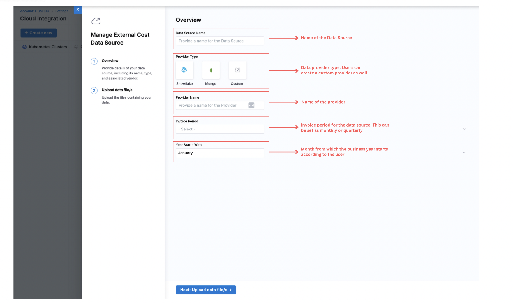

External Cost Data Ingestion allows users to bring cost data from third-party vendors  such as Mongo, Snowflake, etc., into Harness Cloud Cost Management (CCM). This allows users to see unified visibility and analysis across their cloud and external spend. Instead of managing these costs in spreadsheets or siloed tools, users can now consolidate them in Harness CCM for a single source of truth across all the cloud and non-cloud spend.

Harness provides a standard CSV-based ingestion format, called FOCUS, which allows you to map any third-party billing data into a consistent structure. Once uploaded, Harness ingests, validates, and processes the data, automatically generating default Perspective so you can immediately begin analyzing costs, tracking budgets, and organizing spend by teams, business units, or environments.

:::info
Note: This feature is currently in early access and behind  `CCM_EXTERNAL_DATA_INGESTION` feature flag. Please reach out to our support team to enable it.
:::

### Supported Features

The following CCM features are supported with external cost data:

✅ Perspectives

✅ Budgets

✅ Cost Categories

**Coming Soon: Anomalies, Audit Trails, Granular RBAC, and more in future releases.**

## Steps to add External Cost Data Sources

Step 1: Navigate to "Account Settings" in the navigatation bar. Then click on "External Data Sources".
Step 2: Click on "+Create New". 

 
Step 3: Users will be asked to asked to fill in necessary details as shown below:

### FAQs:
Q: Which FeatureFlag needs to be enabled ?

A: `CCM_EXTERNAL_DATA_INGESTION``

Q: When this is going GA ?

A: Dates are not confirmed yet. We expect early/mid Q2 as the GA date.

Q: Are there default perspectives for this ?

A: Yes. The perspectives are created right after user clicks on finish and ingestion is completed. Reducing the time to value to few minutes.

Q: What all "Group Bys" or filters are supported?

A: 
 
Q: How long does it take for data to be available once we upload ?

A: After upload, when we click on finish, the ingestion gets triggered right away. Depending on the file sizes for that invoice period, this can take couple minutes or more. 

Q: What all features supported on external cost data ?

A: Perspectives, Budgets, CostCategories are only supported features in this release. We will add more support in future releases. Anomaly,  Granular RBAC, Audit Trail etc. are some of those.

Q: What is the time to value ?

A: The time to value reduces significantly with this feature. From once a day in case of Cloud to under 10 minutes to visualize and consume the data.

Q: I uploaded the file, but data is not showing up its been more than 10 minutes. 

A: This needs to be looked into by backend team. Please cut a ticket.

Q: My file sizes are more than 20MB. What should I do ?

A: Its advisable to keep the file sizes under 20MB. Tools to split into multiple CSVs can be used as well. In future, we might increase the limit. 

Q: What are other system limits ?

A: Currently, no limits on number of files per invoice period, no limits on number of files per provider or account, no limits on concurrent uploads.
