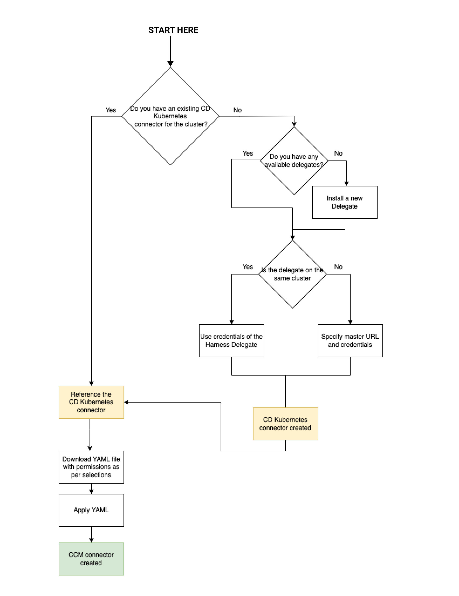
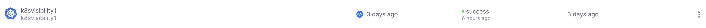
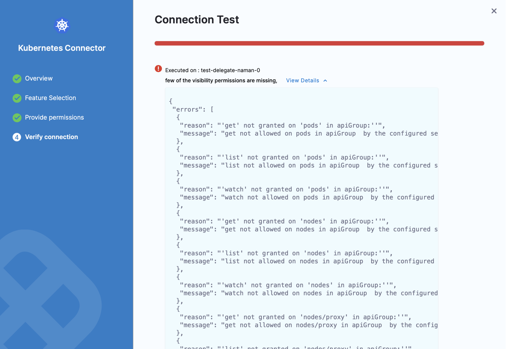

Harness Cloud Cost Management (CCM) monitors the cloud costs of your Kubernetes clusters, namespaces, nodes, workloads, and labels. CCM also allows you to optimize your Kubernetes cluster resources using intelligent cloud AutoStopping rules.

This topic describes how to connect your Kubernetes cluster to CCM.

To fully enable CCM for a Kubernetes cluster, you need to:

- **Deploy a delegate into the target cluster.** This gives Harness a connection into your cluster.
- **Create a Harness cloud provider Kubernetes connector that targets the delegate.** This ties your cluster and delegate to a representation of your cluster in Harness.
- **Create a Harness CCM Kubernetes connector that targets the Kubernetes connector.** This enables the delegate to start collecting usage metrics to be sent back to Harness for use in CCM.
- **(Optional) Deploy the autostopping controller and router into the target cluster.** This enables you to create CCM autostopping rules to reduce costs of your cluster.

:::info

After you enable CCM in your first cluster, the data is available within a few minutes for viewing and analysis.

However, you can't see the idle cost due to missing utilization data. CCM generates the last 30 days of the cost data based on the first events.

From the second cluster onwards, it takes about 2 to 3 hours for the data to be available for viewing and analysis.

If you are using a CCM cloud connector, the data generation is delayed. Since CCM performs cost true-up based on cost information available at cloud provider source.

:::

## Kubernetes CCM connection requirements and workflow

For CCM, you can only use Kubernetes connectors at the Account level in Harness. This section describes how to set up the CCM Kubernetes connector.

Here's a visual representation of the CCM Kubernetes connector requirements and workflow:



### Prerequisites

Make sure you have the following set up before you create a Kubernetes connector for CCM:

#### Kubernetes cluster requirements

You need a target Kubernetes cluster for the Harness Delegate and deployment. Make sure your cluster meets the following requirements:

* **Number of nodes**: 2
* **vCPUs, Memory, Disk Size**: 4vCPUs, 16GB memory, 100GB disk. In GKE, the **e2-standard-4** machine type is enough for this quickstart.
* **Networking**: outbound HTTPS for the Harness connection to **app.harness.io**, **github.com**, and **hub.docker.com**. Allow TCP port 22 for SSH.
* **Kubernetes service account** with permission to create entities in the target namespace is required. The set of permissions should include `list`, `get`, `create`, and `delete` permissions. In general, the cluster-admin permission or namespace admin permission is enough.
   For more information, see [User-Facing Roles](https://kubernetes.io/docs/reference/access-authn-authz/rbac/#user-facing-roles) from Kubernetes.

:::warning

You must not rename the cluster. If you're setting up a new connector with this cluster, it is identified by the `clustername`. Renaming the cluster results in duplicate entries in the dashboard.

:::

#### Delegate size requirements

Your Kubernetes cluster must have unallocated resources required to run the Harness Delegate workload.

**Baseline Configuration:**
For clusters with up to 200 nodes and 4000 pods, each delegate should be configured with:
- 2 vCPUs
- 8 GB of memory
  
**Incremental Scaling:** For every additional 50 nodes and 1000 pods, the delegate capacity should be increased by 0.5 vCPUs and 2 GB of memory
This scaling ensures that the delegate can handle the increased load and continue to collect metrics efficiently.

**Single replica requirement:**
- All specified resource requirements pertain to a single replica of the delegate.
- Instead of utilizing Horizontal Pod Autoscaler (HPA) to increase the number of smaller-sized replicas Harness recommends provisioning each delegate with the necessary resources to handle the specified number of nodes and pods.

:::warning

- These sizing requirements are for the Delegate only. Your cluster will require more memory for Kubernetes, the operating system, and other services. Ensure that the cluster has enough memory, storage, and CPU for all of its resource consumers.
- We recommend using one delegate per cluster and Large size delegates for production clusters for optimal performance.

:::

#### Metrics server requirements

Metrics Server must be running on the Kubernetes cluster where your Harness Kubernetes Delegate is installed. Before enabling CCM for Kubernetes, you must make sure the utilization data for pods and nodes is available.

The Metrics Server is a cluster-wide aggregator of resource usage data. It collects resource metrics from kubelets and exposes them in the Kubernetes API server through Metrics API. CCM polls the utilization data every minute on the Delegate. The metrics are aggregated for 20 minutes and then CCM keeps one data point per 20 minutes. For more information, see [Installing the Kubernetes Metrics Server](https://docs.aws.amazon.com/eks/latest/userguide/metrics-server.html) from AWS.

Metrics Server is installed by default on GKE and AKS clusters; however, you need to install it on the AWS EKS cluster.

To install the metrics server on your EKS clusters, run the following command:

```
kubectl apply -f https://github.com/kubernetes-sigs/metrics-server/releases/download/v0.5.0/components.yaml
```

Resources can be adjusted proportionally based on number of nodes in the cluster.

For clusters exceeding 100 nodes, allocate the following additional resources:

* 1m core per node
* 2MiB memory per node

### Install delegate

[Install a Harness Kubernetes delegate in the cluster.](/docs/platform/delegates/install-delegates/overview)

#### Delegate permission requirements

You can choose one of the following permissions for the delegate for CCM:

* **Install Delegate with cluster-wide read/write access:** Creates a new namespace called "harness-delegate-ng" with the service account bound to Cluster Admin role. This Delegate will be able to read tasks (capture change events etc., needed for Harness Cloud Cost Management) anywhere on the K8s cluster where the Delegate is installed.
* **Install Delegate with cluster-wide read access:** (Requires read-only Cluster Admin role) Creates a new namespace called "harness-delegate-ng" with the service account bound to Cluster Admin role. This Delegate will be able to perform read-only tasks (capture change events etc., needed for Harness Cloud Cost Management) anywhere on the K8s cluster where the Delegate is installed.

#### Delegate role requirements for CCM visibility features and recommendations:

The YAML provided for the Harness Delegate defaults to the `cluster-admin` role. If you can't use cluster-admin because you are using a cluster in your company, you'll need to edit the delegate YAML to include the role below. If you deployed your delegate with Helm, you can also set the value `ccm.visibility: true` to have this role and binding created.

```yaml
apiVersion: rbac.authorization.k8s.io/v1
kind: ClusterRole
metadata:
  name: ce-clusterrole
rules:
- apiGroups:
  - ""
  resources:
  - pods
  - nodes
  - nodes/proxy
  - events
  - namespaces
  - persistentvolumes
  - persistentvolumeclaims
  verbs:
  - get
  - list
  - watch
- apiGroups:
  - apps
  - extensions
  resources:
  - statefulsets
  - deployments
  - daemonsets
  - replicasets
  verbs:
  - get
  - list
  - watch
- apiGroups:
  - batch
  resources:
  - jobs
  - cronjobs
  verbs:
  - get
  - list
  - watch
- apiGroups:
  - metrics.k8s.io
  resources:
  - pods
  - nodes
  verbs:
  - get
  - list
- apiGroups:
  - storage.k8s.io
  resources:
  - storageclasses
  verbs:
  - get
  - list
  - watch
```

### Create the cloud provider Kubernetes cluster connector

Once the delegate is deployed you need to [create a Kubernetes cloud provider connector](/docs/platform/connectors/cloud-providers/add-a-kubernetes-cluster-connector) at the Account level. This connector should be created to `Use credentials of a specific Harness delegate` and select the delegate you deployed into the target cluster.

Make sure the connector passes its connection test to validate the delegate has been installed correctly and can make outbound connections to the Harness Manager.

:::warning

In Harness, the ratio of Delegates to Connectors is 1:2. If you have 20 clusters, then you need 20 delegates and 40 connectors (one Kubernetes cloud provider connector and one CCM Cloud Integration/Cloud Costs Kubernetes connector for each cluster).

Alternatively, to use a single delegate to access multiple Kubernetes clusters, you must specify the Kubernetes master node URL.

:::

### Create a CCM Kubernetes connector

To have your delegate start to collect usage metrics, you need to create a CCM Kubernetes connector at the Account level and connect it to your cluster.

You need one CCM Kubernetes connector per cluster, and you must associate each CCM Kubernetes connector with the cluster's corresponding cloud provider Kubernetes cluster connector (created previously).

Once you create and connect the CCM Kubernetes connector, CCM can collect CCM metrics for deep cloud cost visibility.

You can start creating a CCM Kubernetes connector in your Account Settings or from the Cloud Costs page in Harness.

import Tabs from '@theme/Tabs';
import TabItem from '@theme/TabItem';

<Tabs queryString="tab-number">
<TabItem value="4" label="From Account Settings">

1. Go to **Account Resources** > **Connectors**.
2. Select **+ New Connector**.
3. Under **Cloud Costs**, select **Kubernetes**.

</TabItem>
<TabItem value="5" label="From Cloud Costs">

1. Go to **Setup** > **Cloud Integration**.
2. Select **New Cluster/Cloud account**.
3. Select **Kubernetes**.
4. Select **Advanced**.

:::tip

For the Quick Create option, go to [Kubernetes Quick Create](/docs/cloud-cost-management/get-started/onboarding-guide/use-quick-create-k8s).

:::

</TabItem>
</Tabs>

### Connect your Kubernetes cluster to CCM

After beginning to create the CCM Kubernetes connector, use these steps to connect your Kubernetes cluster to CCM:

1. In the **Kubernetes Connector** wizard, in the **Overview** section, from the **Reference an existing connector** drop-down list, select your Cloud Provider Kubernetes Connector.
If you do not have Cloud Provider Kubernetes Connector already created, select **Create a new connector**. See [Add a Kubernetes Cluster Connector](/docs/platform/connectors/cloud-providers/add-a-kubernetes-cluster-connector).
2. The name for your connector is automatically populated. You can choose to edit the name. This name appears on the **Perspectives** page to identify this cluster.
3. Select **Save and Continue**.

#### Choose Requirements

In **Choose Requirements**, select the Cloud Cost Management features that you would like to enable for your Kubernetes clusters. Based on your selection Harness requires specific permissions.

You need to provide different permissions depending on the features that you enable for your Kubernetes clusters. CCM offers the following features:

| Feature | Capabilities |
| --- | --- |
| **Cost Visibility** (Required)| This feature is available by default. Provides the following capabilities:<ul><li>Insights into cluster costs by pods, namespace, workloads, etc.</li><li>Idle and unallocated cluster costs</li><li><li>Workload recommendations</li>Root cost analysis using cost perspectives </li><li>Cost anomaly detection</li><li>Governance using budgets and forecasts</li><li>Alert users using Email and Slack notification</li></ul>|
| **Kubernetes optimization using AutoStopping rules** (Required for AutoStopping Rules)| This feature allows you to enable Intelligent Cloud AutoStopping for Kubernetes. For more information, see [Create AutoStopping Rules for AWS](/docs/cloud-cost-management/use-ccm-cost-optimization/optimize-cloud-costs-with-intelligent-cloud-auto-stopping-rules/create-auto-stopping-rules/create-autostopping-rules-aws).<ul><li>Orchestrate GCE VMs based on idleness</li><li>Set dependencies between VMs</li><li>Granular savings visibility</li><li>Simple one-time setup</li></ul>|

:::note

- For [AWS](set-up-cost-visibility-for-aws.md) and [Azure](set-up-cost-visibility-for-azure.md), if the cloud connectors are set up, then the cost will be trued-up to the pricing received from the CUR/billing export. However, for [GCP](set-up-cost-visibility-for-gcp.md) the list pricing is used.

- CCM supports Karpenter for AWS starting from version 0.37 and later. However, it is currently not supported for GCP and Azure.

:::

Make your selection and select **Continue**.

#### (Optional) Create a Secret

The secret creation settings appear only if you have selected **Kubernetes Optimization by AutoStopping** feature when selecting features.

In this step, you provide permissions for intelligent cloud AutoStopping rules. For more information, go to [Create AutoStopping Rules for AWS](/docs/cloud-cost-management/use-ccm-cost-optimization/optimize-cloud-costs-with-intelligent-cloud-auto-stopping-rules/create-auto-stopping-rules/create-autostopping-rules-aws).

1. In **Secret creation**, select create an API key here and create an API key. Go to [Create an API Key](/docs/platform/automation/api/add-and-manage-api-keys) for more information.
2. Run the following commands in your Kubernetes cluster:

	1. Create a namespace.

	```
	kubectl create namespace harness-autostopping
	```

	2. In the following YAML, add the API token that you created (in step 1) and run the command in your K8s cluster.

	```
	apiVersion: v1
	data:
	    token: TOKEN
	kind: Secret
	metadata:
	    name: harness-api-key
	    namespace: harness-autostopping
	type: Opaque
	```

	3. Run the following command:

	```
	kubectl apply -f secret.yaml
	```

3. Select **Continue**.

#### Provide permissions

If the cluster does not already have additional permissions, you will apply them in this step. For more information, go to the [Delegate permissions](#delegate-permission-requirements).

1. In **Provide Permissions**, select **Download YAML**.
2. Copy the downloaded YAML to a machine where you have `kubectl`installed and have access to your Kubernetes cluster.
3. Run the following command to apply the Harness Delegate permissions to your Kubernetes Cluster.

   ```
   $ kubectl apply -f ccm-kubernetes.yaml
   ```

4. Select **Done** and **Continue**.
5. In **Verify connection**, once the Test Connection succeeds, select **Finish**.

The connector is now listed in **Connectors**.



#### Troubleshooting

In the **Verify connection** step, if you get an error message like `few of the visibility permissions are missing`, then you need to review the CCM permissions required for Harness Delegate.



Verify that you have all the required permissions for the Service account using the following commands:

```
kubectl auth can-i watch pods
--as=system:serviceaccount:<your-namespace>:<your-service-account>
--all-namespaces
kubectl auth can-i watch nodes
--as=system:serviceaccount:<your-namespace>:<your-service-account>
--all-namespaces
```

```
kubectl auth can-i get nodemetrics
--as=system:serviceaccount:<your-namespace>:<your-service-account>
--all-namespaces
kubectl auth can-i get podmetrics
--as=system:serviceaccount:<your-namespace>:<your-service-account>
--all-namespaces
```

Here is an example showing the commands and output using the default Delegate Service account name and namespace:

```
$ kubectl auth can-i watch pods --as=system:serviceaccount:harness-delegate:default --all-namespaces
yes
$ kubectl auth can-i watch nodes --as=system:serviceaccount:harness-delegate:default --all-namespaces
yes
$ kubectl auth can-i watch nodemetrics --as=system:serviceaccount:harness-delegate:default --all-namespaces
yes
$ kubectl auth can-i watch podmetrics --as=system:serviceaccount:harness-delegate:default --all-namespaces
yes
```

## Next Steps

* [Optimize Cloud Costs with AutoStopping Rules](/docs/cloud-cost-management/use-ccm-cost-optimization/optimize-cloud-costs-with-intelligent-cloud-auto-stopping-rules/create-auto-stopping-rules/autostopping-dashboard)
* [Root Cost Analysis](../../3-use-ccm-cost-reporting/3-root-cost-analysis/perform-root-cost-analysis.md)
* [Create Cost Perspectives](../../3-use-ccm-cost-reporting/1-ccm-perspectives/1-create-cost-perspectives.md)
