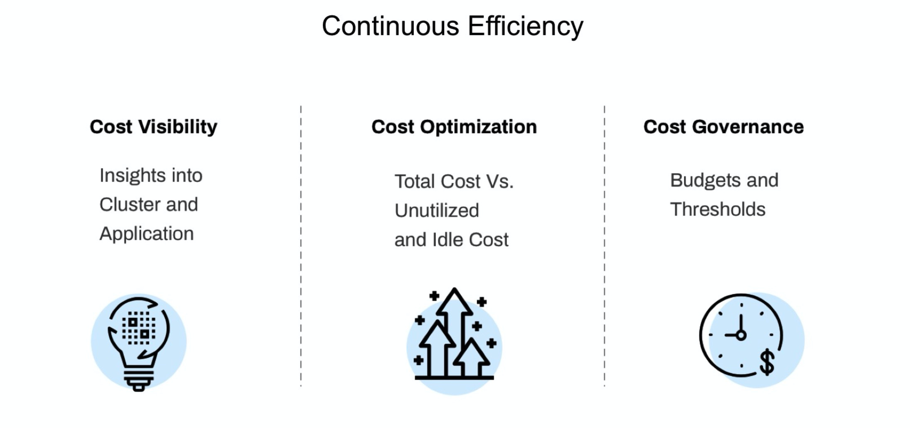
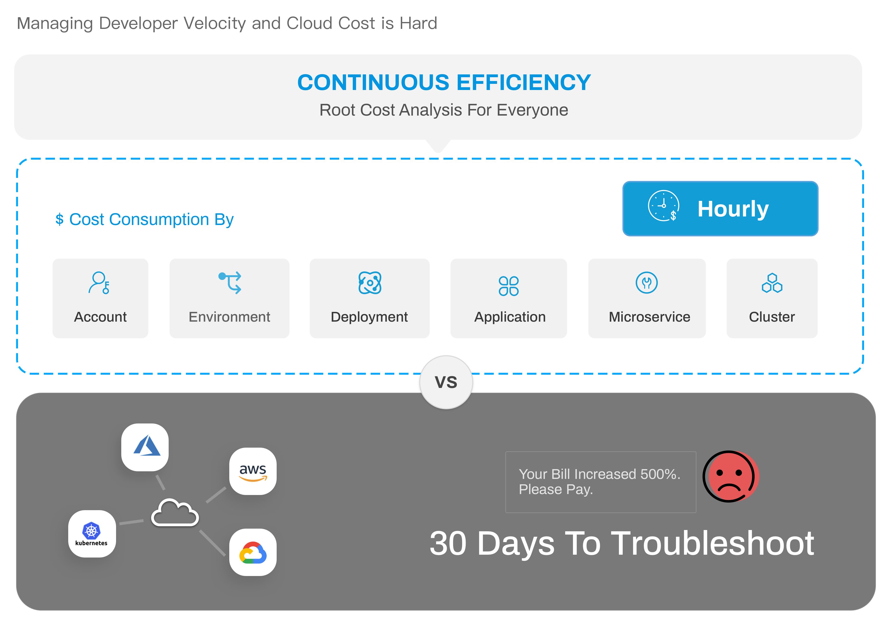

Understanding and managing cloud costs is essential, especially as environments grow more complex. While most tools offer insights by project, service, or tags, they fall short for DevOps teams who need visibility into namespaces, nodes, pods, and other granular resources.

Traditional cost tools are built for monthly CFO-level reporting—not for the engineers actually using the resources. Harness Cloud Cost Management (CCM), formerly Continuous Efficiency, puts cost visibility directly in the hands of engineers and DevOps, offering hourly insights into resource consumption across deployments and clusters.

### Visual Summary
<DocVideo src="https://www.youtube.com/watch?v=xnbTUNet5gw" />

---

### What is Cloud Cost Management?
CCM provides insight and visibility into your cloud infrastructure costs. CCM provides the following benefits:

- **Cost Visibility**: Insights into the costs of your Harness Applications and clusters. Provides granular cost details of your cluster namespaces, workloads, nodes, pods, and labels. Details of total cost versus utilized, idle, and unallocated cost. Forecasts future spend based on historical data.
- **Cost Optimization**: Optimize and minimize the costs associated with utilizing cloud resources. The AutoStoppiing rules, Recommendations, and the Asset Governance features help you identify cloud resources and services that are idle or underutilized and take required action to ensure optimum utilization.
- **Cost Governance**: Enables you to set a budget and configure notifications based on thresholds.

---

### Why Harness' Cloud Cost Management?
The following illustration explains the different challenges that an engineering organization faces with cloud cost management and how Harness CCM can help you resolve them.

Some of the unique challenges that CCM addresses are:

- Lack of visibility into the cost of their Application or clusters
- Unable to detect and resolve cost spikes
- Percentage of cloud spend wasted

---

### Why is this Important?
Teams lack visibility into the cost drivers. CCM can help you gain visibility into your costs. The following table lists the needs and pain points of different teams, and how CCM resolves these issues and provides opportunities for improvement:

|                                  | **Engineer**                                                                                                                                                                                      | **DevOps**                                                                                                                   | **CTO/CIO**                                                | **CFO**                                                                 |
| -------------------------------- | ------------------------------------------------------------------------------------------------------------------------------------------------------------------------------------------------- | ---------------------------------------------------------------------------------------------------------------------------- | ---------------------------------------------------------- | ----------------------------------------------------------------------- |
| **Need Context and  Visibility** | <li>Applications</li><li>Microservices</li><li>Clusters/Nodes</li>                                                                                                                                | <li>Applications</li><li>Environment</li><li>Clusters</li><li>Nodes</li><li>Namespaces</li><li>Workloads</li><li>Labels</li> | <li>Cloud Provider</li><li>Applications</li><li>Teams</li> | <li>Cloud Provider</li><li>Cloud Account</li><li>Cost per Customer</li> |
| **Pain Points**                  | <li>Lack of context or visibility</li><li>Reactive troubleshooting</li>                                                                                                                           | <li>Lack of context or visibility</li><li>Tagging cloud resource</li><li>Reactive troubleshooting</li>                       | Increasing cloud spend                                     | Increasing cloud spend                                                  |
| **Why Harness?**                 | <li>Complete visibility</li><li>Root cost analysis</li><li>Cost optimization opportunities</li><li>Identify cost triggers, for example, CPU and memory spikes</li><li>Manage multiple clouds</li> | <li>Complete visibility</li><li>Embed cost into pipeline</li><li>No Tagging</li><li>Manage multiple clouds efficiently</li>  | Shift cloud cost management to Dev teams                   | Shift cloud cost management to Dev teams                                |
