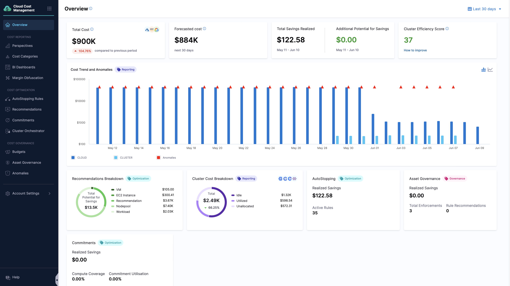

# Harness Cloud Cost Management (CCM)

## Introduction

In today's cloud-first world, understanding and managing cloud costs has become a critical business imperative. As organizations scale their cloud infrastructure, the complexity of tracking expenses increases exponentially. Harness Cloud Cost Management (CCM), formerly known as Continuous Efficiency, addresses this challenge by providing real-time, granular visibility into cloud costs.

<DocVideo src="https://www.youtube.com/watch?v=xnbTUNet5gw" />

## What is Cloud Cost Management?

Harness Cloud Cost Management is a comprehensive solution that provides deep insights and control over your cloud infrastructure costs. It enables engineering and DevOps teams to understand, optimize, and govern cloud spending across their entire infrastructure.

### Three Pillars of CCM

#### Cost Visibility

Provides detailed insights into your cloud spending across:
- Harness applications and environments
- Kubernetes clusters, namespaces, and workloads
- Cloud provider resources and services
- Utilized vs. idle vs. unallocated costs
- Historical trends and future spend forecasting

#### Cost Optimization

Helps reduce cloud spending through:
- AutoStopping for idle resources
- Intelligent rightsizing recommendations
- Workload and node pool optimization
- Commitment orchestration for Reserved Instances and Savings Plans
- Cluster orchestration for efficient scaling

#### Cost Governance

Enables financial control through:
- Budget creation and management
- Threshold-based notifications
- Policy-driven asset governance
- Role-based access control
- Automated enforcement actions

## The Cloud Cost Challenge

Traditional cloud cost management tools fall short in several key areas:

| **Limitation** | **Impact** |
|----------------|------------|
| Limited granularity | Insights only at project, service, or tag level, insufficient for detailed analysis |
| Executive-focused | Designed for CFO/CIO/CTO audiences with monthly billing cycles |
| Engineer disconnect | Engineers and DevOps teams lack access to analyze their resource consumption costs |
| Reactive approach | Cost issues identified after they've already impacted the bottom line |

### How Harness CCM Addresses These Challenges

Harness Cloud Cost Management (CCM) addresses these challenges with solutions designed for modern engineering teams. Unlike traditional tools, CCM provides deep visibility into costs at granular levels: applications, clusters, namespaces, workloads, nodes, and pods, allowing engineers to understand exactly where cloud spend is going. 
Listed below are the key features using which CCM addresses the challenges mentioned above:

## Core Features of Harness CCM

|    | **Features** | **Description** | **Documentation** |
|----| --- | --- | --- |
| **Cost Reporting** | **Perspectives** | Custom views to slice and dice cloud spend across business dimensions. | [Perspectives Documentation](/docs/category/perspectives) |
| **Cost Reporting** | **Cost Categories** | Group and analyze cloud costs based on user-defined categories. | [Cost Categories Documentation](/docs/category/cost-categories) |
| **Cost Reporting** | **BI Dashboards** | Visualize and track cloud cost trends, anomalies, and budgets in one place. | [Dashboards Documentation](/docs/category/bi-dashboards) |
| **Cost Reporting** | **Anomaly Detection** | Automatically detect unusual spikes or drops in your cloud spend. | [Anomalies Documentation](/docs/category/anomalies) |
| **Cost Optimization** | **AutoStopping** | Automatically shut down idle resources to save costs. | [AutoStopping Documentation](/docs/category/autostopping-rules) |
| **Cost Optimization** | **Recommendations** | Get actionable insights to right-size and optimize cloud resources. | [Recommendations Documentation](/docs/category/recommendations) |
| **Cost Optimization** | **Cluster Orchestrator** | Automate provisioning, scaling, and shutdown of Kubernetes clusters based on workload patterns to reduce idle costs. | [Cluster Orchestrator Documentation](/docs/category/cluster-orchestrator-for-aws-eks-clusters-beta) |
| **Cost Optimization** | **Commitment Orchestrator** | Manage and optimize AWS commitments like EC2 Convertible RIs and SPs and RDS Standard RIs. | [Commitment Orchestrator Documentation](/docs/category/commitment-orchestrator) |
| **Cost Governance** | **Asset Governance** | Enforce policies on cloud resources to ensure cost efficiency and compliance. | [Asset Governance Documentation](/docs/category/asset-governance) |
| **Cost Governance** | **Budgets** | Set and track cloud spend limits to avoid budget overruns. | [Budgets Documentation](/docs/category/budgets) |

## Why Harness CCM Matters

Harness CCM addresses critical challenges that engineering organizations face with cloud cost management:

- **Lack of visibility** into application and cluster costs
- **Inability to detect and resolve** cost spikes quickly
- **Significant waste** in cloud spending
- **Disconnected teams** with different cost perspectives

## Platform Coverage

### Supported Cloud Platforms

| **Cloud Provider** | **Support Status** |
|-------------------|-------------------|
| **AWS** | ✅ Fully Supported |
| **GCP** | ✅ Fully Supported |
| **Azure** | ✅ Fully Supported |

:::note
Please note, some of our beta features might not be available on all cloud, please see : [What is supported](/docs/cloud-cost-management/whats-supported) for an in-depth overview of what is supported.
:::

### Supported Container Orchestration

| **Platform** | **Support Status** | **Notes** |
|-------------|-------------------|----------|
| **Kubernetes (EKS)** | ✅ Fully Supported | AWS-managed Kubernetes |
| **Kubernetes (GKE)** | ✅ Fully Supported | GCP-managed Kubernetes |
| **Kubernetes (AKS)** | ✅ Fully Supported | Azure-managed Kubernetes |
| **ECS Clusters** | ✅ Fully Supported | AWS container service |

### Supported Kubernetes Management Platforms

| **Technology** | **Supported Platform** | **Pricing Model** |
|---------------|------------------------|-------------------|
| OpenShift 3.11 | GCP | GCP standard rates |
| OpenShift 4.3 | AWS, On-Prem | AWS rates, Custom rate* |
| Rancher | AWS | Custom rate** |
| Kops | AWS | AWS standard rates |

*Cost data is supported for On-Prem OpenShift 4.3 using a custom rate.

**Cost data is supported for K8s workloads on AWS managed by Rancher, using a custom rate.
