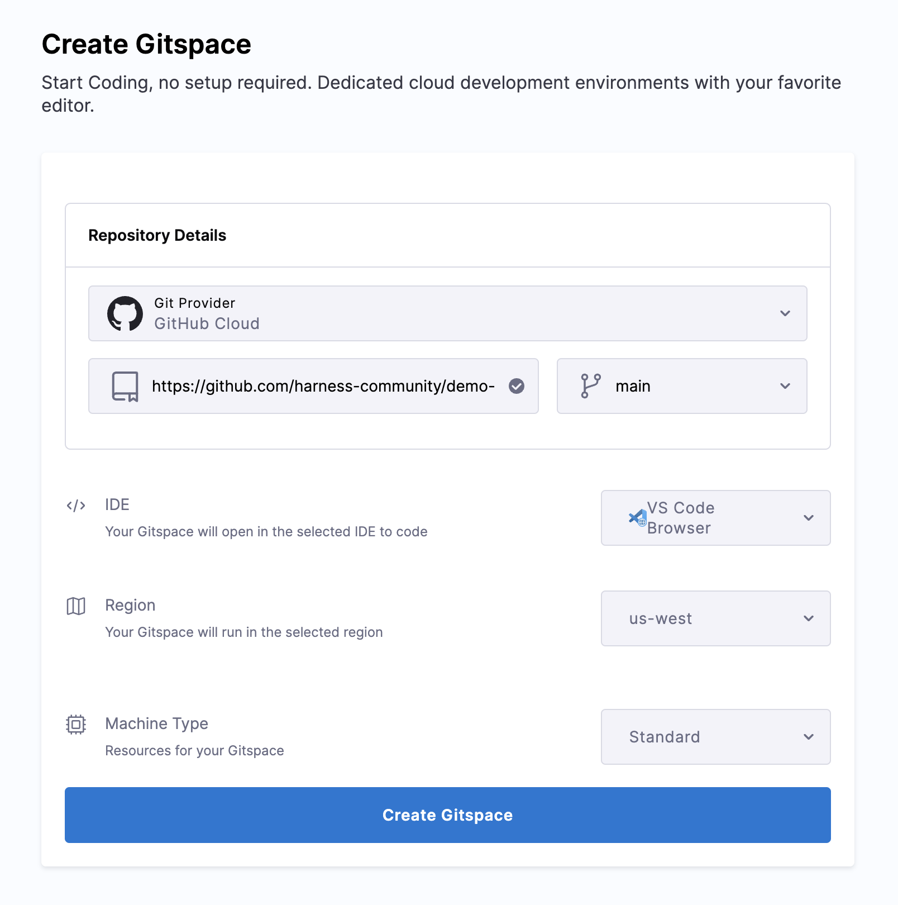

## Overview

Harness Cloud Development Environments (CDE) are preconfigured, remote, ready-to-use  environments that developers can quickly spin up from anywhere and start writing code, debugging, and collaborating with other developers.

This one pager focuses on the core features of CDE and provides a Quickstart guide to help users get started. 


## Configuration

The image used to spin up the container, along with a bunch of other properties, can be specified in the configuration file `.devcontainer/devcontainer.json` in the repository. Any application dependencies can be prebaked into this image so that you do not spend time installing these each time.

The `devcontainer.json` spec contains many properties that let users customize their development environments. As of now, we support the image and postCreateCommand properties, here’s an example. 

If a repository does not have a `devcontainer.json`, we will spin up the CDE with a default docker image at  `mcr.microsoft.com/devcontainers/base:dev-ubuntu-24.04`. The Dockerfile for this default image is available at `https://github.com/devcontainers/images/tree/main/src/base-ubuntu` 

## What is supported?

### Git providers

1. Gitness public and private repositories

2. GitHub public repositories

3. Bitbucket public repositories

4. GitLab public repositories


### IDEs

You can also choose an IDE that will be available in the CDE - VS Code Desktop & Browser are currently supported.

## Sample application

Let us go through the flow of creating a CDE for our sample application, which is available in our public GitHub repository at [demo node.js app](https://github.com/harness-community/demo-repo-nm). Fork the repository if you want to make changes to it as part of this exercise. 

### Create a Gitspace

1. As you go to the CDE Module from the side nav, you'll be redirected to the Getting Started wizard in case there is no new gitspaces for the selected Project. 


2. You can as well select a project where you want to create a new gitspace. 


3. Now on the Create Gitspace page, select the Git Provider, by default we select the **Harness Code**. In case you select any other git provider, you need to [configure the oauth](https://developer.harness.io/docs/platform/git-experience/oauth-integration/#configure-oauth-for-git-provider) for the same. 

4. In this quickstart we are using the repository present in GitHub, hence you can fork the repo and start using it. Repository URL is `https://github.com/harness-community/demo-repo-nm` (enter URL of your fork if you forked it), make sure the URL is the clone URL strictly of the format `https://git-provider.com/organisation/repository` any extra string post this might cause an error. 

5. Leave the default branch main selected.

6. Select the IDE.  

    - Choosing VS Code Browser will open up the Gitspace in a new browser tab

    - Choosing VS Code Desktop will open the Gitspace in your desktop VS Code application, if you have the plugin installed.

7. Now select the **Region** and **Machine Type** (Standard: 2 Core CPU, 8GB RAM, Disk Space: 30GB; Large: 4 Core CPU, 16GB RAM, Disk Space: 30GB ) and click on **Create Gitspace**.



8. After clicking on **Create Gitspace**, you’ll be redirected to the Gitspace Details page, where you can view the events and logs as the Gitspace is being created. Once it is ready, you can open the Gitspace by clicking the **Open VS Code Online** or **Open VS Code Desktop** button at the top right of the page.

8. This will open the **Gitspace**. Click on **Yes, I trust the authors** and **Mark Done** to get started. You can then start coding in the IDE as you normally would.

## Develop in the Gitspace

Now, let’s install dependencies for the sample app and run it. We will also make changes to it and commit back to our fork.

1. First, open a new terminal.

2. All dependencies, packages, tools and libraries needed for this application were installed while provisioning the Gitspace based on the config in devcontainer.json. To run the sample app, run the following command in the terminal:

```sh
npm run dev
```

3. Your application will be available at proxy host 3000. You will see a message at the bottom right of your IDE with a link to open the app in browser.

4. The application shows the Harness canary in a variety of fun situations and poses


:::info

The sample app contains a package called nodemon which has issues when we try to stop the server on VS Code IDE, so you might need to kill the process using `sudo lsof -i :<port_number>` and then `kill -9 [PID]`, to stop the server on port. 

:::

#### Making changes to sample app

1. To make changes to the application, you should  have forked it first and then created a Gitspace for the fork.

- Steps to make changes and commit to source control:

- You can make some changes to haiku.json such as delete one of the canary sections below. Save the file.

```json
    {
        "text": "traffic in bangalore,\ncondiser fying to work",
        "image": "canary-flying.png"
    },
```

2. In the Terminal, configure your GitHub credentials

```sh
git config --global user.email "you@example.com" 

git config --global user.name "Your Name"
```

3. Now that you've made a few changes, you can use the integrated terminal or the source view to commit your work. We will use the **Source Control** view for this example.

4. To stage your changes, click `+` next to the `haikus.json` file, or next to **Changes** if you've changed multiple files and you want to stage them all.

5. To commit your staged changes, type a commit message describing the change you've made, then click **Commit**.

6. Now **Sync Changes**, it will redirect you to login and authorize to your GitHub. After authorization, your changes will be committed to your fork.

7. And that’s it! You have successfully used CDE for development


## Install Gitspace VS Code Extension for VS Code Desktop

1. You can install and configure the Gitspaces VS Code extension to use it on your VS Code Desktop App.

2. Install the Gitspaces VS Code Extension on fro VS COde Extensions Marketplace. 

3. The extension will appear on the left nav of your screen, click on it and proceed to Sign-in. 

4. Any Gitspace you create with VS Code Desktop as the IDE will now open in your desktop application. You can also view a list of Gitspaces in the left navbar and switch between them as needed. 

## Start/Stop a Gitspace

1. To save on compute you can stop a Gitspace when not in use and start it again at a later time. You will not lose any uncommitted changes across Gitspace restarts. 

2. On the Gitspaces Page click on the 3 dots and select Stop Gitspace.

There are three ways of **starting the Gitspace**: 

1. On the Gitspaces Page click on the 3 dots and select Start Gitspace.

2. Click on a stopped Gitspace and you’ll see the Start Gitspace button in the popup. 

3. On the Gitspace Details page, Start Gitspace is available in the More Options menu.

## Delete a Gitspace

Deleting a Gitspace is an irreversible action since deleted Gitspaces cannot be restored.  

1. On the Gitspaces Page click on the 3 dots and select Delete Gitspace. You will see a warning stating that this action cannot be undone. If you are sure you want to delete the Gitspace, click on Delete.
