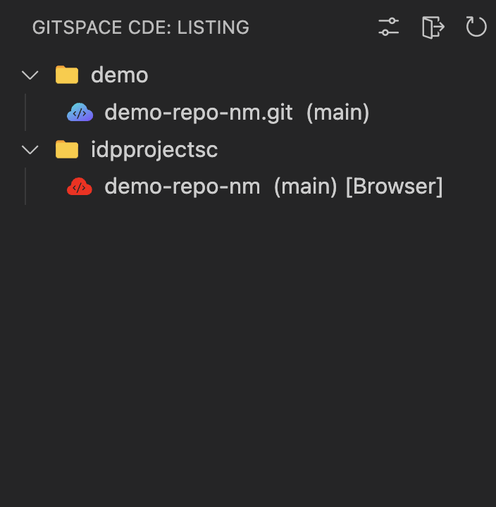
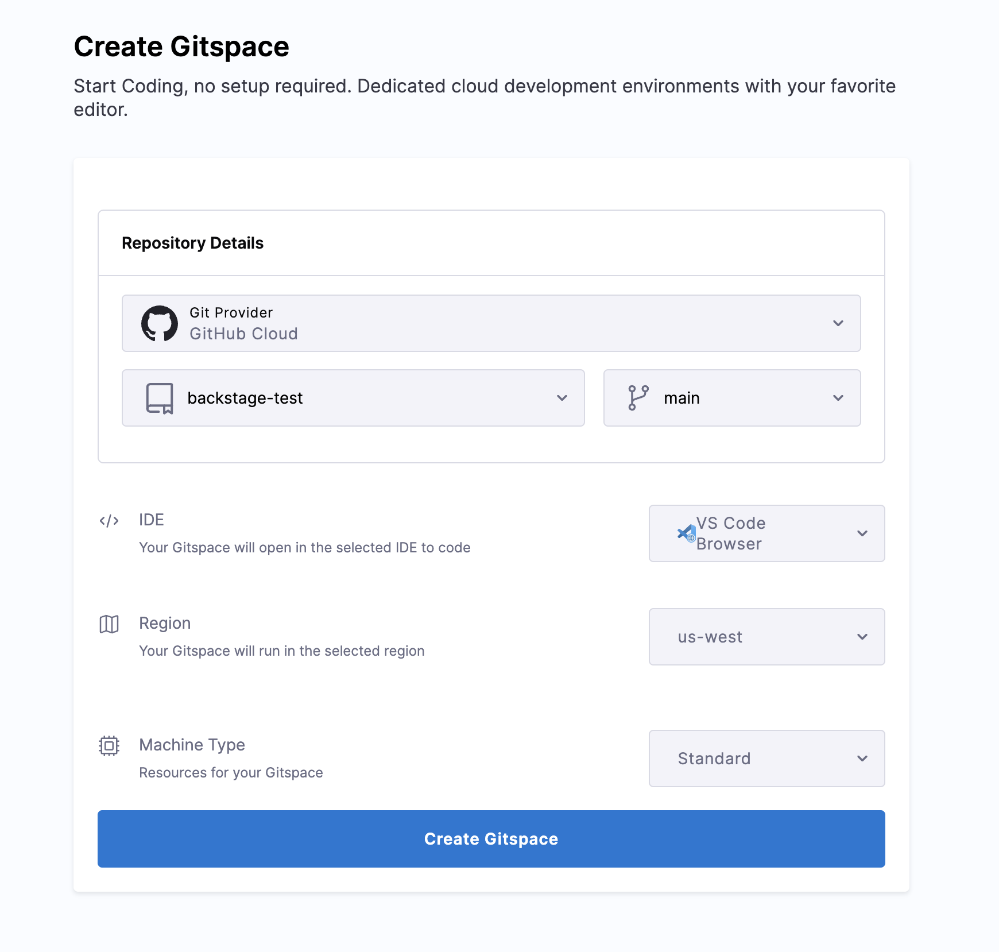
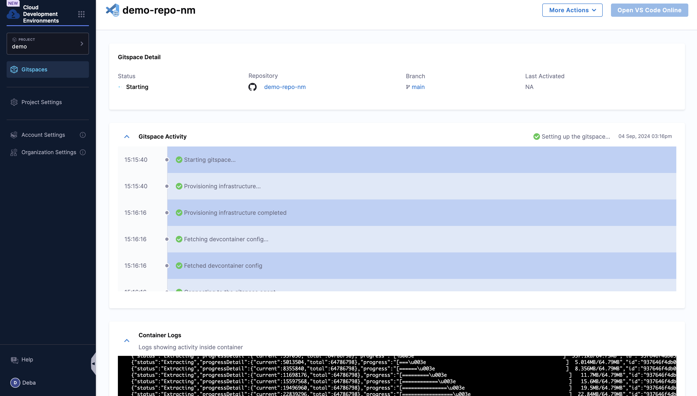

Follow the instructions below to create a Gitspace:

1. Click on **+New Gitspace**. To create a **Gitspace** using the [sample app](https://github.com/harness-community/demo-repo-nm). You have two options to create Gitspace:

import Tabs from '@theme/Tabs';
import TabItem from '@theme/TabItem';

<Tabs queryString="Create Gitspace">
<TabItem value="using-harness-code" label="Using Harness Code">

1. If you don’t have a Harness Code Repository, you can either [create](https://developer.harness.io/docs/code-repository/config-repos/create-repo) one or [import](https://developer.harness.io/docs/code-repository/config-repos/import-repo) a new repository. 

2. Once the repository is available, you can select the **branch** and the **IDE** type (VSCode Browser and Desktop are supported)

3. Import the repository from third party git provider to Harness Code Repository, using the **organization** and the **repository** name. [Read](https://developer.harness.io/docs/code-repository/config-repos/import-repo) for more details

4. Now **Create Gitspace**, by selecting the default **branch** as `main` and **IDE**.

</TabItem>
<TabItem value="other-git-repositories" label="Other Git Repositories">

1.You can add a public or private repository URL for git providers supported, make sure the public repository URL is strictly of the format `https://git-provider.com/organisation/repository` (For GitHub eg:`https://github.com/harness-community/demo-repo-nm`) any extra string post this might cause an error. If you have configured the OAuth, then you'll get the list of private repositories you have access to select from. 

2. By default the **branch** selected would be main which you can change according to your choice.

3. Now select the **IDE**

</TabItem>
</Tabs>

<Tabs queryString="Select IDE">
<TabItem value="vs-code-online" label="VS Code Browser">

- VS Code Browser can directly be started on your browser and doesn't require any pre-configuration. 
- You can select the IDE type as VS Code Browser and you'll redirected to the IDE on a new tab once the Gitspace is created and you click on **Open VS Code Editor**. 

</TabItem>
<TabItem value="vs-code-desktop" label="VS Code Desktop">

## VS Code Desktop

### Pre-Requisite: Install VS Code Desktop Extension

1. You can install and configure the Gitspaces VS Code extension to use it on your VS Code Desktop App.

2. Install the Gitspaces VS Code Extension on from VS COde Extensions Marketplace. Click on Settings and Go to the Extension settings and add the host URL as `https://app.harness.io/`  

3. The extension will appear on the left nav of your screen, click on it and proceed to Sign-in. **Make sure you have already signed-in to Harness Platform already in your browser before starting this step.**

4. Any Gitspace you create with VS Code Desktop as the IDE will now open in your desktop application. You can also view a list of Gitspaces in the left navbar and switch between them as needed. 

### Select IDE

5. Move back to the CDE Create Gitspace window and select the IDE as **VS Code Desktop**. 

</TabItem>
</Tabs>

5. Select the **region** in which you want to provision your CDE. 

6. Select the machine type to be either **Standard** or **Large**. 

7. It will take few minutes to provision the Gitspace and you could see all the steps and logs involved. 

8. Now you can **Open VS Code Editor** and start developing. 