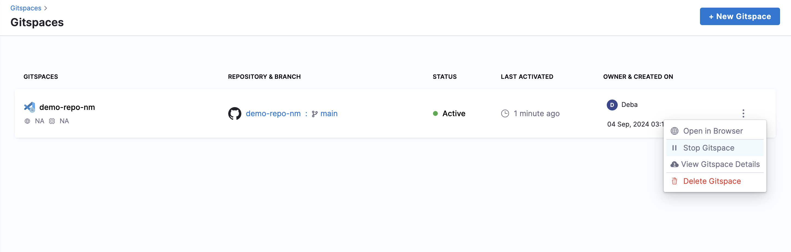
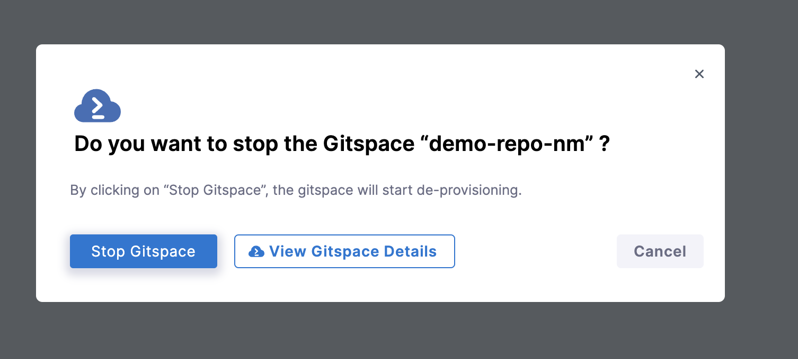
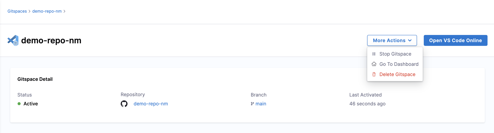
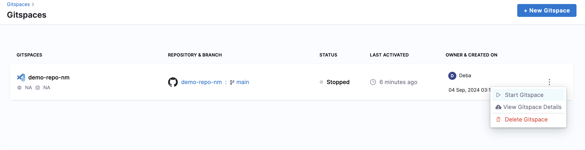
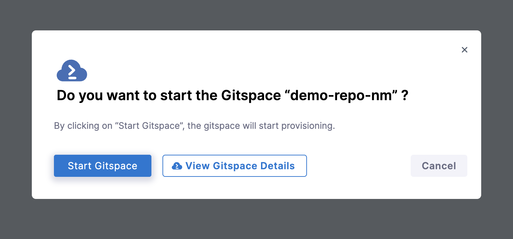
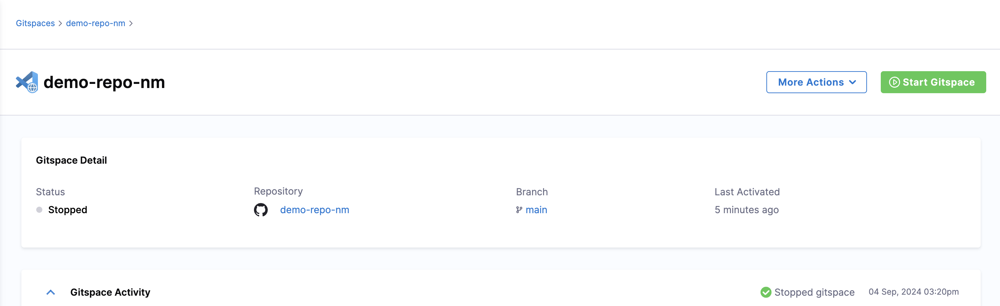

To save on compute you can stop a Gitspace when not in use and start it again at a later time. You will **not lose any uncommitted changes** across Gitspace restarts. 

### Stop a Gitspace

1. On the Gitspaces Page, for any active Gitspace, click on the **3 dots** menu and select **Stop Gitspace**.

2. On the Gitspace Details Page under **More Actions**, there's an option to **Stop Gitspace**.

### Start a Gitspace

There are three ways of starting a Gitspace: 

1. On the Gitspaces Page, for any stopped Gitspace, click on the **3 dots** menu and select **Start Gitspace**.

2. On the Gitspace Details page, **Start Gitspace** is available in the **More Options** menu.

