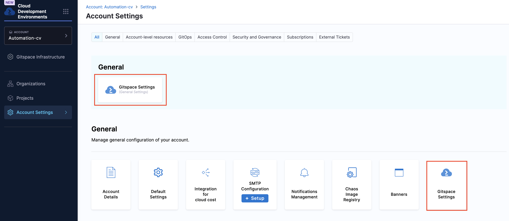
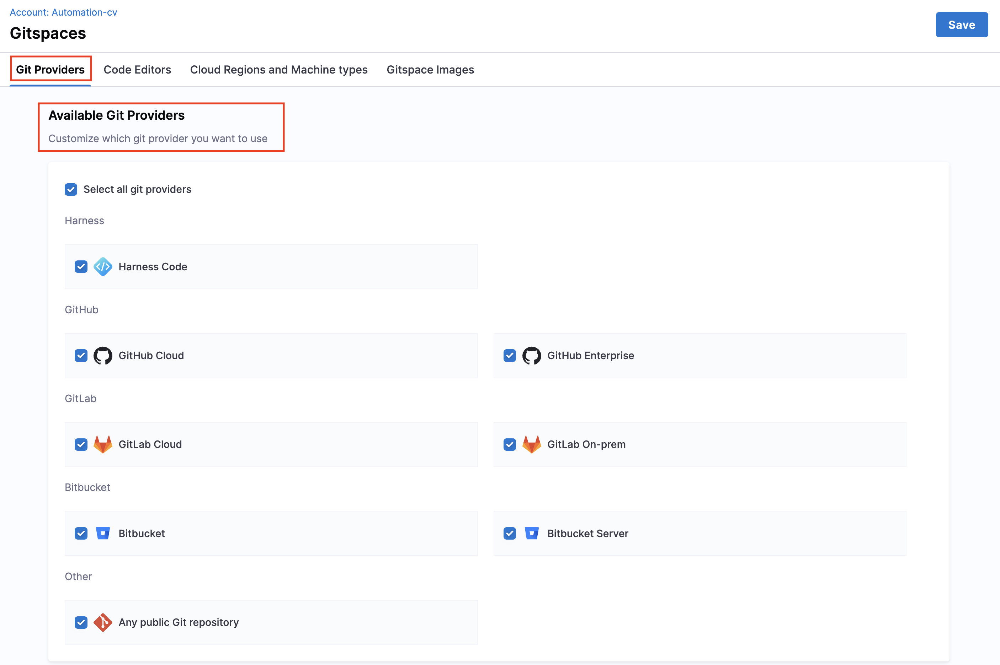
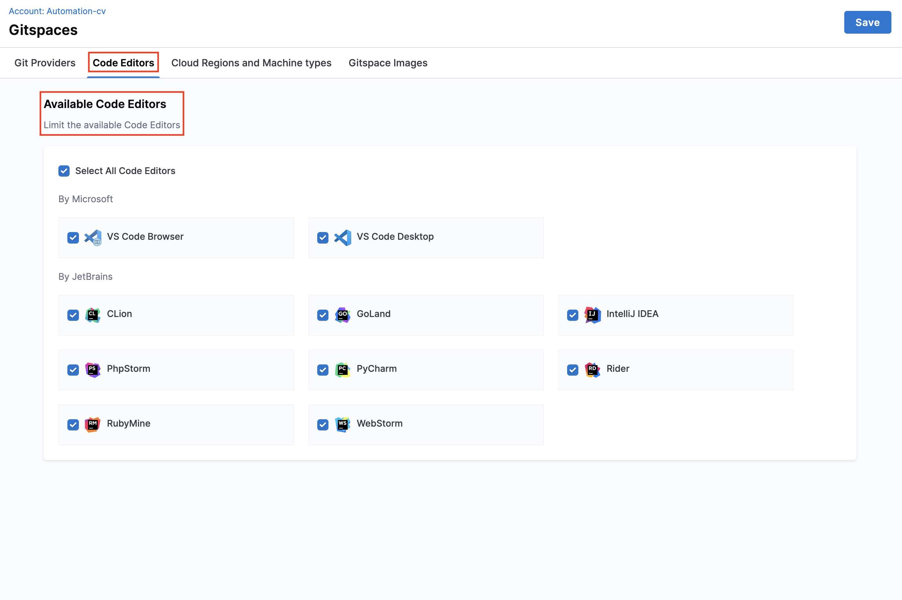
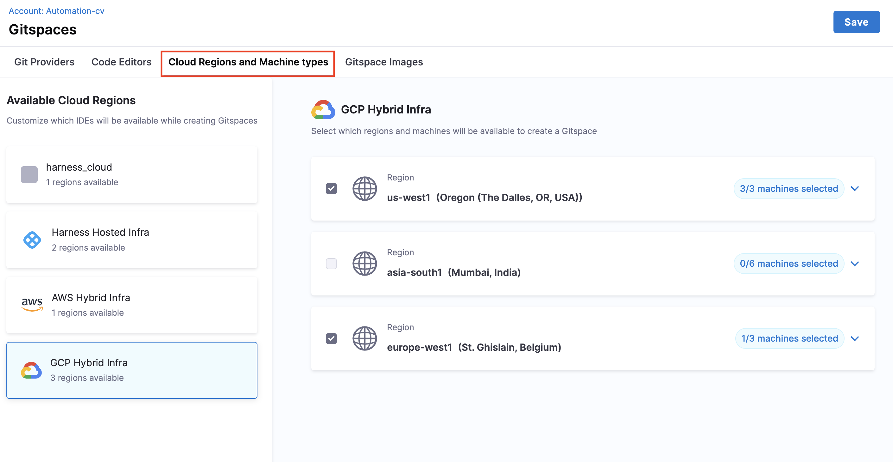
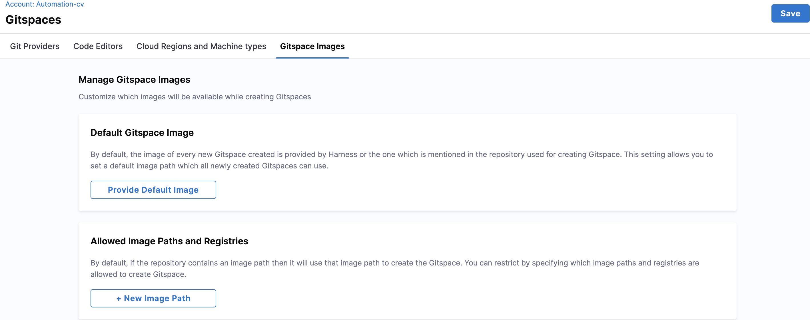
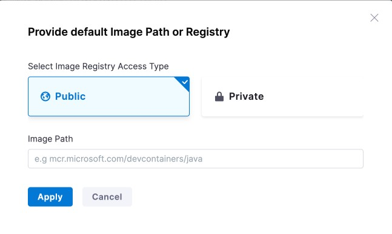
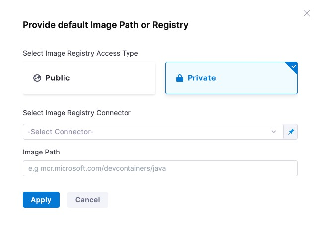

Gitspace Settings provide general configuration options to control Gitspace behavior. With these settings, you can customize Gitspaces to align with your organization’s standards and policies. This gives you fine-grained control over aspects such as Git providers, code editors, image paths, and infrastructure regions & machine types.

This document walks you through all available Gitspace settings and how to use them to tailor your organization’s Gitspace experience.

---

## Before you begin

Before customizing Gitspace settings, ensure the following prerequisites are met:

1. You must have **account-level access** to configure Gitspace settings. These settings are only available at the account level.
2. You must have either the **CDE Admin** role or **Account Admin** role permissions. Go to [Access Control](/docs/cloud-development-environments/rbac.md) to learn more about RBAC in Harness CDE.

---

## Gitspace Settings

As an admin, you can configure the following settings:

* **Git Providers** – Manage which Git providers are available for creating Gitspaces.
* **Code Editors** – Control which code editors are available to users.
* **Cloud Regions & Machine Types** – Define the infrastructure regions and machine types available.
* **Gitspace Images** – Restrict which container images can be used to spin up Gitspaces.

These settings can be accessed from **Account Settings > General**. They apply to **all Gitspaces in the account**. Only **CDE admins** can modify these settings; other **CDE users** can view them but not make changes. Go to [Access Control](/docs/cloud-development-environments/rbac.md) to learn more about CDE roles. 

---

### Git Providers

Use this setting to **restrict and manage which Git providers** are available for your account’s Gitspaces. Once configured, CDE users will only be able to create Gitspaces with the specified providers.
Click **Save** to apply your changes.

---

### Code Editors

This setting lets you **manage which code editors** are available. This ensures that developers work only with editors approved by your organization.

---

### Cloud Regions & Machine Types

Use this setting to **control available cloud regions and machine types**. For each infrastructure provider, you can:

* Enable all machines in a region.
* Restrict availability to only selected machines.

---

### Gitspace Images

This setting controls the container images that can be used to spin up the Gitspace `devcontainer`.

You can configure images in two ways:

1. **Public Images** – Define the `image` property in `devcontainer.json` with any public image. Go to [Deep Dive into Gitspaces](/docs/cloud-development-environments/deep-dive-into-gitspaces/gitspace-configuration.md) for more details.
2. **Private Images** – Connect Harness to your Artifact Repository and configure the private Docker image. Go to [Private Docker Images](/docs/cloud-development-environments/features-of-gitspaces/private-docker-images.md) for more details.

This feature lets you **enforce restrictions** on which images can be used.

---

#### Default Gitspace Image

You can define a **default Gitspace image**, which is used if:

* No image is specified in `devcontainer.json`.
* The specified public image is unavailable.
* A private image is unavailable or not configured properly.

The default image can be a **public** or **private** Docker image.

**Public Image Example:**
Provide any public image path as the default.

**Private Image Example:**
Provide a private image by selecting the registry connector and specifying the path. See [Private Docker Images](/docs/cloud-development-environments/features-of-gitspaces/private-docker-images.md) for details.

---

#### Allowed Image Paths

This setting restricts Gitspaces to only specific image paths. You can add multiple allowed paths with pattern matching.

**Valid Expression Examples**:

| Expression Type            | Example                   | Description                     | Matches                      |
| -------------------------- | ------------------------- | ------------------------------- | ---------------------------- |
| Repository Only            | `nginx`                   | Any tag/digest in repository    | `nginx:latest`, `nginx:1.19` |
| Exact Image Tag            | `nginx:latest`            | Matches only that tag           | `nginx:latest`               |
| Exact Digest               | `nginx@sha256:01eb582...` | Matches only that digest        | Same digest                  |
| Wildcard Repository        | `repo/*`                  | Any image within repo namespace | `repo/app:tag`               |
| Wildcard Tag               | `repo/image:*`            | Any tag for the image           | `repo/image:v1.0`            |
| Tag Prefix Wildcard        | `repo/image:dev*`         | Tags starting with prefix       | `repo/image:dev123`          |
| Repository Prefix Wildcard | `repo/image*`             | Paths starting with prefix      | `repo/image-extra:tag`       |

**Invalid Expression Examples**:

| Invalid Pattern            | Example                            | Issue                           | Correct Alternative                 |
| -------------------------- | ---------------------------------- | ------------------------------- | ----------------------------------- |
| Multiple Wildcards in Tags | `nginx:*:latest`                   | Invalid colon placement         | `nginx:*`                           |
| Wildcard in Middle of Tag  | `nginx:*latest`                    | Wildcards must be suffix only   | `nginx:lat*`                        |
| Wildcard at Repo Start     | `*nginx:latest`                    | Repo name cannot start with `*` | `*/nginx:latest`                    |
| Malformed Syntax           | `invalid@@@`                       | Invalid characters              | `invalid@sha256:...`                |
| Invalid Tag Characters     | `repo/image:!invalid`              | `!` not allowed in tags         | `repo/image:invalid`                |
| Trailing Slash             | `mcr.microsoft.com/devcontainers/` | Incomplete expression           | `mcr.microsoft.com/devcontainers/*` |

