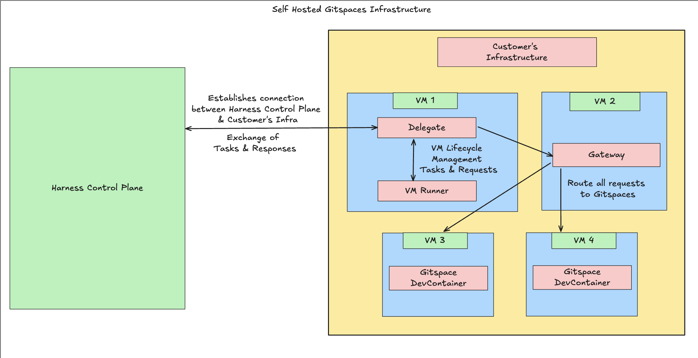
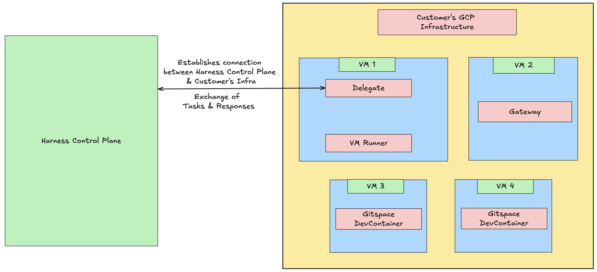
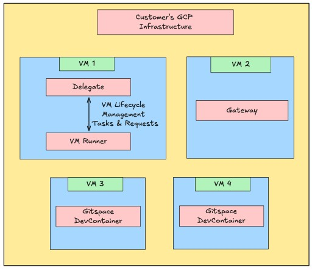
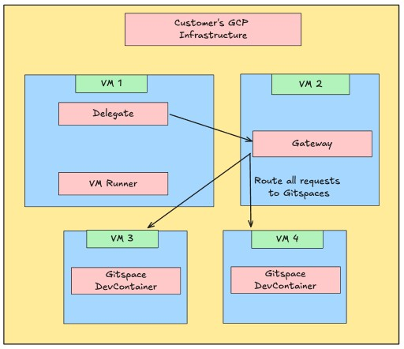

**Self-Hosted Gitspaces** are on-demand remote development environments hosted within your organization’s infrastructure. These environments come pre-configured for immediate coding and provide an added layer of security by offering **full control** over infrastructure and data. This reduces the risk of external data exposure and prevents source code from being cached or accessed by third-party cloud services.

## Self-Hosted vs. Harness-Hosted Gitspaces

Harness-Hosted Gitspaces are fully managed by Harness and reduce the setup complexity for end users. However, as organizations grow and adopt stricter security and compliance standards, **Harness-Hosted Gitspaces may introduce the following enterprise challenges**:

* **Security & Data Sovereignty**: Lack of full control over source code and developer data.
* **Customization Limitations**: Hosted solutions may not support deep customization of tooling and environment setup.
* **Latency Issues**: Hosted regions are fixed, potentially causing performance problems for globally distributed teams.

In contrast, **Self-Hosted Gitspaces** solve these issues by offering complete infrastructure control. 

| Use Case                  | Self-Hosted Gitspaces                      | Harness-Hosted Gitspaces           |
| ------------------------- | ------------------------------------------ | ---------------------------------- |
| **Infrastructure**        | Managed by Customer       | Managed by Harness                 |
| **Security & Compliance** | Full control by customer                   | Shared responsibility model        |
| **Source Code**           | Stored within customer infrastructure               | Stored and cached in Harness |
| **Data Residency**        | Customer-defined and governed              | Stored in Harness Cloud         |
| **Latency/Location**      | Global flexibility based on customer infrastructure | Limited to predefined regions      |

## Self-Hosted Gitspaces: Architecture Overview

Self-Hosted Gitspaces consist of two core components:

* **Harness Control Plane**
* **Customer’s Cloud Infrastructure [Google Cloud Platform(GCP)]**

## Key Components

### Harness Control Plane

The **Harness Control Plane** manages Gitspaces workflows. Users configure their infrastructure and initiate Gitspaces from the Harness UI. The control plane:

* Sends tasks to customer infrastructure
* Accepts responses back
* Maintains central orchestration logic for lifecycle operations

### Customer's Infrastructure

The infrastructure on the customer side (eg. GCP) includes:

| VM             | Purpose                                                                   |
| -------------- | ------------------------------------------------------------------------- |
| **VM1**        | Hosts the Harness **Delegate** and **VM Runner**                          |
| **VM2**        | Hosts the **CDE Gateway** responsible for routing Gitspace requests           |
| **VM3+, VM4+** | Each new Gitspace is launched in its own VM with a DevContainer preloaded |

## Component Interactions

### Harness Control Plane ↔ Customer Infrastructure

* End user sets up infrastructure through the Harness UI.
* User installs the **Delegate** and starts the **VM Runner**.
* The Control Plane submits Gitspace lifecycle tasks to the Delegate.

### Delegate ↔ VM Runner

* Delegate submits VM requests to the VM Runner.
* VM Runner handles VM provisioning, execution, and response.
* Delegate receives status and forwards it to the Control Plane.

### Delegate ↔ Gateway ↔ Gitspaces

* Delegate sends tasks to the Gateway.
* Gateway routes tasks to corresponding Gitspace instances (VMs).
* Gateway handles routing for all workspace interactions.

## Key Concepts

### Delegate

Harness Delegate is a service that you install in your infrastructure to establish and maintain a connection between Harness Control Plane and your infrastructure. Self Hosted Gitspaces run in your own infrastructure, but are managed by Harness Control Plane. Thus to establish and maintain communication between the Harness Control Plane and Customer's infrastructure, customer need to install Harness Delegate in their infrastructure. Read more about [Harness Delegate Overview](https://developer.harness.io/docs/platform/delegates/delegate-concepts/delegate-overview/).

To understand more about this step and its implementation, please refer to [Setup Runner and Install Delegate](docs/cloud-development-environments/self-hosted-gitspaces/steps/runner-delegate.md)

### VM Runner

The **VM Runner** is responsible for **managing the VM lifecycle**. The VM Runner creates a VM on demand for executing the tasks. When the Delegate receives any Task Request from the Harness Control Plane, it forwards the request to the Runner, which executes the task on the created VM and manages the VM lifecycle according to the request. Read more about [VM Runner](https://docs.drone.io/runner/vm/overview/).

To understand more about this step and its implementation, please refer to [Setup Runner and Install Delegate](/docs/cloud-development-environments/self-hosted-gitspaces/steps/runner-delegate.md)

### CDE Gateway

The **CDE Gateway** plays a key role in ensuring reliable connectivity, secure access, and controlled traffic flow. It is responsible for **routing** user requests to the appropriate Gitspaces. The CDE gateway also handles **authentication**, ensuring that only users with valid access tokens can access Gitspaces. From a **security** perspective, the CDE gateway ensures that all incoming traffic to a Gitspace VM originates from trusted components. This controlled entry point greatly reduces the surface area for potential attacks and enforces strict traffic policies.

## Next Steps
You can get started with Self Hosted Gitspaces by following this [Get Started with Self Hosted Gitspaces](/docs/category/configure-self-hosted-gitspaces) guide. 