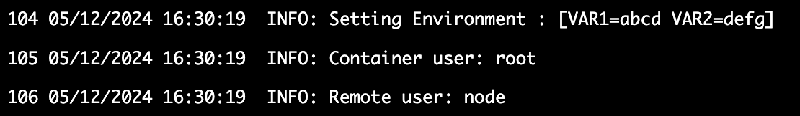

This guide explains how to set up ```containerUser``` and ```remoteUser``` in your Gitspace using the properties in the ```devcontainer.json``` schema.

## What are containerUser and remoteUser?
These properties control the permissions of applications executed within containers, giving developers fine-grained control over container operations.

#### ```containerUser```:
- The user with which the development container is started.
- It handles all processes and operations inside the container.
- This concept is native to containers.
- The default user is either the user specified in the Docker image or the root user.


#### ```remoteUser```:
- The username used for running processes inside the container, including lifecycle scripts and any remote editor/IDE server processes.
- This concept is not native to containers.
- The default user is the same as the containerUser.

## How to Define a containerUser?
You can define a containerUser in the following ways:
1. Using the **containerUser** Property in ```devcontainer.json```:
```
"containerUser": "root"
```
2. Using the user Argument in the **runArgs** Property in ```devcontainer.json```:
```
"runArgs": ["--user=root"]
```
3. Defining **containerUser** in Image Metadata.

#### Priority Order:
If multiple definitions exist, the containerUser is set based on the following priority:
1. runArgs definition
2. ```devcontainer.json``` specification
3. Image metadata

## How to Define a remoteUser?
You can define a remoteUser in the following ways:
1. Using the **remoteUser** Property in ```devcontainer.json```:
```
"remoteUser": "vscode"
```
2. Defining **remoteUser** in Image Metadata.

#### Priority Order:
If multiple definitions exist, the remoteUser is set based on the following priority:
1. ```devcontainer.json``` specification
2. Image metadata

::: info
Static Password: A static password is maintained for the remoteUser in case the user gets locked: Harness@123.
:::

:::info
We assume that the user has a valid home directory. For the root user: /root and For non-root users: /home/username
:::

## Verifying the Setup
After adding this property, you can verify the setup by reviewing the container logs during the creation of a Gitspace via the Harness UI.



