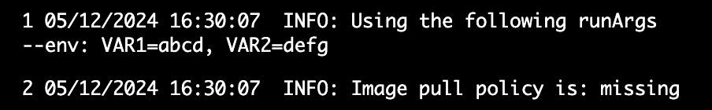

This guide explains how to use the **```runArgs```** property in the ```devcontainer.json``` schema to configure your Gitspace.

## What is "runArgs"?
The **```runArgs```** property is used to specify Docker CLI arguments that should be passed to the docker run command when running the Gitspace.

The docker run command is used for pulling the CDE image (as defined in the image property of ```devcontainer.json```), creating and starting the development container from that image, and executing commands within the container. The ```runArgs``` property (defined in ```devcontainer.json```) is an array of arguments for the ```docker run``` command, enabling developers to customize the behavior of the development container. ([Read more about the specification here.](https://containers.dev/implementors/json_reference/))

## Adding runArgs to devcontainer.json
To include the runArgs property in your ```devcontainer.json``` configuration, use the following format:
```
"runArgs": ["--argument", "value", ...]
```
### Examples
#### Single Value Argument
 If the argument has a single value, you can use a pair within the same array parameter, separated by an =:
``` 
"runArgs": ["--blkio-weight=20"]
```
#### Multiple Values Argument
 For arguments with multiple values, use this format:
```
"runArgs": ["--env", "var1=abcd", "var2=defg", "var3=1234"]
```
In this example:
```
"runArgs": ["--restart=no", "--security-opt", "seccomp=unconfined"]
```
- --restart has a single value (no).
- --security-opt uses a definition with different options.

## Verifying the runArgs Setup
After adding the runArgs property, you can verify the setup by reviewing the **container logs** during the creation of a Gitspace via the Harness UI.




## Supported Docker CLI Arguments
As of now, the runArgs property supports the following [Docker CLI arguments](https://docs.docker.com/reference/cli/docker/container/run/):
| **Argument** | 
| :---------------- | 
| --add-host        |  
| --annotation           | 
| --blkio-weight    | 
| --cap-drop |  
| --cgroup-parent |
| --cgroupns
| --cpu-count
| --cpu-percent
| --cpu-period
| --cpu-quota
| --cpu-rt-period
| --cpu-rt-runtime
| -c, --cpu-shares
| --cpus
| --cpuset-cpus
| --cpuset-mems
| --dns
| --dns-option
| --dns-search
| --domainname
| --entrypoint
| -e, --env
| --health-cmd
| --health-interval
| --health-retries
| --health-start-interval
| --health-start-period
| --health-timeout
| -h, --hostname
| --init
| --io-maxbandwidth
| --io-maxiops
| --ipc
| --isolation
| --kernel-memory
| -l, --label
| --link
| --mac-address
| -m, --memory
| --memory-reservation
| --memory-swap
| --memory-swappiness
| --network
| --no-healthcheck
| --oom-kill-disable
| --oom-score-adj
| --pid
| --pids-limit
| --platform
| --pull
| --restart
| --rm
| --runtime
| --security-opt
| --shm-size
| --stop-signal
| --stop-timeout
| --storage-opt
| --sysctl
| --ulimit
| -u, --user


### Allowed and Blocked Values
For some arguments, a predefined list of allowed and blocked values is enforced:
- **Allowed Values**: Values explicitly supported for a specific argument.
- **Blocked Values**: Values that are restricted for a specific argument.

#### Current Restrictions
- **Network**: Blocked values are ```host``` and ```none```.
- **Label**: Blocked value is ```gitspace\.remote\.user```.


