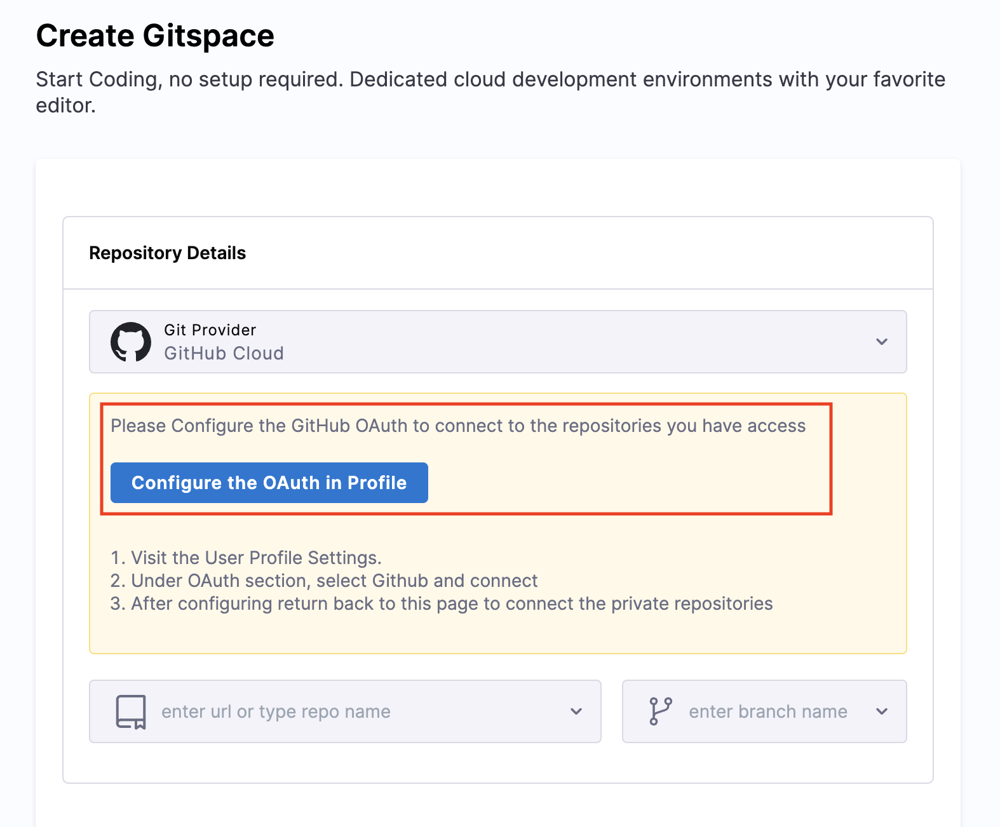
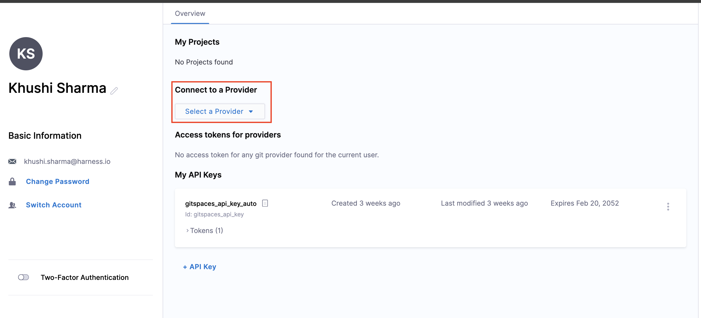
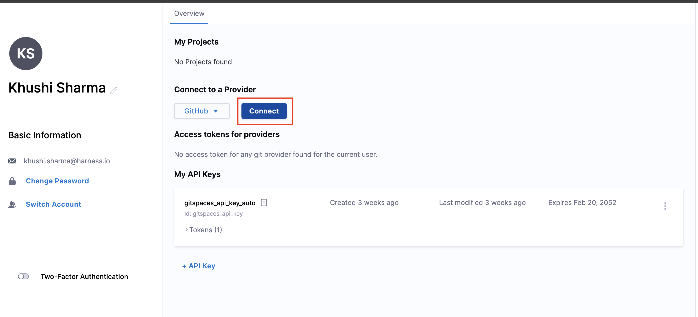
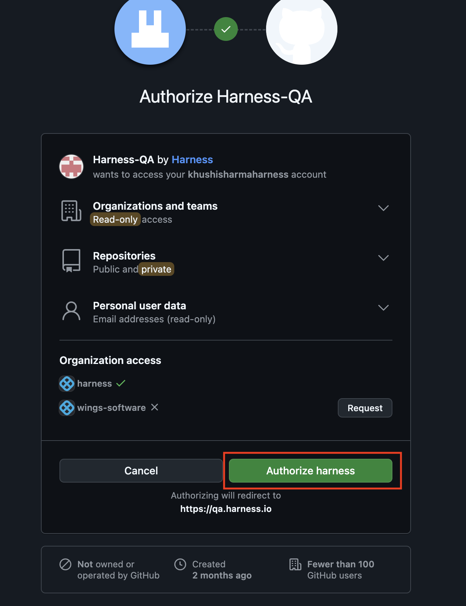
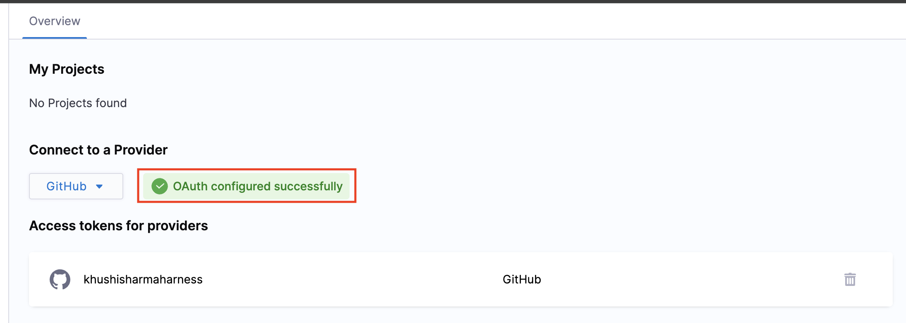

Gitspaces allow you to configure your preferred Git provider for seamless development. This integration enables you to create a Gitspace directly from your project repository (public or private) hosted on your chosen Git provider.

By authorizing and configuring a Git provider, your credentials are securely embedded in your account, eliminating the need for repeated authentication.

We offer the following Git provider integrations for your Gitspaces:
- Harness Code
- GitHub Cloud
- GitLab Cloud
- Bitbucket
- Any Public Git Repository

To create a Gitspace, you’ll first need to configure your preferred Git provider using ```OAuth``` in the Harness UI and link your project repository.

### Configuring OAuth
When creating a Gitspace, you can select your Git provider to fetch repository details. Choose your provider from the dropdown menu, then select the option from the yellow box to configure OAuth from your profile. This will redirect you to your profile section to complete the setup.



Alternatively, you can configure OAuth directly from your profile section. Simply navigate to your ```“Profile Overview”``` from the bottom-left corner.



### Connecting your GitHub Account
Follow these steps to configure GitHub OAuth:
1. Select GitHub as your preferred provider from the dropdown and click Connect.

2. You’ll be redirected to the GitHub interface to authenticate and authorize Harness to access your repositories.

3. After successful authorization, you’ll be redirected back to the Harness UI.


And that’s it—you’re all set!

You can connect to other Git providers by following the same steps as above.


